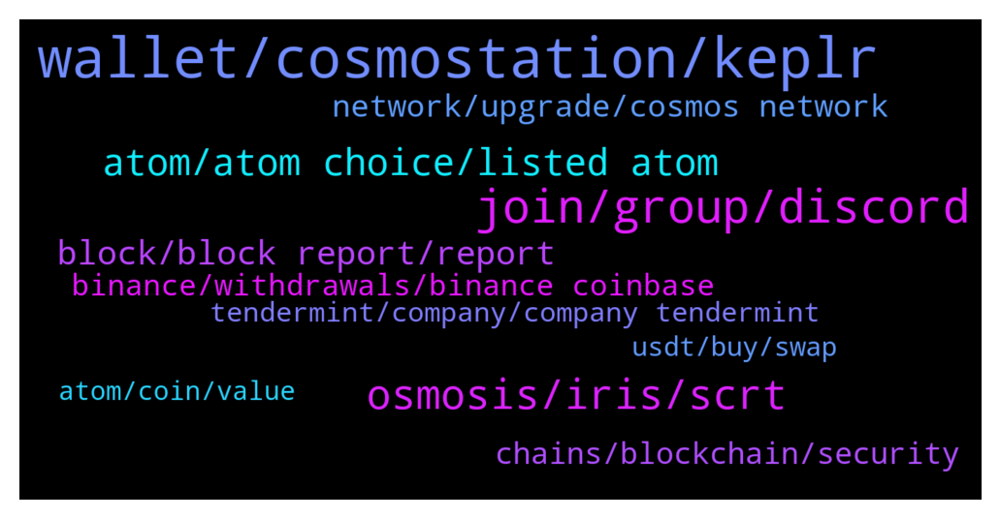

# **@cosmosproject**
 ## Analysis for **2021-12-21** - **2021-12-22**.

---

## 📊 **Basic Stats**

**n_messages_sent**: 600

---

---

## 🔝 **Top keywords and related messages**

1. **wallet, cosmostation, keplr**

    @ZoltanAtom --- *Hey there,Recommend wallets are Cosmostation and Keplr.  Both have web Wallet and mobile apps!  Here's a link: https://t.co/eSyDVJMFAD?amp=1  And a step by step guide: https://medium.com/chainapsis/how-to-use-keplr-wallet-40afc80907f6* **--->** [TG Discussion](https://t.me/cosmosproject/457438)

    @AtomJazz --- *Not familiar with this wallet buy you can copy your address and paste it in the block explorer https://www.mintscan.io/cosmos* **--->** [TG Discussion](https://t.me/cosmosproject/458063)

    @AndrySSL --- *Hello, I lost my password keplr, how can I restore my account with seed phrase?* **--->** [TG Discussion](https://t.me/cosmosproject/457499)

    @drivensuccess --- *Does Keplr use my cosmostation wallet or do I have to transfer it?* **--->** [TG Discussion](https://t.me/cosmosproject/458253)

    @hosein_mohajer96 --- *Hello dear admin, ican use my phrases code from trust wallet for cosmostation wallet?!* **--->** [TG Discussion](https://t.me/cosmosproject/458348)

    @qasimdprs --- *Okay I understand your point of view. I will wait for few days if issue still persist. I will import my wallet to keplr or cosmostation.* **--->** [TG Discussion](https://t.me/cosmosproject/457911)

2. **join, group, discord**

    @drivensuccess --- *What would be the next best course? Just waiting?* **--->** [TG Discussion](https://t.me/cosmosproject/458218)

    @Ninvel --- *I like meet people in the comunities of projects I'm interesting in, It is real important for a good relatioship with the comunity and also practice my englisg in the process 😀* **--->** [TG Discussion](https://t.me/cosmosproject/457473)

    @ZoltanAtom --- *If you look for devs and have technical questions,please join Cosmos discord.* **--->** [TG Discussion](https://t.me/cosmosproject/457470)

    @alpha_gumbel --- *What options do I have if I wanna build for cosmos?* **--->** [TG Discussion](https://t.me/cosmosproject/457338)

    @waynefong --- *Hi everyone,  the latest weekly ⚛ Cosmos ⚛ stats is here. 👇  🌎 https://twitter.com/kysenpool/status/1473059022177595392?s=21* **--->** [TG Discussion](https://t.me/cosmosproject/457187)

    @ZoltanAtom --- *Hi there,yes Sifchain! Please join them to learn more ;  https://t.me/sifchain* **--->** [TG Discussion](https://t.me/cosmosproject/457854)

3. **osmosis, iris, scrt**

    @Paesch --- *Very nice  Do you also know how Safe osmosis is in terms of hacking? I read all the time that Amm‘s get hacked and I’m a bit unsure bc of it* **--->** [TG Discussion](https://t.me/cosmosproject/457958)

    @Ivan --- *I mean, an option I don't have to send back to an exchange. How about osmosis? But I cant figure out how to get my secret over there either? 🤔* **--->** [TG Discussion](https://t.me/cosmosproject/457868)

    @Cordtus --- *Yes or you can swap via osmosis to another token* **--->** [TG Discussion](https://t.me/cosmosproject/458222)

    @StudentForAllMyLife --- *With iris it's less than 1$ i think* **--->** [TG Discussion](https://t.me/cosmosproject/457524)

    @ZoltanAtom --- *Oh sure. Osmosis AMM will be your best shot. If your SCRT is at Keplr wallet, just connect Keplr to Osmosis AMM and go to assets click “deposit” and after swap SCRT to Atom ! Also please join Osmosis channel ;  https://t.me/osmosis_chat* **--->** [TG Discussion](https://t.me/cosmosproject/457869)

    @ebp700 --- *Can i buy osmosis with my income?? And hold and stake??* **--->** [TG Discussion](https://t.me/cosmosproject/458269)

4. **atom, atom choice, listed atom**

    @ZoltanAtom --- *Atom is the governance token of Gravitydex too.* **--->** [TG Discussion](https://t.me/cosmosproject/458343)

    @WinsonGoh --- *Looks like many ppl buying ATOM and got stuck in some of the CEx.👏👏👏* **--->** [TG Discussion](https://t.me/cosmosproject/457402)

    @ZoltanAtom --- *Sure. Atom is the governance token of Cosmos.* **--->** [TG Discussion](https://t.me/cosmosproject/458327)

    @Carlsson2 --- *Hello everyone,  maybe this one is kind of a question most of you roll your eyes.  Difference between dot, cosmos, QNT is more or less clear. Especially in comparison to QNT i get a Bit stucked regarding following quote  'atom is maybe or is the most important project in regard to interoperability. Without interoperability cryptocurrency is doomed to fail'  Do you have an opinion to it? I appreciate it* **--->** [TG Discussion](https://t.me/cosmosproject/458168)

    @AtomJazz --- *Maybe it's better to transfer your ATOM in batches. Something like 1/3 every month* **--->** [TG Discussion](https://t.me/cosmosproject/457158)

    @gramhee --- *Just curious, why was there a sudden surge in price of ATOM? 😆* **--->** [TG Discussion](https://t.me/cosmosproject/458353)

5. **block, block report, report**

    @OS4UU --- *I received scam intent, can i send screenshot so others take care?* **--->** [TG Discussion](https://t.me/cosmosproject/457742)

    @Zzuko7 --- *gm guys, have a good day  sending love to our admins* **--->** [TG Discussion](https://t.me/cosmosproject/457908)

    @Cordtus --- *Also beware of scam DMs these conversations attract scam bots like flies to poop soup* **--->** [TG Discussion](https://t.me/cosmosproject/458410)

    @hilay00 --- *Wow, how many scammers wanna help me :))* **--->** [TG Discussion](https://t.me/cosmosproject/457451)

    @ZoltanAtom --- *Dear Cosmonauts🧑‍🚀👩‍🚀  🚨🚨🚨HOW TO STOP SCAMMERS TO ADD YOU THEIR GROUP🚨🚨🚨  🔘Please Click “Settings” 🔘After Click “Privacy And Security” 🔘Choose “Group&Channels”  🔘Change “WHO CAN ADD ME “ TO “My Contacts”* **--->** [TG Discussion](https://t.me/cosmosproject/457565)

    @ZoltanAtom --- *If someone dm to you,please block and report it.* **--->** [TG Discussion](https://t.me/cosmosproject/458219)

6. **network, upgrade, cosmos network**

    @Joshycrypto --- *it keep saying something about a netwrok update ... how long does it take for real man ... your costing me money* **--->** [TG Discussion](https://t.me/cosmosproject/457652)

    @bacchen --- *Hi, is cosmos network upgrading now* **--->** [TG Discussion](https://t.me/cosmosproject/457285)

    @Cordtus --- *Yeah I've seen it take literally weeks for some platforms to update* **--->** [TG Discussion](https://t.me/cosmosproject/458416)

    @ZoltanAtom --- *Vega upgrade was completed on cosmos hub almost 9 days ago. You should contact to binance and ask them.* **--->** [TG Discussion](https://t.me/cosmosproject/457920)

    @Moongo --- *Is Cosmos Coin updating right now? Why can't I deposit and withdraw money from the exchange?* **--->** [TG Discussion](https://t.me/cosmosproject/457268)

    @Farmeur --- *Ok got it thanks cdcs customer service is super slow. It will take weeks for them to uograde their nodes* **--->** [TG Discussion](https://t.me/cosmosproject/458415)

7. **chains, blockchain, security**

    @OS4UU --- *Hi all, can someone clarify me why it is Cosmos a good way of interconecting blockchains? I don't really understand the goal or the product apart from Cosmos own blockchain* **--->** [TG Discussion](https://t.me/cosmosproject/457074)

    @ZoltanAtom --- *💥INTERCHAIN SECURITY COMING TO COSMOS HUB! 💥   🟪Interchain Security will allow Cosmos chains to lease security to each other. What this means, in practice, is that validators on one chain (the security provider) will be able to validate on another (the security consumer).  Earning Rewards On Many Chains  🟪Interchain Security will allow ATOM holders to earn staking rewards on a large number of Cosmos chains, just by staking their ATOMs. Consumer chains will benefit both from robust security from the Cosmos Hub validator set, and by getting their tokens in the hands of the Cosmos community of early adopters.  📄 For More Details Read This Blog Post* **--->** [TG Discussion](https://t.me/cosmosproject/457432)

    @OS4UU --- *Why are there bsc and erc20 contracts of Cosmos if Cosmos hat his own Blockchain?* **--->** [TG Discussion](https://t.me/cosmosproject/457634)

    @AtomJazz --- *Those are just wrapped token solutions from those projects. Not related with Cosmos at all. We don't suggest using it* **--->** [TG Discussion](https://t.me/cosmosproject/457637)

    @OS4UU --- *Not related with Cosmos at all? These Contracts Adresses are shown on Cosmos Profile from CMC. I think understand you @WorkerBee_3 thanks* **--->** [TG Discussion](https://t.me/cosmosproject/457639)

    @AtomJazz --- *Hey there! Interoperability allows horizontal scalability. Instead of trying to run many dAPPs on one single chain, Cosmos allows to run infinite numbers of application specific blockchains. In Cosmos we have specialized AMM chains, smart contract chains, defi chains, privacy chains, gaming chains all able to intercommunicate and exchange data.  https://mapofzones.com/* **--->** [TG Discussion](https://t.me/cosmosproject/458169)

8. **binance, withdrawals, binance coinbase**

    @AtomJazz --- *People have been withdrawing like crazy from Binance even before the upgrade.* **--->** [TG Discussion](https://t.me/cosmosproject/458097)

    @Satoshi_2009 --- *Does Binance has restricted to withdraw any info* **--->** [TG Discussion](https://t.me/cosmosproject/457232)

    @kasimemehunter --- *I suspect the problem is not only on Binance though* **--->** [TG Discussion](https://t.me/cosmosproject/457995)

    @n0BaadD --- *Not only  Binance, includingTrust wallet and many more  Don’t know the purpose of upgrading your network and screwed everything up* **--->** [TG Discussion](https://t.me/cosmosproject/457924)

    @alen_muly --- *Scrt network also suspended on binance hahahaha ok this is insane. For such huge exchange that they can aford such lack of unprofesionalism 😂* **--->** [TG Discussion](https://t.me/cosmosproject/457307)

    @oleg_moskovskiy --- *when will the transfers on the Binance exchange work?  I'm tired of writing to them.  contact them please* **--->** [TG Discussion](https://t.me/cosmosproject/457977)

9. **tendermint, company, company tendermint**

    @AtomJazz --- *Tendermint is the name of the company as well yes* **--->** [TG Discussion](https://t.me/cosmosproject/457669)

    @Satoshi_is_dead --- *Tendermint is Centralized we need a token for it!* **--->** [TG Discussion](https://t.me/cosmosproject/457675)

    @Satoshi_is_dead --- *Isn't tendermint a company of devs though?* **--->** [TG Discussion](https://t.me/cosmosproject/457667)

    @Satoshi_is_dead --- *Yeah I want part of tendermint lol* **--->** [TG Discussion](https://t.me/cosmosproject/457671)

    @AtomJazz --- *Tendermint core is consensus mechanism of the Cosmos blockchains. I don't think there'll ever be a Tendermint token nor do I understand how that would work actually* **--->** [TG Discussion](https://t.me/cosmosproject/457665)

    @Satoshi_is_dead --- *Is tendermint going to become a token eventually or is cosmos the governance of tendermint?* **--->** [TG Discussion](https://t.me/cosmosproject/457646)

10. **usdt, buy, swap**

    @Hypolite --- *i must sell on Binance with usdt, sent to Kraken, buy on Kraken and Withdraw on my wallet* **--->** [TG Discussion](https://t.me/cosmosproject/457273)

    @jerome --- *It's less then 20$ .  Sifchain is cross chain. If u buy usdc on coinbase . Transferto meta ask (6$here) import to sif (peob 10$ here)   the swap is done in siftokens (they give u 1 free to start but swap would be like .25) 5hen withdrawl of atom also done in sif would be like .25* **--->** [TG Discussion](https://t.me/cosmosproject/457522)

    @qasimdprs --- *Yes I know brother can I there swap for usdt?* **--->** [TG Discussion](https://t.me/cosmosproject/457939)

    @jerome --- *How r u buying usd or eth?* **--->** [TG Discussion](https://t.me/cosmosproject/457514)

    @bacchen --- *Is there any way I can get my money from exchanges to keplr now?  thx* **--->** [TG Discussion](https://t.me/cosmosproject/457287)

    @Cuca --- *Why you advice that and then support that exchanges use your coin?* **--->** [TG Discussion](https://t.me/cosmosproject/457392)

