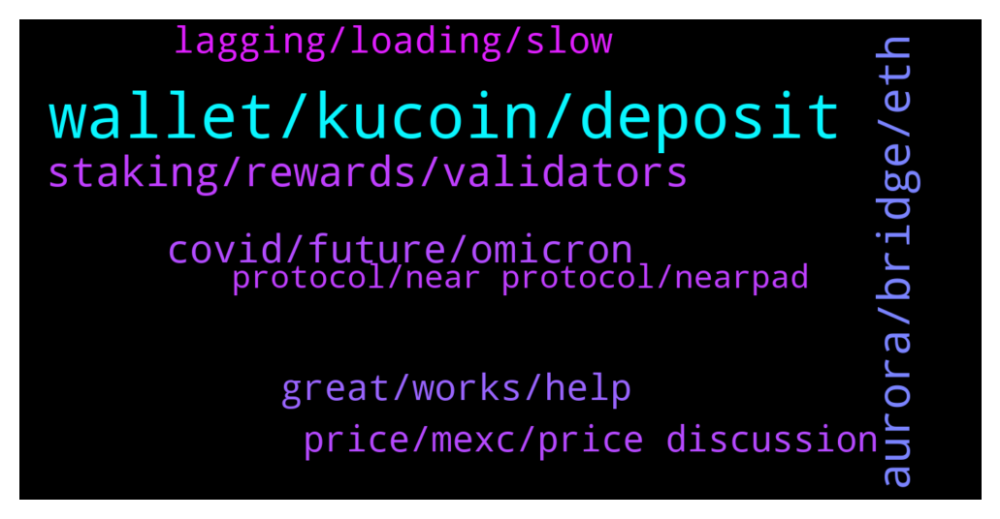

# **@cryptonear**
 ## Analysis for **2021-12-21** - **2021-12-22**.

---

## 📊 **Basic Stats**

**n_messages_sent**: 421

---

---

## 🔝 **Top keywords and related messages**

1. **wallet, kucoin, deposit**

    @aZisHsb23 --- *admin. this is why every time I log in nothing is visible, even though the recovery password is correct* **--->** [TG Discussion](https://t.me/cryptonear/245928)

    @kv9990 --- *Have you applied for grants? If not, apply then team shall contact u 👀 https://near.org/grants/* **--->** [TG Discussion](https://t.me/cryptonear/246836)

    @slash_rif --- *I deposited NEAR to KuCoin but not yet credited 😒* **--->** [TG Discussion](https://t.me/cryptonear/245918)

    @SebastianK33 --- *I'll buy on kucoin to get my wallet set before I get my okcoin set up* **--->** [TG Discussion](https://t.me/cryptonear/246013)

    @c_vaas --- *for connecting dapp we have to pay 0.25 once* **--->** [TG Discussion](https://t.me/cryptonear/246469)

    @OldieCrypto --- *So the problem is at KUcoin deposit system?* **--->** [TG Discussion](https://t.me/cryptonear/246200)

2. **aurora, bridge, eth**

    @NEARverse_xd --- *Aurora is an evm built on the NEAR and it is allowing devs to operate their apps on an eth compatible and scalable platform. So we don't need to rewrite applications from the scratch as aurora is fully compatible with eth. Also, aurora bridge is a part of the NEAR Rainbow Bridge which is the fully trustless bridge allowing transfer of eth and erc20 tokens between eth, aurora and near with low transaction fee.* **--->** [TG Discussion](https://t.me/cryptonear/246973)

    @SebastianK33 --- *Is it easy to bridge to aurora and use platforms there? I have been reading about Tri and think I want some* **--->** [TG Discussion](https://t.me/cryptonear/246752)

    @SebastianK33 --- *Will we be able to bridge stNEAR to aurora at some point to use that in farming ?* **--->** [TG Discussion](https://t.me/cryptonear/246776)

    @dogukanyasars --- *Hello how can I use Aurora on my phone?* **--->** [TG Discussion](https://t.me/cryptonear/246155)

    @TheGo1denBull --- *Yes. I use multiple browsers including metamask especially when you want to bridge into the EVM Aurora.* **--->** [TG Discussion](https://t.me/cryptonear/246046)

    @larry_lang --- *yeah i think stNEAR bridging is possible- but just a head up stNEAR is not yet tradeable on Aurora network so it's best keeping it here* **--->** [TG Discussion](https://t.me/cryptonear/246777)

3. **staking, rewards, validators**

    @Kripto_Raptor --- *it's non custodial brilliant staking solution* **--->** [TG Discussion](https://t.me/cryptonear/246489)

    @Aflatoon123 --- *Yes. I suppose the only difference is of fees charged on rewards* **--->** [TG Discussion](https://t.me/cryptonear/246410)

    @rahulgoel007 --- *The rewards are same in both near wallet staking and metapool staking And that ~11% APY* **--->** [TG Discussion](https://t.me/cryptonear/246478)

    @SebastianK33 --- *Any advice with choosing validators to stake with?* **--->** [TG Discussion](https://t.me/cryptonear/246033)

    @solovey4ik --- *guys is it possible stake near and set up different  receiving adres for rewards?* **--->** [TG Discussion](https://t.me/cryptonear/246601)

    @SebastianK33 --- *And we get rewards even if the validator is outside of the top 5 correct?* **--->** [TG Discussion](https://t.me/cryptonear/246409)

4. **covid, future, omicron**

    @Mr_Atticus --- *Good lord, that's a long list* **--->** [TG Discussion](https://t.me/cryptonear/247112)

    @Kripto_Raptor --- *expecting an answer for this follow up here https://t.me/auroraisnear* **--->** [TG Discussion](https://t.me/cryptonear/246634)

    @soumo_j --- *Matt Lockyer about 4 months ago* **--->** [TG Discussion](https://t.me/cryptonear/246525)

    @SebastianK33 --- *Just in time for NEAR to hit ATHs* **--->** [TG Discussion](https://t.me/cryptonear/246788)

    @TruFinance --- *When another  name will apear :))* **--->** [TG Discussion](https://t.me/cryptonear/246093)

    @TruFinance --- *After that not anymore ,covid is taking some vaccation also until end of autumm* **--->** [TG Discussion](https://t.me/cryptonear/246092)

5. **great, works, help**

    @larry_lang --- *noice^^  looking forward  to your presence there^^* **--->** [TG Discussion](https://t.me/cryptonear/246787)

    @butola_ravi --- *I am always here for u ♥️♥️* **--->** [TG Discussion](https://t.me/cryptonear/246134)

    @FritzWagner --- *U welcome ! Nice to have your interest on this, this is one of the reasons this community is so awesome ! ✨* **--->** [TG Discussion](https://t.me/cryptonear/246679)

    @SebastianK33 --- *Wow love you thank you very much* **--->** [TG Discussion](https://t.me/cryptonear/246756)

    @cuongdcc --- *btw this too, nothing to do with how NEAR works but it super fun: https://www.youtube.com/watch?v=6uv-wZg-ibM* **--->** [TG Discussion](https://t.me/cryptonear/245951)

    @larry_lang --- *well we are here to help sir^^ there's alot of nice people around here indeed, but they kinda sleeping at the moment* **--->** [TG Discussion](https://t.me/cryptonear/246789)

6. **lagging, loading, slow**

    @andreapn1709 --- *I'm from asia it too lag now, especially Ref and paras* **--->** [TG Discussion](https://t.me/cryptonear/247323)

    @bailey_12 --- *yea, it is lagging for quite someday now. Just refresh and keep connecting and it will be fine* **--->** [TG Discussion](https://t.me/cryptonear/246216)

    @Aflatoon123 --- *Is the network lagging a bit?* **--->** [TG Discussion](https://t.me/cryptonear/247287)

    @fiolalala --- *Make a suggestion that near and ref should optimize the connection speed of Asian customers, it's too too too slow,  Especially Ref😐* **--->** [TG Discussion](https://t.me/cryptonear/247106)

    @kv9990 --- *Yeah loading the data from on chain could be time consuming :) Near partnered with The Graph to improve indexing services,wait for it to be implemented ✌️😉* **--->** [TG Discussion](https://t.me/cryptonear/247335)

    @Aflatoon123 --- *Quite lagging in updating the balance and all.* **--->** [TG Discussion](https://t.me/cryptonear/247297)

7. **price, mexc, price discussion**

    @NoMoreBear1 --- *Okay, the inflation is too much* **--->** [TG Discussion](https://t.me/cryptonear/246455)

    @Kripto_Raptor --- *can get ridiculously higher in some exchanges* **--->** [TG Discussion](https://t.me/cryptonear/245996)

    @Abs --- *Do y’all reckon $near will take a huge dump as it’s pumped by 30% today* **--->** [TG Discussion](https://t.me/cryptonear/247180)

    @hasankcby --- *Hi guys Recently i bought like 100$ worht NEAR from MEXC and it was around 5.88. and couldnt sell when it was hit the top 17 😢  should i hold it for long term or sell it cuz its still profitable for me. Or should i just add more from MEXC on it ?* **--->** [TG Discussion](https://t.me/cryptonear/246419)

    @Kripto_Raptor --- *which is bad, I wouldn't do even 3x it's a volatile market lol NFA* **--->** [TG Discussion](https://t.me/cryptonear/246011)

    @Kripto_Raptor --- *in smaller exchanges market buying huge amounts is not recommended* **--->** [TG Discussion](https://t.me/cryptonear/245993)

