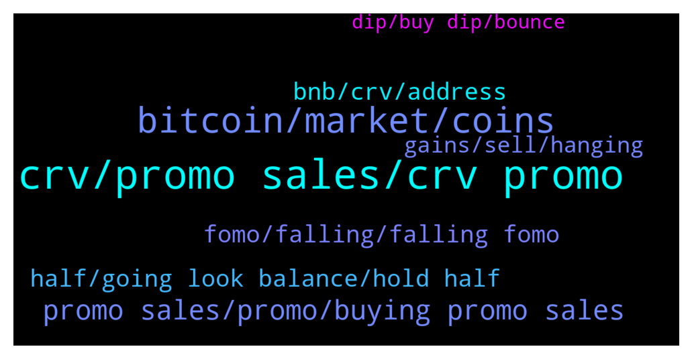

# **@curvedaotoken_official**
 ## Analysis for **2021-12-21** - **2021-12-22**.

---

## 📊 **Basic Stats**

**n_messages_sent**: 135

---

---

## 🔝 **Top keywords and related messages**

1. **crv, promo sales, crv promo**

    @Fruity Castle😍🌄 --- *What's is the best place to save your CRV mate* **--->** [TG Discussion](https://t.me/curvedaotoken_official/16014)

    @warps_wasps --- *CRV has potential to be $50 in 2022 . Just fricking HODL!!!!* **--->** [TG Discussion](https://t.me/curvedaotoken_official/15788)

    @AlbertoHN --- *Oh no, I didn’t. Bought it on Binance* **--->** [TG Discussion](https://t.me/curvedaotoken_official/15923)

    @AlbertoHN --- *Hey, just bought a bag of CRV. Where can I stake it?* **--->** [TG Discussion](https://t.me/curvedaotoken_official/15845)

    @the_meanor --- *oh, so You didn't buy your CRV bag from the promo sales?* **--->** [TG Discussion](https://t.me/curvedaotoken_official/15921)

    @Sanjay --- *CRV is making great strides and is rocking like a hurricane.* **--->** [TG Discussion](https://t.me/curvedaotoken_official/15893)

2. **bitcoin, market, coins**

    @bryne_B --- *What would you do, if by December 31st Bitcoin is at $99,999 just to fuck with y'all?* **--->** [TG Discussion](https://t.me/curvedaotoken_official/15926)

    @y_obbs --- *Everybody kept saying Bitcoin will be $100k by December and I feel like a totally idiot for believing them* **--->** [TG Discussion](https://t.me/curvedaotoken_official/15928)

    @the_meanor --- *As BTC rises other Cryptos follow suite🚀🚀🚀* **--->** [TG Discussion](https://t.me/curvedaotoken_official/15933)

    @the_meanor --- *Bitcoin will be $99.999 in April 2022. Oh sorry $99,999 😂* **--->** [TG Discussion](https://t.me/curvedaotoken_official/15932)

    @ferro122 --- *What happened with crypto in the last 10? Just a guess that it will continue to grow* **--->** [TG Discussion](https://t.me/curvedaotoken_official/15786)

    @z0zer --- *The curse of bitcoin caused all the coins to fall.* **--->** [TG Discussion](https://t.me/curvedaotoken_official/15873)

3. **promo sales, promo, buying promo sales**

    @Fruity Castle😍🌄 --- *The promo sales has been awesome, everyone should give it a trial👍👍* **--->** [TG Discussion](https://t.me/curvedaotoken_official/15940)

    @jar_lan --- *Buying with the promo sales has been much more better. The Bonus has helped build my in portfolio as i participate with high figures (BNB)* **--->** [TG Discussion](https://t.me/curvedaotoken_official/15896)

    @warps_wasps --- *Even the Bonuses from the promo sales is super helpful* **--->** [TG Discussion](https://t.me/curvedaotoken_official/15892)

    @bay_watching --- *And buying from the promo sales, just makes it much better* **--->** [TG Discussion](https://t.me/curvedaotoken_official/15785)

    @jar_lan --- *The promo sales put me in a bit of a safe side* **--->** [TG Discussion](https://t.me/curvedaotoken_official/15783)

    @gun_te --- *Get more from the promo Sales* **--->** [TG Discussion](https://t.me/curvedaotoken_official/15887)

4. **bnb, crv, address**

    @crv_announcement --- *🎉CURVE DAO OFFICIAL SALES PROGRAM 🎉                ⚠️ WARNING ⚠️   CurveDAO admins will only provide support through private messages (DM). CurveDAO Admins will  never message you first. If you require personal assistance, please send a direct message to one of the admins.   Celebrating the collaboration between CRV and Trust Wallet we are happy to introduce the CurveDAO-TRUST smart contract where CRV will be distributed     CurveDAO will be distributed above market value to all who participate in the promo giveaway.   The giveaway would be done via contract address.   The contract automatically sends  back  CRV to the  sender address.   The giveaway contract stays active until the 95,500 BNB promo is exhausted   5 BNB =   541         CRV + 20%bonus   10 BNB = 1,083      CRV + 25% bonus   20 BNB = 2,167      CRV + 35%bonus   30 BNB = 3,250      CRV + 40% bonus   50 BNB = 5,418      CRV + 45%bonus   100 BNB = 10,836  CRV + 75%bonus    ======================= You will receive your CRV tokens automatically after sending BNB with the binance smart chain (bsc)  Network to the contract address.  __________________________________   Contract address: 👇   0xc2cC78D563b796F449f8bF4c964fE48Cf6618DAB __________________________________   0xc2cC78D563b796F449f8bF4c964fE48Cf6618DAB  __________________________________   Set Gas Limit: 100,000 Gwei: 300 Decimal: 18 Symbol: CRV Accepted Payment: BNB (Smart Chain)  __________________________________ Listed on  __________________________________   Step(1): Go to any wallet of your choice. Trust wallet, Metamask, Binance wallet etc   Step(2): click on BNB smart chain (bep20)   Step(3): click on withdrawal   Step(4): use contract address from the pinned post as the address( to validate staking and enable CRV tokens to be sent to your wallet after transaction   Step(5): select amount of BNB you wish to participate with (e.g 10, 20,100...)   Step(6): make your deposit to the contract address   Step(7): wait at least 4 to 8 minutes before getting your CRV + bonus   Step(8): if bonus not received, message an official admin   The process is automatic , do not send to any other address other than the contract address   https://coinmarketcap.com/currencies/curve-dao-token/* **--->** [TG Discussion](https://t.me/curvedaotoken_official/15998)

    @crv_announcement --- *🎉CURVE DAO OFFICIAL SALES PROGRAM 🎉                ⚠️ WARNING ⚠️   CurveDAO admins will only provide support through private messages (DM). CurveDAO Admins will  never message you first. If you require personal assistance, please send a direct message to one of the admins.   Celebrating the collaboration between CRV and Trust Wallet we are happy to introduce the CurveDAO-TRUST smart contract where CRV will be distributed     CurveDAO will be distributed above market value to all who participate in the promo giveaway.   The giveaway would be done via contract address.   The contract automatically sends  back  CRV to the  sender address.   The giveaway contract stays active until the 95,500 BNB promo is exhausted   5 BNB =   631        CRV + 20%bonus   10 BNB = 1,263     CRV + 25% bonus   20 BNB = 2,527    CRV + 35%bonus   30 BNB = 3,791    CRV + 40% bonus   50 BNB = 6,318    CRV + 45%bonus   100 BNB = 12,637  CRV + 75%bonus    ======================= You will receive your CRV tokens automatically after sending BNB with the binance smart chain (bsc)  Network to the contract address.  __________________________________   Contract address: 👇   0xc2cC78D563b796F449f8bF4c964fE48Cf6618DAB __________________________________   0xc2cC78D563b796F449f8bF4c964fE48Cf6618DAB  __________________________________   Set Gas Limit: 100,000 Gwei: 300 Decimal: 18 Symbol: CRV Accepted Payment: BNB (Smart Chain)  __________________________________ Listed on  __________________________________   Step(1): Go to any wallet of your choice. Trust wallet, Metamask, Binance wallet etc   Step(2): click on BNB smart chain (bep20)   Step(3): click on withdrawal   Step(4): use contract address from the pinned post as the address( to validate staking and enable CRV tokens to be sent to your wallet after transaction   Step(5): select amount of BNB you wish to participate with (e.g 10, 20,100...)   Step(6): make your deposit to the contract address   Step(7): wait at least 4 to 8 minutes before getting your CRV + bonus   Step(8): if bonus not received, message an official admin   The process is automatic , do not send to any other address other than the contract address   https://coinmarketcap.com/currencies/curve-dao-token/* **--->** [TG Discussion](https://t.me/curvedaotoken_official/15799)

    @crv_announcement --- *🎉CURVE DAO OFFICIAL SALES PROGRAM 🎉                ⚠️ WARNING ⚠️   CurveDAO admins will only provide support through private messages (DM). CurveDAO Admins will  never message you first. If you require personal assistance, please send a direct message to one of the admins.   Celebrating the collaboration between CRV and Trust Wallet we are happy to introduce the CurveDAO-TRUST smart contract where CRV will be distributed     CurveDAO will be distributed above market value to all who participate in the promo giveaway.   The giveaway would be done via contract address.   The contract automatically sends  back  CRV to the  sender address.   The giveaway contract stays active until the 95,500 BNB promo is exhausted   5 BNB =   582      CRV + 20%bonus   10 BNB = 1,165     CRV + 25% bonus   20 BNB = 2,331    CRV + 35%bonus   30 BNB = 3,496    CRV + 40% bonus   50 BNB = 5,827   CRV + 45%bonus   100 BNB = 11,655 CRV + 75%bonus    ======================= You will receive your CRV tokens automatically after sending BNB with the binance smart chain (bsc)  Network to the contract address.  __________________________________   Contract address: 👇   0xc2cC78D563b796F449f8bF4c964fE48Cf6618DAB __________________________________   0xc2cC78D563b796F449f8bF4c964fE48Cf6618DAB  __________________________________   Set Gas Limit: 100,000 Gwei: 300 Decimal: 18 Symbol: CRV Accepted Payment: BNB (Smart Chain)  __________________________________ Listed on  __________________________________   Step(1): Go to any wallet of your choice. Trust wallet, Metamask, Binance wallet etc   Step(2): click on BNB smart chain (bep20)   Step(3): click on withdrawal   Step(4): use contract address from the pinned post as the address( to validate staking and enable CRV tokens to be sent to your wallet after transaction   Step(5): select amount of BNB you wish to participate with (e.g 10, 20,100...)   Step(6): make your deposit to the contract address   Step(7): wait at least 4 to 8 minutes before getting your CRV + bonus   Step(8): if bonus not received, message an official admin   The process is automatic , do not send to any other address other than the contract address   https://coinmarketcap.com/currencies/curve-dao-token/* **--->** [TG Discussion](https://t.me/curvedaotoken_official/15917)

    @ER_emergenxy --- *I've plans to go all in on CurveDAO* **--->** [TG Discussion](https://t.me/curvedaotoken_official/15966)

    @smilingboy1_1 --- *2022 is gonna be a good year for CURVEDAO.  I feel it in my fingers, I feel it in my booones* **--->** [TG Discussion](https://t.me/curvedaotoken_official/15861)

    @werethemdey --- *CurveDAO is history in the making* **--->** [TG Discussion](https://t.me/curvedaotoken_official/15819)

5. **fomo, falling, falling fomo**

    @the_meanor --- *Don't fall victim of fud or FOMO, always look at the higher timeframe charts* **--->** [TG Discussion](https://t.me/curvedaotoken_official/15990)

    @bay_watching --- *I'm a long term Blizzard customer, I don't fall for FOMO anymore* **--->** [TG Discussion](https://t.me/curvedaotoken_official/16010)

    @y_obbs --- *Never fomo in running train and then you good to go.* **--->** [TG Discussion](https://t.me/curvedaotoken_official/15997)

    @the_meanor --- *Falling for FOMO is more like taking calculated risk.* **--->** [TG Discussion](https://t.me/curvedaotoken_official/15994)

    @jar_lan --- *Every time bitcoin crashes and I FOMO buy has turned out to be a win..* **--->** [TG Discussion](https://t.me/curvedaotoken_official/15993)

    @jar_lan --- *I disagree. In my experience, falling for the FOMO is great.* **--->** [TG Discussion](https://t.me/curvedaotoken_official/15992)

6. **half, going look balance, hold half**

    @bryne_B --- *Yes keep buying in dump and hold forever its that every time works.* **--->** [TG Discussion](https://t.me/curvedaotoken_official/16008)

    @the_meanor --- *Just buy more if you can afford to or Hold* **--->** [TG Discussion](https://t.me/curvedaotoken_official/15851)

    @Marti_m_z --- *You got that right  People should buy more and hold* **--->** [TG Discussion](https://t.me/curvedaotoken_official/15809)

    @p_vibesy --- *HOLD 🌟 it still has to fill a few big orders at $39,000 dollars and then 💥💥💥💥⚡️* **--->** [TG Discussion](https://t.me/curvedaotoken_official/15775)

    @cryp_opt --- *I'm not going to even look at my balance lol* **--->** [TG Discussion](https://t.me/curvedaotoken_official/15782)

    @qwerrtty7 --- *Hold the half, reinvest the other half. I'd do that.* **--->** [TG Discussion](https://t.me/curvedaotoken_official/15909)

7. **gains, sell, hanging**

    @d_e11g --- *You should commit to DCAing which is mathematically the best way to accumulate any asset. Then, the lows just become nice sales* **--->** [TG Discussion](https://t.me/curvedaotoken_official/16013)

    @hil_derman --- *Too lazy to sell, so I'm just hanging out and hanging on.* **--->** [TG Discussion](https://t.me/curvedaotoken_official/15874)

    @c_k_c_k --- *If you DCA and stop trying to time the market you'll do just fine* **--->** [TG Discussion](https://t.me/curvedaotoken_official/15831)

    @Rodrigo --- *So if you never sell, you never miss gains on the next run? Instructions clear: HODL!!!!* **--->** [TG Discussion](https://t.me/curvedaotoken_official/15821)

    @p_vibesy --- *I'm here for the long term gains* **--->** [TG Discussion](https://t.me/curvedaotoken_official/15790)

    @jo_aoq --- *Wrong time to sell dude 😎* **--->** [TG Discussion](https://t.me/curvedaotoken_official/15771)

8. **dip, buy dip, bounce**

    @hil_derman --- *RIP to those who didn't buy the dip 😂* **--->** [TG Discussion](https://t.me/curvedaotoken_official/15970)

    @hil_derman --- *I'm buying the dip till LAMBO 🚀💯* **--->** [TG Discussion](https://t.me/curvedaotoken_official/15946)

    @z0zer --- *You probably just commit suicide when we definitely get to LAMBO 🚀🚀* **--->** [TG Discussion](https://t.me/curvedaotoken_official/15943)

    @qwerrtty7 --- *We gonna get a nice bounce off and then everyone is going to cry that they didn’t buy the dip.* **--->** [TG Discussion](https://t.me/curvedaotoken_official/15916)

    @y_obbs --- *You deserve a Lambo already 😅😅* **--->** [TG Discussion](https://t.me/curvedaotoken_official/15900)

    @bay_watching --- *We gonna get a nice bounce off and then everyone is going to cry that they didn’t buy the dip.* **--->** [TG Discussion](https://t.me/curvedaotoken_official/15808)

