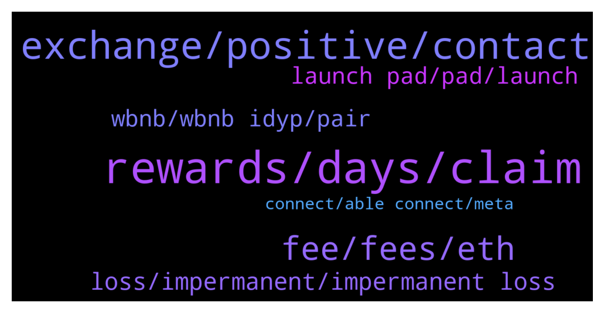

# **@dypfinance**
 ## Analysis for **2021-12-21** - **2021-12-22**.

---

## 📊 **Basic Stats**

**n_messages_sent**: 204

---

---

## 🔝 **Top keywords and related messages**

1. **rewards, days, claim**

    @florin22xxl --- *thank you! Last question, under contract expiration it says 1 year, can i stop staking after 90 days? Or i can only stop after 1 year* **--->** [TG Discussion](https://t.me/dypfinance/232444)

    @DhoniMSD516 --- *There is no autocompound, if you want to reinvest you need to click reinvest in staking pools  Approve and deposit in Farming pools* **--->** [TG Discussion](https://t.me/dypfinance/232443)

    @Life_is_love_La_la_la_la_la --- *Admins: I'm sorry to ask a question about DYP staking (V2) which must have been answered a thousand times but I will temper it by first saying that I have staked 665 DYP in the 90 day contract today and from what I have seen tick-up in claimable DYP rewards it appears to be incredibly "rewarding" simply on the basis of what I have been awarded today. I think i  remember reading that the the rewards are auto-compounding but I cannot see the mechanism by which this happens. From what I see on screen I can click on "Reinvest" whenever I wish but this is a manual process. Am I misunderstanding something? The other thing is would beg your patience to explain is how are the DYP rewards calculated/derived? Are they derived from a proportion of fees generated within the platform or do some of the Avalanche fees feed back into the reward pot? I hope this is not too tiresome a question and that others may benefit from your clarification of the position. Many thanks* **--->** [TG Discussion](https://t.me/dypfinance/232513)

    @uBrown --- *I didn't get my reward Today* **--->** [TG Discussion](https://t.me/dypfinance/231933)

    @Cricascar --- *Yes ,that is what I'm saying if you don't claim at the same hour you lose rewards right* **--->** [TG Discussion](https://t.me/dypfinance/232404)

    @DhoniMSD516 --- *Hello it is perfectly ok to ask questions no issues but please use paragraphs 😅  Coming to the first answer the rewards are NOT auto compounded and no where mentioned by us that there is auto compounding , may be you misread it. Yes if you want to add more you can use reinvest and this doesn't reset timer.  Second question: The staking works under POS(Proof of stake concept) there are many explanation regarding this already available on Google and Youtube so please check out them* **--->** [TG Discussion](https://t.me/dypfinance/232514)

2. **exchange, positive, contact**

    @R --- *Let us know about it for sure.* **--->** [TG Discussion](https://t.me/dypfinance/232486)

    @NewCryptoWorldTrader --- *Hey still no news For new Listing as mentioned in Roadmap  In 2021  or Good news on the way :)😁* **--->** [TG Discussion](https://t.me/dypfinance/232117)

    @DhoniMSD516 --- *Hello please send your proposal to contact@dyp.finance* **--->** [TG Discussion](https://t.me/dypfinance/232377)

    @RadiantPhoenix4 --- *No😂... for telegram.   I can't find them on the STICKERS section* **--->** [TG Discussion](https://t.me/dypfinance/232160)

    @timdyp --- *This is available for all the persons that are asking ''when is the new exchange coming''. We have provided all the required information from their compliance department on 8th of December, there is nothing else that we can do at this time. Also, because of the NDA we are not allowed to share any information. When the time comes, it will be announced by both the exchange and our team.  Plus, we have applied for a secondary tier 1 exchange, and we have received positive feedback from their team. But again, same story, we need to wait for the next step.  Basically there is nothing that we can do from our side, we just need to wait.* **--->** [TG Discussion](https://t.me/dypfinance/232488)

    @DhoniMSD516 --- *Hey please email your proposal to contact@dyp.finance* **--->** [TG Discussion](https://t.me/dypfinance/232475)

3. **fee, fees, eth**

    @Jorzico --- *I see over US500  to stack on eth lol seems that chain is for the rich* **--->** [TG Discussion](https://t.me/dypfinance/231963)

    @Skipper_IM --- *I am asking because when I try to deposit 0,1 WETH the fee is about 100 usd. And when I try to deposit 1 WETH - the fee increases to 300-350 usd.* **--->** [TG Discussion](https://t.me/dypfinance/232202)

    @jamalzahi1 --- *Hey..when I want to claim..the fee is high on the Avalanche network..is there some way.?. i think 6-10 dollars is a lot* **--->** [TG Discussion](https://t.me/dypfinance/232393)

    @hemanrock --- *However it depends on ETH network, no one can handle gas price.* **--->** [TG Discussion](https://t.me/dypfinance/232261)

    @hemanrock --- *Sometimes there might be a network congestion. due to that gas price is high 😄* **--->** [TG Discussion](https://t.me/dypfinance/231964)

    @Vaughanrg --- *Hi all is there a tax fee on slippage for pancake swap or is it 1% please* **--->** [TG Discussion](https://t.me/dypfinance/232052)

4. **loss, impermanent, impermanent loss**

    @Bekirr1 --- *Do I have a permanent loss to the body while ascending? Doesn't my money have to go up when I go up?* **--->** [TG Discussion](https://t.me/dypfinance/232367)

    @DhoniMSD516 --- *Please read about impermanent loss and compare the market price values at the time of your deposit and now* **--->** [TG Discussion](https://t.me/dypfinance/232362)

    @ShrutiShruti99 --- *So it means when bnb hits 600$ my impermanent loss would recover?* **--->** [TG Discussion](https://t.me/dypfinance/232329)

    @Bekirr1 --- *Good Morning. Why is my farm not increasing while dyp is increasing?* **--->** [TG Discussion](https://t.me/dypfinance/232359)

    @DhoniMSD516 --- *I do understand, just please go check and compare the marketprices at the time of deposit and now, so that you can understand why the reason for the decrease in your value, the value increases when these tokens raises too this is what we call impermanent loss and this is common risk involved in yield farming.* **--->** [TG Discussion](https://t.me/dypfinance/232366)

    @Bekirr1 --- *I don't shoot anyway so that there is no permanent loss. My question is why is my investment not going up when the market is going up? You always give the same fudge answers* **--->** [TG Discussion](https://t.me/dypfinance/232363)

5. **launch pad, pad, launch**

    @Vaughanrg --- *Is dyp going to have a launch pad?* **--->** [TG Discussion](https://t.me/dypfinance/232010)

    @Wen Hsiang --- *Excuse me   i refer dyp to my friend  but I am not receive 5% dyp  why? My English not good so don’t be care thank you* **--->** [TG Discussion](https://t.me/dypfinance/232497)

    @DhoniMSD516 --- *You should also consider DYP value on next column* **--->** [TG Discussion](https://t.me/dypfinance/232311)

    @Disguy125 --- *Will the launch pad use IDYP also ?* **--->** [TG Discussion](https://t.me/dypfinance/232252)

    @DhoniMSD516 --- *Hey you are in DYP project channel and you can read about DYP and the features we are offering here  https://t.me/dypfinance/229271* **--->** [TG Discussion](https://t.me/dypfinance/232432)

    @iamJubi --- *You can discuss anything relevant or connected to DYP here.* **--->** [TG Discussion](https://t.me/dypfinance/232006)

6. **wbnb, wbnb idyp, pair**

    @DhoniMSD516 --- *Hey the farm LP involved iDYP and WBNB pair* **--->** [TG Discussion](https://t.me/dypfinance/232360)

    @RadiantPhoenix4 --- *That means 75 CAKE will be used to provide liquidity and I'll receive LP tokens.  This is my main question:  At the end of the contract, if $CAKE is now worth $20 per token, but the WBNB/iDYP pair has suffered a dip, will I receive less than 75CAKE?* **--->** [TG Discussion](https://t.me/dypfinance/232143)

    @DhoniMSD516 --- *Yes because your CAKE is converted to WBNB-iDYP pair so your value depends on marketprice of these token at the time of your withdrawal* **--->** [TG Discussion](https://t.me/dypfinance/232147)

    @ShrutiShruti99 --- *Whats the current price of wbnb?* **--->** [TG Discussion](https://t.me/dypfinance/232325)

    @RadiantPhoenix4 --- *So, depending on the price of CAKE and WBNB/iDYP pair, I could receive more than 75CAKE or less than 75CAKE.  understood* **--->** [TG Discussion](https://t.me/dypfinance/232150)

    @RadiantPhoenix4 --- *Also, if the WBNB/iDYP pair has a price rise, will I receive more than 75CAKE at the end of the contract?* **--->** [TG Discussion](https://t.me/dypfinance/232145)

7. **connect, able connect, meta**

    @Dsin420 --- *Yea it keeps telling me no web3 detected* **--->** [TG Discussion](https://t.me/dypfinance/231944)

    @Paul --- *ok found that....got a tg from a Jubi Lee also asking if i was able to connect my external wallet but blocked that.* **--->** [TG Discussion](https://t.me/dypfinance/232067)

    @Dsin420 --- *At first it wouldn't let me but cleared cache and cookies then it finally let me connect. Thanks for the quick help as always!* **--->** [TG Discussion](https://t.me/dypfinance/231956)

    @Dsin420 --- *Deleted brave browser now I'm able to connect.* **--->** [TG Discussion](https://t.me/dypfinance/231953)

    @Dsin420 --- *Weird, I'm in meta mask but just realized Everytime I click deposit it automatically takes me to brace browser* **--->** [TG Discussion](https://t.me/dypfinance/231949)

    @Dsin420 --- *Do I need to uninstall re install meta?* **--->** [TG Discussion](https://t.me/dypfinance/231945)

