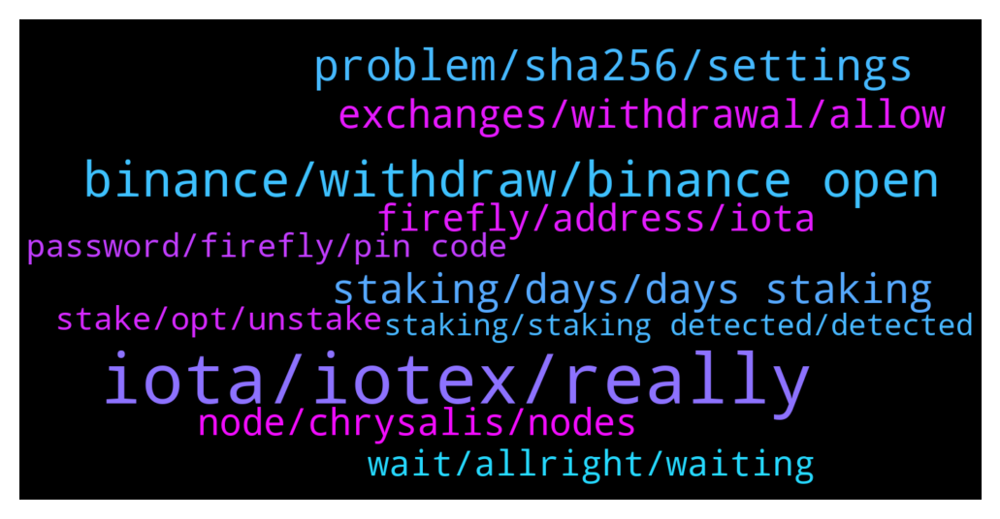

# **@iotatangle**
 ## Analysis for **2021-12-21** - **2021-12-22**.

---

## 📊 **Basic Stats**

**n_messages_sent**: 413

---

---

## 🔝 **Top keywords and related messages**

1. **iota, iotex, really**

    @sobroggi --- *Yeah... I really dislike their Marketing strategy, especially since they seem to talk down IOTA, just because they sound similar and people automatically think the tech might also be similar...* **--->** [TG Discussion](https://t.me/iotatangle/300621)

    @millenium_earl2000 --- *What is the difference between iota and iotex* **--->** [TG Discussion](https://t.me/iotatangle/300693)

    @heyheynotbaaddd --- *Really they talked down on iota?* **--->** [TG Discussion](https://t.me/iotatangle/300628)

    @Arjan --- *I do have the same issue for days now! Anybody? Is there an exchange that does support the iota network??* **--->** [TG Discussion](https://t.me/iotatangle/300879)

    @Vadim --- *What does this mean my coins are ob my hard wallet* **--->** [TG Discussion](https://t.me/iotatangle/300468)

    @heyheynotbaaddd --- *I tot all coin are Blockchain* **--->** [TG Discussion](https://t.me/iotatangle/300605)

2. **binance, withdraw, binance open**

    @Fold11 --- *There is not many days left to wait for binance* **--->** [TG Discussion](https://t.me/iotatangle/301253)

    @Tahmis --- *I recommend waiting for Binance to open withdrawals. Huobi doesn't work either* **--->** [TG Discussion](https://t.me/iotatangle/301252)

    @ngayngo9x --- *Some days ago, I can withdraw from Binance.* **--->** [TG Discussion](https://t.me/iotatangle/300829)

    @sobroggi --- *But I've seen multiple people complaining about Binance and non-working withdrawals. Just try again from time to time, and it should work at some point. Worked for other people at least.* **--->** [TG Discussion](https://t.me/iotatangle/300638)

    @Jacques --- *Hope binance opens up again little fckers* **--->** [TG Discussion](https://t.me/iotatangle/300398)

    @Oshoosho22 --- *I still cant to withdraw from binance, have news from them?* **--->** [TG Discussion](https://t.me/iotatangle/300476)

3. **problem, sha256, settings**

    @Hans --- *settings...network. If manual selected you can check networks* **--->** [TG Discussion](https://t.me/iotatangle/300441)

    @Snelting11 --- *I downloaded the latest version and used the address I got from clicking "receive". Should be good right?* **--->** [TG Discussion](https://t.me/iotatangle/301039)

    @Boaty --- *Did you really check for SHA256? (If you are on windows you have to add SHA256 at the end of the certutil command)* **--->** [TG Discussion](https://t.me/iotatangle/300997)

    @Raw --- *I use mac os under file hash I have SHA256* **--->** [TG Discussion](https://t.me/iotatangle/301005)

    @Tahmis --- *You are now using a devnet address for some reason* **--->** [TG Discussion](https://t.me/iotatangle/301058)

    @allavenand --- *I’ll try again to download it and see if I get the same result* **--->** [TG Discussion](https://t.me/iotatangle/301057)

4. **staking, days, days staking**

    @NOMPike --- *So I'll miss the staking deadline* **--->** [TG Discussion](https://t.me/iotatangle/300624)

    @Fold11 --- *6 days left to start staking am i correct* **--->** [TG Discussion](https://t.me/iotatangle/301254)

    @Basti --- *You are able to prestake NOW (so you don't miss the starting date by a single second :D) for 7 days and the real staking will start on 28th december* **--->** [TG Discussion](https://t.me/iotatangle/300541)

    @Ziya --- *Why 0 days until staking? 6 days:)* **--->** [TG Discussion](https://t.me/iotatangle/300833)

    @mohsen --- *Now We can stake or after 6 days staking is possible?* **--->** [TG Discussion](https://t.me/iotatangle/300540)

    @sobroggi --- *No, there will be no further delay.  Pre-Staking is running from 21.12. - 28.12.  Starting on 28.12., you'll then have 90 days of staking.* **--->** [TG Discussion](https://t.me/iotatangle/300634)

5. **exchanges, withdrawal, allow**

    @millenium_earl2000 --- *Can admin talk to bitrue to allow iota withdrawal* **--->** [TG Discussion](https://t.me/iotatangle/300503)

    @cryptoadvisoryaus --- *Does anyone know an Exchange which is currently allowing withdrawal of IOTA using IOTA blockchain as Binance is currently suspended 🤦‍♂️* **--->** [TG Discussion](https://t.me/iotatangle/301026)

    @Basti --- *1. Iota network is working. It's on binance that they don't allow withdrawals. 2. Hope that they allow withdrawal till the 28th and activate to get informed by SMS when it's allowed again 3. Sell and rebuy on a different exchange* **--->** [TG Discussion](https://t.me/iotatangle/300547)

    @millenium_earl2000 --- *Any other exchange allow iota withdrawal* **--->** [TG Discussion](https://t.me/iotatangle/300695)

    @Tahmis --- *The reason is that exchanges are not used to withdrawing such high amounts and it causes problems to them. Iota network is working fine at the moment* **--->** [TG Discussion](https://t.me/iotatangle/301082)

    @millenium_earl2000 --- *Can iota talk to bitrue to allow withdrawal* **--->** [TG Discussion](https://t.me/iotatangle/300478)

6. **firefly, address, iota**

    @Raw --- *Hello, maybe someone can help me, with the Firefly SHA256 check I get a different number than with the Firefly Release Notes, it starts with 1d and not with 4c.  Does anyone have any idea why that could be?  Or does anyone know a good Iota Telegram group?* **--->** [TG Discussion](https://t.me/iotatangle/300984)

    @allavenand --- *So how do I get a Firefly Iota address? And not a atoi address….* **--->** [TG Discussion](https://t.me/iotatangle/301052)

    @allavenand --- *Hello everybody, what am I missing, I moved my iota tokens to Bitfinex and now I would like to transfer them to the new firefly account I created, however when I try to send my iota tokens the address I get is a Mi and it’s says that it is an invalid address. I guess I am missing something… thank you very much for your help* **--->** [TG Discussion](https://t.me/iotatangle/301020)

    @allavenand --- *I just noticed a strange thing, my Firefly address starts by atoi and not iota, could this be the reason* **--->** [TG Discussion](https://t.me/iotatangle/301048)

    @Markus --- *You don't have To send iota anywhere. In firefly-wallet the only thing I had To do was To update firefly and  click the stake button. If you have To send somewhere you are being scammed.* **--->** [TG Discussion](https://t.me/iotatangle/300942)

    @allavenand --- *Yep I downloaded the firefly app, opened a new wallet and when I go to deposit iota   from Bitfinex it gives me an error saying that the address is not correct* **--->** [TG Discussion](https://t.me/iotatangle/301035)

7. **node, chrysalis, nodes**

    @Hans --- *tried manual mode through a node with participation* **--->** [TG Discussion](https://t.me/iotatangle/300434)

    @Tahmis --- *Some patience is needed as there isn't too many nodes supporting this feature yet I guess :)* **--->** [TG Discussion](https://t.me/iotatangle/300414)

    @Basti --- *So wait for nodes to update or change to a different node* **--->** [TG Discussion](https://t.me/iotatangle/300539)

    @DanieleNad_DestyNic --- *I just have 2 nodes, no one works lol* **--->** [TG Discussion](https://t.me/iotatangle/300455)

    @Basti --- *Yeah node Operators need to update* **--->** [TG Discussion](https://t.me/iotatangle/300406)

    @DanieleNad_DestyNic --- *How did u know the node?* **--->** [TG Discussion](https://t.me/iotatangle/300437)

8. **wait, allright, waiting**

    @Arjan --- *Allright, thanks guys! I will wait a day or two. If it’s still not possible, I’ll do that. Thanks* **--->** [TG Discussion](https://t.me/iotatangle/300884)

    @Jacques --- *Anyhow lets hope the 48 hours will be working* **--->** [TG Discussion](https://t.me/iotatangle/301185)

    @Arjan --- *Allright, that would be great 👍* **--->** [TG Discussion](https://t.me/iotatangle/300887)

    @ngayngo9x --- *For now, waiting for 28th...to receive ASMB and SMR. I can't wait for it 😄* **--->** [TG Discussion](https://t.me/iotatangle/300823)

    @aizensu --- *Best to wait for it, you don’t miss anything atm* **--->** [TG Discussion](https://t.me/iotatangle/300760)

    @DanieleNad_DestyNic --- *Ok fantastic, Ty, I guess I need to wait some days then.* **--->** [TG Discussion](https://t.me/iotatangle/300427)

9. **password, firefly, pin code**

    @Toby --- *Why ask us for password on firefly when you made us create pin code* **--->** [TG Discussion](https://t.me/iotatangle/300866)

    @mohsen --- *I forget my password and I just have it's backup* **--->** [TG Discussion](https://t.me/iotatangle/300802)

    @mckhak --- *Hello admin, i have a problem. I've forgotten my FireFly wallet password but still have the seed phrase and backup file. How should i reset rmy password?* **--->** [TG Discussion](https://t.me/iotatangle/301093)

    @Sailor --- *It's simply to creat new firefly wallet using your seeds* **--->** [TG Discussion](https://t.me/iotatangle/301095)

    @Toby --- *Okay usually pin code makes life easier than remembering a complex password. How can one reset password then* **--->** [TG Discussion](https://t.me/iotatangle/300869)

    @Tahmis --- *Pin code is for seeing the funds in the wallet. You can't send them only  with pin code* **--->** [TG Discussion](https://t.me/iotatangle/300867)

10. **stake, opt, unstake**

    @BlueRyse --- *Or I have to stake everything at once?* **--->** [TG Discussion](https://t.me/iotatangle/300704)

    @Osaaaa --- *how i can  chenge node, i add  funds to stake  but something is wrong* **--->** [TG Discussion](https://t.me/iotatangle/300779)

    @Tahmis --- *Yes :) Almost everybody can stake* **--->** [TG Discussion](https://t.me/iotatangle/301266)

    @Fold11 --- *How the hell i can stake then ffs* **--->** [TG Discussion](https://t.me/iotatangle/301231)

    @Tomo --- *Any tutorial how to stake? I have firefly wallet.* **--->** [TG Discussion](https://t.me/iotatangle/300671)

    @Julien_lesehan --- *how do you stake ?got issue to put an amount to stake.* **--->** [TG Discussion](https://t.me/iotatangle/300494)

