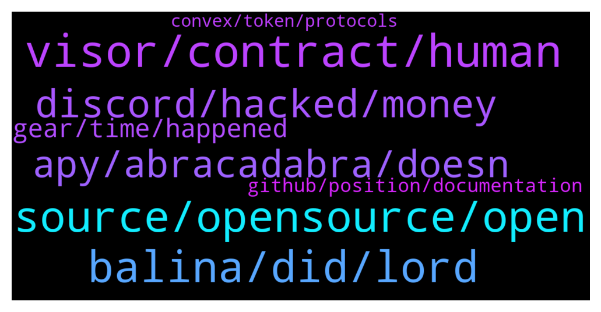

# **@lobsters_chat**
 ## Analysis for **2021-12-21** - **2021-12-22**.

---

## 📊 **Basic Stats**

**n_messages_sent**: 422

---

---

## 🔝 **Top keywords and related messages**

1. **source, opensource, open**

    @elie55 --- *Hey, want to get peoples thought on opensource. You have a split in crypto where half the tools are open and half are closed. Eg opensea could be opensource but isn’t. And uniswap is.  We’re considering open sourcing ourselves and would love to hear some of the pitfalls of taking that approach and giving away our “ip”* **--->** [TG Discussion](https://t.me/lobsters_chat/309210)

    @sneg55 --- *what about open source but without a permissive license, like Uniswap v3?  is it still aligned with crypto ethos?* **--->** [TG Discussion](https://t.me/lobsters_chat/309297)

    @FiveBoroughs --- *Generally speaking opensource backends, close source UIs/frontends will satisfy most of the community and make you composable while protecting from low effort clones* **--->** [TG Discussion](https://t.me/lobsters_chat/309284)

    @xk. --- *It would be counterproductive at this point if developers started favouring closed source deployment, on top of the already present challenge of grasping decentralisation, its implications and novel financial primitives* **--->** [TG Discussion](https://t.me/lobsters_chat/309312)

    @bensams0 --- *if you stay closed source, the biggest way you retain value is by hoping nobody implements something better. if you go open source, your only way to retain value is bizdev/partnerships.  one of these things might be more sustainable than the other for your product* **--->** [TG Discussion](https://t.me/lobsters_chat/309219)

    @ivangbi --- *I can’t wait for fud on that point lol (or maybe the industry standards already accepted it actually). Anyway, licenses are not the same for every piece of the protocol (in general in most cases) because those modules built w the use of others’ code need to remain according to their initial standards. The license is “we can build together, integrate, but you can’t start your own protocol based off it” (ofc this does not help against anonymous forks, but non-anonymous - does a little bit)* **--->** [TG Discussion](https://t.me/lobsters_chat/309230)

2. **balina, did, lord**

    @eth2enthusiast --- *Where you mean to him? 🧐 his preferred pronouns are “our lord and saviour” Dani* **--->** [TG Discussion](https://t.me/lobsters_chat/309807)

    @Henry_Elder --- *Not just any couple guys, it's Tai Lopez of "here in my garage" fame 😂* **--->** [TG Discussion](https://t.me/lobsters_chat/309360)

    @Bysmiel --- *One Chinese KOL lost his 5m usdt mining fund in mochi drama now his moves on like nothing happened* **--->** [TG Discussion](https://t.me/lobsters_chat/309901)

    @michael_p3711 --- *Just crazy how Sisyphus was an insider there too* **--->** [TG Discussion](https://t.me/lobsters_chat/309881)

    @SpikeSpiege1 --- *Yep. He was on CNN a cpl times this year already* **--->** [TG Discussion](https://t.me/lobsters_chat/309930)

    @NeasReal --- *yea i remember that, i suspect he is less in direct visbility, but from my network know he has been growing that site, its kinda what he used to do before i guess.* **--->** [TG Discussion](https://t.me/lobsters_chat/309929)

3. **visor, contract, human**

    @LilMoonLamboX3 --- *That visr got gang banged sir* **--->** [TG Discussion](https://t.me/lobsters_chat/309530)

    @nvy0x --- *So it turns out that none of the Visor audits actually covered the staking contract that was hacked (or any staking contract at all). I guess this would explain how such a weakness in the code came to pass; the code was effectively unaudited.* **--->** [TG Discussion](https://t.me/lobsters_chat/309647)

    @storm0x --- *yeah its bad, but biggest oof would be to drain the users funds, this just impacts the visr Token AFAIK* **--->** [TG Discussion](https://t.me/lobsters_chat/309557)

    @metacoin --- *I believe the attacker took 3% of total supply, even a modest whitehat fee of 5-10% would be a huge payout here, totally justified and no one is a victim. Plenty of minted tokens to be thrown around in situations like this. Hope to see more of that in the future* **--->** [TG Discussion](https://t.me/lobsters_chat/309626)

    @nvy0x --- *I would tend to agree, but human errors like these happen frequently. Although it is a huge oversight on the team, it also highlights the importance of third-party security checks. Outside perspectives are key, and with no audits for their staking contracts, Visor is clearly a protocol that lacks in that department.* **--->** [TG Discussion](https://t.me/lobsters_chat/309653)

    @StrategicReserve --- *Yeah, Visor really needs a security person on the team.* **--->** [TG Discussion](https://t.me/lobsters_chat/309561)

4. **discord, hacked, money**

    @pjsm1508 --- *monkey kingdom discord hacked 1.3M lost  https://solscan.io/account/HuiYfmAceFkmhu3yP8t3a6VMYfw3VSX2Ymqqj9M2k9ib#solTransfers* **--->** [TG Discussion](https://t.me/lobsters_chat/309568)

    @LilMoonLamboX3 --- *knew they shoulda sold the discord lol* **--->** [TG Discussion](https://t.me/lobsters_chat/309584)

    @anonymous_007555 --- *Fractal discord got hacked apparently lol. Some funds lost I guess* **--->** [TG Discussion](https://t.me/lobsters_chat/309565)

    @LilMoonLamboX3 --- *bro its genius, just build the discord up and flip it to a real project for big money* **--->** [TG Discussion](https://t.me/lobsters_chat/309325)

    @spreek --- *What is meant by a discord being hacked? Like admin accounts compromised and them posting phishing links or what?* **--->** [TG Discussion](https://t.me/lobsters_chat/309571)

    @phil_muhbags --- *I know   60 million dollar rug pulls and no one blinks an eye  A discord mod quits and everyone loses their minds.* **--->** [TG Discussion](https://t.me/lobsters_chat/309896)

5. **apy, abracadabra, doesn**

    @xk. --- *Any reason why farms do not make it easy (e.g via an API) to retrieve current APY? I’ve had a look the other day at automating the stable coin table that @Henry_Elder posted, and the best I could come up with was scraping the front ends; except for abracadabra which requires connecting a wallet before the APY is even displayed (making automatic scraping a lot more difficult). Fwiw only one was indexed on the Graph and covalent doesn’t have this kind of data either* **--->** [TG Discussion](https://t.me/lobsters_chat/309435)

    @nullbitx8 --- *that's basically what it is atm https://eips.ethereum.org/EIPS/eip-721* **--->** [TG Discussion](https://t.me/lobsters_chat/309281)

    @ivangbi --- *Ur prices r not even pegged to anything then, u might as well call it a shib coin then.* **--->** [TG Discussion](https://t.me/lobsters_chat/309678)

    @apophenia19 --- *hint: the frontends are calling an API to show the APY* **--->** [TG Discussion](https://t.me/lobsters_chat/309436)

    @xk. --- *Doesn’t always mean it’s trivial to retrieve; see this abracadabra example, which doesn’t even take into account possible cloudflare protection* **--->** [TG Discussion](https://t.me/lobsters_chat/309438)

    @samkazemian --- *Ya it seems like for some reason it is just specifically us they don’t like. Not all other stablecoins.* **--->** [TG Discussion](https://t.me/lobsters_chat/309805)

6. **gear, time, happened**

    @michael_p3711 --- *Thanks, this is the best update ive had since it happened* **--->** [TG Discussion](https://t.me/lobsters_chat/309899)

    @ivangbi --- *Had this 3 weeks ago, just did it again after that. Weird UI glitch I guess [?]* **--->** [TG Discussion](https://t.me/lobsters_chat/309857)

    @jongweiss --- *pleb me couldn't see it before. it's clear as day though now.* **--->** [TG Discussion](https://t.me/lobsters_chat/309666)

    @michwill --- *yeah, I mean, can prob. deploy as soon as it can move* **--->** [TG Discussion](https://t.me/lobsters_chat/309265)

    @maclanewilkison --- *Congrats, impressed with how you all have handled the situation* **--->** [TG Discussion](https://t.me/lobsters_chat/309276)

    @michwill --- *ahhh GEAR is immovable at the moment* **--->** [TG Discussion](https://t.me/lobsters_chat/309260)

7. **github, position, documentation**

    @memer999 --- *Hi, does anyone know if it is possible to read a Uni v3 position? Like if I see a uni v3 NFT in a wallet, can I read what that position contains/its conditions?* **--->** [TG Discussion](https://t.me/lobsters_chat/309829)

    @freshaspect --- *Apeboard will also give you an easy route to get all core details.* **--->** [TG Discussion](https://t.me/lobsters_chat/309837)

    @freshaspect --- *You can just view it on Opensea and the cover art gives you most of the key details.* **--->** [TG Discussion](https://t.me/lobsters_chat/309833)

    @Trip --- *Oh you found it great thanks* **--->** [TG Discussion](https://t.me/lobsters_chat/309404)

    @Sep --- *thank you guys. I will study these.* **--->** [TG Discussion](https://t.me/lobsters_chat/309283)

    @bagheeera48 --- *No.  Thank you.  Seems interesting.  Will take a look.* **--->** [TG Discussion](https://t.me/lobsters_chat/309263)

