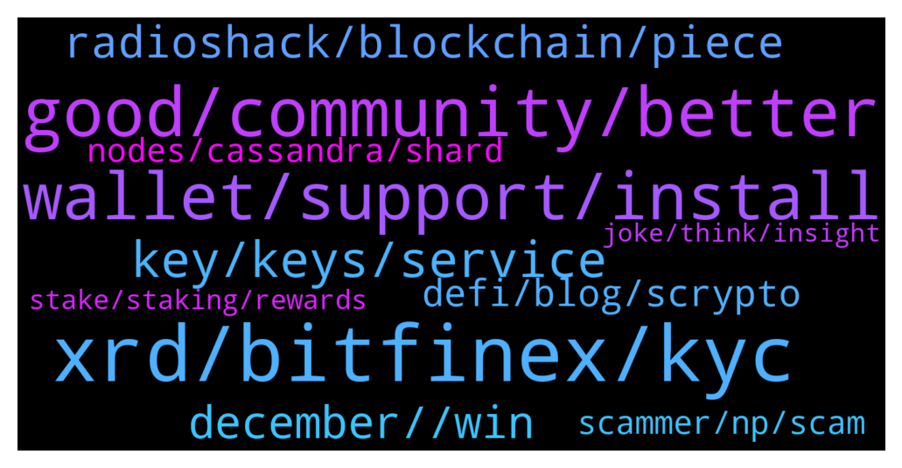

# **@radix_dlt**
 ## Analysis for **2021-12-21** - **2021-12-22**.

---

## 📊 **Basic Stats**

**n_messages_sent**: 554

---

---

## 🔝 **Top keywords and related messages**

1. **xrd, bitfinex, kyc**

    @WinsonGoh --- *Bcos of Bitfinex, I have not bought XRD. KYC took them donkey weeks.😏 still pending. Give up and shld wait for Kucoin.* **--->** [TG Discussion](https://t.me/radix_dlt/325562)

    @aus87 --- *@fpieper I would be very interested to see your slaying of pocket network and aleph zero.  I have done the searches through chats and have found few details comparing them to xrd.* **--->** [TG Discussion](https://t.me/radix_dlt/325245)

    @dlyons33 --- *Reason i'm asking is because I live in the US and it's not easy for me to buy XRD , but i can buy EXRD* **--->** [TG Discussion](https://t.me/radix_dlt/325264)

    @Null_v0id --- *Can you legally buy XRD in the USA or are there any laws that prevent you holding it?* **--->** [TG Discussion](https://t.me/radix_dlt/325261)

    @Magal36 --- *No, you don't need KYC to use Radix, but the official bridge from eXRD to XRD requires KYC since it's custodian, but you can also swap on Bitfinex without KYC and soon other CEX will support the native token as well* **--->** [TG Discussion](https://t.me/radix_dlt/325068)

    @CryptoRadix --- *kucoin only has exrd which is what you have bought. exrd is the ethereum wrapped token and can only be sent to ethereum wallets like metamask. the radix desktop wallet is for the native XRD token (which you can get on bitfinex). you cannot send exrd to the desktop wallet* **--->** [TG Discussion](https://t.me/radix_dlt/325355)

2. **good, community, better**

    @yessurrrre --- *#AMA is Radix useful for web3 or will it be ? I fail to see if it is useful because you show off demos of web3 applications with radix but no marketing is made around it whatsoever* **--->** [TG Discussion](https://t.me/radix_dlt/324839)

    @Blind5ight --- *That path is not as likely for Radix (or so I would like to believe), given the strategy taken so far by the team  The focus is on the community (and tech) and that community is now looking to expand by reaching out to developers This community will grow and hopefully become more and more passionate about the project Leading up to Babylon, we hopefully have a larger enthusiastic community  The entrepreneurs and VCs will then take notice of Radix if there is much industry in our little bee hive :)* **--->** [TG Discussion](https://t.me/radix_dlt/325715)

    @radixmatt --- *In my opinion there is a lot of similarity, yes, although I'm not sure there was a direct inspiration. But in any case I think it's a good way of thinking about it and Radix is going further with this notion of unix-style composability – particularly in the new transaction model we're moving to for Scrypto/Radix Engine v2. We talk a bit about the unix philosophy in our DeFi Whitepaper. https://radixdlt.com/whitepapers/defi  A little bit about our new style of transactions for Scrypto (which allow composition of components directly using buckets of resources): https://docs.radixdlt.com/main/scrypto/system/transaction-model.html* **--->** [TG Discussion](https://t.me/radix_dlt/325495)

    @wojtekkalka --- *actually Radix marketing is not that well yet :P ;)* **--->** [TG Discussion](https://t.me/radix_dlt/325349)

    @peterkimkz --- *Why does radix need time untill 2023 to be fully sharded?* **--->** [TG Discussion](https://t.me/radix_dlt/325026)

    @Jazzer9F --- *Excellent article from Coin Telegraph highlighting the current issues faced by Solidity developers, and detailing how Radix will give developers the power to build quickly, securely, and know that scale will never be a bottleneck!  https://cointelegraph.com/news/watch-out-solidity-new-project-aims-to-tackle-downsides-of-coding-defi-projects* **--->** [TG Discussion](https://t.me/radix_dlt/324876)

3. **wallet, support, install**

    @John --- *Has anybody had real challenges with the InstaPass KYC?  Does not recognize my facial image.  I have good camera on a late model phone.  Tried multiple times, no success.  My identity card picture is very clear.  I emailed their support, but don't know how long that will take, or if it will even be helpful.  Am I the only one facing this?* **--->** [TG Discussion](https://t.me/radix_dlt/325557)

    @Magal36 --- *Update the wallet and try this : https://t.me/radix_dlt/325119* **--->** [TG Discussion](https://t.me/radix_dlt/325128)

    @danich51 --- *Did anybody install a new firmware for their ledger? It seems like radix app (and all other apps) was wiped off and have to be reinstalled, do I just reintall the app with sideloading as I did the first time or the process is different? I don't wanna accidentally wipe out my key file.* **--->** [TG Discussion](https://t.me/radix_dlt/325809)

    @Snowman --- *I'm having issues sideloading the radix app onto my ledger nano s. I made a comment in the radix discord group in the support section. If someone from radix could help that would be great.* **--->** [TG Discussion](https://t.me/radix_dlt/325534)

    @Jake --- *I just got verification for instabridge. You can only swap $15k worth annually?!* **--->** [TG Discussion](https://t.me/radix_dlt/325207)

    @John --- *well, i've reached some maximum number of attempts right now, will wait to hear from support, or try again tomorrow.  thx.* **--->** [TG Discussion](https://t.me/radix_dlt/325570)

4. **key, keys, service**

    @danhughes --- *I'm sure for some services you'll still need kyc etc and that's fine. I'm talking about the reduction of friction to surf and do stuff. Its like a "login with Google" but it's built in and it's not Google* **--->** [TG Discussion](https://t.me/radix_dlt/324915)

    @MassieFur --- *#ama I heared they (some people or governments) are pushing digital login for the internet. So if you want to use the internet, you need to login. Reason would be, if there is a hack, they know who did it (at least this is the narative). Is there a way to create this, without privacy problems (no one can access this data, only in extreme necessary cases), without centralization of power? Or without other problems I didn't come up with😊?* **--->** [TG Discussion](https://t.me/radix_dlt/325038)

    @danhughes --- *Well you'd need some key ofc but it doesn't need to be the same key that controls your funds. In fact it probably shouldn't be. It's fine though as they serve different purposes so you probably want to separate them to some degree.* **--->** [TG Discussion](https://t.me/radix_dlt/324919)

    @danhughes --- *In fact you could probably do some crypto magic with bls or similar where your hot wallet keys are derived from a merged secret key and your identity key.* **--->** [TG Discussion](https://t.me/radix_dlt/324921)

    @danhughes --- *Then to spend funds you need the identity private key and the wallet private key* **--->** [TG Discussion](https://t.me/radix_dlt/324922)

    @danhughes --- *Yup, have a root Id key and derive from it for services... Nice* **--->** [TG Discussion](https://t.me/radix_dlt/324928)

5. **december, , win**

    @fpieper --- *🔥🤟 would be a nice end of year present* **--->** [TG Discussion](https://t.me/radix_dlt/325293)

    @Luke --- *My dad died a few days ago so I'm not up to date.* **--->** [TG Discussion](https://t.me/radix_dlt/325789)

    @Blind5ight --- *What happes in Vegas, does not stay in Vegas! 😁  https://twitter.com/radixdlt/status/1473280428601745408?t=ZE8oGekq5s8goCWH22gi9A&s=19  👉 Follow Radix Push for inside sc👀ps:  https://t.me/joinchat/0BmQTbhjZuphZTQy 👈* **--->** [TG Discussion](https://t.me/radix_dlt/325149)

    @Blind5ight --- *"They said it would be released in december, well now it's december and here it is." - Lady from the internet  https://youtu.be/xM0jZh1cn7g?t=37  👉 Follow Radix Push for inside sc👀ps:  https://t.me/joinchat/0BmQTbhjZuphZTQy 👈* **--->** [TG Discussion](https://t.me/radix_dlt/325683)

    @Jacob_XRD --- *New Competition has just launched!🚀  Memes, poems, paintings, or stage plays. The choices are endless.  Let's see what you can do!  Full Details: https://www.radixdlt.com/post/alexandria-launch-creative-competition* **--->** [TG Discussion](https://t.me/radix_dlt/325112)

    @CryptoLayerX --- *Is ociswap doing an airdrop as i have just watched a video on it and just want to make sure it is ligit.* **--->** [TG Discussion](https://t.me/radix_dlt/325046)

6. **radioshack, blockchain, piece**

    @MattToTheMoon --- *China is going to steal the tech and use it to build their digital currency but will spend billions on developing additional use cases, then they will allow crypto back into the country 🤣🤣* **--->** [TG Discussion](https://t.me/radix_dlt/324844)

    @Blind5ight --- *Follow @Ben_XRD to keep up to date on the fundamentals of crypto in general: https://twitter.com/bfargher/status/1473314412366761988?s=20  L3 😅 https://medium.com/starkware/fractal-scaling-from-l2-to-l3-7fe238ecfb4f* **--->** [TG Discussion](https://t.me/radix_dlt/325304)

    @mx471 --- *Strong. Are other crypto projects present there as well?* **--->** [TG Discussion](https://t.me/radix_dlt/325135)

    @Martian --- *The current cryptocurrency market is not very good. Many people have suffered a lot of losses recently, right?* **--->** [TG Discussion](https://t.me/radix_dlt/325768)

    @Kafkafrate --- *Have you seen the rant of Jack yesterday on Twitter? He's kind of right, we haven't even decentralized the web and big VCS already bought most of it.* **--->** [TG Discussion](https://t.me/radix_dlt/325706)

    @Kafkafrate --- *The idea of web3 was that the little guy can invest also, not like until now only accredited investors* **--->** [TG Discussion](https://t.me/radix_dlt/325721)

7. **defi, blog, scrypto**

    @yessurrrre --- *yes but what I mean is that with the heavy defi marketing, we are too dependant on the defi hype and radix doesnt 'just' do defi as most of people understand it, usecases are beyond just swapping tokens on a dex so narrowing down the project as 'defi optimal' idk* **--->** [TG Discussion](https://t.me/radix_dlt/324848)

    @Ben_XRD --- *https://youtu.be/UAgI-Z_bsQE&t=12m45s   Everything is DeFi ~Raj Gokal (12:45)* **--->** [TG Discussion](https://t.me/radix_dlt/324973)

    @Jazzer9F --- *In the 2nd installment of a four-part series the CEO of Radix Piers Ridyard and CPO Matthew Hine discuss why the Radix Engine is a game-changer for DeFi, and why the Ethereum Virtual Machine cant carry DeFi any further. 🚀  https://www.youtube.com/watch?v=fdG-JVT6bsc* **--->** [TG Discussion](https://t.me/radix_dlt/325115)

    @mx471 --- *Most hype topics flatten out and become irrelevant after that. DeFi, however, is not a hype topic but the future and is therefore the biggest selling point.* **--->** [TG Discussion](https://t.me/radix_dlt/324851)

    @prp_999 --- *Tradfi is slowly transitioning to DeFi* **--->** [TG Discussion](https://t.me/radix_dlt/325242)

    @yessurrrre --- *defi and web3 are linked obviously* **--->** [TG Discussion](https://t.me/radix_dlt/324853)

8. **nodes, cassandra, shard**

    @Sourena --- *Great, thanks 👍 very curious if the network model has gone through formal simulations with results* **--->** [TG Discussion](https://t.me/radix_dlt/325755)

    @Sourena --- *So as the cerebrus infographics reads 'the membership of each validator set shuffles periodically....called an "epoch".'  -Considering that in the future huge amount of data will be stored in each shard, and that data is not shared between different shards, does it mean that after each epoch all of that data in the network has to be reshuffled?  -Which algorithm takes care of the minimum number of nodes per each shard, so enough data redundancy and decentralization will always be guaranteed? #AMA* **--->** [TG Discussion](https://t.me/radix_dlt/325743)

    @Frosties --- *Hoskinson knew he didn’t have the credentials and know how to execute a technologically superior blockchain to Eth that’s why he peer reviews everything - which cost ADA 4 years twiddling their thumbs - whilst competitors built their decks within 2 years* **--->** [TG Discussion](https://t.me/radix_dlt/324829)

    @radixmatt --- *See the analysis performed by UC Davis researchers, which included simulated network results of the core Cerberus consensus model: https://arxiv.org/abs/2008.04450* **--->** [TG Discussion](https://t.me/radix_dlt/325762)

    @Blind5ight --- *Yes, there's a researchnet called Cassandra where Dan implemented a prototype of fully sharded Cerberus among other things (hybrid consensus: probabilistic phase going into a deterministic phase) Tests are run together with the community, they are coordinated here: https://t.me/cassandraplayground And streamed on twitch occasionally as well  Altho, I don't think @danhughes implemented the load balancing algo in Cassandra?* **--->** [TG Discussion](https://t.me/radix_dlt/325757)

    @ahsimon --- *Agreed.   That doubt is one of the reasons why many people will miss the opportunity to buy at what, with the benefit-of-hindsight, will have been bargain prices.   A related risk is that a lot of Xi'an is still in Dan's head.  He has tried to minimize this risk by keeping Russell (the CTO) fully up to speed with Cassandra.* **--->** [TG Discussion](https://t.me/radix_dlt/324828)

9. **scammer, np, scam**

    @Blind5ight --- *Nobody from the team or community mods will DM you  Scammers however will* **--->** [TG Discussion](https://t.me/radix_dlt/325420)

    @Magal36 --- *I wasn't calling you a scammer 😂😂😂 I understood you were contacted by a scammer* **--->** [TG Discussion](https://t.me/radix_dlt/324913)

    @anilsahbaz98 --- *:D :D Np bro , but im not scammer you know . Now I switched to computer and now I use google translate. At least we can get along better. An application where I can follow the wallet we use on the computer.* **--->** [TG Discussion](https://t.me/radix_dlt/324909)

    @PeachyKeehn --- *Most anti-scam/spam applications try to boot someone that joins and posts within 24hrs of their entry into a channel.  Posting an innocuous "Hi" gets them through that barrier and they'll let the account dwell in the background for 24hrs before using it to post their spam-scam* **--->** [TG Discussion](https://t.me/radix_dlt/325728)

    @muu_0O --- *Hello admin wo I must contact to show him a promoto offers* **--->** [TG Discussion](https://t.me/radix_dlt/325443)

    @MassieFur --- *No. People who DM you after you are asking such questions here* **--->** [TG Discussion](https://t.me/radix_dlt/325034)

10. **stake, staking, rewards**

    @Jake --- *Any suggestions on who to stake with? I'm sure you all have your biases. Haha* **--->** [TG Discussion](https://t.me/radix_dlt/325254)

    @wojtekkalka --- *well only top 100 nodes make staking rewards atm, so be sure to gather some friends or add some mil radix yourself* **--->** [TG Discussion](https://t.me/radix_dlt/325364)

    @Magal36 --- *yes, preferably spread amongst at least 5 alidators and avoid the top ones (with more than 2% stake)* **--->** [TG Discussion](https://t.me/radix_dlt/325430)

    @fpieper --- *I have compiled a list showing which node runners have low and high stake: https://florianpieperstaking.com/validators  ofc, you can stake on my validator if you like :D (rock solid 100% uptime since months)* **--->** [TG Discussion](https://t.me/radix_dlt/325257)

    @Oum --- *Where can i stake my Exrd?* **--->** [TG Discussion](https://t.me/radix_dlt/325631)

    @muhammettss --- *Then how can I do Staking?* **--->** [TG Discussion](https://t.me/radix_dlt/324970)

