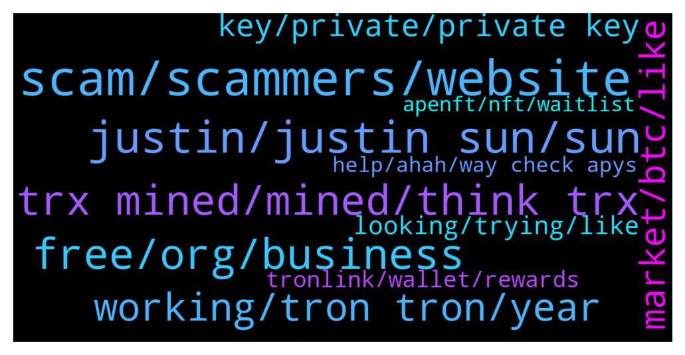

# **@tronnetworkEN**
 ## Analysis for **2021-12-21** - **2021-12-22**.

---

## 📊 **Basic Stats**

**n_messages_sent**: 445

---

---

## 🔝 **Top keywords and related messages**

1. **scam, scammers, website**

    @ZohebXYZ --- *Tell us a sign that this website is honest. So that we can earn money by investing in this website with satisfaction* **--->** [TG Discussion](https://t.me/tronnetworkEN/3780469)

    @agentpiki --- *Thanks for sharing. Let scammers die of hunger* **--->** [TG Discussion](https://t.me/tronnetworkEN/3781481)

    @ZohebXYZ --- *Give us a specific sign that we can identify the scam site* **--->** [TG Discussion](https://t.me/tronnetworkEN/3780572)

    @xPommepote --- *If they promise even 0.1% daily it’s a scam* **--->** [TG Discussion](https://t.me/tronnetworkEN/3780576)

    @xPommepote --- *My answer is: don’t invest in website. Just don’t. It’s a scam.* **--->** [TG Discussion](https://t.me/tronnetworkEN/3780472)

    @agentpiki --- *Thanks. Block and report.  Apparently this scammer is not in the channel* **--->** [TG Discussion](https://t.me/tronnetworkEN/3781473)

2. **justin, justin sun, sun**

    @xPommepote --- *Probably going to moon sooner or later yes* **--->** [TG Discussion](https://t.me/tronnetworkEN/3783690)

    @Fabs_trx --- *But when they will say Justin sun, just behind they will say founder and ex-ceo of tron* **--->** [TG Discussion](https://t.me/tronnetworkEN/3784201)

    @Fabs_trx --- *Maybe cause all the medias of the world will talk about that trip and talk about people who were on board 🤷‍♂️* **--->** [TG Discussion](https://t.me/tronnetworkEN/3784197)

    @Iamthewitcher --- *Well Justin sun is retired from crypto and has announced that trx is going to dissolve* **--->** [TG Discussion](https://t.me/tronnetworkEN/3783667)

    @xPommepote --- *I’m thinking exactly the same. Even if he leaves, he still support his baby and he may surprise us 👀* **--->** [TG Discussion](https://t.me/tronnetworkEN/3782713)

    @agentpiki --- *I hope Justin Sun brought his backdrop of TRON and BTT with him to Grenada 🤑* **--->** [TG Discussion](https://t.me/tronnetworkEN/3781263)

3. **free, org, business**

    @ZohebXYZ --- *I am saying that we invest in a website for business. Then, two months later, the website deceives and scams us. After all, what is Tron used for?* **--->** [TG Discussion](https://t.me/tronnetworkEN/3780455)

    @musa_mareer --- *Who gets free trons ? And how ?* **--->** [TG Discussion](https://t.me/tronnetworkEN/3784069)

    @Leminiscata --- *Any official tron account contacted me ?* **--->** [TG Discussion](https://t.me/tronnetworkEN/3780466)

    @xPommepote --- *Nothing to do with tron. It just scam website. They do it with every crypto, just don’t invest in random platform* **--->** [TG Discussion](https://t.me/tronnetworkEN/3780458)

    @idowu152 --- *So many scams here. More than 5 tron official support messages me already saying I should validate my wallet.* **--->** [TG Discussion](https://t.me/tronnetworkEN/3781778)

    @ZohebXYZ --- *One thing i don't understand If Tron is used for business then why do big websites scam? Stealing someone's tron ​​and leaving ... Is this business?* **--->** [TG Discussion](https://t.me/tronnetworkEN/3780445)

4. **trx mined, mined, think trx**

    @awtsw --- *by the fact that trx cant be mined* **--->** [TG Discussion](https://t.me/tronnetworkEN/3780508)

    @DavidReee --- *Yes guys! I bought trx in 2018 and till now didnt have a look at it :D  I think it is still on my ETh Wallet. Is there ANY possibility to swap to the new token?  Or can i just forget about it?* **--->** [TG Discussion](https://t.me/tronnetworkEN/3780629)

    @Moslly --- *may, but trx makes me sad* **--->** [TG Discussion](https://t.me/tronnetworkEN/3780602)

    @Iamthewitcher --- *Yes that's what i heard trx is going to close but that's a trash news* **--->** [TG Discussion](https://t.me/tronnetworkEN/3783687)

    @Iamthewitcher --- *So can we still expect that trx has better future cuz I've invested my money in it and surely gonna hold it 2022🥲* **--->** [TG Discussion](https://t.me/tronnetworkEN/3783685)

    @xPommepote --- *This is absolutely a great news yes. But people think now TRX will be « close » or dissolved but it’s exactly the opposite 🚀💪🏻* **--->** [TG Discussion](https://t.me/tronnetworkEN/3783683)

5. **working, tron tron, year**

    @jarcola --- *Tron kor never even heard of them* **--->** [TG Discussion](https://t.me/tronnetworkEN/3782676)

    @Ptrondeb --- *God please save tron.. All my life savings there* **--->** [TG Discussion](https://t.me/tronnetworkEN/3782316)

    @Nick --- *Right but how does this tie to Tron?* **--->** [TG Discussion](https://t.me/tronnetworkEN/3784198)

    @Nick --- *Why is this space trip relevant to Tron???* **--->** [TG Discussion](https://t.me/tronnetworkEN/3784188)

    @agentpiki --- *Every legit tron works perfectly.  Don't come in to legit channel asking if why tron is not working. Because it is working.* **--->** [TG Discussion](https://t.me/tronnetworkEN/3782968)

    @xPommepote --- *This has nothing to do with tron* **--->** [TG Discussion](https://t.me/tronnetworkEN/3780434)

6. **market, btc, like**

    @Moslly --- *Why is there so much good news, but the value drops a lot* **--->** [TG Discussion](https://t.me/tronnetworkEN/3780585)

    @Yuva --- *Market going to Dump...please Kindly Take your profit immediately* **--->** [TG Discussion](https://t.me/tronnetworkEN/3783720)

    @Susan --- *BTC price, will continue to fall, I personally do not recommend buying now* **--->** [TG Discussion](https://t.me/tronnetworkEN/3780654)

    @Megan --- *The market is a bit rough today* **--->** [TG Discussion](https://t.me/tronnetworkEN/3780759)

    @xPommepote --- *You are never in loss till you sell. It’s up to you. Market is down for days, probably not a good timing to sell anything. But it’s not a financial advice.* **--->** [TG Discussion](https://t.me/tronnetworkEN/3782647)

    @Zer0log --- *They slowly started to buy like 70,80 millions every time* **--->** [TG Discussion](https://t.me/tronnetworkEN/3782383)

7. **key, private, private key**

    @Leminiscata --- *In smartphone its ask me for password, I don't remeber it* **--->** [TG Discussion](https://t.me/tronnetworkEN/3780391)

    @Leminiscata --- *Yes, I thought that, but I have another problem, I forgot the password for my wallet on smartphone i'm accessing it by biometric* **--->** [TG Discussion](https://t.me/tronnetworkEN/3780380)

    @Kytje073 --- *I redeemed 10000 point for Samsung tel how do i get my phone ???* **--->** [TG Discussion](https://t.me/tronnetworkEN/3783386)

    @Leminiscata --- *In my smartphone the values are ok* **--->** [TG Discussion](https://t.me/tronnetworkEN/3780359)

    @Carlos_TRX --- *Do not erase the wallet from your phone, my advice, create a new one, send the funds and copy the keys well before losing everything.* **--->** [TG Discussion](https://t.me/tronnetworkEN/3780361)

    @Leminiscata --- *In my smartphone account I generated the private key  with my  words and than trying restore my account at tronlink brown computer, but its restore other account with zero value in it, how is this possible ?* **--->** [TG Discussion](https://t.me/tronnetworkEN/3780651)

8. **looking, trying, like**

    @ibbeyy --- *Hahah.. by looking at my face ? Your telling ?* **--->** [TG Discussion](https://t.me/tronnetworkEN/3780505)

    @Iamthewitcher --- *Heyy may i ask a question* **--->** [TG Discussion](https://t.me/tronnetworkEN/3783665)

    @smith vega --- *I don't mean to harm anybody* **--->** [TG Discussion](https://t.me/tronnetworkEN/3780781)

    @agentpiki --- *Maybe he looking at Yi Long Mask* **--->** [TG Discussion](https://t.me/tronnetworkEN/3784060)

    @Iamthewitcher --- *Yeah idk why people just don't like js😑* **--->** [TG Discussion](https://t.me/tronnetworkEN/3783693)

    @MilNoslen --- *Unless he's trying something with shasta🤦🏻‍♂️🤦🏻‍♂️* **--->** [TG Discussion](https://t.me/tronnetworkEN/3782972)

9. **tronlink, wallet, rewards**

    @agentpiki --- *Welcome to tron and remember to take your trx rewards. Dunno how it works in that wallet but in tronlink you have to take trx rewards manually* **--->** [TG Discussion](https://t.me/tronnetworkEN/3782125)

    @aleborda15 --- *I have already tronlink, is exactly where I need to transfer my found* **--->** [TG Discussion](https://t.me/tronnetworkEN/3781229)

    @Carlos_TRX --- *If you have your private key well copied there should be no problem, install tronlink extension browser and try there.* **--->** [TG Discussion](https://t.me/tronnetworkEN/3780354)

    @KingsDove_TRX --- *Tron link pro is just Wallet nothing else* **--->** [TG Discussion](https://t.me/tronnetworkEN/3782080)

    @AnNa45458 --- *Will anyone use tp wallet? Can you teach me* **--->** [TG Discussion](https://t.me/tronnetworkEN/3781462)

    @TronBlockStaking --- *Try the official Tron wallet TronLink* **--->** [TG Discussion](https://t.me/tronnetworkEN/3781388)

10. **apenft, nft, waitlist**

    @agentpiki --- *Are you not receiving apenft? ☹* **--->** [TG Discussion](https://t.me/tronnetworkEN/3784096)

    @Angela_TRON --- *🚀500K Users Joined Waitlist of #APENFT Marketplace on the 1st Day!  🎁Leave An Email to Join Waitlist, Win Special Xmas Gifts: 🎄10K NFT VIP Cards 🎄Up to $1 M #Airdrop 🎄Referral Commission  🎅Join Now: https://waitlist.apenftex.com  🪂RT & @ 3 frds, $2,000 $NFT Token to 100 Users!  👉🏻https://twitter.com/apenftorg/status/1473486213348798470?s=21* **--->** [TG Discussion](https://t.me/tronnetworkEN/3783019)

    @gersi28 --- *Write for the link of my first NFT* **--->** [TG Discussion](https://t.me/tronnetworkEN/3783895)

    @agentpiki --- *@apenftEN  APENFT official channel  For the last time, pls keep your questions and comments short.* **--->** [TG Discussion](https://t.me/tronnetworkEN/3783360)

    @agentpiki --- *Go to @apenftEN for further discussion regarding apenft   Click >> @apenftEN* **--->** [TG Discussion](https://t.me/tronnetworkEN/3781435)

    @keepHODL --- *What can we use from APENFT? Please anyone can explain? Any program?* **--->** [TG Discussion](https://t.me/tronnetworkEN/3783748)

