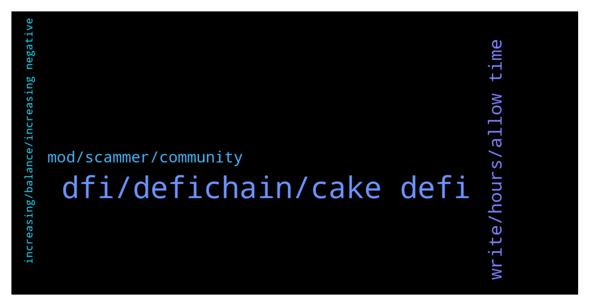

# **@CakeDeFi_EN**
 ## Analysis for **2021-12-22** - **2021-12-23**.

---

## 📊 **Basic Stats**

**n_messages_sent**: 207

---

---

## 🔝 **Top keywords and related messages**

1. **dfi, defichain, cake defi**

    @YyeapY --- *encountered "unexpected problem" error message while unstaking (not successful)* **--->** [TG Discussion](https://t.me/CakeDeFi_EN/156009)

    @Teo L. T. --- *Can I use DeFiChain swap DFI to dUSDT and transfer it to CakeDefi using DFI network? I am new to crypto. Actually I don’t know what is the different between USDT and dUSDT.* **--->** [TG Discussion](https://t.me/CakeDeFi_EN/156231)

    @frnklfrt --- *Question regarding impermanent loss, does that imply there is such a thing as impermanent gain?* **--->** [TG Discussion](https://t.me/CakeDeFi_EN/155839)

    @Kassius84 --- *Can you check the transaction id on defiscan.live?* **--->** [TG Discussion](https://t.me/CakeDeFi_EN/156243)

    @Arno --- *How many of you are in the freezer for 10 years?* **--->** [TG Discussion](https://t.me/CakeDeFi_EN/155803)

    @Michael --- *Where can I find the channel roles?* **--->** [TG Discussion](https://t.me/CakeDeFi_EN/155771)

2. **write, hours, allow time**

    @Michael_Schredl --- *Please contact the official Support for that, we can't help you here :/* **--->** [TG Discussion](https://t.me/CakeDeFi_EN/156299)

    @Roman --- *3 tickets and 21 days. It doesn't take a rocket scientist to know they've been seen and ignored.* **--->** [TG Discussion](https://t.me/CakeDeFi_EN/156305)

    @riserspec24 --- *28a753e3bcfbc16f73aef5e7a6a72942f60615fa9c292dcaf2c583c42f40db65    already checked it but no results.* **--->** [TG Discussion](https://t.me/CakeDeFi_EN/156275)

    @Kassius84 --- *Your money will not be lost. I would suggest to try again to contact the support via support form* **--->** [TG Discussion](https://t.me/CakeDeFi_EN/156264)

    @Carl --- *@DmgBautista  please can I get an answer from you ?* **--->** [TG Discussion](https://t.me/CakeDeFi_EN/156184)

    @Roman --- *I broke my phone and lost access to authy. Without 2fa I can't do any actions within cake. I sent proof that I am the holder of the account. Got emails for all my support tickets saying they've been received but no actual response back.* **--->** [TG Discussion](https://t.me/CakeDeFi_EN/156307)

3. **mod, scammer, community**

    @DmgBautista --- *All conversation is always held on this official chat. As per community rules, no mod will ever DM you, its against the same to DM other users and there is no official support in Telegram. Any support must always be directed to Cake by the official channels (website support for example). We do this to ensure no user gets victim of a scam, therefore, anyone getting DM, even from someone who may look a mod, will surelly be a scammer. Just block and report. If for any reason a user may need to speak directly to a mod or other user, can place such request directly in here in the community chat. After a positive feedback, can send a message. A mod will never start that conversation even when asked if can be contacted directly here, the user must establish first contact. And always here, to ensure that does not asks someone trying to impersonate a mod.   But all this can be easily avoided. Just check the community channel rules (valid for any community chat), read them thoroughly and follow them religiously. If you got a DM, just block and report, DM must be treated as a scamm attempt. Even if it looks someone exactly good looking as me 😂😂😂 No security is enough when speaking about your funds!* **--->** [TG Discussion](https://t.me/CakeDeFi_EN/155762)

    @Kevin --- *Does Daniel ever reach out to anyone in this telegram?* **--->** [TG Discussion](https://t.me/CakeDeFi_EN/155793)

    @Michael --- *Just want to double check that all conversation are in this group chat.  Someone has duplicated Michael moderator account and has pim me* **--->** [TG Discussion](https://t.me/CakeDeFi_EN/155760)

    @Sam --- *how can I report a scammer?* **--->** [TG Discussion](https://t.me/CakeDeFi_EN/156025)

    @rbteixeira7 --- *2 people send me messages 😂 fucking scams* **--->** [TG Discussion](https://t.me/CakeDeFi_EN/156067)

    @Michael_Schredl --- *You can send a mod the Screenshot and Username of the scammer* **--->** [TG Discussion](https://t.me/CakeDeFi_EN/156028)

4. **increasing, balance, increasing negative**

    @moonman73 --- *Please explain why and how an account can show negative assets...* **--->** [TG Discussion](https://t.me/CakeDeFi_EN/155926)

    @ABIOLA SYLVESTER --- *Please I will appreciate if my concerns is treated. I am not liking the experience of daily increasing negative balance when I did borrow money* **--->** [TG Discussion](https://t.me/CakeDeFi_EN/155923)

    @ABIOLA SYLVESTER --- *Please it’s high time you people have a call center this zendesk thing isn’t making support understand some challenges that user faced. I have made at least two eth deposits but my balance is still reading negative and it keeps increasing. Honestly I am angry 😡 because the support is just giving me a generic answer that doesn’t do justice to why my account not only continue to read negative but also increasing negative* **--->** [TG Discussion](https://t.me/CakeDeFi_EN/155921)

    @ABIOLA SYLVESTER --- *Yet to get a support to resolve my issues . I am becoming concerned of increasing negative symbol showing after many deposits and transactions* **--->** [TG Discussion](https://t.me/CakeDeFi_EN/155838)

    @ABIOLA SYLVESTER --- *Please what’s the cause of available USD showing negative sign on iOS mobile App* **--->** [TG Discussion](https://t.me/CakeDeFi_EN/155715)

    @ABIOLA SYLVESTER --- *My balance keep showing negative and it’s always going up and I have made multiple transactions* **--->** [TG Discussion](https://t.me/CakeDeFi_EN/155927)

