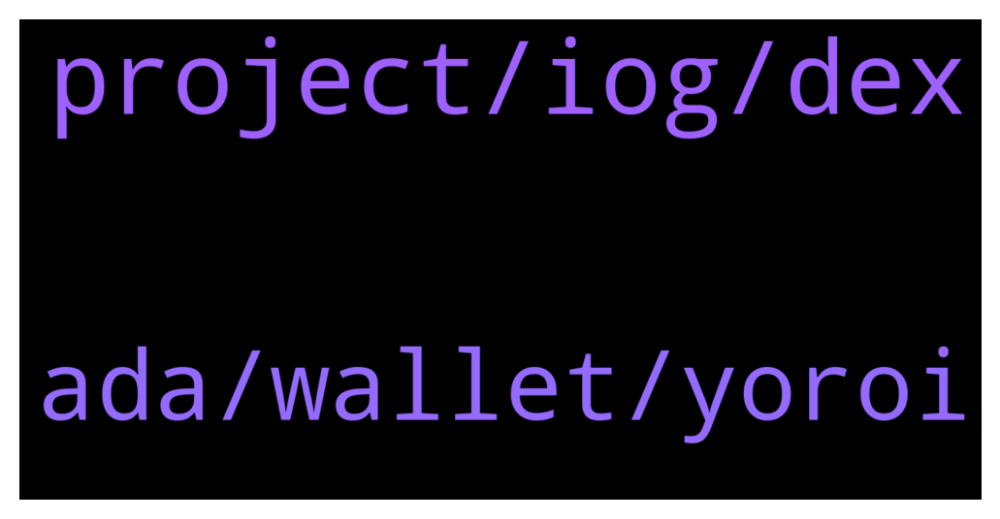

# **@Cardano**
 ## Analysis for **2021-12-22** - **2021-12-23**.

---

## 📊 **Basic Stats**

**n_messages_sent**: 65

---

---

## 🔝 **Top keywords and related messages**

1. **project, iog, dex**

    @glitch04 --- *I just replied to that and continually asking me will get you nowhere, you need to talk to that project which is misleading you on their ability to produce* **--->** [TG Discussion](https://t.me/Cardano/761449)

    @Iluvgermany --- *Do you have an tips how to receive that information elsewhere? I thought this would be easy to find out since it's just a project timeline* **--->** [TG Discussion](https://t.me/Cardano/761461)

    @Iluvgermany --- *Any updates regarding a rough launch date (e. g. Q1/Q2 2022) of KEVM to mainnet today? Thank you in advance.* **--->** [TG Discussion](https://t.me/Cardano/761445)

    @glitch04 --- *The other person that keeps asking the same question was sent here from a project that is relaying that as the reason they are " delayed " within hours 3 people asked the same question in relation to that project.  I don't have any information for you or them, if I did I would make it available.* **--->** [TG Discussion](https://t.me/Cardano/761458)

    @fr3dyui --- *i invested the project via Bluezilla, just wondering why it takes so long that the DEX still not online, is it a scam….* **--->** [TG Discussion](https://t.me/Cardano/761361)

    @Iluvgermany --- *Did you get an answer about a rough date?* **--->** [TG Discussion](https://t.me/Cardano/761306)

2. **ada, wallet, yoroi**

    @Fowsi88 --- *i want to add ADA contract to my NAMI wallet* **--->** [TG Discussion](https://t.me/Cardano/761443)

    @TJSP2024 --- *Ok thanks. And once restored in yoroi, the wallet will still be accessible in both daedalus and yoroi right? I want to restore the wallet in yoroi extension , switch some pools and then delete it after . Ive always used daedalus , i like its security and interface, i just wish it could load like 1000x faster* **--->** [TG Discussion](https://t.me/Cardano/761560)

    @charlesaugu --- *Hi the minimum ada is a security measure to avoid spamming the blockchain with custom tokens, you are forced to put some ada with every native token you transfer, what I cannot tell you though it's what the exchange will do with that ada...* **--->** [TG Discussion](https://t.me/Cardano/761746)

    @ExInfernis --- *I see some rewards (which are part of my total amount of ada in the wallet) with option withdraw, but in daedalus there is no such thing. Do I need to click Withdraw on them or it is ok not to touch this* **--->** [TG Discussion](https://t.me/Cardano/761296)

    @apex_pool_spo --- *your sentence does not make sense. ADA is not a erc20 token to add its contract to a wallet.* **--->** [TG Discussion](https://t.me/Cardano/761447)

    @dmitry_stas --- *and you definitely shouldn't claim your rewards or validate your wallet on any sites :) I'm pretty sure scammers DMs to you right now, so be careful...* **--->** [TG Discussion](https://t.me/Cardano/761314)

