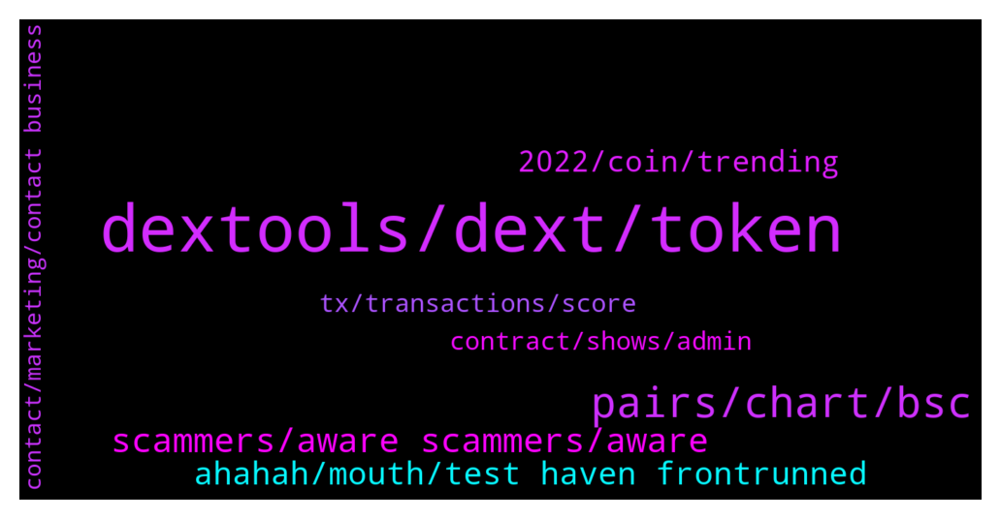

# **@DEXToolsCommunity**
 ## Analysis for **2021-12-21** - **2021-12-23**.

---

## 📊 **Basic Stats**

**n_messages_sent**: 294

---

---

## 🔝 **Top keywords and related messages**

1. **dextools, dext, token**

    @MonkeySuit --- *so in my opinion, dext token is a good buy/hold, I think there are big things coming for the platform, if you hold 100k you can get into the VIP group and participate in venture deals.  Other than that I would get into metaverse or p2e focused tokens early.* **--->** [TG Discussion](https://t.me/DEXToolsCommunity/315780)

    @Nathan --- *Hey guys can someone please help me? I sent 224 DEXT to 0x469d342e4f3d9ffbedca2e2ca8ab268a6fe973c3 to get an active dextools subscription and now it is not showing any active subscription even after clicking the "I already transfered the money box". The transaction hash is 0x0a32598849e0502f46a9bc2c8fdf9dbaa1687f6342514bc9e7c4bf0c39b20543* **--->** [TG Discussion](https://t.me/DEXToolsCommunity/316589)

    @Vallcha --- *Hello there, question for all community. We do see one token can be sold by the Dextool bot. But we can’t sell it by ourself. Can anybody help us with this? 0xd58f55b2c7b64afed8d21c5e852bcccae721e376* **--->** [TG Discussion](https://t.me/DEXToolsCommunity/315330)

    @HenryMatambo --- *Can someone please help me to sell my NFT* **--->** [TG Discussion](https://t.me/DEXToolsCommunity/315258)

    @izysteps --- *I have probelm selling my $MetaV. I want switch it to BUSD ot BNB. I got the spending approved yesterday but can not swap. It always complain about the slippage even when I set it to 20%.* **--->** [TG Discussion](https://t.me/DEXToolsCommunity/315704)

    @JoeyDieleman --- *You can see the tx on dextools* **--->** [TG Discussion](https://t.me/DEXToolsCommunity/316417)

2. **pairs, chart, bsc**

    @Flashbang665 --- *Hi, is there any issues with charts now?, the history of this chart is gone: https://www.dextools.io/app/bsc/pair-explorer/0x486697ae24469cb1122f537924aa46e705b142aa* **--->** [TG Discussion](https://t.me/DEXToolsCommunity/316191)

    @AbdoMelody --- *In Bsc alerts dont work for me* **--->** [TG Discussion](https://t.me/DEXToolsCommunity/315618)

    @FredericDEXT --- *Hot Pairs depends on a custom algorithm which is undisclosed, so please don't ask about it  We don't accept payments for trending / hot pairs, you can pay scammers for this but it won't work!* **--->** [TG Discussion](https://t.me/DEXToolsCommunity/315652)

    @ContentsMayVary --- *@JoeyDieleman or any other admin/dev   Your chart is showing we removed liquidity when poocoins is showing correct chart. This impacts appearance on pancakeswap to look like the wrong price then swap at the proper price   Need help* **--->** [TG Discussion](https://t.me/DEXToolsCommunity/316402)

    @kishu_crypto --- *Hey there, wbnb/moni chart is off* **--->** [TG Discussion](https://t.me/DEXToolsCommunity/316303)

    @hantick3 --- *chart for this isn't loading. BSC 0xd6bb010019c9d3ea177e6d2e9af7938c6e53da55* **--->** [TG Discussion](https://t.me/DEXToolsCommunity/316263)

3. **scammers, aware scammers, aware**

    @napascual --- *Marketing to @guillermorodriguez78. Be aware of scammers, remember he'll never dm first* **--->** [TG Discussion](https://t.me/DEXToolsCommunity/315630)

    @CyberBULK --- *Sorry can he DM me? Im on tg jail* **--->** [TG Discussion](https://t.me/DEXToolsCommunity/316573)

    @(⊙o⊙) --- *This guy is a high-level liar, be careful everyone!* **--->** [TG Discussion](https://t.me/DEXToolsCommunity/315462)

    @napascual --- *Got your dm. Be aware of scammers, admins never dm first* **--->** [TG Discussion](https://t.me/DEXToolsCommunity/315728)

    @stanes --- *Please DM @guillermorodriguez78 he is the person-in-charge.  Be aware of scammers, HE WILL NEVER DM YOU FIRST.* **--->** [TG Discussion](https://t.me/DEXToolsCommunity/316648)

    @RipDaPool --- *One of your scammers just tried to message me* **--->** [TG Discussion](https://t.me/DEXToolsCommunity/315249)

4. **ahahah, mouth, test haven frontrunned**

    @Nathan --- *Yes I did thank you so much!* **--->** [TG Discussion](https://t.me/DEXToolsCommunity/316599)

    @stanes --- *Ahahah for sure... but I don't think it's so easy 😉* **--->** [TG Discussion](https://t.me/DEXToolsCommunity/316567)

    @stanes --- *You haven't been frontrunned so doesn't matter 😉* **--->** [TG Discussion](https://t.me/DEXToolsCommunity/315517)

    @lex_44 --- *Hey nive profile pic.. Rob zombie* **--->** [TG Discussion](https://t.me/DEXToolsCommunity/315773)

    @moondriver1 --- *thanks 👌🏼yep already someone DM me first 😳* **--->** [TG Discussion](https://t.me/DEXToolsCommunity/315841)

    @JoeyDieleman --- *Guys keep it clean here please* **--->** [TG Discussion](https://t.me/DEXToolsCommunity/316396)

5. **2022, coin, trending**

    @joshmilison --- *Can you please refer me to someone who can help me trend it* **--->** [TG Discussion](https://t.me/DEXToolsCommunity/315654)

    @lex_44 --- *So let me ask you this So wicht  coin Will be for next 2022 ? Any advise* **--->** [TG Discussion](https://t.me/DEXToolsCommunity/315777)

    @MegaTed --- *Why is there never a coin trending from 11 to 15?* **--->** [TG Discussion](https://t.me/DEXToolsCommunity/316331)

    @lex_44 --- *so what would it be for 2022* **--->** [TG Discussion](https://t.me/DEXToolsCommunity/315770)

    @bastardganpunk --- *you’ve been asking for the next diamond hands token in 2022* **--->** [TG Discussion](https://t.me/DEXToolsCommunity/315768)

    @TheFutureHour --- *🔥 yes   the Chinese community has been looking forward to it too* **--->** [TG Discussion](https://t.me/DEXToolsCommunity/315675)

6. **tx, transactions, score**

    @FredericDEXT --- *1 tx in the last days* **--->** [TG Discussion](https://t.me/DEXToolsCommunity/315644)

    @Freddy R --- *how i can know how many X i did? like 10x or 50 x? there are some calculator?* **--->** [TG Discussion](https://t.me/DEXToolsCommunity/315081)

    @JoeyDieleman --- *Looks like a weird tx 🤔* **--->** [TG Discussion](https://t.me/DEXToolsCommunity/316414)

    @kishu_crypto --- *How can I track back transactions that are more than 500 transactions ago?* **--->** [TG Discussion](https://t.me/DEXToolsCommunity/316059)

    @stanes --- *If you are a standard user you can see 1200.* **--->** [TG Discussion](https://t.me/DEXToolsCommunity/316061)

    @stanes --- *Without that the score will stay low.* **--->** [TG Discussion](https://t.me/DEXToolsCommunity/316038)

7. **contract, shows, admin**

    @trojantechltd --- *https://www.dextools.io/app/bsc/pair-explorer/0x11bafd3915e226048bb3b4bab14dd1802ca8a74d  Hello admin, any updates on fixing this contract ? Would be greatly appreciated* **--->** [TG Discussion](https://t.me/DEXToolsCommunity/315912)

    @trojantechltd --- *Hello, it shows up as “no name “* **--->** [TG Discussion](https://t.me/DEXToolsCommunity/315967)

    @stanes --- *Hi, what is the issue with it?* **--->** [TG Discussion](https://t.me/DEXToolsCommunity/315961)

    @trojantechltd --- *Hello admin,   https://www.dextools.io/app/bsc/pair-explorer/0x11bafd3915e226048bb3b4bab14dd1802ca8a74d  This contract is having same issues as yesterday.. it’s showing up as “no name “* **--->** [TG Discussion](https://t.me/DEXToolsCommunity/315787)

    @ngl_ee --- *but if i psated the contract it shows up* **--->** [TG Discussion](https://t.me/DEXToolsCommunity/315642)

    @ngl_ee --- *i was trying to search by name* **--->** [TG Discussion](https://t.me/DEXToolsCommunity/315641)

