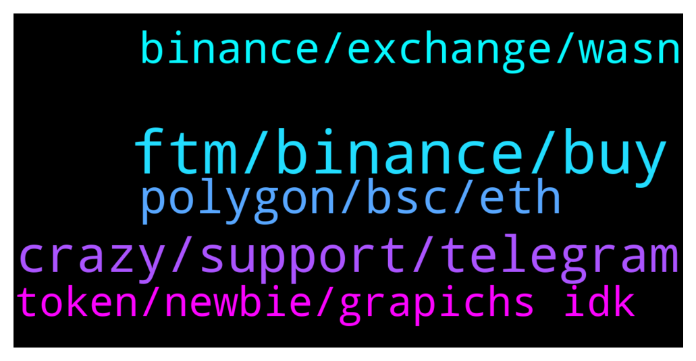

# **@Fantom_English**
 ## Analysis for **2021-12-22** - **2021-12-23**.

---

## 📊 **Basic Stats**

**n_messages_sent**: 79

---

---

## 🔝 **Top keywords and related messages**

1. **ftm, binance, buy**

    @nitinsbalaji --- *I transfer my bnb via ftm blockchain To binance exchange  But i Haven't received till now I'll try to contact you in all possible way but I haven't received any kind of help It's my request to solve my queries asap* **--->** [TG Discussion](https://t.me/Fantom_English/614631)

    @necronoth --- *Hi anyone knows where to get native ftm on exchange? kucoin currently unavailable to withdraw* **--->** [TG Discussion](https://t.me/Fantom_English/614616)

    @SleeplessB0x --- *anyone able to help me with a swap that says it suceeded in making my ERC20 FTM OperaFTM but as far as I can see it has  done nothing but takee my FTM.* **--->** [TG Discussion](https://t.me/Fantom_English/615132)

    @Immm3r --- *I do sepa eur transfer from revolut to coinbase takes max 5 min. Than i buy sol/xlm send it to binance and buy ftm. Coinbase take 0,5% fee* **--->** [TG Discussion](https://t.me/Fantom_English/614811)

    @Wesley --- *buy some litecoin transfer it to binance and buy some FTM* **--->** [TG Discussion](https://t.me/Fantom_English/614815)

    @WelshNik --- *For fiat on board for ftm coins* **--->** [TG Discussion](https://t.me/Fantom_English/614693)

2. **crazy, support, telegram**

    @pajamasfreak --- *Hi, what can I do for you* **--->** [TG Discussion](https://t.me/Fantom_English/614597)

    @Janevietani --- *not sure what is that error. try ask it on spookyswap group  please be noted . admin will never dm user first https://t.me/SpookySwapCommunity* **--->** [TG Discussion](https://t.me/Fantom_English/614798)

    @SleeplessB0x --- *esp to ppl who dm you pretending to be technical support* **--->** [TG Discussion](https://t.me/Fantom_English/615147)

    @Sleepycloud71 --- *Jesus Christ... the amount of scammers here is crazy. They just keep messaging me.* **--->** [TG Discussion](https://t.me/Fantom_English/614881)

    @Sleepycloud71 --- *Jesus... one post and 5 scammers message me. 🤣🤣🤣* **--->** [TG Discussion](https://t.me/Fantom_English/614865)

    @Anwarmalil --- *where are you from crazy dog* **--->** [TG Discussion](https://t.me/Fantom_English/614841)

3. **polygon, bsc, eth**

    @SleeplessB0x --- *unless multichain xyz just steals your token no matter what you put in, then oh well nut following the transaction it accessed the fantom contract and sent my tokens there, so it looks  legitimamte* **--->** [TG Discussion](https://t.me/Fantom_English/615138)

    @Sleepycloud71 --- *I don't want to bridge. I want to buy it and send it directly to my Fantom wallet.* **--->** [TG Discussion](https://t.me/Fantom_English/614870)

    @t_mikhanashvili --- *Hello Admin, how to add custom network to fantom wallet?* **--->** [TG Discussion](https://t.me/Fantom_English/615083)

    @magik9999 --- *Hello, I have a problem with swaping fantom to tomb on spookyswap.. I see this sentences „Transaction decoding is not available for chainId 250” any idea ?* **--->** [TG Discussion](https://t.me/Fantom_English/614797)

    @Janevietani --- *Fantom bridges are: Anyswap : FTM from/to Arbitrum, AVAX, BSC, ETH, OKEx, Polygon https://stable.anyswap.exchange/#/swap   Spiritswap : FTM from/to Arbitrum, AVAX, BSC, ETH, Polygon https://swap.spiritswap.finance/#/bridge  Spookyswap : FTM from/to Arbitrum, AVAX, BSC, ETH, Polygon https://spookyswap.finance/bridge  Multichain : FTM from/to Arbitrum, AVAX, BSC, ETH, Polygon https://multichain.xyz/  Elk Finance : FTM from/to Binance, CRO, HuobiECO, HOO, KCC, MOVR, OKEx, ONE, Polygon, TLOS, xDAI (ELK Tokens only) https://app.elk.finance/#/elknet   Evodefi : FTM from/to Arbitrum, AVAX, BSC, CRO, ETH, HECO, Polygon, SOL, TRX https://bridge.evodefi.com/?token=USDC  CBridge : FTM from/to Arbitrum, AVAX, BSC, ETH, OKEx, Optimism, Polygon, xDai https://cbridge.celer.network/#/  O3Swap : FTM from/to Arbitrum, BSC, ETH, HuobiECO, NEO, Polygon https://o3swap.com/swap  Relaychain : FTM from/to AVAX, BSC, CRO, ETH, HECO, IOTX, MOVR, ONE, Polygon, SDN  https://app.relaychain.com/#/cross-chain-bridge-transfer  Synapse Protocol : FTM from/to Arbitrum, AVAX, BSC, BOBA, ETH, MOVR, ONE, Optimism, Polygon https://synapseprotocol.com/?inputCurrency=USDC&outputCurrency=BUSD&outputChain=56  Xpollinate : FTM from/to Arbitrum, AVAX, BSC, MOVR, Polygon, xDai https://www.xpollinate.io/  Ren : https://bridge.renproject.io/  NFT Bridge : https://nft.anyswap.exchange/  ⚠️ Gas fees is required from native chain.* **--->** [TG Discussion](https://t.me/Fantom_English/614989)

    @chimpydev --- *Can someone help me on develop a contract on Fantom Smart Chain* **--->** [TG Discussion](https://t.me/Fantom_English/615095)

4. **binance, exchange, wasn**

    @cro_joe9191 --- *Is Fantom Binance exchange still on track for q4 2021?! That's what the press release said when it was announced* **--->** [TG Discussion](https://t.me/Fantom_English/614917)

    @Abhi1781 --- *When Binance will provide staking on Fantom @admin* **--->** [TG Discussion](https://t.me/Fantom_English/614482)

    @chiquito82 --- *Hehehe, so what was it.. Really I don't remember hahaha was it a fantom exchange made by binance?* **--->** [TG Discussion](https://t.me/Fantom_English/614691)

    @chiquito82 --- *Wasn't it announced at the end of October?* **--->** [TG Discussion](https://t.me/Fantom_English/614686)

    @Mcjig --- *bitfinex and huobi has liquidity/ looks like binance might be reopened* **--->** [TG Discussion](https://t.me/Fantom_English/614872)

    @chiquito82 --- *Hey guys, wasn't a binance fantom exchange going to be launched this month?* **--->** [TG Discussion](https://t.me/Fantom_English/614682)

5. **token, newbie, grapichs idk**

    @Mcjig --- *you cant when there is no liqudity* **--->** [TG Discussion](https://t.me/Fantom_English/614871)

    @pipozgos --- *Hi to all where is the tokenomic with grapichs, idk where is sorry for my newbie question. Token schedule and tokenomics* **--->** [TG Discussion](https://t.me/Fantom_English/615168)

    @pipozgos --- *Hi to all where is the tokenomic with grapichs, idk where is sorry for my newbie question* **--->** [TG Discussion](https://t.me/Fantom_English/615150)

    @theblokchainbaker --- *I just fomo'd in thank you people* **--->** [TG Discussion](https://t.me/Fantom_English/615006)

    @Mighty💯 --- *Can you store this token in metamask* **--->** [TG Discussion](https://t.me/Fantom_English/614653)

    @Rob912 --- *Can you store this token in metamask* **--->** [TG Discussion](https://t.me/Fantom_English/614489)

