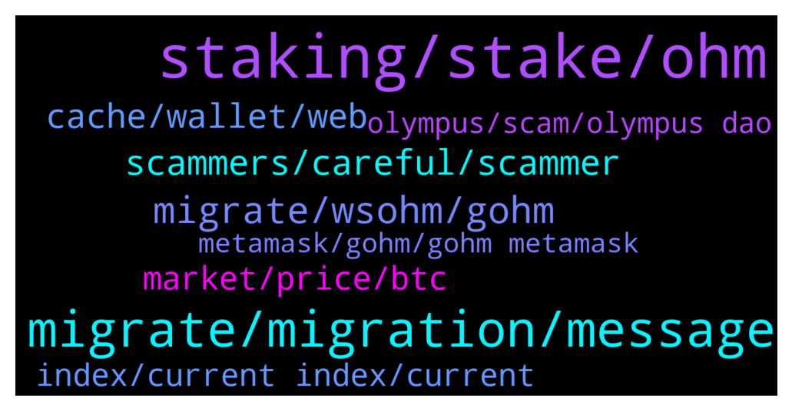

# **@OlympusTG**
 ## Analysis for **2021-12-22** - **2021-12-23**.

---

## 📊 **Basic Stats**

**n_messages_sent**: 605

---

---

## 🔝 **Top keywords and related messages**

1. **staking, stake, ohm**

    @currency516 --- *Just seeing all this chat about gOHM and sOHm making sure that buying regular OHM is stakeable* **--->** [TG Discussion](https://t.me/OlympusTG/131800)

    @nfwaple --- *buy gOHM and do nothing, or buy OHM v2 and stake them, they both have the same outcome* **--->** [TG Discussion](https://t.me/OlympusTG/132805)

    @DeFiMaximalist --- *not for me but the staking does https://app.olympusdao.finance/#/stake* **--->** [TG Discussion](https://t.me/OlympusTG/131658)

    @ADIL --- *So just buy gohm directly and no need to stake ? Auto staking??* **--->** [TG Discussion](https://t.me/OlympusTG/132646)

    @nfwaple --- *Did you see the second pic of the thread: https://twitter.com/dopex_intern/status/1473439395999068162/photo/1  If you only own gOHM, the sOHM you see in the Staking page is just an equivalent amount of sOHM you'd get when you unwrap your gOHM, you don't actually own gOHM + sOHM. gOHM is already doing something, it has the same outcome as staking OHM.* **--->** [TG Discussion](https://t.me/OlympusTG/132819)

    @Eroni --- *So I should just stake the normal way now then wait for olyzaps to work?* **--->** [TG Discussion](https://t.me/OlympusTG/131576)

2. **migrate, migration, message**

    @Talal107 --- *Guys is it normal to not receive the correct amount from rebase?* **--->** [TG Discussion](https://t.me/OlympusTG/131852)

    @Newson_wong --- *Hi May I know when Olympus v2 migration will be totally completed ? Thank you !* **--->** [TG Discussion](https://t.me/OlympusTG/131956)

    @nfwaple --- *ok, then you won't see your rebases and need to wait until more announcement on what to do without a migration, pretty sure everyone else just migrates because the v1 liquidity will be moved* **--->** [TG Discussion](https://t.me/OlympusTG/131762)

    @Talal107 --- *I haven't migrated yet as I saw many people were having issues so I decided to do it like 2 weeks from now. But if this means that my rebase rewards will be cut then I will do it right away. Not panicking or anything just a bit concerned.* **--->** [TG Discussion](https://t.me/OlympusTG/131927)

    @SMNFT7 --- *Na, they took the rebases off for V1* **--->** [TG Discussion](https://t.me/OlympusTG/131936)

    @Keegan --- *When is the migration officially over* **--->** [TG Discussion](https://t.me/OlympusTG/132455)

3. **migrate, wsohm, gohm**

    @anonymous_sifu --- *is sohm to gohm and bridging working or currently only way out is migration from v1?* **--->** [TG Discussion](https://t.me/OlympusTG/132191)

    @nfwaple --- *gOHM 100%, wsohm holders now need to migrate to gOHM, gOHM is the v2 token* **--->** [TG Discussion](https://t.me/OlympusTG/132171)

    @Ap0l1o --- *You can migrate from sOhm to gOhm. Bridging is optional.* **--->** [TG Discussion](https://t.me/OlympusTG/132201)

    @botbotgo --- *Can you migrate to V2 sOHM or does everyone have to migrate to gOHM?* **--->** [TG Discussion](https://t.me/OlympusTG/132636)

    @DeFiCollector --- *Watch out for scammers messaging you, to migrate you should be able to wrap your sOhm to gOnm* **--->** [TG Discussion](https://t.me/OlympusTG/132359)

    @Jeff --- *If I have sohm in Abra cadra do I need to unstake and migrate?* **--->** [TG Discussion](https://t.me/OlympusTG/131789)

4. **scammers, careful, scammer**

    @chittyusername --- *Can we please send media...I need to show the community this message with a scammer* **--->** [TG Discussion](https://t.me/OlympusTG/131669)

    @chittyusername --- *Be careful of being added to identical groups that are scams* **--->** [TG Discussion](https://t.me/OlympusTG/131589)

    @mrmiyagi68 --- *Yea so many of them haha, very fun to mess around with them and then tell them you know they are scammers* **--->** [TG Discussion](https://t.me/OlympusTG/132239)

    @nfwaple --- *the scammers would love to chat* **--->** [TG Discussion](https://t.me/OlympusTG/132669)

    @SucherX91 --- *I have never gotten that much scam messages in such a short time...* **--->** [TG Discussion](https://t.me/OlympusTG/132360)

    @Talal107 --- *We should hire these scammers. They are really fast at responding.* **--->** [TG Discussion](https://t.me/OlympusTG/131853)

5. **cache, wallet, web**

    @cdp279 --- *You need to connect. Using eth network* **--->** [TG Discussion](https://t.me/OlympusTG/131660)

    @Dada --- *I checjed not showing on the Web* **--->** [TG Discussion](https://t.me/OlympusTG/131805)

    @zhangliangfeng --- *I want to cancel mortgage, click to cancel mortgage, why is the webpage blank?* **--->** [TG Discussion](https://t.me/OlympusTG/132704)

    @Ozzyy --- *I know how to connect , your web site is not working.. Can you check it please ?* **--->** [TG Discussion](https://t.me/OlympusTG/131662)

    @DeFiMaximalist --- *it suddenly worked for me now try refreshing* **--->** [TG Discussion](https://t.me/OlympusTG/131663)

    @DeFiMaximalist --- *it is working for me, try clearing ur cache or i dont know* **--->** [TG Discussion](https://t.me/OlympusTG/131667)

6. **market, price, btc**

    @chittyusername --- *I can't believe the price is actually going up. I am in shock.* **--->** [TG Discussion](https://t.me/OlympusTG/131601)

    @Liam --- *If it drops below $300 and BTC stays above 46 I might panic, but I feel pretty good.  We've seen this before.  Stay strong 💪* **--->** [TG Discussion](https://t.me/OlympusTG/132517)

    @Liam --- *I haven't lost too much of my October November gains in my portfolio, but it's definitely dipped the last 25 days.   The only true dud for me has been JADE, but that was a small f it play that I expected to lose.* **--->** [TG Discussion](https://t.me/OlympusTG/132525)

    @CryptoCrazy_TR3 --- *Shit I hope it does drop that low so I can pick up more 😂* **--->** [TG Discussion](https://t.me/OlympusTG/132520)

    @juggszn --- *That’s not how it works! Seriously you should research before buying in blindly* **--->** [TG Discussion](https://t.me/OlympusTG/132474)

    @cdp279 --- *You are ser. Why does there need to be a reason if the price goes down 3%. Do you need to ask why?* **--->** [TG Discussion](https://t.me/OlympusTG/132310)

7. **index, current index, current**

    @nfwaple --- *no, the index is the same for every person, you can go to the wesite - docs - search 'current index' to learn more* **--->** [TG Discussion](https://t.me/OlympusTG/131846)

    @Stu --- *Does this mean the index on the app is different for each person? If I have held gohm for 1 week and someone else has only held for 1 day then the value must be different on each app? Am I correct?* **--->** [TG Discussion](https://t.me/OlympusTG/131842)

    @hunkarperk --- *Is the current index for gohm diffirent for everybody? A person who entered staking with gohm couple months ago, this person's index should be higher than new stakers. Am i correct?* **--->** [TG Discussion](https://t.me/OlympusTG/132803)

    @nfwaple --- *yes having gOHM in your wallet is equivalent to staking OHM, you get the same outcome. gOHM price = OHM price x current index, the index goes up every rebase* **--->** [TG Discussion](https://t.me/OlympusTG/132796)

    @nfwaple --- *it goes up in terms of price, gOHM price = OHM price x current index* **--->** [TG Discussion](https://t.me/OlympusTG/132478)

    @nfwaple --- *no, the current index is the same for everyone* **--->** [TG Discussion](https://t.me/OlympusTG/132806)

8. **olympus, scam, olympus dao**

    @cdp279 --- *Yeah man there are huge Olympus groups with very fancy web pages for you to send your ohm to. Be careful* **--->** [TG Discussion](https://t.me/OlympusTG/131570)

    @Mercy_ck --- *The dev is a group of gigabrains in crypto worlds. I always say this and will say it again, if u can find a fork who has done so much more than olympus, I am humble to know it. By that, I don't mean mere APY. 😊* **--->** [TG Discussion](https://t.me/OlympusTG/132177)

    @B --- *and which one for stake on olympus dao?* **--->** [TG Discussion](https://t.me/OlympusTG/132810)

    @Robert --- *Hi There does Anybody know how to stake/unstake Olympus in Python using web3?* **--->** [TG Discussion](https://t.me/OlympusTG/132415)

    @B --- *So what makes more sense now? What is the best strategy at olympusdao? BUY sohm and stake them?* **--->** [TG Discussion](https://t.me/OlympusTG/132804)

    @FUTEBOL124 --- *is the user : olympusTG Admin legit admin?* **--->** [TG Discussion](https://t.me/OlympusTG/132433)

