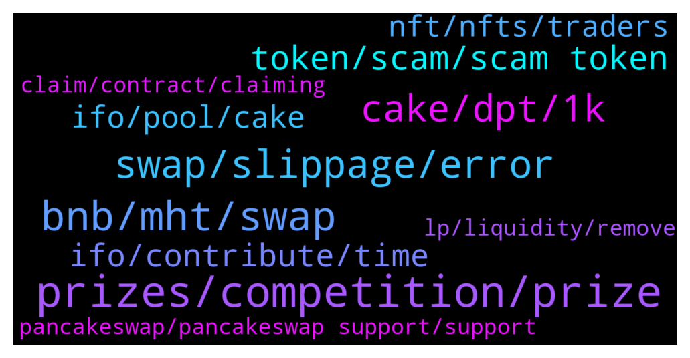

# **@PancakeSwap**
 ## Analysis for **2021-12-22** - **2021-12-23**.

---

## 📊 **Basic Stats**

**n_messages_sent**: 1755

---

---

## 🔝 **Top keywords and related messages**

1. **prizes, competition, prize**

    @rolling_barrel --- *Not first and not all, I suppose 3-5 ppl received reward* **--->** [TG Discussion](https://t.me/PancakeSwap/2216625)

    @Abc97462 --- *I think they really screwed up. It seems it gave the prizes for the whole tier to the first one who claimed* **--->** [TG Discussion](https://t.me/PancakeSwap/2216430)

    @rolling_barrel --- *Each member of the level received a size of the award, which was to be distributed among each member of the level. lel* **--->** [TG Discussion](https://t.me/PancakeSwap/2216616)

    @cryptXXXking --- *There's are just trophys, They aren't different from one another.  Which is fine. They will al l have the same "value"* **--->** [TG Discussion](https://t.me/PancakeSwap/2218035)

    @Vonmaxa --- *I understand about 30 minutes delay. I question about 2 day delay between competition end and prizes claim* **--->** [TG Discussion](https://t.me/PancakeSwap/2217538)

    @Ceddi200 --- *Bro scroll down the page and read. The prizes is written* **--->** [TG Discussion](https://t.me/PancakeSwap/2217618)

2. **bnb, mht, swap**

    @dlam99 --- *Someone bought it now for 1.9 BNB and reselling for 70 BNB 😂* **--->** [TG Discussion](https://t.me/PancakeSwap/2216555)

    @ELIZABETH --- *I need help. I sent BNB to PancakeSwap on ERC network and I don’t see in my wallet even though transfer was successful* **--->** [TG Discussion](https://t.me/PancakeSwap/2214098)

    @i --- *pankacefinance is f..ing shit. wasnt able to unstake BUT bnb was withdrawn for each attempt(((* **--->** [TG Discussion](https://t.me/PancakeSwap/2213228)

    @Houtje --- *1.9 bnb is way to cheap for this lovely nft* **--->** [TG Discussion](https://t.me/PancakeSwap/2216593)

    @TimiJacobs --- *My BNB which i had on metamask disappeared and checking my transactions on BSC scan it seems to be associated with pancakeswap I connected that wallet recently to make a swap on pancake swap and now my remaining BNB is gone Please can an admin here help me ascertain the problem* **--->** [TG Discussion](https://t.me/PancakeSwap/2213459)

    @DarkForest666 --- *Anyone can help? I made a swap on metamask from cointofishtoken (ctft) to bnb and now the support is telling me it was sent to an andress even tho i only clicked on swap and didnt even type an adress xD* **--->** [TG Discussion](https://t.me/PancakeSwap/2216964)

3. **swap, slippage, error**

    @Oreo --- *Bro swap is to slow .. are problem with Network ??* **--->** [TG Discussion](https://t.me/PancakeSwap/2215339)

    @Ogonnaa --- *Please @admin how do I resolve this? I mean the impact price too high. What is it all about?* **--->** [TG Discussion](https://t.me/PancakeSwap/2218538)

    @Nivek_0 --- *Hello can anyone help me when i swap a token to busd i have a error:  The transaction cannot succeed due to error: execution reverted: TransferHelper: TRANSFER_FROM_FAILED.* **--->** [TG Discussion](https://t.me/PancakeSwap/2215743)

    @Tardu Kaan --- *i tried all the slippage still couldnt swap i got TRANSFER_FROM_FAILED error* **--->** [TG Discussion](https://t.me/PancakeSwap/2213178)

    @Brad --- *Same here, I can't enable a BUSD swap.* **--->** [TG Discussion](https://t.me/PancakeSwap/2214843)

    @Hardey --- *I can't swap my token, it just show price impact too high at the bottom* **--->** [TG Discussion](https://t.me/PancakeSwap/2218514)

4. **cake, dpt, 1k**

    @HuddsCrypto --- *Yea they can always learn I am a fan aswell I have had cake for a long time* **--->** [TG Discussion](https://t.me/PancakeSwap/2216411)

    @TokeBee --- *Cake has been sideways for most of the year* **--->** [TG Discussion](https://t.me/PancakeSwap/2213534)

    @ShakeyShak --- *Yo. The contract is empty. There is 49 cake and <70 of each fan token left.* **--->** [TG Discussion](https://t.me/PancakeSwap/2216691)

    @Anuj --- *Is $CAKE ever going to go above $14. Need to see some profits 🥲🥲* **--->** [TG Discussion](https://t.me/PancakeSwap/2217113)

    @Siapa --- *Guys any explanation about cake price actions doing? It's because tokenomics or what? Lil bit worries right now since Dex and DeFi sector recovery  cake still consitantly down* **--->** [TG Discussion](https://t.me/PancakeSwap/2217305)

    @Firat77777 --- *Hi, what’s next for cake, 10$ or 13-14$?* **--->** [TG Discussion](https://t.me/PancakeSwap/2216156)

5. **token, scam, scam token**

    @David --- *Number of tokens appears Just the amount in $ that doesn’t appear below* **--->** [TG Discussion](https://t.me/PancakeSwap/2218280)

    @JamieDavis20 --- *yeah bro, it’s an open-world RPG game in which players are able to earn tokens by joining in-game battles or contributing to the ecosystem.* **--->** [TG Discussion](https://t.me/PancakeSwap/2215420)

    @HAITIENLK --- *Check with that project of token* **--->** [TG Discussion](https://t.me/PancakeSwap/2213880)

    @David --- *Just want to know if some of you guys bought this token recently* **--->** [TG Discussion](https://t.me/PancakeSwap/2218152)

    @zeamaayz --- *Might be issue with the token* **--->** [TG Discussion](https://t.me/PancakeSwap/2218127)

    @Luukku1 --- *63 holders on the token, could it be a scam?* **--->** [TG Discussion](https://t.me/PancakeSwap/2213179)

6. **ifo, contribute, time**

    @JoeQi2 --- *So what did I miss? What went wrong with DPT IFO yesterday?* **--->** [TG Discussion](https://t.me/PancakeSwap/2214433)

    @Winshaz --- *Admin When is next ifo ?* **--->** [TG Discussion](https://t.me/PancakeSwap/2214077)

    @misterrr#9034 --- *Hi i came here from YouTube, they said the IFO of PCS fail terribly, why is that,?? I've been considering to join my first IFO through pancakeswap,* **--->** [TG Discussion](https://t.me/PancakeSwap/2216188)

    @Hein_007 --- *When is that IfO still nothing in the tab* **--->** [TG Discussion](https://t.me/PancakeSwap/2218768)

    @HAITIENLK --- *Please read more. Ifo 3.0 .* **--->** [TG Discussion](https://t.me/PancakeSwap/2214968)

    @Luukku1 --- *It was mentioned in the vote and on the ifo page Have a read at IFO docs* **--->** [TG Discussion](https://t.me/PancakeSwap/2213131)

7. **ifo, pool, cake**

    @Matt --- *I staked 30k $ dollars for IFO. After IFO i got a profit of 30 dollars which by now is allmost down to 15 dollars. Pancake swap is an amazing decentralised platform but there is a need to improvement. I want to make suggestions which can be heard. Where can i make suggestions ?* **--->** [TG Discussion](https://t.me/PancakeSwap/2214252)

    @Dom --- *I got a question when i stake in Ifo Pool and got a average pool balance of 5000$ but i have only 2500$. Doesn't it bring me any advantage if I have a higher average balance than my credit? 🤔* **--->** [TG Discussion](https://t.me/PancakeSwap/2215330)

    @HAITIENLK --- *stake in ifo pool, you still get interest , like pool autocake.* **--->** [TG Discussion](https://t.me/PancakeSwap/2214083)

    @QuestofQuest --- *But if someone keeps cake staked  in ifo pool as it is , then that will be used for next ifo.* **--->** [TG Discussion](https://t.me/PancakeSwap/2213312)

    @Niranjanvadala --- *Dear admin, I am very big fan of $CAKE, instead of doing IFO, please bring seperate IDO platform do whitelist for cake holders ratio, so that cake price increases and no one can affected from this method as most successful IDO platforms performing very well without any site overloads and etc. I think you people are preferred only for gas fees from investors as long as huge members came and huge gas fees will gain* **--->** [TG Discussion](https://t.me/PancakeSwap/2215357)

    @ahedron --- *In the ifo-pool, the reward is paid not in cake, but in ifo tokens!* **--->** [TG Discussion](https://t.me/PancakeSwap/2215238)

8. **nft, nfts, traders**

    @Ryan --- *Is 5 hours normal? I don’t see the nft and can’t even delist it* **--->** [TG Discussion](https://t.me/PancakeSwap/2218247)

    @HAITIENLK --- *I'm also looking forward to the money hahaha. important is the NFT.* **--->** [TG Discussion](https://t.me/PancakeSwap/2217954)

    @Karthik --- *Ok all r same then i thought ever nft will be different* **--->** [TG Discussion](https://t.me/PancakeSwap/2218042)

    @cryptXXXking --- *Not all nfts look different.  Not all are generated at different rarities* **--->** [TG Discussion](https://t.me/PancakeSwap/2217186)

    @nicolerodrigez --- *What do you guys think of NFT’s? I hear they are next best thing? 😮* **--->** [TG Discussion](https://t.me/PancakeSwap/2213789)

    @Karthik --- *why all the easter nfts are looking same all are looking the same pls can a nyone clarify* **--->** [TG Discussion](https://t.me/PancakeSwap/2217184)

9. **pancakeswap, pancakeswap support, support**

    @itsdone13 --- *Everyone is butt hurt lol, all I did is have a problem and come here to address it since that is what pancakeswap says to do on their website, thank you guys who heard what i had to say. Next comp I will make sure I’m in the top 100 when it ends so this doesn’t happen. Haha* **--->** [TG Discussion](https://t.me/PancakeSwap/2215661)

    @itsdone13 --- *I’m already over it, but pancakeswap should want to improve, and competitions aren’t fun if the ranking system is false, so I came here to tell what happened so they can improve. That’s all, of course it sucks for me but I just want them to be aware of the problem, it will make a lot of normal people not want to play.* **--->** [TG Discussion](https://t.me/PancakeSwap/2215643)

    @au_stin --- *Please guys why is pancakeswap so slow* **--->** [TG Discussion](https://t.me/PancakeSwap/2216685)

    @dunnybhoy --- *I mean its not something pancakeswap can control. maybe ask in metamask room* **--->** [TG Discussion](https://t.me/PancakeSwap/2218283)

    @bluesy2 --- *BTW the name that called has pancakeswap logo and the ID is CAKE Dev. Do NOT give them your 12 letter word. Pancakeswap has no support team.* **--->** [TG Discussion](https://t.me/PancakeSwap/2213993)

    @fomoebit --- *first ifo, i believe so much in pancakeswap, i like that they hear their community* **--->** [TG Discussion](https://t.me/PancakeSwap/2216410)

10. **lp, liquidity, remove**

    @Hmd --- *I added liquidity to my currency, but I made a mistake in pricing.  I want to reduce the price of the token, the problem now is that the price of the currency is already recorded, is it possible to change the price or not?* **--->** [TG Discussion](https://t.me/PancakeSwap/2216338)

    @TomorrowlandForLife --- *let me tell you that if you didn't perform that LP transfer to the wallet 0xae5cd92f29867bebef1f22aa9074e64b92b61ed5, then someone else did and in order to do that, that person will need access to your wallet and the only way to have it is having your seed phrase or someone that has access to your wallet. These are all your txns with the LP* **--->** [TG Discussion](https://t.me/PancakeSwap/2218769)

    @MaryJane23_23 --- *hmm i added 2 times liquitity to the bnb/dpt pool 1hours ago 1210dpt and 0.17bnb that dont show up :( i tried again with the rest 0.5dpt i had and that instant show up. whats wrong? i got all lp tokens only my first liquidity add dont show up  scam..ers go away dont pm me!* **--->** [TG Discussion](https://t.me/PancakeSwap/2213632)

    @dockters --- *ur LP already Send out  7 hour ago to other address* **--->** [TG Discussion](https://t.me/PancakeSwap/2218762)

    @MaryJane23_23 --- *I got all my lp tokens thats fine but the liquitity dont show up so i cant remove it later but i got the lp tokens* **--->** [TG Discussion](https://t.me/PancakeSwap/2213670)

    @Valencia4life --- *I've done all of that but confirm does nothing. It's showing my LP tokens ready to convert back* **--->** [TG Discussion](https://t.me/PancakeSwap/2213972)

