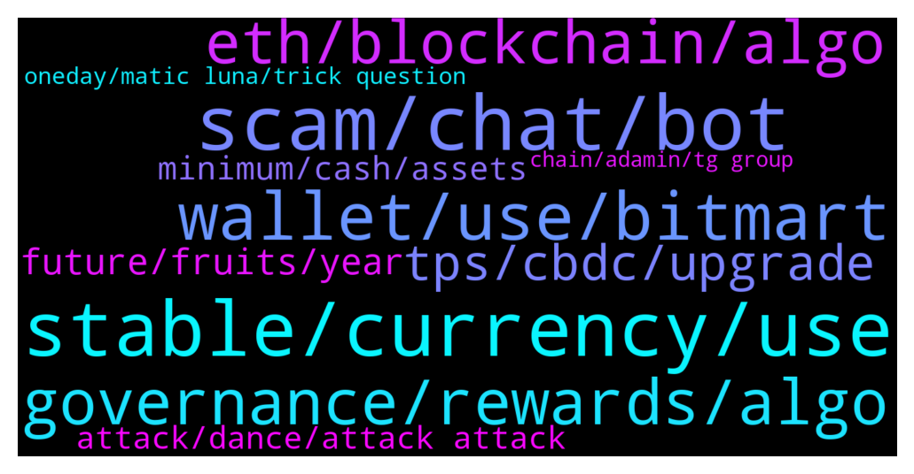

# **@algorand**
 ## Analysis for **2021-12-22** - **2021-12-23**.

---

## 📊 **Basic Stats**

**n_messages_sent**: 236

---

---

## 🔝 **Top keywords and related messages**

1. **stable, currency, use**

    @Ninvel --- *Well, thank you very much for answering me, but my interest is precisely not to use a stablecoin but rather that the native currency itself is stable, it just seems that in this algorand it does not fulfill my needs.* **--->** [TG Discussion](https://t.me/algorand/324888)

    @Ninvel --- *I do not know if I explain myself well but the stability of a currency is a purely economic concept and is measured with the generalized changes in prices of products and services (inflation and deflation) the dollar is stable because its inflation is very small* **--->** [TG Discussion](https://t.me/algorand/324883)

    @Martin --- *Life is not stable man. Everything changes except change. Your super stable-neutral coin is a honorable idea but that’s impossible to achieve in the real world.* **--->** [TG Discussion](https://t.me/algorand/324902)

    @Ninvel --- *Hello, how are you? I am a junior developer of JAVA, I have got a project, the project was in tezos but I have another phiilosophy than the tezos comunity, my project is create a wallet for entreprises based in blockchains, this wallet would be desinged to be comfortable to use for physical and online stores, the problem with the tezos community is that my phylosophy is based on the international use of a “neutral” token (native token)  which must be stable (as a stablecoin but without being linked with another coin) Is the algo token designed to be long-term stable for use in international trade? thanks for the answer 😄* **--->** [TG Discussion](https://t.me/algorand/324855)

    @Ninvel --- *If a pizza is worth 1 algo in 5 years, how much will the pizza be worth? that's the metric* **--->** [TG Discussion](https://t.me/algorand/324879)

    @Ninvel --- *If the production method of the pizza has not changed (it costs the same effort to produce it) the pizza should be worth 1 algo, if not, the currency is not stable, this is how the stability of currencies has always been measured* **--->** [TG Discussion](https://t.me/algorand/324881)

2. **scam, chat, bot**

    @A1981 --- *True but if not careful they become poor from being scammed by scammers then 🤣🤣🤣🤣* **--->** [TG Discussion](https://t.me/algorand/325127)

    @Floffy --- *There is another telegram geoup named ALGORAND OFFICIAL. I guess that's the scam geoup right xD? They do some kind of sale if you send bnb to their wallets. But 1000% is to steal your cryptos haha* **--->** [TG Discussion](https://t.me/algorand/324797)

    @grieze96 --- *I think the bots on this chat just say hello/hi and nothing else* **--->** [TG Discussion](https://t.me/algorand/324557)

    @Mimo --- *I don’t know why I’m banned there* **--->** [TG Discussion](https://t.me/algorand/324757)

    @MackDenver --- *There is a human verification bot that does a little verification. You you can't solve it, the bot  will ban you.* **--->** [TG Discussion](https://t.me/algorand/324769)

    @kenny920 --- *I'm also banned there. Never even said a word lol* **--->** [TG Discussion](https://t.me/algorand/324765)

3. **wallet, use, bitmart**

    @SquareRut --- *I have 10 Algos in my wallet but it keeps bringing up 0.018 as my maximum each time I want to use it via Tinyman* **--->** [TG Discussion](https://t.me/algorand/325112)

    @vohuytang --- *I want to use the DApp function on Algorand Wallet* **--->** [TG Discussion](https://t.me/algorand/325087)

    @pupzemli18 --- *I want 1 seed phrase and 10 wallets, this is possible? 10 new wallets I mean* **--->** [TG Discussion](https://t.me/algorand/325104)

    @MackDenver --- *You can simply import the wallet you want to use* **--->** [TG Discussion](https://t.me/algorand/325101)

    @pupzemli18 --- *Tell me pls, how can I make second, third and more wallets?) like in metamask* **--->** [TG Discussion](https://t.me/algorand/325100)

    @MackDenver --- *MyAlgo wallet supports connecting to Algorand dapps.* **--->** [TG Discussion](https://t.me/algorand/325089)

4. **governance, rewards, algo**

    @reslimed --- *It's actually being replaced by liquidity rewards for staking in dex pools. Governance is separate* **--->** [TG Discussion](https://t.me/algorand/324945)

    @Marco_Fonseca --- *Hi everyone. I've committed X Algos for the 1st voting session and have kept a min. of that amount in my Algorand wallet. In parallel I've been using Yieldly to stake anything above my committed Algos. The trouble is that Yieldly allows for all my ALGO to be staked (committed + surplus) but I suppose if I do that I'll lose my 1st governance rewards as the period hasn't ended yet. Do I have to keep the amount of ALGOS in my algorand wallet until end of 31Dec for governance rewards? Anyone knows how much %yield you get from governance?  Thank you in advance :)* **--->** [TG Discussion](https://t.me/algorand/325062)

    @Abubakar --- *What is apy in algo wallet on algo staking* **--->** [TG Discussion](https://t.me/algorand/325131)

    @Kermit1337 --- *Hi, i have 700 algo. How can I get in governance ?* **--->** [TG Discussion](https://t.me/algorand/325021)

    @KAPIBAYSIDE --- *When staking in algo in algo prize game do we get more algo or just yieldly?* **--->** [TG Discussion](https://t.me/algorand/325053)

    @Ziliqa_KID_PUMP_it --- *Hi guys when keep my algo token on coinbase or algorand wallet where is more apy?* **--->** [TG Discussion](https://t.me/algorand/324785)

5. **eth, blockchain, algo**

    @Chocoim --- *Nevwe dare to compare algo to eth and btc Algo is chain with billions of coins created out of thin air and slow development controlled by few people at top . Btc and eth having thousands of running on it.. r decentralied chain... had to put lof of effort and energy to create them...* **--->** [TG Discussion](https://t.me/algorand/324670)

    @Tiny_Philosopher_784 --- *I have will forever continue to dare and compare the two. Just to spite your troll self.  Btc is run by China miners, same with ethereum.  Now, for your nonsense... you don't really dig around or understand what's come online for algorand, but that's okay. Just sell your algo and go back to ethereum. Just do it.* **--->** [TG Discussion](https://t.me/algorand/324673)

    @Ninvel --- *I'm going to try it and if I don't succeed, then I can always come to algorand again and what is better, I will have in my resume have made a blockchain that, no matter how bad it is, is not a bad curriculum* **--->** [TG Discussion](https://t.me/algorand/324903)

    @Chocoim --- *Look how market valuing ada And don't talk about eth It's umcomparable to deadgorand* **--->** [TG Discussion](https://t.me/algorand/324627)

    @Tiny_Philosopher_784 --- *Like trash, yeah.  And I'll talk about eth all I want. Try me* **--->** [TG Discussion](https://t.me/algorand/324631)

    @Akansha --- *Hello everyone, I want to learn about algorand blockchain. Plz guide me how I can start.  How we can create smart contract in it.* **--->** [TG Discussion](https://t.me/algorand/325066)

6. **tps, cbdc, upgrade**

    @S --- *Can we get an official update to the proton upgrade roadmap? Clearly the 202146k tps and then 2021 10k tps upgrades haven’t happened on the timelines stated by Algorand Inc, and unfortunately this is creating a good amount of consternation within the community. I understand the refocus on stateproofs, which is great, but we need a refresh on upgrade timelines so Algorand doesn’t needlessly lose credibility.* **--->** [TG Discussion](https://t.me/algorand/324809)

    @DlHKl --- *Can I ask a question?  what's happening with 46k tps and CBDC?* **--->** [TG Discussion](https://t.me/algorand/324699)

    @bigboy87183 --- *Thia is old news, and gas finished. The old accelerated vesting plan...   You should see the date at top of the article...* **--->** [TG Discussion](https://t.me/algorand/325019)

    @DlHKl --- *Is it same pitch for 2022 and beyond?* **--->** [TG Discussion](https://t.me/algorand/324713)

    @DlHKl --- *Steve said to Arrington on camera its this year and he was sure about it* **--->** [TG Discussion](https://t.me/algorand/324710)

    @domioo911 --- *Holding algo to end of 2025 !! Byebye* **--->** [TG Discussion](https://t.me/algorand/324899)

7. **future, fruits, year**

    @Chocoim --- *I pity myself wasted whole year* **--->** [TG Discussion](https://t.me/algorand/324661)

    @Kermit1337 --- *What are the next steps ?* **--->** [TG Discussion](https://t.me/algorand/325035)

    @qwert494 --- *Jesus wishes everyone a better future* **--->** [TG Discussion](https://t.me/algorand/325045)

    @hope999999999 --- *If you work hard, life will give you sweet fruits. If you are lazy, people give you hundreds fruits you will still be useless. Go outside and think for yourself* **--->** [TG Discussion](https://t.me/algorand/324740)

    @Tiny_Philosopher_784 --- *Okay. Best of luck to you in the future. And I hope you achieve your goals.* **--->** [TG Discussion](https://t.me/algorand/324707)

    @Chocoim --- *Keep living happy in ur own small world .* **--->** [TG Discussion](https://t.me/algorand/324634)

8. **minimum, cash, assets**

    @MillieMe85 --- *you are likely entered into a number of smart contracts giving you a minimum balance to maintain* **--->** [TG Discussion](https://t.me/algorand/325114)

    @Catherine08 --- *You won’t get rich if you invest where everyone else has invested.* **--->** [TG Discussion](https://t.me/algorand/325125)

    @MillieMe85 --- *There’s also a minimum balance to be maintained for assets added to the wallet.* **--->** [TG Discussion](https://t.me/algorand/325116)

    @hope999999999 --- *Savings account. If wallet owner pass away, their asset is spread to the rest :)* **--->** [TG Discussion](https://t.me/algorand/324736)

    @Tiny_Philosopher_784 --- *If you've held for a year, you've gained over 5x value.* **--->** [TG Discussion](https://t.me/algorand/324711)

    @A1981 --- *There’s a minimum amount also a length of time attached sometimes too* **--->** [TG Discussion](https://t.me/algorand/325119)

9. **attack, dance, attack attack**

    @Tiny_Philosopher_784 --- *At least algorand doesn't have some blow hard paying people to pump it* **--->** [TG Discussion](https://t.me/algorand/324640)

    @sumant17 --- *when this sleeping giant will wake up, Algorand* **--->** [TG Discussion](https://t.me/algorand/324801)

    @Tiny_Philosopher_784 --- *You're grown, now act like it.  If you were saying algorand has flaws but has brought alot more online than they said they were, this would be civil. You can be disappointed but still be honest about what they have done. Instead, you attack attack attack. What were you expecting? A bunch of sheep?? Yeah, nice thinking.* **--->** [TG Discussion](https://t.me/algorand/324700)

    @Tiny_Philosopher_784 --- *You wanted to dance, you should dance. You can't tiptoe back and forth across the line of support and attack. If you despise algorand, that much, it's simple: sell* **--->** [TG Discussion](https://t.me/algorand/324697)

    @Tiny_Philosopher_784 --- *Have you even used algorand? You sound like a troll from another group* **--->** [TG Discussion](https://t.me/algorand/324650)

    @NightAlgorand --- *You are in algorand now, we have more power here.* **--->** [TG Discussion](https://t.me/algorand/325143)

10. **oneday, matic luna, trick question**

    @EnalTesla20 --- *Total supply of 10 billion no more additions...?* **--->** [TG Discussion](https://t.me/algorand/324961)

    @Chocoim --- *Matic , Luna , Sol, avax,....r being  pumped because they r paid?* **--->** [TG Discussion](https://t.me/algorand/324645)

    @hope999999999 --- *😂😂😂 i bought DEXTF token then oneday they changed their name to Domani with gamification website. Waiting to sell it soon. When anyone lose his/her promise once, reject* **--->** [TG Discussion](https://t.me/algorand/324733)

    @Insecurity_Romania --- *Is this a trick question ⁉️* **--->** [TG Discussion](https://t.me/algorand/324581)

    @mrlovin --- *You are right, why I am even asking* **--->** [TG Discussion](https://t.me/algorand/324585)

    @Kermit1337 --- *So this is not enough ?* **--->** [TG Discussion](https://t.me/algorand/325034)

