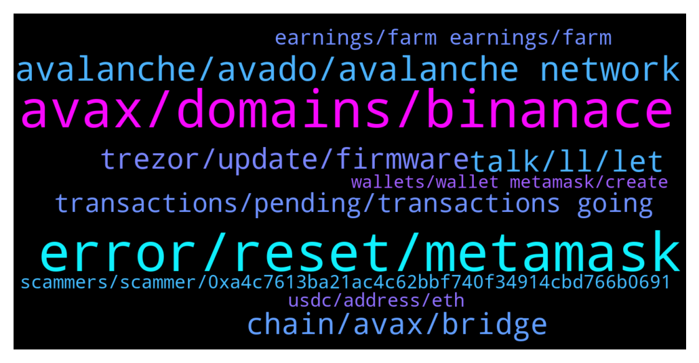

# **@avalancheavax**
 ## Analysis for **2021-12-22** - **2021-12-23**.

---

## 📊 **Basic Stats**

**n_messages_sent**: 252

---

---

## 🔝 **Top keywords and related messages**

1. **error, reset, metamask**

    @Nicolas_A --- *Try to reset Metamask perhaps. Try another token* **--->** [TG Discussion](https://t.me/avalancheavax/316842)

    @FluffyRat --- *Anyone else having issues swapping their gb token to e.g. usdc.e or any other token for that matter?  I'm getting an error when swapping on the front-end of pangolin. The tx is not even being broadcasted to the network* **--->** [TG Discussion](https://t.me/avalancheavax/316837)

    @oathtobarbatos --- *Try resetting your Metamask wallet, there has been an issue with Metamask and you might have to reset your profile. Settings > Advanced > Reset profile* **--->** [TG Discussion](https://t.me/avalancheavax/316701)

    @BuchiSmart --- *I can't transact, claim tokens or even buy or sell tokens. what's going on. I have reset my account  yet same problem* **--->** [TG Discussion](https://t.me/avalancheavax/316689)

    @BuchiSmart --- *Hi, please for the past two days I cannot interact with any avalanche token on my metamask.  I received transaction 251 failed error: message unknown.  What should I do please?* **--->** [TG Discussion](https://t.me/avalancheavax/316649)

    @Nicolas_A --- *Indexing error I believe they don't exist* **--->** [TG Discussion](https://t.me/avalancheavax/316895)

2. **avax, domains, binanace**

    @kroinik --- *Hello. Why do we have 0 TVL on Avalaunch in DefiLamaplatform? Wierd* **--->** [TG Discussion](https://t.me/avalancheavax/316602)

    @Nicolas_A --- *If you want view your address on the explorer you can use explorer.avax.network* **--->** [TG Discussion](https://t.me/avalancheavax/316896)

    @berzctnky --- *https://twitter.com/coinmarketcap/status/1473286657759715328?s=21  vote for avax please* **--->** [TG Discussion](https://t.me/avalancheavax/316476)

    @only3bood --- *Any plans for supporting avaxc usdt on binanace?* **--->** [TG Discussion](https://t.me/avalancheavax/316361)

    @AbleGod2311 --- *Hi can some one please send me $1 worth of avax* **--->** [TG Discussion](https://t.me/avalancheavax/316800)

    @BuchiSmart --- *I have avax in my wallet* **--->** [TG Discussion](https://t.me/avalancheavax/316721)

3. **avalanche, avado, avalanche network**

    @Nicolas_A --- *Yes but that’s with every crypto wallet not specific to Avalanche* **--->** [TG Discussion](https://t.me/avalancheavax/316506)

    @defikeyser --- *What’s the best place to look for people who look for a job in crypto and specifically Avalanche* **--->** [TG Discussion](https://t.me/avalancheavax/316410)

    @Chab --- *Will there be a Avalanche live on Ledger?* **--->** [TG Discussion](https://t.me/avalancheavax/316512)

    @oathtobarbatos --- *Move it to the Avalanche trading group* **--->** [TG Discussion](https://t.me/avalancheavax/316377)

    @Maicol998 --- *Group avalanche official announcement span 1000 mesages😭* **--->** [TG Discussion](https://t.me/avalancheavax/316501)

    @liochain --- *thank you AVALANCHE for giving my the Chikns, thy are changing my LIFE❤️* **--->** [TG Discussion](https://t.me/avalancheavax/316524)

4. **chain, avax, bridge**

    @coctail_Bae --- *Hi there, I’m new to avax and c chain, I’m mostly playing on bsc I would like to know what’s the equivalent of poocoin on the avax chain? Thanks* **--->** [TG Discussion](https://t.me/avalancheavax/316870)

    @MissusMop --- *Hello people. How can I bridge my Avax Bsc in Metamask, to my Avalanche wallet in there?* **--->** [TG Discussion](https://t.me/avalancheavax/316348)

    @rallod --- *if i send from binance avax with avax c chain network this is ok or?* **--->** [TG Discussion](https://t.me/avalancheavax/316592)

    @Nicolas_A --- *Be sure to use a C chain address (0x...)* **--->** [TG Discussion](https://t.me/avalancheavax/316569)

    @TheM4hd1 --- *hello, is there a way to bridge bsc to avax? (for chainlink)* **--->** [TG Discussion](https://t.me/avalancheavax/316543)

    @Nicolas_A --- *Can't bridge directly. Either go through Binance or swap to a stablecoin which you can then bridge to Avalanche using Synapse bridge* **--->** [TG Discussion](https://t.me/avalancheavax/316349)

5. **talk, ll, let**

    @povapay --- *But you are replying to messages again admin* **--->** [TG Discussion](https://t.me/avalancheavax/316654)

    @BuchiSmart --- *ok thanks  , why can't I get someone here?* **--->** [TG Discussion](https://t.me/avalancheavax/316719)

    @BuchiSmart --- *Why is no one addressing this issue here pls?* **--->** [TG Discussion](https://t.me/avalancheavax/316691)

    @oathtobarbatos --- *If you need anything else just LmK.* **--->** [TG Discussion](https://t.me/avalancheavax/316723)

    @povapay --- *I’m sorry, but there is a particular group we do message and get issue resolved.* **--->** [TG Discussion](https://t.me/avalancheavax/316645)

    @oathtobarbatos --- *I'll do some research about that issue. If I find something relevant I'll talk to you again* **--->** [TG Discussion](https://t.me/avalancheavax/316725)

6. **trezor, update, firmware**

    @MENRO54 --- *I had the same problem. It's because the Trezor, you must update it* **--->** [TG Discussion](https://t.me/avalancheavax/316403)

    @Cbears22 --- *Yes. Trezor T only supports avax C chain I believe. Not X or P. Firmware may fix.* **--->** [TG Discussion](https://t.me/avalancheavax/316747)

    @BuchiSmart --- *I don't need to buy another trezor, right?* **--->** [TG Discussion](https://t.me/avalancheavax/316764)

    @vampyren --- *Ah ok then latest version 10.8.1* **--->** [TG Discussion](https://t.me/avalancheavax/316710)

    @BuchiSmart --- *How do I update the it pls. there is pop up like that* **--->** [TG Discussion](https://t.me/avalancheavax/316750)

    @vampyren --- *ah Trezor....yeah maybe update app there + firmware.....and when you say tranact , do you mean send or what? what page?* **--->** [TG Discussion](https://t.me/avalancheavax/316745)

7. **transactions, pending, transactions going**

    @TheSEOdude --- *Are transactions going through right now ? Anyone who has just did one ?* **--->** [TG Discussion](https://t.me/avalancheavax/316436)

    @schultzjl88 --- *Is the network slow right now? I've been trying to approve a traderjoe contract for the last 20 minutes.* **--->** [TG Discussion](https://t.me/avalancheavax/316542)

    @ramziakram --- *i also have pending transaction.seems congested right now. i look into snowtrace there are people using 3 avax for  gas fee right now* **--->** [TG Discussion](https://t.me/avalancheavax/316531)

    @Butra1 --- *How long does it take for a queued transaction to be failed/dropped?* **--->** [TG Discussion](https://t.me/avalancheavax/316607)

    @onepn --- *Can't go to the next step in pending.  Am I the only one like this?* **--->** [TG Discussion](https://t.me/avalancheavax/316530)

    @Mike --- *I basically had a sell order that took half the night before it would complete. Something is bottlenecking the network* **--->** [TG Discussion](https://t.me/avalancheavax/316536)

8. **earnings, farm earnings, farm**

    @Nicolas_A --- *They have no power over that* **--->** [TG Discussion](https://t.me/avalancheavax/316841)

    @pricelessjewels --- *We all do I guess, been stacking more of the dips with farm earnings in fact* **--->** [TG Discussion](https://t.me/avalancheavax/316679)

    @alrko616 --- *He must be over the moon with his holdings* **--->** [TG Discussion](https://t.me/avalancheavax/316605)

    @Mike --- *They're double what they were yesterday.* **--->** [TG Discussion](https://t.me/avalancheavax/316425)

    @Chroniclesophia_Boss --- *Been stacking more from farm earnings* **--->** [TG Discussion](https://t.me/avalancheavax/316340)

    @Tyranny5000 --- *uranus is full of shit, must go further* **--->** [TG Discussion](https://t.me/avalancheavax/316383)

9. **scammers, scammer, 0xa4c7613ba21ac4c62bbf740f34914cbd766b0691**

    @Nicolas_A --- *Correct. Admins never DM first. only scammer do* **--->** [TG Discussion](https://t.me/avalancheavax/316614)

    @BeIntrinsic --- *Nicolas, is it safe to say you do not just randomly PM folks?* **--->** [TG Discussion](https://t.me/avalancheavax/316613)

    @/ --- *Any scammers out there? Im bored lets have some fun text me 😁* **--->** [TG Discussion](https://t.me/avalancheavax/316912)

    @BuchiSmart --- *Scammers are just here to scam* **--->** [TG Discussion](https://t.me/avalancheavax/316667)

    @Mike --- *Got someone DMing me - I don’t think that’s kosher* **--->** [TG Discussion](https://t.me/avalancheavax/316529)

    @Akabo_Crypto --- *be on the watch out for scammer , they just pull out 70 $ out of my metamask address , u son of huge bitch£(excuse my language)  0xa4C7613BA21Ac4C62bBf740F34914CBD766b0691* **--->** [TG Discussion](https://t.me/avalancheavax/316488)

10. **usdc, address, eth**

    @Nicolas_A --- *Yeah you sent the funds to the contract address. I’m afraid they are lost. No one has access to the contract* **--->** [TG Discussion](https://t.me/avalancheavax/316835)

    @No name --- *I was sending usdc from my metamask wallet 1 account to 2 account and instead of putting my wallet 2 address to send usdc I instead put the usdc contact and sent* **--->** [TG Discussion](https://t.me/avalancheavax/316830)

    @No name --- *I had copied the usdc address to add on my second wallet so I can see the funds so I did that and then when I went to send from wallet 1 to wallet 2 I pasted the usdc address in the send to part* **--->** [TG Discussion](https://t.me/avalancheavax/316856)

    @okanenoodles --- *ok it's still im my eth wallet sorry* **--->** [TG Discussion](https://t.me/avalancheavax/316807)

    @No name --- *Sending from wallet 1 to wallet 2  Instead of putting is the sending on metamask my wallet 2 address I pasted usdc contract address* **--->** [TG Discussion](https://t.me/avalancheavax/316833)

    @okanenoodles --- *If I rejected the second transaction where's my eth?* **--->** [TG Discussion](https://t.me/avalancheavax/316806)

