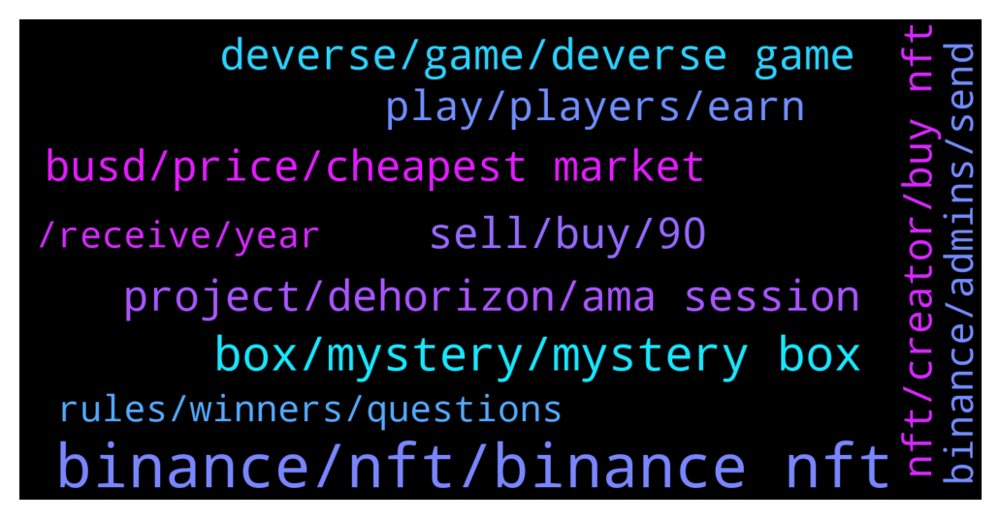

# **@binancenfts**
 ## Analysis for **2021-12-22** - **2021-12-23**.

---

## 📊 **Basic Stats**

**n_messages_sent**: 420

---

---

## 🔝 **Top keywords and related messages**

1. **binance, nft, binance nft**

    @ChongMunChun --- *I'm not sure whether is Binance's problem or the Win NFT Horse's problem, I dont want to have prejudice against them* **--->** [TG Discussion](https://t.me/binancenfts/414070)

    @serb_astian --- *I’ll need an intro on Binance NFTs then please.* **--->** [TG Discussion](https://t.me/binancenfts/413499)

    @SUSUBOYY --- *How to sell NFT on binance?* **--->** [TG Discussion](https://t.me/binancenfts/414524)

    @JuggernautXO --- *Why I withdraw NFT from binance 2 hours ago but it still processing?* **--->** [TG Discussion](https://t.me/binancenfts/413601)

    @nichols_n --- *Oh ok, and if I created a nft on a different platform, can I list it on binance* **--->** [TG Discussion](https://t.me/binancenfts/413463)

    @arianagrinder89 --- *How long does it take to become an nft creator on Binance?* **--->** [TG Discussion](https://t.me/binancenfts/413864)

2. **box, mystery, mystery box**

    @YilanGulsum --- *how can you buy mystery box? I've never been able to get one.* **--->** [TG Discussion](https://t.me/binancenfts/413667)

    @YilanGulsum --- *it is not easy to buy. all boxes run out in one sec.* **--->** [TG Discussion](https://t.me/binancenfts/413674)

    @YilanGulsum --- *Is it not a scam when making money from a box, but a scam when losing money? This is called trading. you can't always win. you have to do your research well* **--->** [TG Discussion](https://t.me/binancenfts/414550)

    @c_hinmay --- *No🤣🤭.... mystery box gave ma a N rated item worth 10$* **--->** [TG Discussion](https://t.me/binancenfts/414721)

    @vyshak5813 --- *With in 13 minute there will be a mystery box sale* **--->** [TG Discussion](https://t.me/binancenfts/413682)

    @sanketrai --- *no one will be able to get a single deverse mystery box 😔* **--->** [TG Discussion](https://t.me/binancenfts/413345)

3. **busd, price, cheapest market**

    @SyronEU --- *bru they are for around 12 busd on the market xd* **--->** [TG Discussion](https://t.me/binancenfts/413725)

    @adi4746 --- *I saw some at 300 -400 busd Although i have listed at same range at 0.8 bnb* **--->** [TG Discussion](https://t.me/binancenfts/414615)

    @SyronEU --- *LFW Silver Tide Hero 165BUSD only now, because i need some busd haha ill take it out in 5minutes* **--->** [TG Discussion](https://t.me/binancenfts/414464)

    @baflac --- *haha i got that for 30 busd* **--->** [TG Discussion](https://t.me/binancenfts/414168)

    @HenryKorsunskiy --- *Wts! 160 busd or in BNB* **--->** [TG Discussion](https://t.me/binancenfts/413709)

    @YilanGulsum --- *i have 50 busd. are you interested in?* **--->** [TG Discussion](https://t.me/binancenfts/414690)

4. **deverse, game, deverse game**

    @shengdaddy --- *And also i just post a seank peek about our game play for deverse game* **--->** [TG Discussion](https://t.me/binancenfts/414011)

    @shengdaddy --- *DeVerse is planned to launch in Q1,2022, which is coming soon! We will invite our partnered guilds to join the internal test before it officially launches.* **--->** [TG Discussion](https://t.me/binancenfts/413934)

    @shengdaddy --- *DeVerse is a 30vs30 team battle game. Ranger, Adventurer, Rogue, Alchemist, Warrior are five important NFTs, known as Numen in DeHorizon metaverse. They also play vital roles in DeVerse.* **--->** [TG Discussion](https://t.me/binancenfts/413891)

    @neversosi --- *Firstly, this seems like a great project and congrats on the recent $8.5m of funding. Will you be working to get streamers involved in DeVerse at an early stage? I sometimes find that in the play to earn space there isn’t enough focus on the likes of Twitch and YouTube Gaming and so forth and instead it’s mostly about the earning aspect. Do you think the game will encourage people to stream, chat and enjoy? It certainly seems to be very engaging on first glance! Thanks* **--->** [TG Discussion](https://t.me/binancenfts/413972)

    @shengdaddy --- *DeVerse is planned to launch in Q1, 2022, which is absolutely coming soon!* **--->** [TG Discussion](https://t.me/binancenfts/413881)

    @Lencunyeshin --- *DeVerse offers five playable hero characters. What is the difference between each Hero in the game? How does each player need Heroes to participate in DeVerse?#DeHorizon* **--->** [TG Discussion](https://t.me/binancenfts/413997)

5. **sell, buy, 90**

    @vamaveche9 --- *Hehe, with this price you can buy instead my ice cream monroe, if you are interested, I will make you a discount 😖* **--->** [TG Discussion](https://t.me/binancenfts/414278)

    @Sonersonerx --- *I sell cheapest price friends 🥳* **--->** [TG Discussion](https://t.me/binancenfts/414248)

    @jamik_tursunov --- *How to sell Marlin Monroe? no one buys* **--->** [TG Discussion](https://t.me/binancenfts/414217)

    @nobodyfck --- *How much do you think you can sell for?* **--->** [TG Discussion](https://t.me/binancenfts/413707)

    @VeniceN --- *5$ only It has low graphics and quality* **--->** [TG Discussion](https://t.me/binancenfts/413537)

    @Sonersonerx --- *I sell cheapest price friends 🤠🥳* **--->** [TG Discussion](https://t.me/binancenfts/414296)

6. **project, dehorizon, ama session**

    @Ivan11338 --- *AMA session with DEhorizon at 2 pm utc today, correct?* **--->** [TG Discussion](https://t.me/binancenfts/413804)

    @shengdaddy --- *Here r DeHorizon official links for your reference: ⬇️ ⭐ - Official Website: http://www.dehorizon.fun/  ⭐ - Discord: https://discord.gg/dehorizon  ⭐ - Telegram: https://t.me/DeHorizonfun  ⭐ - Twitter: https://twitter.com/DeHorizonfun  ⭐ - My Podcast: hhttps://www.youtube.com/channel/UCnImowKo32-77Oi2vdCy9cA  ⭐ - My Twitter: https://twitter.com/Shengdaddy* **--->** [TG Discussion](https://t.me/binancenfts/414010)

    @lipirani46 --- *I want to support your project, Tell us more about the Dehorizon Program and in what ways can we participate ? #DeHorizon* **--->** [TG Discussion](https://t.me/binancenfts/413951)

    @Kenikky --- *Get your questions ready. I will open the chat only for 1 minute. And make sure you add at the end of the question #DeHorizon* **--->** [TG Discussion](https://t.me/binancenfts/413944)

    @shengdaddy --- *My personal podcast will randomly invite my colleagues to share more updates about DeHorizon.* **--->** [TG Discussion](https://t.me/binancenfts/413888)

    @Kenikky --- *Very happy to welcome @shengdaddy of Dehorizon 😄* **--->** [TG Discussion](https://t.me/binancenfts/413872)

7. **play, players, earn**

    @sanketrai --- *How are you planing to stand out from other Gamefi projects by focusing on "Fun first then Earn" rather than "Play to Earn" model ? #DeHorizon* **--->** [TG Discussion](https://t.me/binancenfts/413965)

    @shengdaddy --- *We are dedicated to letting our players "Play for fun and to earn" and become our DeHorizon inhabitants.* **--->** [TG Discussion](https://t.me/binancenfts/413936)

    @shengdaddy --- *all the gamefi project are too focus on the play to earn* **--->** [TG Discussion](https://t.me/binancenfts/413883)

    @loving61 --- *Is it an Dehorizon Sport multiplayer game? Can you play against random players from all over the world or challenge your friends? Do they need an investment to play the game? #DeHorizon* **--->** [TG Discussion](https://t.me/binancenfts/413987)

    @nknitai19 --- *Is it an Dehorizon Sport multiplayer game? Can you play against random players from all over the world or challenge your friends? Do they need an investment to play the game?* **--->** [TG Discussion](https://t.me/binancenfts/413981)

    @Kenikky --- *How can players play to earn in DeHorizon metaverse?* **--->** [TG Discussion](https://t.me/binancenfts/413908)

8. **nft, creator, buy nft**

    @YilanGulsum --- *This is a channel dedicated to nft topics only.* **--->** [TG Discussion](https://t.me/binancenfts/413740)

    @Semeerkvv --- *Yes .CREATOR Not a NFT PRIDE* **--->** [TG Discussion](https://t.me/binancenfts/414170)

    @MakNyoshNFT --- *At least if you want to buy NFT, better focus on the top creator category (of all time). Why?? Because if we buy nft from top creators, we don't have to wait long to sell it* **--->** [TG Discussion](https://t.me/binancenfts/414194)

    @sophianyc --- *All are unique NFT's. DM me for link* **--->** [TG Discussion](https://t.me/binancenfts/414064)

    @Ragnar_mb --- *Any link to an nft within the blockchain* **--->** [TG Discussion](https://t.me/binancenfts/413731)

    @Ragnar_mb --- *I mean you guys all own nfts are they actually in the blockchain or just links.* **--->** [TG Discussion](https://t.me/binancenfts/413720)

9. **binance, admins, send**

    @c_hinmay --- *Read binance articles ... answers won't be shared here😑* **--->** [TG Discussion](https://t.me/binancenfts/414677)

    @Anon905 --- *This is a shame for Binance. They are not at all aware of the distribution of prizes.* **--->** [TG Discussion](https://t.me/binancenfts/414067)

    @newadems --- *Binance Elif Angel Please don't angel people like this who are on Binance Turkey.* **--->** [TG Discussion](https://t.me/binancenfts/414272)

    @YilanGulsum --- *To know the answer to this question, you have no choice but to follow binance's announcement channels.* **--->** [TG Discussion](https://t.me/binancenfts/414105)

    @YilanGulsum --- *we often see admins as shareholders of Binance.Let's not forget that admins are only mediators for us.* **--->** [TG Discussion](https://t.me/binancenfts/414094)

    @YilanGulsum --- *binance should do smt about it.* **--->** [TG Discussion](https://t.me/binancenfts/413684)

10. **rules, winners, questions**

    @Anon905 --- *Even when Kenneth asks, he doesn't answer....😭😭😭😭😭* **--->** [TG Discussion](https://t.me/binancenfts/414074)

    @Kenikky --- *Don't worry, @captainbnb is very efficient at finding rule breakers.* **--->** [TG Discussion](https://t.me/binancenfts/414041)

    @neversosi --- *The rules don't count for much huh? One of the "winners" answered multiple questions, like many others* **--->** [TG Discussion](https://t.me/binancenfts/414027)

    @ChongMunChun --- *Kenneth the winners asked multiple questions* **--->** [TG Discussion](https://t.me/binancenfts/414031)

    @Kenikky --- *don't worry, Thor will be reviewing all of the winners that they followed the rules.* **--->** [TG Discussion](https://t.me/binancenfts/414030)

    @u_wana --- *Third time all answers right, but declared a false* **--->** [TG Discussion](https://t.me/binancenfts/413745)

