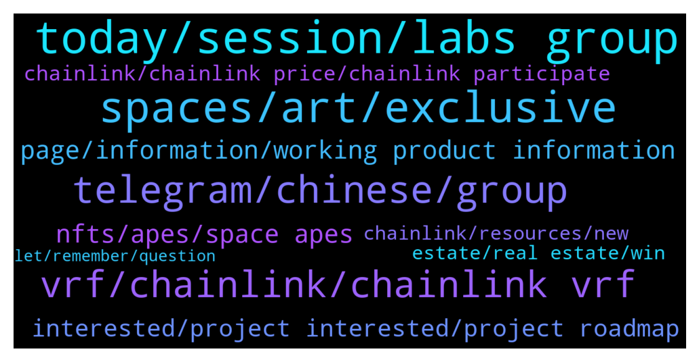

# **@chainlinkofficial**
 ## Analysis for **2021-12-22** - **2021-12-23**.

---

## 📊 **Basic Stats**

**n_messages_sent**: 199

---

---

## 🔝 **Top keywords and related messages**

1. **today, session, labs group**

    @jakelabsgroup --- *Mike won't be joining us today, as he is not feeling well. Thank you Juan for organizing.* **--->** [TG Discussion](https://t.me/chainlinkofficial/356954)

    @Linkederic --- *It typically takes longer than a day for hiring to get back to people. Bear in mind that its the holiday, and also griping in an official channel like this isnt really the best way to get your resume considered* **--->** [TG Discussion](https://t.me/chainlinkofficial/356685)

    @AB --- *Whom should I contact for AMA proposal* **--->** [TG Discussion](https://t.me/chainlinkofficial/356717)

    @dejlin --- *Will be happy to see you in our channels 💪☺️* **--->** [TG Discussion](https://t.me/chainlinkofficial/356836)

    @juankaramoy --- *Once again, thank you to LABS Group's Leo and Mike for your time. It has been a please ~1 hour chatting with you both!* **--->** [TG Discussion](https://t.me/chainlinkofficial/356994)

    @jakelabsgroup --- *Hello everyone, I am Jake from LABS Group. I'm doing very well, happy to be here.* **--->** [TG Discussion](https://t.me/chainlinkofficial/356946)

2. **spaces, art, exclusive**

    @marcromeron --- *Can you explain more in detail what are those Exclusive Spaces for?* **--->** [TG Discussion](https://t.me/chainlinkofficial/356811)

    @dejlin --- *In the not-so-distant future, you can expect CEX listing, new major partnership announcements and integrating Spaces into metaverse.* **--->** [TG Discussion](https://t.me/chainlinkofficial/356791)

    @dejlin --- *We do this by interweaving gamification, art, and rewards yielding via Play-To-Earn interactions and bringing it closer to the general public.* **--->** [TG Discussion](https://t.me/chainlinkofficial/356746)

    @dejlin --- *Co-create art and get rewarded 🔥✌️🚀* **--->** [TG Discussion](https://t.me/chainlinkofficial/356760)

    @dejlin --- *We are first and only project out there that has such concept. By combining gamification, art creation through NFTs, advertisement, yield farming and play-to-earn model, we are leading by example.* **--->** [TG Discussion](https://t.me/chainlinkofficial/356771)

    @dejlin --- *Concept was well thought out before we gone on a journey of creating MVP and after that was well excepted we build the platform.* **--->** [TG Discussion](https://t.me/chainlinkofficial/356772)

3. **telegram, chinese, group**

    @James --- *Hello dev is there any Chinese group here?* **--->** [TG Discussion](https://t.me/chainlinkofficial/357020)

    @Author --- *Hello Dev any China group here!?..* **--->** [TG Discussion](https://t.me/chainlinkofficial/357061)

    @aeyahi --- *China has a telegram group, It’s called @chainlinkfans (unofficial) and please also feel free to check out our Chinese communities (official) here:  https://blog.chain.link/chainlink-chinese-communities/* **--->** [TG Discussion](https://t.me/chainlinkofficial/357036)

    @Sylvarantt --- *China has a telegram group, It’s called @chainlinkfans (unofficial) and please also feel free to check out our Chinese communities (official) here:  https://blog.chain.link/chainlink-chinese-communities/* **--->** [TG Discussion](https://t.me/chainlinkofficial/357022)

    @Joypokkamol --- *China has a telegram group, It’s called @chainlinkfans (unofficial) and please also feel free to check out our Chinese communities (official) here:  https://blog.chain.link/chainlink-chinese-communities/* **--->** [TG Discussion](https://t.me/chainlinkofficial/356839)

    @juankaramoy --- *Official Website: [https://labsgroup.io/](https://labsgroup.io/) Telegram: [https://t.me/labsgroupio](https://t.me/labsgroupio) Telegram (Chinese 中文): [https://t.me/Labs_china](https://t.me/Labs_china) Twitter: [https://twitter.com/labsgroupio](https://twitter.com/labsgroupio) Medium: [https://labsgroupio.medium.com/](https://labsgroupio.medium.com/) Discord: [https://discord.gg/5HtDNebSGf](https://discord.gg/5HtDNebSGf) Reddit: [https://www.reddit.com/r/LabsGroupio/](https://www.reddit.com/r/LabsGroupio/) Instagram: [https://www.instagram.com/labsgroupio/](https://www.instagram.com/labsgroupio/) LinkedIn: [https://www.linkedin.com/company/labs-group/](https://www.linkedin.com/company/labs-group/)* **--->** [TG Discussion](https://t.me/chainlinkofficial/356996)

4. **vrf, chainlink, chainlink vrf**

    @leozhezha --- *As the VRF stands for Verifiable Random Function you are easily able to understand from the name the functionality.   We decided to utilize this feature into our Win platform, a lottery game platform where we are randomly generating the winning numbers. Every 12 hours we are given the opportunity to win a big price.* **--->** [TG Discussion](https://t.me/chainlinkofficial/356975)

    @marcromeron --- *In just a few moments, we will have a Community Q&A with 1000 BLOCKS who recently announced that integrates Chainlink VRF to help power transparent rewards distribution.    To read more about this integration, please check this article below:  https://1000blocks.medium.com/1000blocks-space-integrates-chainlink-vrf-to-help-power-transparent-rewards-distribution-bcbf02908911* **--->** [TG Discussion](https://t.me/chainlinkofficial/356733)

    @marcromeron --- *For people interested in deep-dive into VRF, please check our documentation: https://chain.link/chainlink-vrf* **--->** [TG Discussion](https://t.me/chainlinkofficial/356782)

    @juankaramoy --- *and for those that would like to learn more about VRF check out this article https://blog.chain.link/chainlink-vrf-on-chain-verifiable-randomness/* **--->** [TG Discussion](https://t.me/chainlinkofficial/356997)

    @juankaramoy --- *In just a few moments, we will have a Community Q&A with LABS Group who recently announced the integration of Chainlink VRF to support the raffle system for the LABS WIN Platform.  To read more about this integration, please check this article below: https://labsgroupio.medium.com/the-labs-win-platform-integrates-chainlink-vrf-to-support-lucky-draws-e4ee6a694d91* **--->** [TG Discussion](https://t.me/chainlinkofficial/356941)

    @leozhezha --- *There are some great features of the Chainlink VRF that makes it important on the blockchain.   Some of them in my opinion are the following:   1. It regulates the process of Random Number Generation for the smart contracts.  2. Produces honest randomness for the game outcome.  3. Consuming smart contracts get all the random number results after they are verified.  4. Oracles cannot manipulate the result generated.  5. Providing users the integrity of the game along with the cryptographic proof, which builds a trust level.  6. VRF does not allow the malicious users and the node operators to alter and tamper with the randomness results.* **--->** [TG Discussion](https://t.me/chainlinkofficial/356971)

5. **page, information, working product information**

    @juankaramoy --- *This article might help your case https://academy.binance.com/en/articles/how-to-recover-crypto-transferred-to-the-wrong-network-on-binance* **--->** [TG Discussion](https://t.me/chainlinkofficial/356677)

    @dejlin --- *Otherwise simply visit our page https://1000blocks.space where everything is explained in details. Or even better test it out yourself. It is fully working product 😉* **--->** [TG Discussion](https://t.me/chainlinkofficial/356786)

    @dejlin --- *Head over to https://1000blocks.space/how-it-works for more information.* **--->** [TG Discussion](https://t.me/chainlinkofficial/356753)

    @Linkederic --- *here's that link for you https://tokens.pancakeswap.finance/pancakeswap-default.json* **--->** [TG Discussion](https://t.me/chainlinkofficial/356637)

    @Oneeyedoll --- *Ok, but i need an array of those.* **--->** [TG Discussion](https://t.me/chainlinkofficial/356638)

    @Linkederic --- *To answer your question see this page https://chain.link/community/advocates* **--->** [TG Discussion](https://t.me/chainlinkofficial/356917)

6. **nfts, apes, space apes**

    @dejlin --- *Sure. So I am a co-founder of 1000Blocks and an engineer by heart. Working with different technology solutions from my early days. I started my crypto journey back in 2014 and never looked back. Excited for the future to come.* **--->** [TG Discussion](https://t.me/chainlinkofficial/356738)

    @dejlin --- *More details here:  https://1000blocks.medium.com/space-apes-by-1000blocks-22nd-december-2021-mint-details-1a7e5385e15  Space Apes smart NFTs “Extremely rare, extremely powerful!”* **--->** [TG Discussion](https://t.me/chainlinkofficial/356810)

    @dejlin --- *We call those NFTs smart, as they will give owners special powers and abilities that can be used on 1000Blocks platform.* **--->** [TG Discussion](https://t.me/chainlinkofficial/356807)

    @dejlin --- *Today at 10 pm UTC | 5 pm EST | 2 pm PST, a full collection of ONLY 2100 Space Apes smart NFTs will be minted on Binance Smart Chain.* **--->** [TG Discussion](https://t.me/chainlinkofficial/356806)

    @dejlin --- *Today (in couple of hours!) we will release a full collection of Space Apes smart NFTs which will give owners special powers on the platform.* **--->** [TG Discussion](https://t.me/chainlinkofficial/356790)

    @dejlin --- *But we don’t stop here. We always add extra layers on top, as todays smart NFTs release will show.* **--->** [TG Discussion](https://t.me/chainlinkofficial/356773)

7. **interested, project interested, project roadmap**

    @marcromeron --- *Thank you very much @dejlin for your precious time!! Amazing project.* **--->** [TG Discussion](https://t.me/chainlinkofficial/356824)

    @Oneeyedoll --- *And is it time consuming to write one?* **--->** [TG Discussion](https://t.me/chainlinkofficial/356641)

    @juankaramoy --- *here are the the socials where you can stay up to date with the projects and ask any other questions you have* **--->** [TG Discussion](https://t.me/chainlinkofficial/356995)

    @juankaramoy --- *Please do follow, talk and ask questions in their social media platform to stay updated and to learn more about the project.* **--->** [TG Discussion](https://t.me/chainlinkofficial/356983)

    @juankaramoy --- *Last but not least what’s next on your project’s roadmap for those very enthusiastic about your project here today?* **--->** [TG Discussion](https://t.me/chainlinkofficial/356984)

    @juankaramoy --- *As always, we’re interested on what makes your project special and unique?* **--->** [TG Discussion](https://t.me/chainlinkofficial/356963)

8. **chainlink, chainlink price, chainlink participate**

    @jackdavid01 --- *Hello I need info about the chain link* **--->** [TG Discussion](https://t.me/chainlinkofficial/357031)

    @DoctorMantisToboggan --- *Is there any in depth discussion groups for chainlink?* **--->** [TG Discussion](https://t.me/chainlinkofficial/356701)

    @marcromeron --- *Next question.This is important for us as a Chainlink Community...* **--->** [TG Discussion](https://t.me/chainlinkofficial/356776)

    @dejlin --- *We aim to have a long-term relationship with Chainlink. Maybe even setup an Exclusive space for you 😉* **--->** [TG Discussion](https://t.me/chainlinkofficial/356781)

    @Dot0moon --- *Is any possibility chainlink will participate on dot parachains?* **--->** [TG Discussion](https://t.me/chainlinkofficial/357058)

    @YoungJer --- *Hello is chainlink partner with megladoge?* **--->** [TG Discussion](https://t.me/chainlinkofficial/356896)

9. **estate, real estate, win**

    @jakelabsgroup --- *Both works! Both of our platforms provides an easy starting point for blockchain and real estates aficinados, with the former one allowing investors to grow their wealth with real estate with just 100 USDT, and have a little fun with our WIN platform winning rewards.   LABS WIN Platform will be launched in the coming few weeks. So please do follow our social media channels and stay tunned!* **--->** [TG Discussion](https://t.me/chainlinkofficial/356981)

    @juankaramoy --- *I has been a pleasant 45 min learning about the WIN Platform and your real estate investing platform. We just have a few questions here to wrap up our Q&A session for today* **--->** [TG Discussion](https://t.me/chainlinkofficial/356979)

    @jakelabsgroup --- *Whoa - that's a great question. The WIN platform is part of our ecosystem to create more utilities to our LABS token. While they could invest in real estate with a lower entry barrier, why not winning extra bonuses and rewards with WIN? It is also a perfect starting point for members to start their blockchain investment journey.* **--->** [TG Discussion](https://t.me/chainlinkofficial/356977)

    @jakelabsgroup --- *LABS has been focusing on digital Real Estate investment. The WIN Platform is an innovative and revolutionary idea to give back to the LABS supporters. With just $5 USD worth of LABS, participants can enter the raffle and try their luck.  The payoff of the winning ticket varies each day. Each sold ticket increases the prize pool. When a prize pool isn't won, the next round's prize pool will be accumulated from the previous round; the longer it's been since someone has won the jackpot, the larger the prize pool will be.* **--->** [TG Discussion](https://t.me/chainlinkofficial/356964)

    @juankaramoy --- *Love the idea of giving more opportunity to the general mass to get involved in real estate investing via a fraction of its price point as we know real estate investing can cost a lot just to even get started with* **--->** [TG Discussion](https://t.me/chainlinkofficial/356962)

    @jakelabsgroup --- *Sure thing! LABS Group is a digital investment platform that provides access to fractionalized property ownership and enables the continuous trading of real estate assets-backed tokenized shares on a regulated security exchange.  We use blockchain technology and smart contracts to ensure complete transparency over a borderless ecosystem where property developers and investors can interact seamlessly and with unprecedented efficiency. So that people could invest in real estate projects in a fraction of its price point. Making real estate investment available for everyone.* **--->** [TG Discussion](https://t.me/chainlinkofficial/356960)

10. **chainlink, resources, new**

    @LaureanoAlonso --- *Hello! By mistake I sent my links to the bsc network token contract instead of to my wallet. Is there any way to get them back?* **--->** [TG Discussion](https://t.me/chainlinkofficial/356674)

    @Oneeyedoll --- *Hello, i need help. Is there a way to retrieve key name from a get request?* **--->** [TG Discussion](https://t.me/chainlinkofficial/356633)

    @Linkederic --- *Welcome new members to the Official Chainlink Telegram Community!  Please review the pinned post for our community rules and resources.   Be aware that price/trading discussion is strictly prohibited.  New to Chainlink? Check out these resources:  - What is Chainlink? - Chainlink 2.0 Whitepaper Overview - The Community Factsheet - Explicit Staking in Chainlink 2.0  - 77 Smart Contract Use Cases Enabled By Chainlink  - The Ultimate Chainlink Deep Dive: Completing The God Protocols: A Comprehensive Overview of Chainlink in 2021   ‼️Remember: We will not PM you first. We will never ask for your passwords, keys, or funds for any reason. We don’t have special deals to offer you and there is not now nor will there ever be a Chainlink airdrop. See this article to learn how to avoid the most common scams.* **--->** [TG Discussion](https://t.me/chainlinkofficial/356865)

    @nam_nguyenson --- *We cannot help you as we are not a wallet or an exchange. Regardless, tell us your problem here and we can point you in the right direction. Please also be aware of DM scam attempts, keep it in this chat for your own safety.* **--->** [TG Discussion](https://t.me/chainlinkofficial/356721)

    @erickneverson --- *There's a new scam livestream on youtube you should be careful of.  The channel is bearing the name Chainlink.  They've been reported.* **--->** [TG Discussion](https://t.me/chainlinkofficial/356664)

    @Linkederic --- *If you sent your tokens to any token contract address on any network they are unrecoverable by any party* **--->** [TG Discussion](https://t.me/chainlinkofficial/356682)

