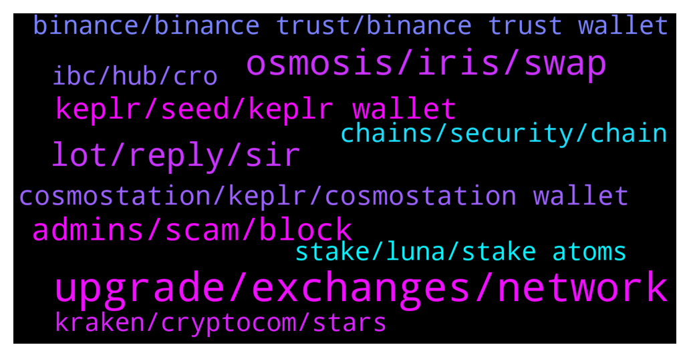

# **@cosmosproject**
 ## Analysis for **2021-12-22** - **2021-12-23**.

---

## 📊 **Basic Stats**

**n_messages_sent**: 566

---

---

## 🔝 **Top keywords and related messages**

1. **upgrade, exchanges, network**

    @AtomJazz --- *Hey, pls contact those exchanges directly and ask them this. We had an upgrade last week* **--->** [TG Discussion](https://t.me/cosmosproject/457596)

    @Joshycrypto --- *it keep saying something about a netwrok update ... how long does it take for real man ... your costing me money* **--->** [TG Discussion](https://t.me/cosmosproject/457652)

    @ZoltanAtom --- *Vega upgrade was completed on cosmos hub almost 9 days ago. You should contact to binance and ask them.* **--->** [TG Discussion](https://t.me/cosmosproject/457920)

    @Cordtus --- *Pretty much any exchange you can think of. Including a few dex on ibc* **--->** [TG Discussion](https://t.me/cosmosproject/458667)

    @AtomJazz --- *Network was upgraded a week ago already. I thought you read the pinned message 😀* **--->** [TG Discussion](https://t.me/cosmosproject/458483)

    @Cordtus --- *Depends on the exchange and what tokens they accept* **--->** [TG Discussion](https://t.me/cosmosproject/458226)

2. **osmosis, iris, swap**

    @AtomJazz --- *You can withdraw IRIS from Binance to Keplr and swap it to atom on Osmosis DeX* **--->** [TG Discussion](https://t.me/cosmosproject/458542)

    @Ivan --- *I mean, an option I don't have to send back to an exchange. How about osmosis? But I cant figure out how to get my secret over there either? 🤔* **--->** [TG Discussion](https://t.me/cosmosproject/457868)

    @ZoltanAtom --- *Osmosis has their own validator set to secure themself. I don’t think they will need to use interchain security. But as you aware, osmosis delegators can decide to use interchain security or not via governance proposal.    But technically I don’t know if you can use your own validator set and use interchain security is an option! This question should be directed to devs.* **--->** [TG Discussion](https://t.me/cosmosproject/458915)

    @Cordtus --- *You can swap the atom on binance for SCRT and send that to your keplr SCRT address, then send it to osmosis and swap it back for atom.* **--->** [TG Discussion](https://t.me/cosmosproject/458654)

    @Paesch --- *Very nice  Do you also know how Safe osmosis is in terms of hacking? I read all the time that Amm‘s get hacked and I’m a bit unsure bc of it* **--->** [TG Discussion](https://t.me/cosmosproject/457958)

    @Cordtus --- *Yes or you can swap via osmosis to another token* **--->** [TG Discussion](https://t.me/cosmosproject/458222)

3. **lot, reply, sir**

    @Totalspud --- *Hey thanks for the reply! I know it's tricky but I'm trying to get as much indepth detail as possible.  Sorry if I'm wrecking your head.* **--->** [TG Discussion](https://t.me/cosmosproject/458916)

    @Tom --- *Great to know this. Thanks a lot* **--->** [TG Discussion](https://t.me/cosmosproject/458934)

    @Totalspud --- *Okay thanks, just making a vid about it.* **--->** [TG Discussion](https://t.me/cosmosproject/458893)

    @drivensuccess --- *I'm gonna do it all on my PC anyways. Thanks.* **--->** [TG Discussion](https://t.me/cosmosproject/458264)

    @Paesch --- *Thanks a lot  Can’t wait to try it 😁* **--->** [TG Discussion](https://t.me/cosmosproject/457962)

    @Coin_6 --- *It did for me earlier today* **--->** [TG Discussion](https://t.me/cosmosproject/458494)

4. **admins, scam, block**

    @TwinPeaksRedRoom --- *Hey, I haven't been keeping up with the community or the project much lately. Any reason why we're pumping? Any significant news?* **--->** [TG Discussion](https://t.me/cosmosproject/458793)

    @sissy952 --- *Hello, can I talk to the administrator I have many services* **--->** [TG Discussion](https://t.me/cosmosproject/458205)

    @Zzuko7 --- *gm guys, have a good day  sending love to our admins* **--->** [TG Discussion](https://t.me/cosmosproject/457908)

    @ZoltanAtom --- *I have no idea. You should react out to their admins.* **--->** [TG Discussion](https://t.me/cosmosproject/458906)

    @ZoltanAtom --- *Hello,How can I help you ?* **--->** [TG Discussion](https://t.me/cosmosproject/458206)

    @ZoltanAtom --- *Hello,how can I help you ?* **--->** [TG Discussion](https://t.me/cosmosproject/458323)

5. **keplr, seed, keplr wallet**

    @Cordtus --- *It's just an issue with their app. Alternatively you could use your seed from crypto DeFi wallet to make a new keplr account and you'll be able to remove them* **--->** [TG Discussion](https://t.me/cosmosproject/458404)

    @AtomJazz --- *It's officially supported on Chrome only but should work on Brave too https://medium.com/chainapsis/how-to-use-keplr-wallet-40afc80907f6?source=user_profile---------0----------------------------* **--->** [TG Discussion](https://t.me/cosmosproject/458845)

    @oleg_moskovskiy --- *is it really a seed phrase from a trust wallet suitable for kerpl?* **--->** [TG Discussion](https://t.me/cosmosproject/458012)

    @Lucky_Luck888 --- *Hi admins. Its ok if i use Keplr wallet connected to Ledger or better Keplr only? Please excuse my ignorant. Thanks in advance (scammers pls stop DM me) Best, LK* **--->** [TG Discussion](https://t.me/cosmosproject/458625)

    @g4u5591 --- *Hi, is there any trick to install keplr extension in Brave browser? It gives me an error* **--->** [TG Discussion](https://t.me/cosmosproject/458844)

    @Paesch --- *is the kepl wallet only available for chrome?* **--->** [TG Discussion](https://t.me/cosmosproject/457741)

6. **cosmostation, keplr, cosmostation wallet**

    @drivensuccess --- *Does Keplr use my cosmostation wallet or do I have to transfer it?* **--->** [TG Discussion](https://t.me/cosmosproject/458253)

    @Fayvivien --- *Which app is the best to connect with trust wallet?  Keplr or Cosmostation? I don't usually do airdrop. I do only buying and staking.* **--->** [TG Discussion](https://t.me/cosmosproject/458516)

    @Coin_6 --- *Its on cosmos the moment its on your wallet... your keplr wallet that it, then u just deposit it in osmosis from the asset page* **--->** [TG Discussion](https://t.me/cosmosproject/458491)

    @oleg_moskovskiy --- *what wallet would you recommend for the future?* **--->** [TG Discussion](https://t.me/cosmosproject/458009)

    @qasimdprs --- *Okay I understand your point of view. I will wait for few days if issue still persist. I will import my wallet to keplr or cosmostation.* **--->** [TG Discussion](https://t.me/cosmosproject/457911)

    @Zzuko7 --- *guys with this new UI in cosmostation mobile app, i cant add wallets anymore, how can i add comdex wallet in cosmostation 😕* **--->** [TG Discussion](https://t.me/cosmosproject/457653)

7. **chains, security, chain**

    @OS4UU --- *Why are there bsc and erc20 contracts of Cosmos if Cosmos hat his own Blockchain?* **--->** [TG Discussion](https://t.me/cosmosproject/457634)

    @AtomJazz --- *Up to 10k tps per every Cosmos chain. We have application specific L1 blockchains here not a single chain* **--->** [TG Discussion](https://t.me/cosmosproject/457599)

    @OS4UU --- *Could you please expand this info a little, what do you mean with "here not a single chain"? Sorrt i want to understand correctly, thanks* **--->** [TG Discussion](https://t.me/cosmosproject/457609)

    @OS4UU --- *What is the Tx speed for Cosmos Blockchain? How many per second?* **--->** [TG Discussion](https://t.me/cosmosproject/457598)

    @AtomJazz --- *Hey there! Interoperability allows horizontal scalability. Instead of trying to run many dAPPs on one single chain, Cosmos allows to run infinite numbers of application specific blockchains. In Cosmos we have specialized AMM chains, smart contract chains, defi chains, privacy chains, gaming chains all able to intercommunicate and exchange data.  https://mapofzones.com/* **--->** [TG Discussion](https://t.me/cosmosproject/458169)

    @AtomJazz --- *Those are just wrapped token solutions from those projects. Not related with Cosmos at all. We don't suggest using it* **--->** [TG Discussion](https://t.me/cosmosproject/457637)

8. **ibc, hub, cro**

    @Prometheus_Zeus --- *If cronos is IBC Connected to the Cosms Hub, does that mean that they use also th IBC Router?* **--->** [TG Discussion](https://t.me/cosmosproject/458210)

    @Totalspud --- *Hey, guys.. is all ibc  transactions routed through the hub?* **--->** [TG Discussion](https://t.me/cosmosproject/458885)

    @kofvi --- *Hi, is the IBC same as crosschain bridge?* **--->** [TG Discussion](https://t.me/cosmosproject/458686)

    @Prometheus_Zeus --- *Hi Jazz, will the team prepare a list or web-report showing which chain using the IBC router?* **--->** [TG Discussion](https://t.me/cosmosproject/458786)

    @ZoltanAtom --- *Hi there,after Vega upgrade Cosmos hub became ibc router. But no all ibc txs routed by hub.* **--->** [TG Discussion](https://t.me/cosmosproject/458886)

    @ZoltanAtom --- *Hi there,IBC is inter-blockchain communication protocol. You can say it “Cross-chain transfers”   Please check this website, all your questions will be answered ;  https://ibcprotocol.org* **--->** [TG Discussion](https://t.me/cosmosproject/458719)

9. **kraken, cryptocom, stars**

    @ZoltanAtom --- *There we gooooo 🔥🔥🔥🔥 You can pay at Zamnesia with BitCanna!   https://twitter.com/BitCannaGlobal/status/1474033158416969732* **--->** [TG Discussion](https://t.me/cosmosproject/458940)

    @Cordtus --- *You probably have access to crypto.com though? Considering they just spent like 70 million on naming rights to a US stadium lol* **--->** [TG Discussion](https://t.me/cosmosproject/458235)

    @AtomJazz --- *Cryptocom and Kraken according to some people here. I don't use CEXes so don't know tbh* **--->** [TG Discussion](https://t.me/cosmosproject/457704)

    @AtomJazz --- *According to some members here Cryptocom works currently and Kraken as well* **--->** [TG Discussion](https://t.me/cosmosproject/458000)

    @dimiandre --- *i was serious about the /txs endpoint, it requires rewrite of integration. Crypto.com probably already use updated api because they have their own cronos/cro chain jwhich has been just integrated* **--->** [TG Discussion](https://t.me/cosmosproject/458102)

    @ZoltanAtom --- *Hi there,as far i as I know crypto.com and kraken !* **--->** [TG Discussion](https://t.me/cosmosproject/458750)

10. **stake, luna, stake atoms**

    @blueluelue --- *Hey guys. Is there a way to stake luna without downloading anything using just the chrome extension. I did it before but I forget how I did it now!* **--->** [TG Discussion](https://t.me/cosmosproject/458267)

    @AtomJazz --- *You can stake ATOM or you can use it in DeFi applications for yields. Osmosis and Sifchain for example* **--->** [TG Discussion](https://t.me/cosmosproject/458857)

    @Julio Brum --- *Thanks! Where can I stake my ATOMs?* **--->** [TG Discussion](https://t.me/cosmosproject/457605)

    @ZoltanAtom --- *So you are good to go! Just stake them.* **--->** [TG Discussion](https://t.me/cosmosproject/458255)

    @ebp700 --- *I want to stake atom but i cant* **--->** [TG Discussion](https://t.me/cosmosproject/458980)

    @Bournifle --- *No only ATOMs which are staked* **--->** [TG Discussion](https://t.me/cosmosproject/457589)

