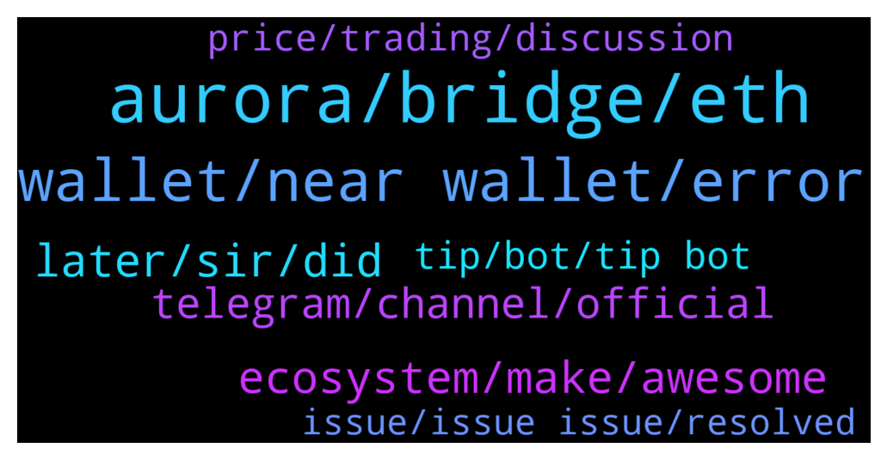

# **@cryptonear**
 ## Analysis for **2021-12-22** - **2021-12-23**.

---

## 📊 **Basic Stats**

**n_messages_sent**: 699

---

---

## 🔝 **Top keywords and related messages**

1. **aurora, bridge, eth**

    @NEARverse_xd --- *Aurora is an evm built on the NEAR and it is allowing devs to operate their apps on an eth compatible and scalable platform. So we don't need to rewrite applications from the scratch as aurora is fully compatible with eth. Also, aurora bridge is a part of the NEAR Rainbow Bridge which is the fully trustless bridge allowing transfer of eth and erc20 tokens between eth, aurora and near with low transaction fee.* **--->** [TG Discussion](https://t.me/cryptonear/246973)

    @kv9990 --- *Ledger 👀✌️ not sure if it supports Aurora* **--->** [TG Discussion](https://t.me/cryptonear/248016)

    @LDavila30 --- *Hello guys, there's some way to bridge my near to aurora? I'm a bit confused about it 🧐* **--->** [TG Discussion](https://t.me/cryptonear/247938)

    @S1001001001001 --- *Near and auraora are different. Which is main ? Is aurora a working like gas ? I don't understand for existing 2 coins. Pls elaborate.* **--->** [TG Discussion](https://t.me/cryptonear/247788)

    @larry_lang --- *yeah i think stNEAR bridging is possible- but just a head up stNEAR is not yet tradeable on Aurora network so it's best keeping it here* **--->** [TG Discussion](https://t.me/cryptonear/246777)

    @SebastianK33 --- *Is it easy to bridge to aurora and use platforms there? I have been reading about Tri and think I want some* **--->** [TG Discussion](https://t.me/cryptonear/246752)

2. **wallet, near wallet, error**

    @paperdawg --- *hi may i ask why can't i withdraww in near.wallet? ?<html><head> <meta http-equiv="content-type" content="text/html;charset=utf-8"> <title>502 Server Error</title> </head> <body text=#000000 bgcolor=#ffffff> <h1>Error: Server Error</h1> <h2>The server encountered a temporary error and could not complete your request.
Please try again in 30 seconds.</h2> <h2></h2> </body></html>?"* **--->** [TG Discussion](https://t.me/cryptonear/249019)

    @kv9990 --- *Would suggest to use wallet.near.org  Or checkout https://awesomenear.com/categories/wallets/* **--->** [TG Discussion](https://t.me/cryptonear/248207)

    @Ak47fantom --- *So you basically can't trade on reef finance unless you have a pc since the official near wallet does not a mobile wallet. That's seems very limiting eco system.  Can someone confirm whether that's the case ? . Thanks* **--->** [TG Discussion](https://t.me/cryptonear/248720)

    @NEARverse_xd --- *Yes and you can buy directly from NEAR wallet via moonpay* **--->** [TG Discussion](https://t.me/cryptonear/248182)

    @kv9990 --- *near.bet and nearnames.com for gifting wallets ✌️* **--->** [TG Discussion](https://t.me/cryptonear/248525)

    @kv9990 --- *Import your trust wallet passpharse to wallet.near.org was and use it ✌️* **--->** [TG Discussion](https://t.me/cryptonear/248594)

3. **later, sir, did**

    @larry_lang --- *noice^^  looking forward  to your presence there^^* **--->** [TG Discussion](https://t.me/cryptonear/246787)

    @badlordazekage --- *Jack it well I'd meet you for stuffs later* **--->** [TG Discussion](https://t.me/cryptonear/247635)

    @badlordazekage --- *Huh... Really need to learn howta make infographics... Can I write a poem bout near?🤨* **--->** [TG Discussion](https://t.me/cryptonear/247620)

    @rahulgoel007 --- *Haha It seems you haven't blocked the below one😄* **--->** [TG Discussion](https://t.me/cryptonear/247352)

    @larry_lang --- *=)) there's even more of that coming^^* **--->** [TG Discussion](https://t.me/cryptonear/247115)

    @Aflatoon123 --- *Oh i am not the only one😅* **--->** [TG Discussion](https://t.me/cryptonear/247336)

4. **ecosystem, make, awesome**

    @SebastianK33 --- *Yeah would love to. I just recently came into the NEAR ecosystem. Can't believe how helpful everyone is* **--->** [TG Discussion](https://t.me/cryptonear/246784)

    @Kripto_Raptor --- *like you can do prepare infographics and advertise Near Protocol / Ecosystem get funded for that* **--->** [TG Discussion](https://t.me/cryptonear/247613)

    @FritzWagner --- *U welcome ! Nice to have your interest on this, this is one of the reasons this community is so awesome ! ✨* **--->** [TG Discussion](https://t.me/cryptonear/246679)

    @larry_lang --- *hmm some good projects around NEAR can be Ref,finance, Octopus Network, Skyward Finance, Paras, Flux Protocol, Aurora,... those are core project of the NEAR ecosystem and good project IMO* **--->** [TG Discussion](https://t.me/cryptonear/247109)

    @larry_lang --- *yeah totally onboard if u have some idea and wanted to build an app on NEAR^^* **--->** [TG Discussion](https://t.me/cryptonear/248521)

    @Crypple --- *What is the mission of this project?* **--->** [TG Discussion](https://t.me/cryptonear/247379)

5. **telegram, channel, official**

    @Zedrone --- *Hi all!  Is there a Near News Channel on Telegram?* **--->** [TG Discussion](https://t.me/cryptonear/248512)

    @rimberjack --- *are we all sticking around the telegram chat* **--->** [TG Discussion](https://t.me/cryptonear/248642)

    @Zedrone --- *Any other useful Telegram groups? :)* **--->** [TG Discussion](https://t.me/cryptonear/248558)

    @Kripto_Raptor --- *expecting an answer for this follow up here https://t.me/auroraisnear* **--->** [TG Discussion](https://t.me/cryptonear/246634)

    @larry_lang --- *oh oh speaking of stNEAR- we do have an upcoming AMA with them on 22DEC 2PM UCT+0 on our Discord channel- good question even get some stNEAR=)))) i just gonna leave the link here in case u interested: https://discord.gg/hPvAsd7f* **--->** [TG Discussion](https://t.me/cryptonear/246781)

    @CryptoAndAliens --- *Just joined the chat today and had a fake Near Official Protocol telegram account message me trying to see if I’m eligible for the aurora rewards* **--->** [TG Discussion](https://t.me/cryptonear/246655)

6. **tip, bot, tip bot**

    @badlordazekage --- *Okay I think I've got this down... so...... are there things we are to do to get tipped by you?🥺* **--->** [TG Discussion](https://t.me/cryptonear/247608)

    @Kripto_Raptor --- *this is how you tip New comers now you try 😊* **--->** [TG Discussion](https://t.me/cryptonear/247532)

    @Ștefan --- *how do i get the tip?* **--->** [TG Discussion](https://t.me/cryptonear/247538)

    @thanano46 --- *Yes they do tip near but only to the persons whose username is not hidden* **--->** [TG Discussion](https://t.me/cryptonear/247506)

    @thanano46 --- *I feel sorry for you.. can't tip u bcz your username is hidden* **--->** [TG Discussion](https://t.me/cryptonear/247508)

    @thanano46 --- *You need to login into your near tip bot* **--->** [TG Discussion](https://t.me/cryptonear/247547)

7. **price, trading, discussion**

    @NEARverse_xd --- *Join the following groups for a trading discussion  https://t.me/NEARForce https://t.me/merchantsofnear* **--->** [TG Discussion](https://t.me/cryptonear/247105)

    @larry_lang --- *yeah for price chat can u join our Price channel: https://t.me/merchantsofnear since price talk is not allowed in this group* **--->** [TG Discussion](https://t.me/cryptonear/248369)

    @Zedrone --- *Trade discussions allowed here or there is a separate chat for that?* **--->** [TG Discussion](https://t.me/cryptonear/248552)

    @larry_lang --- *separate chat:  https://t.me/merchantsofnear pls join here sir* **--->** [TG Discussion](https://t.me/cryptonear/248554)

    @Ilya --- *Warum hat man diese hoche Preis für Near-kript ?* **--->** [TG Discussion](https://t.me/cryptonear/248829)

    @rahulgoel007 --- *We don't do price discussion here  Please join https://t.me/merchantsofnear* **--->** [TG Discussion](https://t.me/cryptonear/247966)

