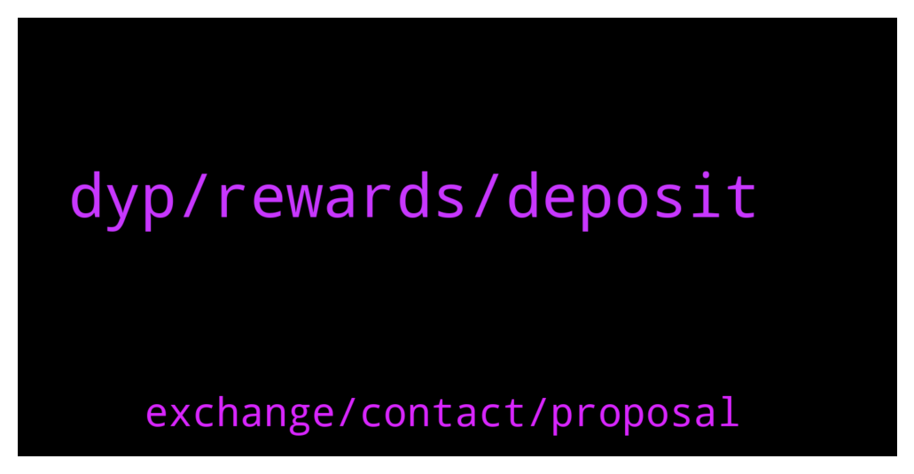

# **@dypfinance**
 ## Analysis for **2021-12-22** - **2021-12-23**.

---

## 📊 **Basic Stats**

**n_messages_sent**: 255

---

---

## 🔝 **Top keywords and related messages**

1. **dyp, rewards, deposit**

    @Eugej --- *Truthfully DYP team..this new contract is CRAP. Just in less than a month, my 5k is now less than half. To interact with the new contract is expensive. The rewards don't commensurate with my loss and my dyp reward keeps reducing. If you like delete me as Fud which it isn't...this is just my feedback from using your new contract that I hopefully waited for cos I enjoyed the old contract so much... I thot my Xmas would be fun with fyp but right now I'm in tears...* **--->** [TG Discussion](https://t.me/dypfinance/232590)

    @DhoniMSD516 --- *Hey the withdraw button is on dApp page here https://app-avax.dyp.finance/staking-avax-3* **--->** [TG Discussion](https://t.me/dypfinance/232850)

    @hemanrock --- *FARMS work this way. please check this  Consider a scenario wherein you deposit BUSD $1000, the smart contract will split the BUSD $1000 in two parts: BUSD $750 is added to PancakeSwap V2 BNB/iDYP LP and BUSD $250 is sent to DYP Staking with 50% APR.   you can read more about it from here https://dypfinance.medium.com/?p=6be89f573f19* **--->** [TG Discussion](https://t.me/dypfinance/232564)

    @Life_is_love_La_la_la_la_la --- *Hello again Dhoni.  With regard to my previously mentioned imagining of the auto-compounding of DYP rewards, I now see that this was a feature of the V1 Staking contract in which I invested. The following still stands in the V1 preamble:-  "DYP Staking Deposit your DYP tokens to earn DYP rewards. To start earning DYP rewards, you must deposit your DYP tokens into the corresponding list of pools. The pool will have four different staking options, with rewards starting from 20% APR up to 35% APR, depending on the lock time from a minimum of thirty days up to 120 days. The staking pools have the REINVEST function integrated, it means you are able to automatically add your daily rewards to the staking pool."  May I ask why this feature was discontinued in V2? This would seem to drive investors through the doors of platforms such as Beefy and Yield Yak which DO employ strategies to maximise rewards by multiple daily reinvestment (autocompounding if you like)?  Further, could you point me to where DeFi sets out in the investor stats the date on which the initial deposit was made and the end of the lock-in period? I cannot see it anywhere whiteout having to scour Snowtrace/BSCscan etc.   Finally, would you kindly make it clear without my needing to take an evening course in Proof of Stake/Authority/Delegated Authority/Pudding, what are the penalties for withdrawing one's investment before the end of the lock period.   I am much obliged for your indulgence.   Sandy  P. S. I hope this is adequately parsed for everyone to comprehend.* **--->** [TG Discussion](https://t.me/dypfinance/232524)

    @florin22xxl --- *thank you! Last question, under contract expiration it says 1 year, can i stop staking after 90 days? Or i can only stop after 1 year* **--->** [TG Discussion](https://t.me/dypfinance/232444)

    @Manuel --- *I think most understand how IL work and also that it will be settled if you stay long enough in the pool. The dissapointment is that everyone that got in early bought Idyp on its spike. The feeling is that this spike was at least partly because there was just a very small portion of Idyp in circulation when the first pools where opened and this could have been foreseen by the team. And yes, also by the early ones who got in if they did a very close reading of all information available. Nevertheless, this is leaving a bad taste in the mouths of people who got in early because it feels that everyone that jumped in trustfully was stupid to do so. Please understand these feelings and do not ignore them. And for all others, take your loss, wait for your rewards, we are in it for the long run anyways.* **--->** [TG Discussion](https://t.me/dypfinance/232807)

2. **exchange, contact, proposal**

    @Manuel --- *Thanks Tim, and I am happy with All the work you and the team is doing. Keep moving mountains* **--->** [TG Discussion](https://t.me/dypfinance/232812)

    @R --- *Let us know about it for sure.* **--->** [TG Discussion](https://t.me/dypfinance/232486)

    @Life_is_love_La_la_la_la_la --- *If you need any more of my input: I designed the pensions administration systems and front ends for the British Telecom Pension Scheme, among many others. £50bn enterprises* **--->** [TG Discussion](https://t.me/dypfinance/232547)

    @error_500 --- *Hi, what were all those proposals that were expired in the BSC Governance, they are all blanks without any details* **--->** [TG Discussion](https://t.me/dypfinance/232460)

    @hemanrock --- *Please report and block. Admins never DM First or ask for Private Key* **--->** [TG Discussion](https://t.me/dypfinance/232557)

    @Tony_GH11 --- *Hi There,  Would you mind referring me the marketing contact or team email regarding this project?  Want to forward our documentation about advertising and marketing for the project (not like shilling and twitter promotions with "influencers" and little AMA's). We offer actual advertising and real world marketing on our platform, where we have 1/3 million active users per month and guarantee much higher ROI and click-rates than Poocoin. We have open advertising spots (and more) and can connect you with our audience full of investors (whales too) to help you reach the moon.* **--->** [TG Discussion](https://t.me/dypfinance/232766)

