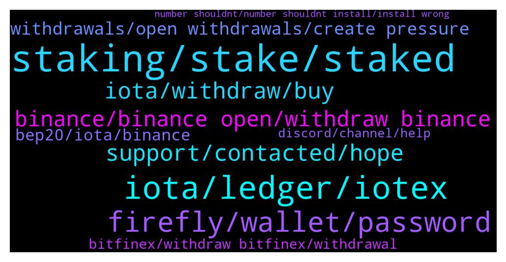

# **@iotatangle**
 ## Analysis for **2021-12-22** - **2021-12-23**.

---

## 📊 **Basic Stats**

**n_messages_sent**: 405

---

---

## 🔝 **Top keywords and related messages**

1. **staking, stake, staked**

    @Basti --- *Thing with iota staking is... It's no real staking.. So there will be a flood of unstaked tokens once the 90 days are over :D* **--->** [TG Discussion](https://t.me/iotatangle/301725)

    @sobroggi --- *I think early participants is actually the VCs etc. participating in ecosystem funding, but not participants of staking... https://blog.assembly.sc/assembly-fair-launch-token-distribution/* **--->** [TG Discussion](https://t.me/iotatangle/301735)

    @Ziya --- *Why 0 days until staking? 6 days:)* **--->** [TG Discussion](https://t.me/iotatangle/300833)

    @Fold11 --- *Thought so. Getting just dif info that u should put separate amounnts on two wallrts fot staking idk* **--->** [TG Discussion](https://t.me/iotatangle/301300)

    @ash1taka1997 --- *Yes. In fact your IOTAs will never leave your wallet, staking is a transaction to your own wallet that has a "staked" mark on it.* **--->** [TG Discussion](https://t.me/iotatangle/300849)

    @Tahmis --- *Well this was actually anticipated that something like this would happen when the actual staking starting is announced as everyone wants to withdraw at the same time* **--->** [TG Discussion](https://t.me/iotatangle/301465)

2. **iota, ledger, iotex**

    @Arjan --- *I do have the same issue for days now! Anybody? Is there an exchange that does support the iota network??* **--->** [TG Discussion](https://t.me/iotatangle/300879)

    @Hekki --- *Yea of course because I have iota and I like it, tell me in which devices Iota is already used , I’m very interested you sound like you know* **--->** [TG Discussion](https://t.me/iotatangle/300792)

    @tomcce81 --- *Close other apps, if you connected to ledger live.. close it* **--->** [TG Discussion](https://t.me/iotatangle/300972)

    @Amit --- *What about iota we stored in trinty wallet Is it still accessible* **--->** [TG Discussion](https://t.me/iotatangle/301421)

    @Tahmis --- *Hotbit doesn't support iota if I'm not wrong* **--->** [TG Discussion](https://t.me/iotatangle/301065)

    @rob0008 --- *I’ve had success from Hotbit in the past . Reliable and always worked great but havnt looked to see what’s up with iota .  I havnt sold my other stuff yet .  It’s not a popular exchange in the west but has done me very well over last 2years .  Great % Apr on every coin too …  Fast reliable help desk aswell …* **--->** [TG Discussion](https://t.me/iotatangle/301040)

3. **firefly, wallet, password**

    @Raw --- *Hello, maybe someone can help me, with the Firefly SHA256 check I get a different number than with the Firefly Release Notes, it starts with 1d and not with 4c.  Does anyone have any idea why that could be?  Or does anyone know a good Iota Telegram group?* **--->** [TG Discussion](https://t.me/iotatangle/300984)

    @allavenand --- *Hello everybody, what am I missing, I moved my iota tokens to Bitfinex and now I would like to transfer them to the new firefly account I created, however when I try to send my iota tokens the address I get is a Mi and it’s says that it is an invalid address. I guess I am missing something… thank you very much for your help* **--->** [TG Discussion](https://t.me/iotatangle/301020)

    @Basti --- *Open Firefly, go to Settings > Network configuration > Node selection > Manual, add "https://mainnet-node.tanglebay.com/"* **--->** [TG Discussion](https://t.me/iotatangle/300784)

    @Tahmis --- *Are you using Firefly wallet? IF you are trying to send to an prechrysalis address then it won't work* **--->** [TG Discussion](https://t.me/iotatangle/301032)

    @allavenand --- *Yep I downloaded the firefly app, opened a new wallet and when I go to deposit iota   from Bitfinex it gives me an error saying that the address is not correct* **--->** [TG Discussion](https://t.me/iotatangle/301035)

    @Mur --- *Hi I want transfer my iota token from etoro to fire fly wallet. Somebody knows how it works* **--->** [TG Discussion](https://t.me/iotatangle/301760)

4. **support, contacted, hope**

    @sy-subrc --- *And you guess contacting them will help make it work again faster? Sure thing 😂* **--->** [TG Discussion](https://t.me/iotatangle/301333)

    @Tahmis --- *I recommend to wait and ask their support* **--->** [TG Discussion](https://t.me/iotatangle/301550)

    @SunnySide~ --- *yeah not in a hurry, but every day that passes by gets me anxious :/* **--->** [TG Discussion](https://t.me/iotatangle/301459)

    @Snelting11 --- *Looks like it then, wonder what the problem is. Hope my test order goes through well soon, then I can transfer the rest* **--->** [TG Discussion](https://t.me/iotatangle/301359)

    @ngayngo9x --- *check internet, retry and waiting bro!* **--->** [TG Discussion](https://t.me/iotatangle/300819)

    @ekfkd --- *Does someone can help me with that problem? Can’t push the button, after 30 seconds it just cuts off.* **--->** [TG Discussion](https://t.me/iotatangle/300818)

5. **iota, withdraw, buy**

    @tonny_nguyen --- *Stop IOTA, I Can't Withdraw with all Exchange bitfinex is the last place to withdraw, but when entering the wallet address, the exchange does not accept it* **--->** [TG Discussion](https://t.me/iotatangle/301741)

    @Aleksandr --- *I need withrow my IOTA , but ALL transactions closed , on all cryptomarkets , why? Binance , bitfinex, huoby, hitbtc, all NOT working IOTA withrow* **--->** [TG Discussion](https://t.me/iotatangle/300985)

    @razali1984 --- *I thought Huobi have suspended IOTA withdrawals for months already.. not just recently?* **--->** [TG Discussion](https://t.me/iotatangle/301502)

    @millenium_earl2000 --- *Which exchange can u still withdraw iota* **--->** [TG Discussion](https://t.me/iotatangle/301772)

    @cryptoadvisoryaus --- *Does anyone know an Exchange which is currently allowing withdrawal of IOTA using IOTA blockchain as Binance is currently suspended 🤦‍♂️* **--->** [TG Discussion](https://t.me/iotatangle/301026)

    @tonny_nguyen --- *I try on bittrex, Houbi ... All not suport Withdraw IOTA* **--->** [TG Discussion](https://t.me/iotatangle/301596)

6. **binance, binance open, withdraw binance**

    @ngayngo9x --- *Some days ago, I can withdraw from Binance.* **--->** [TG Discussion](https://t.me/iotatangle/300829)

    @Fold11 --- *There is not many days left to wait for binance* **--->** [TG Discussion](https://t.me/iotatangle/301253)

    @Fold11 --- *So tomorrow we can withdraw from binance? Nice* **--->** [TG Discussion](https://t.me/iotatangle/301769)

    @tuanindo --- *Binance withdraw are avaible now guys ?* **--->** [TG Discussion](https://t.me/iotatangle/301195)

    @TickTockTye --- *Binance will be up soon, they will just be moving more iota from cold storage* **--->** [TG Discussion](https://t.me/iotatangle/300883)

    @Tahmis --- *I recommend waiting for Binance to open withdrawals. Huobi doesn't work either* **--->** [TG Discussion](https://t.me/iotatangle/301252)

7. **withdrawals, open withdrawals, create pressure**

    @Tahmis --- *Everyone is withdrawing I guess and it causes problems unfortunately* **--->** [TG Discussion](https://t.me/iotatangle/301076)

    @cryptoadvisoryaus --- *I had a friend in Australia try CoinSpot today and he said that’s also now suspended for withdrawal?* **--->** [TG Discussion](https://t.me/iotatangle/301072)

    @Tahmis --- *etoro is not allowing withdrawals unfortunately. You should ask their support if they are going to* **--->** [TG Discussion](https://t.me/iotatangle/301766)

    @sy-subrc --- *Check if they allow withdrawals first* **--->** [TG Discussion](https://t.me/iotatangle/301243)

    @sy-subrc --- *Wouldn’t be aware, that they restricted withdrawals* **--->** [TG Discussion](https://t.me/iotatangle/301133)

    @Tahmis --- *Please all contact you exchanges support to create some pressure for them to open the withdrawals! Also it might help to create some pressure on social media ;)* **--->** [TG Discussion](https://t.me/iotatangle/301031)

8. **bep20, iota, binance**

    @sy-subrc --- *BEP20 IOTA are not "real" IOTA, but wrapped tokens on the Binance Smart Chain. You simply cannot stake them. Period. You have to swap them first.* **--->** [TG Discussion](https://t.me/iotatangle/301283)

    @navinhn --- *Yes , that s 1 option, but if IOTA need thr token holders to participate then they also should support right , now major exchange like binance , huobi, Bittrex are not allowing them what the use, so what firefly can do from thr end is then can support BEP20 chain , if they don’t support others then how others will support thr token , in future if they want to transfer Bak to exchange to sell then again it’s going to create a problem,* **--->** [TG Discussion](https://t.me/iotatangle/301591)

    @navinhn --- *No , I m not choosing BEP20 in first place , but Binance has only BEP20 to transfer out of binance, and they suspended Real IOTA , if they don’t support then most of IOTA will b stuck on exchange* **--->** [TG Discussion](https://t.me/iotatangle/301536)

    @sy-subrc --- *Just because you chose BEP20 in the first place, instead of „real IOTA“ is not a valid reason.* **--->** [TG Discussion](https://t.me/iotatangle/301490)

    @navinhn --- *If firefly support accepting BEP20 then it’s not a problem, because binance has opened withdrawal for IOTA in BEP20 , if IOTA want thr users to stake then they should enable this , else all binance IOTA coins will b stuck thr only* **--->** [TG Discussion](https://t.me/iotatangle/301470)

    @navinhn --- *Nope, when you have two doors to enter house , and one door is suspended and another door is locked from inside , so we are asking them to open it from inside so that we can enter with another door,  so here two doors are IOTA and BEP20 network, hope if you are technically understand the concept then u will understand,* **--->** [TG Discussion](https://t.me/iotatangle/301618)

9. **bitfinex, withdraw bitfinex, withdrawal**

    @Snelting11 --- *My Bitfinex withdrawal now 13 hour pending since this morning* **--->** [TG Discussion](https://t.me/iotatangle/301329)

    @sy-subrc --- *So it's more a specific problem to your account and not a general Bitfinexx issue* **--->** [TG Discussion](https://t.me/iotatangle/301357)

    @Lord_Hermes6 --- *i withdraw from bitfinex its work fine .* **--->** [TG Discussion](https://t.me/iotatangle/301600)

    @Makimako --- *Nop you can withdraw in Bitfinex* **--->** [TG Discussion](https://t.me/iotatangle/301474)

    @sy-subrc --- *Bitfinex definitely works. Tried it 5 minutes ago, withdrawal received just now* **--->** [TG Discussion](https://t.me/iotatangle/301341)

    @khthon --- *The thing about Bitfinex, I believe, is that you cannot check anything about a withdrawal without having the respective token. That is, you cannot check networks, or fees, or if it is enabled or suspended...* **--->** [TG Discussion](https://t.me/iotatangle/301135)

10. **discord, channel, help**

    @Tahmis --- *Note that I'm just a community member. This is community driven channel. Official is in Discord ;)* **--->** [TG Discussion](https://t.me/iotatangle/301625)

    @Tahmis --- *Please go to discord. As there is a separate help channel its easier to find help* **--->** [TG Discussion](https://t.me/iotatangle/301373)

    @Tahmis --- *Please go to discord as there is a separate help channel* **--->** [TG Discussion](https://t.me/iotatangle/301100)

    @Tahmis --- *But please ask in discord about that* **--->** [TG Discussion](https://t.me/iotatangle/300991)

    @Tahmis --- *Hello, please join the offcial discord. Developers and main community is there so easier to find help* **--->** [TG Discussion](https://t.me/iotatangle/300986)

    @Tahmis --- *Hi! I recommend you ask in the official discord as developers can be found there* **--->** [TG Discussion](https://t.me/iotatangle/301323)

