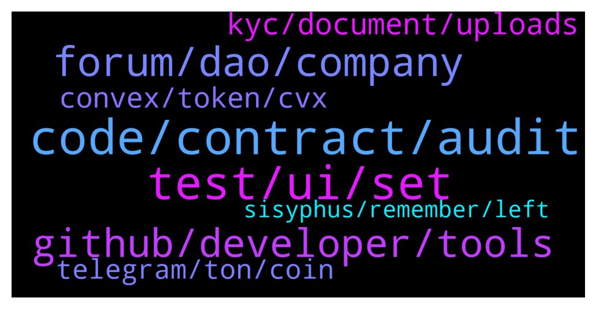

# **@lobsters_chat**
 ## Analysis for **2021-12-22** - **2021-12-23**.

---

## 📊 **Basic Stats**

**n_messages_sent**: 333

---

---

## 🔝 **Top keywords and related messages**

1. **code, contract, audit**

    @storm0x --- *Not to sound harsh, but if the only way you catch this one is thru an audit, you got bigger problems to work out on your team 😪* **--->** [TG Discussion](https://t.me/lobsters_chat/309648)

    @river0x --- *Fwiw this predated my time as an employee by a short while but yes , it makes sense to double check* **--->** [TG Discussion](https://t.me/lobsters_chat/310063)

    @storm0x --- *agreed, odds are an audit would catch this one, but also think some good testing would have also done the job and peer reviews before even getting to an audit, feels like a failure in process overall. Shouldnt fall in the devs only, deploying the contract is a team decision and output of "some" process.* **--->** [TG Discussion](https://t.me/lobsters_chat/309658)

    @nvy0x --- *You can't tell me that an audit wouldn't have mitigated the possibilities of such an error slipping through lol* **--->** [TG Discussion](https://t.me/lobsters_chat/309654)

    @nvy0x --- *So it turns out that none of the Visor audits actually covered the staking contract that was hacked (or any staking contract at all). I guess this would explain how such a weakness in the code came to pass; the code was effectively unaudited.* **--->** [TG Discussion](https://t.me/lobsters_chat/309647)

    @syed_jafri --- *https://tally.cash/ by Thesis (Matt Luongo)  Not audited yet afaict though, DYOR* **--->** [TG Discussion](https://t.me/lobsters_chat/309710)

2. **test, ui, set**

    @jongweiss --- *pleb me couldn't see it before. it's clear as day though now.* **--->** [TG Discussion](https://t.me/lobsters_chat/309666)

    @Cryptoaq --- *Hi guys I have a white screen on metamask* **--->** [TG Discussion](https://t.me/lobsters_chat/310016)

    @ivangbi --- *Had this 3 weeks ago, just did it again after that. Weird UI glitch I guess [?]* **--->** [TG Discussion](https://t.me/lobsters_chat/309857)

    @michael_p3711 --- *Thanks, this is the best update ive had since it happened* **--->** [TG Discussion](https://t.me/lobsters_chat/309899)

    @Cryptoaq --- *The only thing to solve is restore with seed?* **--->** [TG Discussion](https://t.me/lobsters_chat/310017)

    @admnrqst --- *Hi, which CMS are you using?* **--->** [TG Discussion](https://t.me/lobsters_chat/309690)

3. **forum, dao, company**

    @RSVSinatra --- *Hello everyone,  The project I am part will set up DAO forums really soon. However, in the spirit of decentralization, we'd prefer not using Discourse as it would rely on the founding company to continue paying the membership/hosting fees. Ideally, we'd make use of a forum with the same capabilities but which is either free to use or one-time fixed fee.  Does anyone here have an idea of such a forum?   Thanks in advance!* **--->** [TG Discussion](https://t.me/lobsters_chat/309689)

    @blockminded --- *someone's name, somewhere, individual or company, will need to be responsible for domain registration, hosting, infrastructure etc* **--->** [TG Discussion](https://t.me/lobsters_chat/309694)

    @RSVSinatra --- *The way our protocol works, separate DAOs will manage entirely separate parts built on top of the protocol - so it wouldn't hurt the DAOs if our company's website would go down or anything similar, as long as their DAO forum is live, they'll be able to run their part.   I was thinking of Reddit as an example. Anyone can create a new subreddit. Sure, you do rely on a central entity (the company behind Reddit), but at least it is not relying on the founding company of the protocol. Too bad subreddits are not ideal for DAO forums.  Thanks a lot for linking that forum, I'll take a look. If anyone here has any other suggestions, please do share.* **--->** [TG Discussion](https://t.me/lobsters_chat/309697)

    @blockminded --- *You have an impossible problem unless you register the DAO as a business entity somewhere* **--->** [TG Discussion](https://t.me/lobsters_chat/309693)

    @RSVSinatra --- *Wait.. But we'd still be paying the hosting for our website - which would have the same effect (the DAO relying on us to keep the forum alive).* **--->** [TG Discussion](https://t.me/lobsters_chat/309692)

    @RSVSinatra --- *I don't actually know, but I can ask our website team. Are you suggesting building a forum on the website itself?* **--->** [TG Discussion](https://t.me/lobsters_chat/309691)

4. **github, developer, tools**

    @syed_jafri --- *Not so simple, MIM<>UST have big collab for example* **--->** [TG Discussion](https://t.me/lobsters_chat/309803)

    @jefftt --- *anyone know where i can find a list of DAO tooling? e.g. coordinape* **--->** [TG Discussion](https://t.me/lobsters_chat/309685)

    @blockminded --- *Take a look at Flarum though, it looks very nice and is open source: https://flarum.org/* **--->** [TG Discussion](https://t.me/lobsters_chat/309696)

    @Rssic --- *Hi guys, SynFutures is hosting a live talk with the investors. Feel free to join if you like: https://www.youtube.com/watch?v=bJMOIljzC5Y* **--->** [TG Discussion](https://t.me/lobsters_chat/309712)

    @tiredgom --- *Hi, fellas. What is the best youtube guys who building on Solana daaps? I am noob rust developer 😀* **--->** [TG Discussion](https://t.me/lobsters_chat/310088)

    @farm42 --- *dapp.tools, cointool.app, github.com/gauss314/defi, github.com/gweicz/defi-toolkit and twitter.com/0xshual pinned thread. I also collected tools here: github.com/OffcierCia/DeFi-Developer-Road-Map* **--->** [TG Discussion](https://t.me/lobsters_chat/309686)

5. **kyc, document, uploads**

    @zhongfu --- *i'm seeing a lot of services using jumio and other id-verification-as-a-service providers these days* **--->** [TG Discussion](https://t.me/lobsters_chat/310158)

    @svenblockchain --- *Phones combine biometrics and all sorts of sensory checks to verify there's a real person taking an image of a real document.* **--->** [TG Discussion](https://t.me/lobsters_chat/310161)

    @SpikeSpiege1 --- *Imagine doing kyc for exchanges in nearly 2022. There's been some things that I've wanted to buy via exchange sales but I refuse to give my data to another exchange when they have sieve level opsec.* **--->** [TG Discussion](https://t.me/lobsters_chat/310167)

    @sixty10 --- *it makes sense that they would outsource this but i wonder why these services can't offer the trad KYC process* **--->** [TG Discussion](https://t.me/lobsters_chat/310166)

    @zhongfu --- *if you're worried about that, then don't go through the kyc flow and/or submit your wallet address* **--->** [TG Discussion](https://t.me/lobsters_chat/310164)

    @zhongfu --- *well, they can promise not to, but they'll still have your kyc and your wallet address* **--->** [TG Discussion](https://t.me/lobsters_chat/310163)

6. **convex, token, cvx**

    @safetythirst --- *Convex expanding their reach beyond curve to cvxFXS - big, no? https://twitter.com/ConvexFinance/status/1473320765919477766  Is this the dawn of cvxYFI and the likes, too?* **--->** [TG Discussion](https://t.me/lobsters_chat/309656)

    @samkazemian --- *The other way to think of Convex is the "Lido of ____." The same way all PoS derivative staking protocols want to peg their stETH tokens to ETH 1 to 1 so they can rehypothecate the L1 assets and capture that cash flow, Convex wants to do the same thing to the best veToken protocols. Their cvxTokens are basically their version of stETH. If Convex is successful in making their derivative of veCRV & veFXS the de facto 1 to 1 tokenized version of that, it will basically be the "Lido of ___" of these onchain protocols. It has basically done that successfully so far with veCRV. Soon it will try that with veFXS.* **--->** [TG Discussion](https://t.me/lobsters_chat/309668)

    @samkazemian --- *I don't think this was ever the case. Convex has grand amibitions to be the "Convex of ____" many protocols the same way it is for Curve. Obviously Curve made the most sense to start with as it is the biggest and most important infra for yields/farming in the space.* **--->** [TG Discussion](https://t.me/lobsters_chat/309665)

    @jongweiss --- *convex's token is so tightly tied with curve that I thought that its TAM was limited to Curve* **--->** [TG Discussion](https://t.me/lobsters_chat/309661)

    @jongweiss --- *+1 agreed with the most part, if I had to nitpick I think the peg mechanism is a bit weak but I like how Convex just makes cvxTOKEN/TOKEN LPs a big big stakeholder in the ecosystem so cvxTOKEN holders will always be relevant. Looking forward to see how the FXS integrations plays out. veYFI veDPX soon after hopefully* **--->** [TG Discussion](https://t.me/lobsters_chat/309674)

    @samkazemian --- *Ya it does. It has a big governance shift. Convex will become a sort of "index fund" of the most useful/valuable governance tokens in DeFi. At least they will pass through that governance power to CVX which is why CVX is being hoarded so much right now by a lot of projects, including us.* **--->** [TG Discussion](https://t.me/lobsters_chat/309675)

7. **telegram, ton, coin**

    @ivangbi --- *Why is Durov writing like he is shilling a scam coin ido. Wtf is this* **--->** [TG Discussion](https://t.me/lobsters_chat/310110)

    @gonzogirl --- *Because he wants to rule this world. Obviously supporting the coin which is kinda independent, but, obviously, his is the best he can do to attract users thus gain some value* **--->** [TG Discussion](https://t.me/lobsters_chat/310114)

    @ivangbi --- *Blz explain the significance of this? I don’t get it* **--->** [TG Discussion](https://t.me/lobsters_chat/309657)

    @akashking0 --- *jack hates everything except btc ? why he aped in celo* **--->** [TG Discussion](https://t.me/lobsters_chat/310026)

    @ivangbi --- *When Telegram said goodbye to TON last year, I expressed the hope that future generations of developers would one day carry on with our vision of a mass-market blockchain platform.  So I was inspired to see the champions of Telegram's coding contests continue developing the open TON project, which they rebranded to Toncoin.  I'm proud that the technology we created is alive and evolving. When it comes to scalability and speed, TON is still years ahead of everything else in the blockchain realm. It would have been a shame to see this project not benefitting humanity.  Unlike the original TON, Toncoin is independent from Telegram. But I wish its team the same success. Coupled with the right go-to-market strategy, they have all they need to build something epic 💪* **--->** [TG Discussion](https://t.me/lobsters_chat/310109)

    @gonzogirl --- *Well, yeah. Nothing against Durov, but he's too clever for dumb shilling. He knows what he does. Telegram token was sued by USA feds. No worries, let "someone" make "independent" coin.* **--->** [TG Discussion](https://t.me/lobsters_chat/310116)

