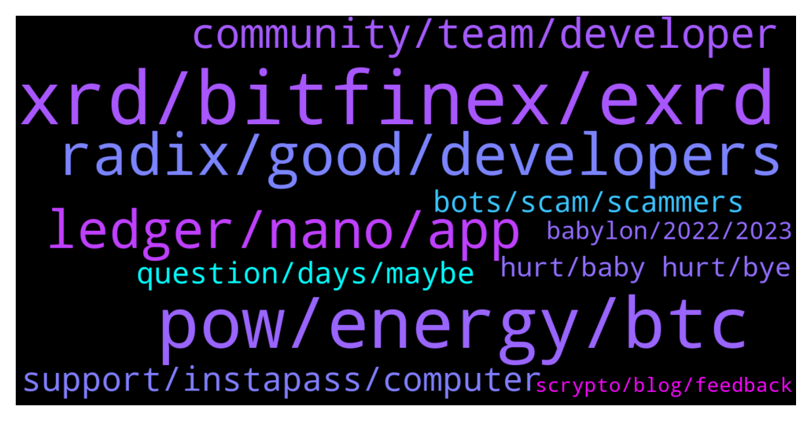

# **@radix_dlt**
 ## Analysis for **2021-12-22** - **2021-12-23**.

---

## 📊 **Basic Stats**

**n_messages_sent**: 473

---

---

## 🔝 **Top keywords and related messages**

1. **xrd, bitfinex, exrd**

    @Null_v0id --- *Wow Okolie shouting out XRD, you love to see it 😁 https://twitter.com/lawrence_tko/status/1473810387049005065?s=21* **--->** [TG Discussion](https://t.me/radix_dlt/326175)

    @WinsonGoh --- *Bcos of Bitfinex, I have not bought XRD. KYC took them donkey weeks.😏 still pending. Give up and shld wait for Kucoin.* **--->** [TG Discussion](https://t.me/radix_dlt/325562)

    @Paul --- *Hello out there, may I get some advice from the super technically minded members in here please. Perhaps Florian.  I bought EXRD through a friend back in June. He held my stake along with his own in his Metamask wallet which was hacked two days ago, all coins withdrawn.   Can anyone suggest a person or organisation to contact to try and help with the retrieval of the missing coins. Obviously a dialogue with Metamask has been opened.* **--->** [TG Discussion](https://t.me/radix_dlt/326152)

    @aifretis --- *Hello all, Can I swap my EXRD to XRD on bitfinex? I will have 1-1 right? Even if it's not the same price on market?* **--->** [TG Discussion](https://t.me/radix_dlt/326063)

    @jonericcook --- *Does that this service able to gather all my stake history from when I started staking or does it just start once I link my wallet?* **--->** [TG Discussion](https://t.me/radix_dlt/326066)

    @nzjoec --- *can I stake with eXRD? is mainnet live yet?* **--->** [TG Discussion](https://t.me/radix_dlt/326168)

2. **pow, energy, btc**

    @Magal36 --- *But in Bitcvoin it's a competition for computational power, in CPoW it isn't* **--->** [TG Discussion](https://t.me/radix_dlt/325862)

    @S --- *Right, because you can't do something like rush a longer chain?* **--->** [TG Discussion](https://t.me/radix_dlt/325905)

    @aus87 --- *"mining" solves a problem.  You get rewarded for mining bitcoin.  In our model it is used in conjuction with POS for our consensus only if im not mistaken* **--->** [TG Discussion](https://t.me/radix_dlt/325892)

    @S --- *Yeah, but this is the logic of a ponzi scheme. Value must go up forever to compensate the halving* **--->** [TG Discussion](https://t.me/radix_dlt/325913)

    @S --- *Perfect comp. is only a problem if you have a reward that goes up in value over time* **--->** [TG Discussion](https://t.me/radix_dlt/325896)

    @S --- *because the more value there is in BTC, the more work you want to be done. Safer that way* **--->** [TG Discussion](https://t.me/radix_dlt/325899)

3. **radix, good, developers**

    @Blind5ight --- *That path is not as likely for Radix (or so I would like to believe), given the strategy taken so far by the team  The focus is on the community (and tech) and that community is now looking to expand by reaching out to developers This community will grow and hopefully become more and more passionate about the project Leading up to Babylon, we hopefully have a larger enthusiastic community  The entrepreneurs and VCs will then take notice of Radix if there is much industry in our little bee hive :)* **--->** [TG Discussion](https://t.me/radix_dlt/325715)

    @Jazzer9F --- *Excellent article from Coin Telegraph highlighting the current issues faced by Solidity developers, and detailing how Radix will give developers the power to build quickly, securely, and know that scale will never be a bottleneck!  https://cointelegraph.com/news/watch-out-solidity-new-project-aims-to-tackle-downsides-of-coding-defi-projects* **--->** [TG Discussion](https://t.me/radix_dlt/326079)

    @Kafkafrate --- *I worry more about the industry as a whole rather than radix. It looks like a take over by the old guard.* **--->** [TG Discussion](https://t.me/radix_dlt/325717)

    @bonafideplug --- *https://youtu.be/YGSzt8d2Pvw  This is my video. A beginner’s perspective on this amazing sleeping giant : Radix!   My favorite crypto. The standard for a good crypto to me is comparing it to Radix and see if it even hits one spot  I’ll talk more about it as this is sort of my journey / learning curve -> subscribe if you think I’m worthy of speaking about Radix lol* **--->** [TG Discussion](https://t.me/radix_dlt/325398)

    @Snowman --- *Nice! I think that will really help adoption. Especially if Radix is mentioned in the firmware update when it becomes available.* **--->** [TG Discussion](https://t.me/radix_dlt/325986)

    @BrandamBrandom --- *Can i stak my radix on a trezor one?* **--->** [TG Discussion](https://t.me/radix_dlt/325639)

4. **ledger, nano, app**

    @danich51 --- *Did anybody install a new firmware for their ledger? It seems like radix app (and all other apps) was wiped off and have to be reinstalled, do I just reintall the app with sideloading as I did the first time or the process is different? I don't wanna accidentally wipe out my key file.* **--->** [TG Discussion](https://t.me/radix_dlt/325809)

    @Snowman --- *I'm having issues sideloading the radix app onto my ledger nano s. I made a comment in the radix discord group in the support section. If someone from radix could help that would be great.* **--->** [TG Discussion](https://t.me/radix_dlt/325534)

    @Snowman --- *Wen Radix download available on Ledger Live without the need of sideload?* **--->** [TG Discussion](https://t.me/radix_dlt/325984)

    @danasocial --- *Can someone help me for the sideloading of the app on ledger?* **--->** [TG Discussion](https://t.me/radix_dlt/325959)

    @even_Phteven --- *nano s only holds like 4 or 5 apps* **--->** [TG Discussion](https://t.me/radix_dlt/325606)

    @danasocial --- *Yes, i did go in the radix app directory, where there are bin and debug directory, i send the PIN on ledger nano s and After send the last command, i allow the unsafe app on the nano s, and here take the error invalid status 5103* **--->** [TG Discussion](https://t.me/radix_dlt/325976)

5. **community, team, developer**

    @Blind5ight --- *Here you can learn how the team thinks about attracting developers: https://www.youtube.com/watch?v=PKFmdWqRfy0* **--->** [TG Discussion](https://t.me/radix_dlt/326041)

    @Blind5ight --- *You can also monitor the different developer communities: https://developers.radixdlt.com/#join-community* **--->** [TG Discussion](https://t.me/radix_dlt/326037)

    @Sha256 --- *I’m not a developer, I just want to see how many developers are actually using this.* **--->** [TG Discussion](https://t.me/radix_dlt/326034)

    @Blind5ight --- *There is no centralized push for tools The community decides what to use, the community decides what tools are created* **--->** [TG Discussion](https://t.me/radix_dlt/326043)

    @Mik3ology --- *I disagree, we here to build community. She is in the right place.* **--->** [TG Discussion](https://t.me/radix_dlt/325648)

    @Blind5ight --- *The team talks about upcoming initiatives geared towards devs in the latest roundtable session* **--->** [TG Discussion](https://t.me/radix_dlt/326025)

6. **support, instapass, computer**

    @John --- *Has anybody had real challenges with the InstaPass KYC?  Does not recognize my facial image.  I have good camera on a late model phone.  Tried multiple times, no success.  My identity card picture is very clear.  I emailed their support, but don't know how long that will take, or if it will even be helpful.  Am I the only one facing this?* **--->** [TG Discussion](https://t.me/radix_dlt/325557)

    @Snowman --- *I'm not 100% sure. I just tried using a different account on my computer.* **--->** [TG Discussion](https://t.me/radix_dlt/325948)

    @Snowman --- *I hope you can figure it out. If you have another computer or a Mac you could try sideloading on those too and you could potentially bypass the problem that way.* **--->** [TG Discussion](https://t.me/radix_dlt/325982)

    @John --- *well, i've reached some maximum number of attempts right now, will wait to hear from support, or try again tomorrow.  thx.* **--->** [TG Discussion](https://t.me/radix_dlt/325570)

    @coolcukecumber --- *I did too before and had to email support. Keep at it and you'll get verified!* **--->** [TG Discussion](https://t.me/radix_dlt/325575)

    @ABC4632 --- *Can someone explain to me why I can select at Instapass landline Phone Bill but it is not accepted by support?* **--->** [TG Discussion](https://t.me/radix_dlt/326202)

7. **question, days, maybe**

    @Magal36 --- *Yes, you might have a point* **--->** [TG Discussion](https://t.me/radix_dlt/325492)

    @Magal36 --- *👆🏻 that might be the reason* **--->** [TG Discussion](https://t.me/radix_dlt/325966)

    @NotBen --- *I was mostly just being sassy* **--->** [TG Discussion](https://t.me/radix_dlt/325656)

    @MassieFur --- *Maybe this gives some insight https://caviarnine.com/statistics* **--->** [TG Discussion](https://t.me/radix_dlt/325771)

    @L --- *just choose a validator of your choice then?* **--->** [TG Discussion](https://t.me/radix_dlt/325429)

    @dbrigon --- *A bit fiddly, but it's OK.* **--->** [TG Discussion](https://t.me/radix_dlt/325584)

8. **bots, scam, scammers**

    @PeachyKeehn --- *Most anti-scam/spam applications try to boot someone that joins and posts within 24hrs of their entry into a channel.  Posting an innocuous "Hi" gets them through that barrier and they'll let the account dwell in the background for 24hrs before using it to post their spam-scam* **--->** [TG Discussion](https://t.me/radix_dlt/325728)

    @yr12345678 --- *Be careful of the scammers DMing you about this now* **--->** [TG Discussion](https://t.me/radix_dlt/326162)

    @Blind5ight --- *Nobody from the team or community mods will DM you  Scammers however will* **--->** [TG Discussion](https://t.me/radix_dlt/325420)

    @mx471 --- *I don't understand what they want to achieve with these bots* **--->** [TG Discussion](https://t.me/radix_dlt/325727)

    @vashqu --- *Care you are gonna get 100 dms from scammers* **--->** [TG Discussion](https://t.me/radix_dlt/325535)

    @muu_0O --- *Hello admin wo I must contact to show him a promoto offers* **--->** [TG Discussion](https://t.me/radix_dlt/325443)

9. **hurt, baby hurt, bye**

    @Luke --- *My dad died a few days ago so I'm not up to date.* **--->** [TG Discussion](https://t.me/radix_dlt/325789)

    @pietpatati --- *Ooo wauw .. you are really gonna use that….   Condolences for your lose outside of that* **--->** [TG Discussion](https://t.me/radix_dlt/325790)

    @lphaPrimalDawg --- *Cheers man..im all over this like a fat kid on cake..😁😁* **--->** [TG Discussion](https://t.me/radix_dlt/325841)

    @pietpatati --- *Loosing a parent always a big loss* **--->** [TG Discussion](https://t.me/radix_dlt/325794)

    @Ben_XRD --- *Very very sorry to hear this 😔.* **--->** [TG Discussion](https://t.me/radix_dlt/325793)

    @Thalrian --- *I see. welcome back. hope you're surprised in a good way.* **--->** [TG Discussion](https://t.me/radix_dlt/325680)

10. **babylon, 2022, 2023**

    @Roy --- *Regarding that roadmap, launch in 2022 for Babylon and 2023 for Xi'an is quite broad, especially for Babylon. Is there any estimate on when in 2022 and when in 2023?* **--->** [TG Discussion](https://t.me/radix_dlt/326137)

    @mx471 --- *It is a long time to Babylon. In the end we will maybe have 20 DEXes starting at the same time 😂* **--->** [TG Discussion](https://t.me/radix_dlt/325406)

    @JuelzCrypto --- *any plans for it to be?* **--->** [TG Discussion](https://t.me/radix_dlt/325598)

    @yr12345678 --- *Babylon is estimated for late 2022, but no date has been given* **--->** [TG Discussion](https://t.me/radix_dlt/326138)

    @newbs_tech --- *Someone needs to inform the BBC that Xi'an is to be released from lockdown in 2023...* **--->** [TG Discussion](https://t.me/radix_dlt/325827)

    @wojtekkalka --- *there will be three exchanges so far when babylon comes out* **--->** [TG Discussion](https://t.me/radix_dlt/325399)

