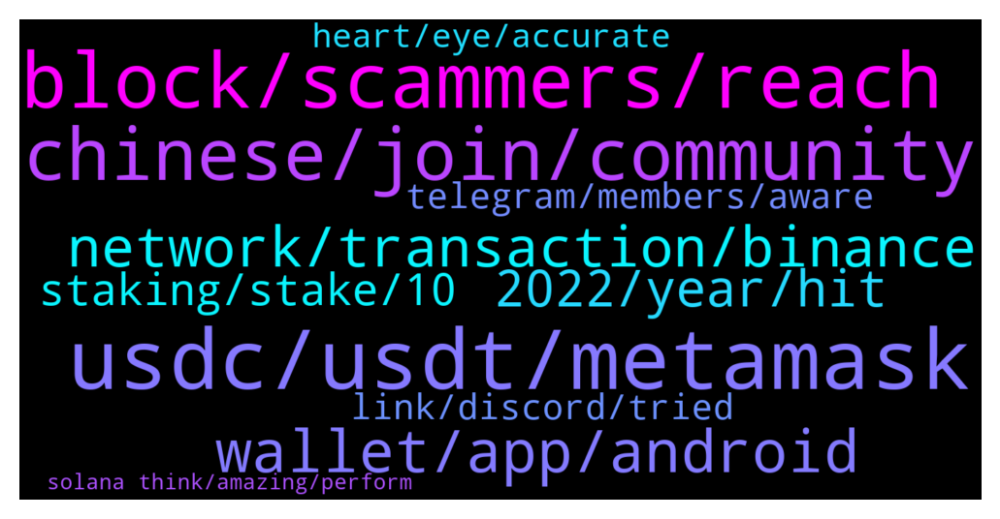

# **@solana**
 ## Analysis for **2021-12-22** - **2021-12-23**.

---

## 📊 **Basic Stats**

**n_messages_sent**: 425

---

---

## 🔝 **Top keywords and related messages**

1. **usdc, usdt, metamask**

    @thinks_deep4742 --- *But was looking if busd was cheaper* **--->** [TG Discussion](https://t.me/solana/876493)

    @swissclive --- *I thought of all that.   The point is that I have UST on the Solan Chain and I want to change to SOL on the Solana chain.  Coinmarket cap does not help.  I don't want to send my coinss to a CEX.* **--->** [TG Discussion](https://t.me/solana/875655)

    @Alfonso --- *Any way of buying SOL with only USDC in Phantom (Raydium?)* **--->** [TG Discussion](https://t.me/solana/875726)

    @🔥Fans $SCRT $LUNA $LARIX $SOL $FTM $ROSE --- *no no. u will buy usdc on binance and sent to metamask with bcs network. and then used allbridge/wormholebridge connect metamask and select destination network is  solana. after success u will receive usdc on solana network / your wallet phantom* **--->** [TG Discussion](https://t.me/solana/876425)

    @🔥Fans $SCRT $LUNA $LARIX $SOL $FTM $ROSE --- *yeah buy stable coin on binance and sent to metamask with bsc network and then used bridge from bsc to solana* **--->** [TG Discussion](https://t.me/solana/876433)

    @thinks_deep4742 --- *I used allbridge to get usdc from metamask to pahntom wrapped usdc* **--->** [TG Discussion](https://t.me/solana/876477)

2. **block, scammers, reach**

    @tonnypin --- *Alot of customers support dm me when I first join the group. Are they all legit?* **--->** [TG Discussion](https://t.me/solana/875542)

    @cryptolover1987 --- *No man! You can’t drop that message what you wrote here.* **--->** [TG Discussion](https://t.me/solana/876579)

    @kekyv2 --- *if u are admin why u messaging me directly like scammers* **--->** [TG Discussion](https://t.me/solana/877129)

    @Sciwalker --- *Btw so many scammers out there trying to contact me. Blocked them all...* **--->** [TG Discussion](https://t.me/solana/875910)

    @zoran --- *Francium and i have farm on tulip* **--->** [TG Discussion](https://t.me/solana/877233)

    @Folaross --- *Lol... You too block the account back* **--->** [TG Discussion](https://t.me/solana/877184)

3. **chinese, join, community**

    @Folaross --- *Please join!  🇨🇳 Chinese: @SolanaCHN 🇨🇳 https://weibo.com/SolanaNews 🇨🇳 Chinese WeChat ID: Solana_SOLdier* **--->** [TG Discussion](https://t.me/solana/876078)

    @RealPrinceOla --- *Hello, I try to get that for you but I couldn't. May I ask you to join our discord channel. Our dev support will be able to help you technical things!   👉 https://solana.com/discord  ✅Click on #role and select the emoji "Community " 👨‍🌾 on Carl -bot. And then go back to the general section again.  Then you will able to send message!* **--->** [TG Discussion](https://t.me/solana/877016)

    @Folaross --- *▫️Join us in the Discord for technical support from the dev team 🔗https://discord.gg/KmnARV8CT5  ✅Click on #role and select the emoji "Community " 👨‍🌾 on Carl -bot. And then go back to the general section again.  Then you will able to send message!* **--->** [TG Discussion](https://t.me/solana/876236)

    @Folaross --- *Join with this link below https://discord.gg/KmnARV8CT5* **--->** [TG Discussion](https://t.me/solana/876233)

    @Cheng --- *＠Master Yoda　You live in the toilet, it has nothing to do with me, please do not disturb me* **--->** [TG Discussion](https://t.me/solana/876106)

    @mahib45 --- *Hello 👋  Feel free to write your issue here ❤* **--->** [TG Discussion](https://t.me/solana/877514)

4. **wallet, app, android**

    @BenjaminShannon --- *None, I just can't find the steps to sync my Solflare wallet with my Solflare mobile app* **--->** [TG Discussion](https://t.me/solana/876958)

    @Yienjo --- *Use phantom wallet or sollet on desktop* **--->** [TG Discussion](https://t.me/solana/877376)

    @Umirai --- *Is there a way to setup a solana wallet with 2fa* **--->** [TG Discussion](https://t.me/solana/877258)

    @robotking1 --- *Please what Solana wallet can I download for app store* **--->** [TG Discussion](https://t.me/solana/875755)

    @Folaross --- *You can't set up 2fa security on the decentralised wallet. But I will advise you to set up a lock method on your browser and wallet apps.* **--->** [TG Discussion](https://t.me/solana/877263)

    @BenjaminShannon --- *Does Solflare Android app work with Ledger?* **--->** [TG Discussion](https://t.me/solana/876946)

5. **network, transaction, binance**

    @SpideySpider --- *I withdraw from mexc exchange they saying their is some network congestion on solana* **--->** [TG Discussion](https://t.me/solana/875837)

    @Qiwave --- *hello.  I was wondering is anyone here that can help me.  I used the sollet bridge as usual and swapped some eth.  It has been stuck there 2 days now.  I sent another .01 eth and that worked.  I am not sure what to do.  Thanks* **--->** [TG Discussion](https://t.me/solana/877124)

    @SpideySpider --- *My solana withdrawal is still in process after 8 hours tell me what i need to do i am worried about my funds   I also have txid: 33Eh9My1inSPF1WK7wyvTc2W4EZTSTob4h5LDZVvYXtPiTPDoM1AUBfJ9fVydwXv8AQps5yvQj5dyNYVKnr3bR6z* **--->** [TG Discussion](https://t.me/solana/875820)

    @Ghali --- *how can I not find my transaction on the explorer ? made a transfer from binance to a sol address through the sol network everything is correct I checked a million times, I get a TxID I check it and get "Not Found" been waiting for more than an hour now, is this something that can happen at all ?* **--->** [TG Discussion](https://t.me/solana/875723)

    @mahib45 --- *Hello 👋  This is NOT congestion on #Solana  network.  Please remember Binance is a centralized exchange, so when you request a withdrawal from Binance to  wallet, the Binance side will need to approve it, and the tx will NOT be recorded in the blockchain until Binance approved it. You may contact Binance tech support for more assistance ❤ Thank you so much!* **--->** [TG Discussion](https://t.me/solana/875735)

    @airdr0ph0ld --- *SOL withdrawal is suspended sol network is unstable* **--->** [TG Discussion](https://t.me/solana/876488)

6. **2022, year, hit**

    @lauretta122 --- *Long sol from it entry point at @ $176   With a. 10x leverage. And hold and sell at $185* **--->** [TG Discussion](https://t.me/solana/877404)

    @Ahmet --- *Solana won't see $500 this year* **--->** [TG Discussion](https://t.me/solana/876988)

    @lauretta122 --- *The year is almost over did you buy the dip for next year bull run when sol hit $500* **--->** [TG Discussion](https://t.me/solana/876904)

    @Senti --- *2022 1Q would have a good run* **--->** [TG Discussion](https://t.me/solana/877051)

    @smith --- *maybe not 6m, but I do think they will at the same in 1.5-2y* **--->** [TG Discussion](https://t.me/solana/877449)

    @C --- *The big ones are gonna be in 2022. He isn’t negative Sophia, he’s just telling us to not think Sol stopped progress.* **--->** [TG Discussion](https://t.me/solana/875847)

7. **staking, stake, 10**

    @Woly000 --- *Correct but always choose a good platform once it comes to staking, I personally use atomic wallet for $SOL staking* **--->** [TG Discussion](https://t.me/solana/877147)

    @kekyv2 --- *if i cancel my staking is there any time limit ?* **--->** [TG Discussion](https://t.me/solana/877149)

    @kekyv2 --- *one more thing if i use phantom app stake it says %7 - %10 fee for stake for example if i stake 100 sol will they get my 7-8 sol for fees ?* **--->** [TG Discussion](https://t.me/solana/877144)

    @cryptolover1987 --- *Which platform do you using for staking ?* **--->** [TG Discussion](https://t.me/solana/877227)

    @kekyv2 --- *so i wont lose any sol if i stake thanks* **--->** [TG Discussion](https://t.me/solana/877146)

    @zoran --- *Hello. My sol is decreased in a wallet over time automatically. Is that due to staking on dapps? Or something else?* **--->** [TG Discussion](https://t.me/solana/877222)

8. **telegram, members, aware**

    @mahib45 --- *Hello to all the newcomers! 👋    Welcome to Solana official community! As you just entered in #Solana, in case you have a question about what is #Solana?  Solana is a fast, secure, and censorship-resistant blockchain providing the open infrastructure required for crypto to scale to global adoption.   To read more about Solana please visit  Website: www.solana.com Document: https://docs.solana.com/introduction  ⚠️ Please be aware of fraudulent actors posing as Solana team members on Telegram. If you do receive suspicious messages, do not respond, click on links or follow any instructions. ✅ We recommend changing your telegram privacy settings to avoid being added to scam groups. ❗️There is no Solana airdrop or free giveaway!* **--->** [TG Discussion](https://t.me/solana/876535)

    @Peppsonoio --- *Luna's group on telegram 199k members Solana's group on telegram 97k members* **--->** [TG Discussion](https://t.me/solana/877488)

    @RealPrinceOla --- *⚠️ Please be aware of fraudulent actors posing as Solana team members on Telegram. If you do receive suspicious messages, do not respond, click on links or follow any instructions. ✅ We recommend changing your telegram privacy settings to avoid being added to scam groups. ❗️There is no Solana airdrop or free giveaway!  ⚠️Admins will never PM you first, if it does, it is most likely a scam. We the real Solana admins will never ask for money or remittances or any kind of seed phrase !!  Please Block 🚫 and report them to @notoscam* **--->** [TG Discussion](https://t.me/solana/876986)

    @thinks_deep4742 --- *the reddit as well as the telegram is silent* **--->** [TG Discussion](https://t.me/solana/876397)

    @Ravb2021 --- *Ok I tried to paste the link but telegram does not allow, it’s solaway dot org, in fact reward is 3 times , I almost fall for it but then realized telegram has so many spam groups* **--->** [TG Discussion](https://t.me/solana/876283)

    @swissclive --- *The user above is spamming every telegram channel with his same chinese message.* **--->** [TG Discussion](https://t.me/solana/875659)

9. **link, discord, tried**

    @Sudesh --- *Lol 😂 it’s the same error .. you guys keep giving me the link.. trust me I have tried joining with the same link 1000 times .. I feel like it’s the bot is auto banning me .. someone in discord will need help me* **--->** [TG Discussion](https://t.me/solana/876248)

    @Sudesh --- *I have having issues joining solana discord, can anyone here help with that* **--->** [TG Discussion](https://t.me/solana/876223)

    @kris_anon --- *Hey team.. Can someone unban me on discord? i mean i dont know why i would be banned in the first place..* **--->** [TG Discussion](https://t.me/solana/877161)

    @nadozirny_s --- *just change Settings -> Privacy and Security -> Groups & Channels: Anyone ->  My contacts* **--->** [TG Discussion](https://t.me/solana/877181)

    @Sudesh --- *I don’t know if you are the same person managing discord.. I can def give you my username* **--->** [TG Discussion](https://t.me/solana/876243)

    @Sudesh --- *I get the same error .. “the invite link is invalid or expired”* **--->** [TG Discussion](https://t.me/solana/876241)

10. **heart, eye, accurate**

    @Monterrey_Rice --- *Can the heart ever see what the eye has felt?* **--->** [TG Discussion](https://t.me/solana/875817)

    @Marco_s15 --- *This is not a positive thing…* **--->** [TG Discussion](https://t.me/solana/875637)

    @janey961145 --- *Can the eye ever forget what the heart has seen? 🤔* **--->** [TG Discussion](https://t.me/solana/875811)

    @lauretta122 --- *Hope this was taking into consideration* **--->** [TG Discussion](https://t.me/solana/877614)

    @whitepeece --- *I think is kinda accurate too* **--->** [TG Discussion](https://t.me/solana/877462)

    @Vivian115614 --- *a lot of people discuss that prj these days* **--->** [TG Discussion](https://t.me/solana/877041)

