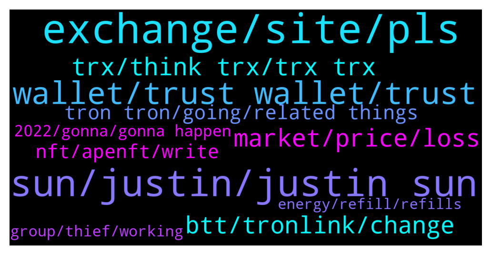

# **@tronnetworkEN**
 ## Analysis for **2021-12-22** - **2021-12-23**.

---

## 📊 **Basic Stats**

**n_messages_sent**: 355

---

---

## 🔝 **Top keywords and related messages**

1. **exchange, site, pls**

    @Iamthewitcher --- *Heyy may i ask a question* **--->** [TG Discussion](https://t.me/tronnetworkEN/3783665)

    @xPommepote --- *Sure, how can we help you* **--->** [TG Discussion](https://t.me/tronnetworkEN/3783666)

    @Carlos_TRX --- *How? Share me the exp pls 😅* **--->** [TG Discussion](https://t.me/tronnetworkEN/3784093)

    @SteveMillerOR --- *IDK what your question is referring to.* **--->** [TG Discussion](https://t.me/tronnetworkEN/3784327)

    @kencar --- *Not sure who manages. But thanks m8* **--->** [TG Discussion](https://t.me/tronnetworkEN/3783326)

    @DzulCorp --- *So we can contact exchange to get identity of the person right?* **--->** [TG Discussion](https://t.me/tronnetworkEN/3783715)

2. **sun, justin, justin sun**

    @M0S1R --- *Justin Sun Resigns as CEO of TRON, This does not have a little psychological impact* **--->** [TG Discussion](https://t.me/tronnetworkEN/3785765)

    @xPommepote --- *Probably going to moon sooner or later yes* **--->** [TG Discussion](https://t.me/tronnetworkEN/3783690)

    @agentpiki --- *You think?  You think Justin Sun will just abandon his precious Tron baby?* **--->** [TG Discussion](https://t.me/tronnetworkEN/3785079)

    @Iamthewitcher --- *Well Justin sun is retired from crypto and has announced that trx is going to dissolve* **--->** [TG Discussion](https://t.me/tronnetworkEN/3783667)

    @Fabs_trx --- *But when they will say Justin sun, just behind they will say founder and ex-ceo of tron* **--->** [TG Discussion](https://t.me/tronnetworkEN/3784201)

    @RICHMOND89SP --- *What is true in the romantic relationship between Justin Sun and Jack Ma?* **--->** [TG Discussion](https://t.me/tronnetworkEN/3783401)

3. **wallet, trust wallet, trust**

    @joem123tel --- *my trust wallet is showing me warning about phishing* **--->** [TG Discussion](https://t.me/tronnetworkEN/3783332)

    @Canaster --- *My Trx tokens aren't showing in the BSC side of the Tronbridge, can anyone help. My other tokens show.? Thanks* **--->** [TG Discussion](https://t.me/tronnetworkEN/3785562)

    @AmakaG --- *Am not receiving on trust wallet Please what could be the problem?   Or does it have a minimum to hold before one can receive Apenft?* **--->** [TG Discussion](https://t.me/tronnetworkEN/3784246)

    @Kytje073 --- *I redeemed 10000 point for Samsung tel how do i get my phone ???* **--->** [TG Discussion](https://t.me/tronnetworkEN/3783386)

    @Erik de Viking --- *ok , and receiving party (1XBET) can't solve either?* **--->** [TG Discussion](https://t.me/tronnetworkEN/3785392)

    @landudno --- *hello everyone, what can i do if my coins haven't arrived ??  with Tronscan it is displayed !?* **--->** [TG Discussion](https://t.me/tronnetworkEN/3784799)

4. **trx, think trx, trx trx**

    @Iamthewitcher --- *Well I'm just wondering don't take it personally but why trx didn't performed well like everyone coin is pumping but trx is still at his position🙂* **--->** [TG Discussion](https://t.me/tronnetworkEN/3785082)

    @Iamthewitcher --- *So can we still expect that trx has better future cuz I've invested my money in it and surely gonna hold it 2022🥲* **--->** [TG Discussion](https://t.me/tronnetworkEN/3783685)

    @Iamthewitcher --- *Yes that's what i heard trx is going to close but that's a trash news* **--->** [TG Discussion](https://t.me/tronnetworkEN/3783687)

    @xPommepote --- *This is absolutely a great news yes. But people think now TRX will be « close » or dissolved but it’s exactly the opposite 🚀💪🏻* **--->** [TG Discussion](https://t.me/tronnetworkEN/3783683)

    @Iamthewitcher --- *Is there any event coming of trx?* **--->** [TG Discussion](https://t.me/tronnetworkEN/3785071)

    @Zer0log --- *Trx will skyrocket i guess 😂* **--->** [TG Discussion](https://t.me/tronnetworkEN/3784480)

5. **market, price, loss**

    @agentpiki --- *Not taking personally 😁   Even in stocks, particular company performing well yet stocks go down  Same thing. You can't just rely on price action.* **--->** [TG Discussion](https://t.me/tronnetworkEN/3785085)

    @Kraniume --- *Why all this while it can’t climb to a dollar* **--->** [TG Discussion](https://t.me/tronnetworkEN/3782658)

    @Yuva --- *Market going to Dump...please Kindly Take your profit immediately* **--->** [TG Discussion](https://t.me/tronnetworkEN/3783720)

    @Iamthewitcher --- *Same🙂once I'd get my average price i would definitely sell it off and never buy this coin again until i will make sure the price is in dip* **--->** [TG Discussion](https://t.me/tronnetworkEN/3785546)

    @xPommepote --- *Because the market is still drowning* **--->** [TG Discussion](https://t.me/tronnetworkEN/3785535)

    @xPommepote --- *You are never in loss till you sell. It’s up to you. Market is down for days, probably not a good timing to sell anything. But it’s not a financial advice.* **--->** [TG Discussion](https://t.me/tronnetworkEN/3782647)

6. **btt, tronlink, change**

    @agentpiki --- *@TicTacCrypto tictac pls unmute me in BTT channel 😭😭😭  CC: @Carlos_TRX* **--->** [TG Discussion](https://t.me/tronnetworkEN/3785046)

    @Ahmed --- *Greetings!!  Need Support.  I have TRX in Yobit, is it okay or need to transfer to Binance.   Thanks* **--->** [TG Discussion](https://t.me/tronnetworkEN/3783151)

    @FarisAzmi2020 --- *How to change bttold to btt in tronlink pro?* **--->** [TG Discussion](https://t.me/tronnetworkEN/3785476)

    @Jikkingdom2 --- *It is very necessary to change from the BTTOLD to the new one?* **--->** [TG Discussion](https://t.me/tronnetworkEN/3783391)

    @SteveMillerOR --- *I don’t see any CSupport avenue at Tronlink.* **--->** [TG Discussion](https://t.me/tronnetworkEN/3784325)

    @DigiKon --- *Hii, im having troubles with swapping etherium back to tron in tronlink pro, it failed 4 times. Any suggestions?* **--->** [TG Discussion](https://t.me/tronnetworkEN/3783466)

7. **tron tron, going, related things**

    @jarcola --- *Tron kor never even heard of them* **--->** [TG Discussion](https://t.me/tronnetworkEN/3782676)

    @ORAKLERSUCKSDICK --- *Right but how does this tie to Tron?* **--->** [TG Discussion](https://t.me/tronnetworkEN/3784198)

    @Meli_Lil --- *Just ask him to bring a flag of tron with him together* **--->** [TG Discussion](https://t.me/tronnetworkEN/3784464)

    @ORAKLERSUCKSDICK --- *Why is this space trip relevant to Tron???* **--->** [TG Discussion](https://t.me/tronnetworkEN/3784188)

    @SaraSE2021 --- *Who’s going to run Tron now?* **--->** [TG Discussion](https://t.me/tronnetworkEN/3784839)

    @Fabs_trx --- *This isn’t really tied to tron* **--->** [TG Discussion](https://t.me/tronnetworkEN/3784200)

8. **nft, apenft, write**

    @agentpiki --- *Are you not receiving apenft? ☹* **--->** [TG Discussion](https://t.me/tronnetworkEN/3784096)

    @Angela_TRON --- *🚀500K Users Joined Waitlist of #APENFT Marketplace on the 1st Day!  🎁Leave An Email to Join Waitlist, Win Special Xmas Gifts: 🎄10K NFT VIP Cards 🎄Up to $1 M #Airdrop 🎄Referral Commission  🎅Join Now: https://waitlist.apenftex.com  🪂RT & @ 3 frds, $2,000 $NFT Token to 100 Users!  👉🏻https://twitter.com/apenftorg/status/1473486213348798470?s=21* **--->** [TG Discussion](https://t.me/tronnetworkEN/3783019)

    @randommenNFT --- *Hello everyone  My NFT Is Launched write me to get it* **--->** [TG Discussion](https://t.me/tronnetworkEN/3784600)

    @randommenNFT --- *Write for the link of my first NFT* **--->** [TG Discussion](https://t.me/tronnetworkEN/3783895)

    @agentpiki --- *@apenftEN  APENFT official channel  For the last time, pls keep your questions and comments short.* **--->** [TG Discussion](https://t.me/tronnetworkEN/3783360)

    @tronbullsboss --- *If anyone has questions about NFTs, feel free to ask.* **--->** [TG Discussion](https://t.me/tronnetworkEN/3785293)

9. **2022, gonna, gonna happen**

    @BOB080 --- *Or are they not distributed yet?* **--->** [TG Discussion](https://t.me/tronnetworkEN/3785800)

    @awtsw --- *its gonna pump in the beginning of 2022* **--->** [TG Discussion](https://t.me/tronnetworkEN/3785840)

    @Iamthewitcher --- *2025 may be but why are we predicting it's price we all know that it's not gonna happen this year😂😂* **--->** [TG Discussion](https://t.me/tronnetworkEN/3785552)

    @Iamthewitcher --- *So what's actually gonna happen with it* **--->** [TG Discussion](https://t.me/tronnetworkEN/3783674)

    @DigiKon --- *7 more days left till 2022* **--->** [TG Discussion](https://t.me/tronnetworkEN/3785527)

    @blockhainculture --- *Sorry my ignorance but when is it gonna be launched? I’m really so hyped for this game* **--->** [TG Discussion](https://t.me/tronnetworkEN/3784485)

10. **group, thief, working**

    @agentpiki --- *Every legit tron works perfectly.  Don't come in to legit channel asking if why tron is not working. Because it is working.* **--->** [TG Discussion](https://t.me/tronnetworkEN/3782968)

    @bu_sarry --- *Need help please give me mobile number for manger office for tron* **--->** [TG Discussion](https://t.me/tronnetworkEN/3785429)

    @SteveMillerOR --- *Weird, but I had understood Staking Tron would accumulate Energy & Bandwidth sufficient to cover my Sends/Receives, but by unstaking it, I have (FINALLY!) had a successful Send. TY* **--->** [TG Discussion](https://t.me/tronnetworkEN/3784361)

    @Fabs_trx --- *This is Tron group. Tron is a blockchain and everything has been doing fine. Maybe you should find some trading group 👍🏻* **--->** [TG Discussion](https://t.me/tronnetworkEN/3784909)

    @KARTHIKEYAN --- *How to earning tron this group* **--->** [TG Discussion](https://t.me/tronnetworkEN/3785333)

    @Ellite01 --- *How to buy Tron on Tron network* **--->** [TG Discussion](https://t.me/tronnetworkEN/3785174)

