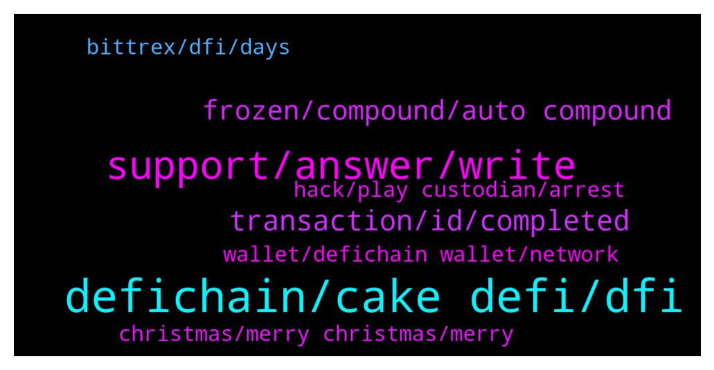

# **@CakeDeFi_EN**
 ## Analysis for **2021-12-23** - **2021-12-24**.

---

## 📊 **Basic Stats**

**n_messages_sent**: 150

---

---

## 🔝 **Top keywords and related messages**

1. **defichain, cake defi, dfi**

    @Teo L. T. --- *Can I use DeFiChain swap DFI to dUSDT and transfer it to CakeDefi using DFI network? I am new to crypto. Actually I don’t know what is the different between USDT and dUSDT.* **--->** [TG Discussion](https://t.me/CakeDeFi_EN/156231)

    @Carlos --- *Will i ever be able to convert dfi to btc in the future ?* **--->** [TG Discussion](https://t.me/CakeDeFi_EN/156495)

    @jollyboat --- *This is a problem with defichain system currently. I won't go into detail but basically the demand is more than the supply because of high APR for stock-dusd liquidity mining. There are some proposals to make dUSD closer to $1 but making the same for the stocks has some other problems* **--->** [TG Discussion](https://t.me/CakeDeFi_EN/156217)

    @Kassius84 --- *No unfortunately not. You have to use the Ethereum Network for USDT. You could only use DeFiChain DEX to send USDT via DeFiChain Network.* **--->** [TG Discussion](https://t.me/CakeDeFi_EN/156225)

    @Teo L. T. --- *Any exchange that can send USDT using DeFi Network instead of Ether? Address creation fee USD130 for Ether is too expensive.* **--->** [TG Discussion](https://t.me/CakeDeFi_EN/156224)

    @kasimkwok --- *Why cannot dind cake defi in cmc* **--->** [TG Discussion](https://t.me/CakeDeFi_EN/156158)

2. **support, answer, write**

    @Michael_Schredl --- *Please contact the official Support for that, we can't help you here :/* **--->** [TG Discussion](https://t.me/CakeDeFi_EN/156299)

    @riserspec24 --- *28a753e3bcfbc16f73aef5e7a6a72942f60615fa9c292dcaf2c583c42f40db65    already checked it but no results.* **--->** [TG Discussion](https://t.me/CakeDeFi_EN/156275)

    @Roman --- *I broke my phone and lost access to authy. Without 2fa I can't do any actions within cake. I sent proof that I am the holder of the account. Got emails for all my support tickets saying they've been received but no actual response back.* **--->** [TG Discussion](https://t.me/CakeDeFi_EN/156307)

    @Michael_Schredl --- *It can take up to 3 business days* **--->** [TG Discussion](https://t.me/CakeDeFi_EN/156572)

    @Kassius84 --- *Your money will not be lost. I would suggest to try again to contact the support via support form* **--->** [TG Discussion](https://t.me/CakeDeFi_EN/156264)

    @Roman --- *3 tickets and 21 days. It doesn't take a rocket scientist to know they've been seen and ignored.* **--->** [TG Discussion](https://t.me/CakeDeFi_EN/156305)

3. **transaction, id, completed**

    @Kassius84 --- *Can you check the transaction id on defiscan.live?* **--->** [TG Discussion](https://t.me/CakeDeFi_EN/156243)

    @mikkelseg --- *I have made a deposit for to my btc on cake defi account but it is still pending for over 5 hours* **--->** [TG Discussion](https://t.me/CakeDeFi_EN/156602)

    @Kassius84 --- *The transaction status on Cake DeFi is "complete"? Did you got an transaction id and can you find them defiscan.live? If not, you should contact Support.* **--->** [TG Discussion](https://t.me/CakeDeFi_EN/156226)

    @jollyboat --- *Same happened with me too. Waiting for Three hours and it shows completed in cake but transaction id not in defiscan* **--->** [TG Discussion](https://t.me/CakeDeFi_EN/156204)

    @Frank --- *Hi all, question about withdrawal from cake to light wallet. - Cake display “withdrawal completed” However I can’t find the transaction id on Defi scan, nor see the withdrawal in the light wallet.  Is this normal and it just takes some time, even so the withdrawal is completed on cake side?  Thank you* **--->** [TG Discussion](https://t.me/CakeDeFi_EN/156247)

    @riserspec24 --- *Yes it was completed and it generated tx id.. but nothing shows in my bittrex account.* **--->** [TG Discussion](https://t.me/CakeDeFi_EN/156240)

4. **frozen, compound, auto compound**

    @emirch4n --- *Hello, the $5 reward I received was automatically frozen.  It was taken out of the freezer today.  However, I still cannot use my reward.  It still appears to be frozen.  Can you help me?* **--->** [TG Discussion](https://t.me/CakeDeFi_EN/156127)

    @Arno --- *Question about freezing  How can I check if I auto-compound or not?* **--->** [TG Discussion](https://t.me/CakeDeFi_EN/156104)

    @GimmieMyBananas --- *Question about the freezer. I’ve been considering the 10 year lock up. If worst case scenario happens where let’s say my region is no longer supported, would I be able to get my funds out?* **--->** [TG Discussion](https://t.me/CakeDeFi_EN/156110)

    @A --- *I’m moving coins from Binance to my private wallet and it’s not speedy either. I want to play with Raydium and I don’t have all day. I got presents to wrap.* **--->** [TG Discussion](https://t.me/CakeDeFi_EN/156567)

    @lessiless --- *Hi why I cant unfreeze my defi enddate 23.12* **--->** [TG Discussion](https://t.me/CakeDeFi_EN/156167)

    @Michael_Schredl --- *Check it under the Freezer page, there you should see if it is still frozen* **--->** [TG Discussion](https://t.me/CakeDeFi_EN/156129)

5. **wallet, defichain wallet, network**

    @Businesspunk1 --- *Thank u, How can I change the network?! Sorry newbie* **--->** [TG Discussion](https://t.me/CakeDeFi_EN/156536)

    @Captlu --- *One last question, I've setup the DeFiChain wallet on app. To confirm, there is only one address to send all assets to? Like TSLA, GOOGL, etc?* **--->** [TG Discussion](https://t.me/CakeDeFi_EN/156598)

    @kasimkwok --- *If it is defi, why do we need to sign up.. dont we just connect to our wallet?* **--->** [TG Discussion](https://t.me/CakeDeFi_EN/156161)

    @mm_phoenix --- *You Need to use the Defichain wallet* **--->** [TG Discussion](https://t.me/CakeDeFi_EN/156593)

    @Tehokosong --- *Needs to be thru the btc network. If you sending to DeFiChain wallet it needs to be wrapped, just send it through defi network.* **--->** [TG Discussion](https://t.me/CakeDeFi_EN/156191)

    @fabioandreatta --- *Select deposit and copy your Bitcoin Deposit Adress (DeFiChain Network) then past your address on the DeFiChain Wallet* **--->** [TG Discussion](https://t.me/CakeDeFi_EN/156537)

6. **christmas, merry christmas, merry**

    @Businesspunk1 --- *@fabioandreatta thank u very much and have a merry christmas 🙂* **--->** [TG Discussion](https://t.me/CakeDeFi_EN/156540)

    @Lydbank --- *Merry Christmas to you all 🙏🙏* **--->** [TG Discussion](https://t.me/CakeDeFi_EN/156546)

    @fabioandreatta --- *Merry Christmas to you too ❤️* **--->** [TG Discussion](https://t.me/CakeDeFi_EN/156541)

    @Dan --- *Was hoping could be sorted before Xmas as normally only takes a few hours.* **--->** [TG Discussion](https://t.me/CakeDeFi_EN/156520)

    @A --- *Hello beautiful people! Wishing a great new year to all!* **--->** [TG Discussion](https://t.me/CakeDeFi_EN/156372)

    @fabioandreatta --- *Not crazy at all. It may take up to 72 hours. As stated in the message above, during holiday time everything is in slowmode. Merry Christmas 🎄* **--->** [TG Discussion](https://t.me/CakeDeFi_EN/156562)

7. **bittrex, dfi, days**

    @Alexandre --- *I benn waiting more than 2 days for a withdraw. This is crazy!* **--->** [TG Discussion](https://t.me/CakeDeFi_EN/156559)

    @Michael_Schredl --- *Withdraws are working normaly - they can take up to 3 business days* **--->** [TG Discussion](https://t.me/CakeDeFi_EN/156517)

    @riserspec24 --- *i just withdrew dfi token to bittrex.. just about an hour, on cake Defi app it was done.. but on Bittrex is not reflecting.. On my previous withdrawals it takes about around 30 mins to arrive.. but now so long.. how come?* **--->** [TG Discussion](https://t.me/CakeDeFi_EN/156196)

    @Michael_Schredl --- *It shows you the time it can take for you withdraw, up to the 3 business days* **--->** [TG Discussion](https://t.me/CakeDeFi_EN/156560)

    @sgabade --- *Is burning Dfi, automatic or scheduled in certain times?, when is next dfi burn* **--->** [TG Discussion](https://t.me/CakeDeFi_EN/156288)

    @jollyboat --- *In general - while I do love cake - their withdrawal system is very chaotic. Sometimes it is very quick, sometimes it takes hours. I think they should have a daily limit and below that limit the process should be instant and automatic* **--->** [TG Discussion](https://t.me/CakeDeFi_EN/156209)

