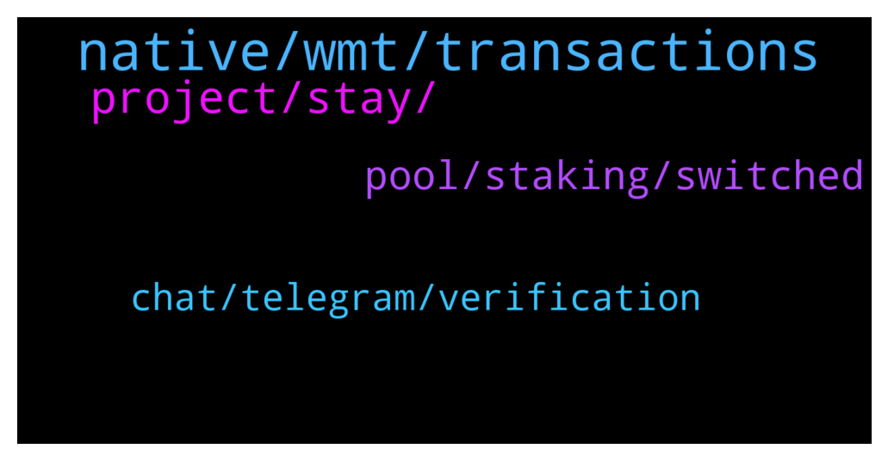

# **@Cardano**
 ## Analysis for **2021-12-23** - **2021-12-24**.

---

## 📊 **Basic Stats**

**n_messages_sent**: 55

---

---

## 🔝 **Top keywords and related messages**

1. **native, wmt, transactions**

    @glitch04 --- *If you don't have native assets then it will say you don't have assets to send, if you are just sending ada you have to put in the value you want to send less the transaction fee or it will fail* **--->** [TG Discussion](https://t.me/Cardano/761965)

    @charlesaugu --- *Hi the minimum ada is a security measure to avoid spamming the blockchain with custom tokens, you are forced to put some ada with every native token you transfer, what I cannot tell you though it's what the exchange will do with that ada...* **--->** [TG Discussion](https://t.me/Cardano/761746)

    @Bill --- *I'm a long term holder for ada* **--->** [TG Discussion](https://t.me/Cardano/761602)

    @MangoPool --- *Can I run cli if I have daedalus wallet in my windows system* **--->** [TG Discussion](https://t.me/Cardano/761964)

    @Daz321 --- *How long will it be before we can send native tokens without having to send some ADA too?* **--->** [TG Discussion](https://t.me/Cardano/761984)

    @Ondrej22 --- *Hi guys, could anyone help?  I want to send WMT to an exchange from Daedalus wallet. There is also minimum 1,38 ADA needed to be send with WMT token as well. And additionally there is also estimated fee 0.18ADA. Why there is also need to send ADA with WMT as well? Will that ADA be "lost", or it arrive to destination address with WMT and it only costs that 0.18 ADA in fees? Or that 1,38 ADA will be return to my wallet after I send WMT?* **--->** [TG Discussion](https://t.me/Cardano/761729)

2. **project, stay, **

    @ExInfernis --- *Check cardano cube io for the all kind of projects* **--->** [TG Discussion](https://t.me/Cardano/761717)

    @ThomNk --- *Hello. Cardano community. I was just wondering if Cardano can, could or will be used for a Metaverse Project?* **--->** [TG Discussion](https://t.me/Cardano/761712)

    @glitch04 --- *https://datastudio.google.com/u/0/reporting/3136c55b-635e-4f46-8e4b-b8ab54f2d460/page/k5r9B  or one of the third party explorers* **--->** [TG Discussion](https://t.me/Cardano/761903)

    @adigator89 --- *To all the admin and team, happy holidays. I am certain everyone is focused on 100x, 1000x which is funny. I wish you guys to deliver a great project and stay healthy. Applies to all the users. Stay safe, spend time with family during holidays.* **--->** [TG Discussion](https://t.me/Cardano/762033)

    @glitch04 --- *The best way for you to get updates on those projects is directly from their social platforms/groups* **--->** [TG Discussion](https://t.me/Cardano/761787)

    @Bill --- *I believe so much in the project* **--->** [TG Discussion](https://t.me/Cardano/761604)

3. **pool, staking, switched**

    @... --- *hi if i unstake and restake on the same stakepool on the same day will i still receive my rewards?* **--->** [TG Discussion](https://t.me/Cardano/762065)

    @... --- *I delegated to a different pool* **--->** [TG Discussion](https://t.me/Cardano/762093)

    @... --- *I already switched pools you see* **--->** [TG Discussion](https://t.me/Cardano/762091)

    @tham3rr --- *Yes, but why it doesn't make sense?* **--->** [TG Discussion](https://t.me/Cardano/762078)

    @... --- *I didn't restake, i switched back to my old pool if that's what you mean* **--->** [TG Discussion](https://t.me/Cardano/762115)

    @DimkaT --- *After you switched pools, you have to wait two epochs for new setting to apply.* **--->** [TG Discussion](https://t.me/Cardano/762094)

4. **chat, telegram, verification**

    @JuanIncognito --- *Why doesn’t this Cardano chat have the verification symbol?* **--->** [TG Discussion](https://t.me/Cardano/761941)

    @glitch04 --- *Telegram has not verified the channels yet, not sure why but the process was started several months ago with no response from telegram as to why or what needed to happen to complete the verification.* **--->** [TG Discussion](https://t.me/Cardano/761970)

    @mindmisled --- *I haven’t looked at this chat for days and there was 300 messages waiting….* **--->** [TG Discussion](https://t.me/Cardano/761942)

    @Bill --- *Hey guys, i'm so glad that i finaly made a telegram* **--->** [TG Discussion](https://t.me/Cardano/761600)

    @mindmisled --- *My NEAR chat had 2.5.k 😵‍💫* **--->** [TG Discussion](https://t.me/Cardano/761943)

    @mindmisled --- *How comes this chat is quiet? Are there other channels?* **--->** [TG Discussion](https://t.me/Cardano/761939)

