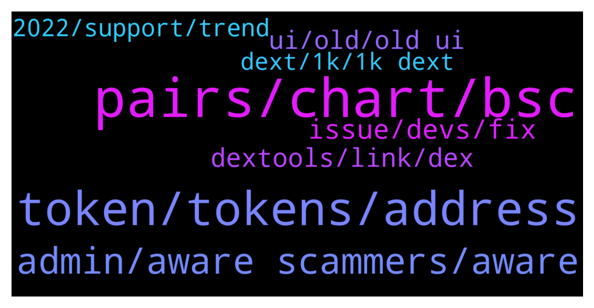

# **@DEXToolsCommunity**
 ## Analysis for **2021-12-22** - **2021-12-24**.

---

## 📊 **Basic Stats**

**n_messages_sent**: 377

---

---

## 🔝 **Top keywords and related messages**

1. **pairs, chart, bsc**

    @Flashbang665 --- *Hi, is there any issues with charts now?, the history of this chart is gone: https://www.dextools.io/app/bsc/pair-explorer/0x486697ae24469cb1122f537924aa46e705b142aa* **--->** [TG Discussion](https://t.me/DEXToolsCommunity/316191)

    @nate102 --- *what does drained mean? just they sold off that amount total?* **--->** [TG Discussion](https://t.me/DEXToolsCommunity/316847)

    @SilentBobdcv --- *Hi guys any chance you could check TARP pairing? It’s gone a bit off lol 0x631af28e12eac34eaf386c36d9f9dd555fb3f86b* **--->** [TG Discussion](https://t.me/DEXToolsCommunity/316179)

    @FredericDEXT --- *Hot Pairs depends on a custom algorithm which is undisclosed, so please don't ask about it  We don't accept payments for trending / hot pairs, you can pay scammers for this but it won't work!* **--->** [TG Discussion](https://t.me/DEXToolsCommunity/315652)

    @fiesta_0604 --- *Could I ask something relate to the BOTS? How can I stop users using BOT to call for a chart? There are no helps command show me that.* **--->** [TG Discussion](https://t.me/DEXToolsCommunity/316592)

    @mtac79 --- *i get 3 new pairs , went to 0* **--->** [TG Discussion](https://t.me/DEXToolsCommunity/316775)

2. **token, tokens, address**

    @D --- *nice work making the old token available after making a new one* **--->** [TG Discussion](https://t.me/DEXToolsCommunity/317036)

    @D --- *how do i get the new token* **--->** [TG Discussion](https://t.me/DEXToolsCommunity/316995)

    @solidask --- *Hello, is it possible to remove old version (V1) chart of a token that migrated to new version (V2)?* **--->** [TG Discussion](https://t.me/DEXToolsCommunity/316912)

    @D --- *how do i convert my old token to new token?* **--->** [TG Discussion](https://t.me/DEXToolsCommunity/317002)

    @stanes --- *You do what you want but the old token is useless. We only use the new one for the app and features.* **--->** [TG Discussion](https://t.me/DEXToolsCommunity/317001)

    @stanes --- *Yeah, so you bought the old token after we changed it... 🤷‍♂️* **--->** [TG Discussion](https://t.me/DEXToolsCommunity/317035)

3. **admin, aware scammers, aware**

    @napascual --- *All feedback will be taken into account, dm us your suggestions!* **--->** [TG Discussion](https://t.me/DEXToolsCommunity/317126)

    @stanes --- *Ahahah for sure... but I don't think it's so easy 😉* **--->** [TG Discussion](https://t.me/DEXToolsCommunity/316567)

    @stanes --- *Never trust anybody here who doesn't have an admin tag.* **--->** [TG Discussion](https://t.me/DEXToolsCommunity/316799)

    @(⊙o⊙) --- *This guy is a high-level liar, be careful everyone!* **--->** [TG Discussion](https://t.me/DEXToolsCommunity/315462)

    @stanes --- *You haven't been frontrunned so doesn't matter 😉* **--->** [TG Discussion](https://t.me/DEXToolsCommunity/315517)

    @napascual --- *Marketing to @guillermorodriguez78. Be aware of scammers, remember he'll never dm first* **--->** [TG Discussion](https://t.me/DEXToolsCommunity/315630)

4. **issue, devs, fix**

    @stanes --- *The issue has been forwarded to the devs. They will check and fix it asap.   Thanks for reporting 🙏* **--->** [TG Discussion](https://t.me/DEXToolsCommunity/316823)

    @stanes --- *Clear your cache it should solve the problem.* **--->** [TG Discussion](https://t.me/DEXToolsCommunity/316811)

    @stanes --- *The issue has been forwarded to the devs. They will check and fix it asap.  Thanks for reporting 🙏* **--->** [TG Discussion](https://t.me/DEXToolsCommunity/316180)

    @SillySmiles21 --- *How often are the devs around? I know it is holidays, but obviously we know how crypto works :P* **--->** [TG Discussion](https://t.me/DEXToolsCommunity/316876)

    @napascual --- *It's been fixed now, thanks for the patience!* **--->** [TG Discussion](https://t.me/DEXToolsCommunity/316261)

    @trojantechltd --- *The issue was corrected and now it has reverted back.* **--->** [TG Discussion](https://t.me/DEXToolsCommunity/315789)

5. **dextools, link, dex**

    @matarazzee00 --- *Yes i don't no i want you guys to show me how to list it on dextools* **--->** [TG Discussion](https://t.me/DEXToolsCommunity/316985)

    @JoeyDieleman --- *You can see the tx on dextools* **--->** [TG Discussion](https://t.me/DEXToolsCommunity/316417)

    @Chris --- *Any way to revert to the old DexTools?* **--->** [TG Discussion](https://t.me/DEXToolsCommunity/317101)

    @starkess --- *I launched a project and it showing no symbol in dextool 😐* **--->** [TG Discussion](https://t.me/DEXToolsCommunity/316323)

    @CaesarCrypto --- *are you sure? I know that dextools has also DFV (type)* **--->** [TG Discussion](https://t.me/DEXToolsCommunity/315812)

    @gumbercules --- *then the relevant data will be relayed to DEXTools* **--->** [TG Discussion](https://t.me/DEXToolsCommunity/315691)

6. **ui, old, old ui**

    @atosm --- *we got a downgrade for xmas* **--->** [TG Discussion](https://t.me/DEXToolsCommunity/317124)

    @sandman0108 --- *can we please have the old favs as a display option?* **--->** [TG Discussion](https://t.me/DEXToolsCommunity/317144)

    @JoeyDieleman --- *Also many changes are by requests of the community.* **--->** [TG Discussion](https://t.me/DEXToolsCommunity/317135)

    @atosm --- *I have been a community member too for a long time. you can do a search in this chat. and I definitely think the old UI is better.* **--->** [TG Discussion](https://t.me/DEXToolsCommunity/317149)

    @嘉门 --- *We need a switch to switch between old and new UI* **--->** [TG Discussion](https://t.me/DEXToolsCommunity/317122)

    @napascual --- *We will start implementing small iterations over the current design (like enabling a toggle to hide favorites charts)* **--->** [TG Discussion](https://t.me/DEXToolsCommunity/317118)

7. **2022, support, trend**

    @lex_44 --- *So let me ask you this So wicht  coin Will be for next 2022 ? Any advise* **--->** [TG Discussion](https://t.me/DEXToolsCommunity/315777)

    @joshmilison --- *Can you please refer me to someone who can help me trend it* **--->** [TG Discussion](https://t.me/DEXToolsCommunity/315654)

    @lex_44 --- *so what would it be for 2022* **--->** [TG Discussion](https://t.me/DEXToolsCommunity/315770)

    @stanes --- *Not in the near future I am afraid.* **--->** [TG Discussion](https://t.me/DEXToolsCommunity/316570)

    @bastardganpunk --- *you’ve been asking for the next diamond hands token in 2022* **--->** [TG Discussion](https://t.me/DEXToolsCommunity/315768)

    @lex_44 --- *So wisht Will be the next Diamond Hands token for 2022?* **--->** [TG Discussion](https://t.me/DEXToolsCommunity/315764)

