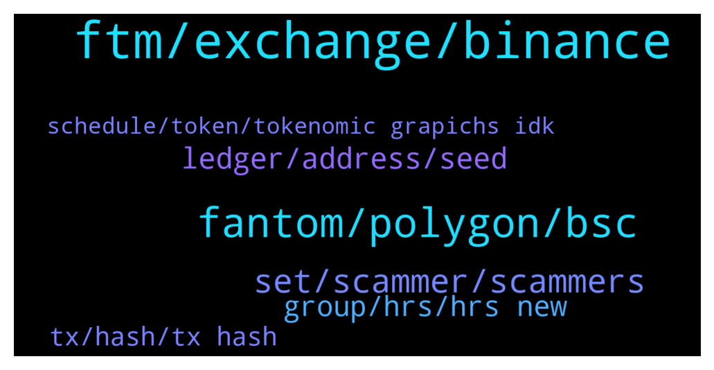

# **@Fantom_English**
 ## Analysis for **2021-12-23** - **2021-12-24**.

---

## 📊 **Basic Stats**

**n_messages_sent**: 143

---

---

## 🔝 **Top keywords and related messages**

1. **ftm, exchange, binance**

    @yapxy --- *Hi! Could I ask for some help…trying to send my FTM tokens from kucoin to MM. can I send it directly via FTM network instead of erc?* **--->** [TG Discussion](https://t.me/Fantom_English/615336)

    @CG_05 --- *I did not discussed about price of ftm, just said what problem had with binance* **--->** [TG Discussion](https://t.me/Fantom_English/615446)

    @Chris --- *I was also trying to do this. I changed to BNB and sent to MM on BSC. Then I swapped for FTM on SpookySwap. Then I bridged to Fantom Network, again using SpookySwap. This last step, the bridge, has now been waiting to be confirmed for 8 hours !!* **--->** [TG Discussion](https://t.me/Fantom_English/615368)

    @cro_joe9191 --- *Is Fantom Binance exchange still on track for q4 2021?! That's what the press release said when it was announced* **--->** [TG Discussion](https://t.me/Fantom_English/614917)

    @Janevietani --- *Binnance, Huobi, Bitfinex have liquidity for main net FTM* **--->** [TG Discussion](https://t.me/Fantom_English/615362)

    @SleeplessB0x --- *anyone able to help me with a swap that says it suceeded in making my ERC20 FTM OperaFTM but as far as I can see it has  done nothing but takee my FTM.* **--->** [TG Discussion](https://t.me/Fantom_English/615132)

2. **fantom, polygon, bsc**

    @slickrick6 --- *You can only send directly to fantom network from MetaMask if kucoin has native fantom withdrawals open* **--->** [TG Discussion](https://t.me/Fantom_English/615353)

    @Sleepycloud71 --- *I don't want to bridge. I want to buy it and send it directly to my Fantom wallet.* **--->** [TG Discussion](https://t.me/Fantom_English/614870)

    @slickrick6 --- *where did you perform the swap* **--->** [TG Discussion](https://t.me/Fantom_English/615133)

    @SleeplessB0x --- *unless multichain xyz just steals your token no matter what you put in, then oh well nut following the transaction it accessed the fantom contract and sent my tokens there, so it looks  legitimamte* **--->** [TG Discussion](https://t.me/Fantom_English/615138)

    @t_mikhanashvili --- *Hello Admin, how to add custom network to fantom wallet?* **--->** [TG Discussion](https://t.me/Fantom_English/615083)

    @Janevietani --- *Fantom bridges are: Anyswap : FTM from/to Arbitrum, AVAX, BSC, ETH, OKEx, Polygon https://stable.anyswap.exchange/#/swap   Spiritswap : FTM from/to Arbitrum, AVAX, BSC, ETH, Polygon https://swap.spiritswap.finance/#/bridge  Spookyswap : FTM from/to Arbitrum, AVAX, BSC, ETH, Polygon https://spookyswap.finance/bridge  Multichain : FTM from/to Arbitrum, AVAX, BSC, ETH, Polygon https://multichain.xyz/  Elk Finance : FTM from/to Binance, CRO, HuobiECO, HOO, KCC, MOVR, OKEx, ONE, Polygon, TLOS, xDAI (ELK Tokens only) https://app.elk.finance/#/elknet   Evodefi : FTM from/to Arbitrum, AVAX, BSC, CRO, ETH, HECO, Polygon, SOL, TRX https://bridge.evodefi.com/?token=USDC  CBridge : FTM from/to Arbitrum, AVAX, BSC, ETH, OKEx, Optimism, Polygon, xDai https://cbridge.celer.network/#/  O3Swap : FTM from/to Arbitrum, BSC, ETH, HuobiECO, NEO, Polygon https://o3swap.com/swap  Relaychain : FTM from/to AVAX, BSC, CRO, ETH, HECO, IOTX, MOVR, ONE, Polygon, SDN  https://app.relaychain.com/#/cross-chain-bridge-transfer  Synapse Protocol : FTM from/to Arbitrum, AVAX, BSC, BOBA, ETH, MOVR, ONE, Optimism, Polygon https://synapseprotocol.com/?inputCurrency=USDC&outputCurrency=BUSD&outputChain=56  Xpollinate : FTM from/to Arbitrum, AVAX, BSC, MOVR, Polygon, xDai https://www.xpollinate.io/  Ren : https://bridge.renproject.io/  NFT Bridge : https://nft.anyswap.exchange/  ⚠️ Gas fees is required from native chain.* **--->** [TG Discussion](https://t.me/Fantom_English/614989)

3. **set, scammer, scammers**

    @MoonPacShakur --- *Jane did and tried calling me* **--->** [TG Discussion](https://t.me/Fantom_English/615400)

    @Mcjig --- *and compare our user names. mine is @mcjig. scammers cant use the same name/ look for differences* **--->** [TG Discussion](https://t.me/Fantom_English/615727)

    @Janevietani --- *if you got dm. that is scammer . admin will never pm you first* **--->** [TG Discussion](https://t.me/Fantom_English/615397)

    @SleeplessB0x --- *TECHNICAL SUPPORT stop scamming I need a real admin thanks* **--->** [TG Discussion](https://t.me/Fantom_English/615285)

    @A444598 --- *Scammer don't write to me because I'll block you* **--->** [TG Discussion](https://t.me/Fantom_English/615101)

    @Sleepycloud71 --- *Jesus Christ... the amount of scammers here is crazy. They just keep messaging me.* **--->** [TG Discussion](https://t.me/Fantom_English/614881)

4. **ledger, address, seed**

    @Fjody --- *Do you need your old address being connected to Ledger for some reason? Because that basically does not add any security to your account - once the old seed was used on a computer, it might be compromised. It is advised to create a new address with Ledger and then connect it to Fantom wallet (so the seed will remain just within Ledger).* **--->** [TG Discussion](https://t.me/Fantom_English/615675)

    @Janevietani --- *use fwallet seed phrase / mnemonic to ledger* **--->** [TG Discussion](https://t.me/Fantom_English/615666)

    @Sugzino --- *I've tried to use the fantom help page, but can't figure out how to import an existing fwallet into the ledger?* **--->** [TG Discussion](https://t.me/Fantom_English/615665)

    @Sugzino --- *Is that through ledger live? Or through the pwa app* **--->** [TG Discussion](https://t.me/Fantom_English/615671)

    @MoonPacShakur --- *I just need help on this on my question* **--->** [TG Discussion](https://t.me/Fantom_English/615403)

    @Fjody --- *If you want to be sure that your wallet is safe, then yes, create new address with Ledger and transfer the funds to it.* **--->** [TG Discussion](https://t.me/Fantom_English/615689)

5. **group, hrs, hrs new**

    @SleeplessB0x --- *8 hrs I'm at over 16 hrs...* **--->** [TG Discussion](https://t.me/Fantom_English/615427)

    @Mcjig --- *you can search for it. i found one group. but dont know if its legit or not. so check it out but be careful* **--->** [TG Discussion](https://t.me/Fantom_English/615734)

    @👻 --- *Hello✌️, is there a Russian-language chat?💬* **--->** [TG Discussion](https://t.me/Fantom_English/615268)

    @Johnnyfantom --- *Before there was a Spanish group, but not anymore* **--->** [TG Discussion](https://t.me/Fantom_English/614927)

    @James --- *Hello dev is there any Chinese group here?* **--->** [TG Discussion](https://t.me/Fantom_English/615700)

    @love1284 --- *Can I know the address of the Korean group?* **--->** [TG Discussion](https://t.me/Fantom_English/615556)

6. **tx, hash, tx hash**

    @Janevietani --- *mean tx are not broadcasted yet. check current gas price vs gas price you are using. or you can reset metamask to clear all pending tx. go to metamask setting -> advanced -> reset then re-do your tx* **--->** [TG Discussion](https://t.me/Fantom_English/615220)

    @redsand228 --- *"Sorry unable to locate TX hash"* **--->** [TG Discussion](https://t.me/Fantom_English/615209)

    @Janevietani --- *it could be error on your phone. try close the app and reopen or restart your phone* **--->** [TG Discussion](https://t.me/Fantom_English/615450)

    @Chris --- *It's recommending to submit a ticket :/* **--->** [TG Discussion](https://t.me/Fantom_English/615379)

    @slickrick6 --- *You haven’t sent your wallet or tx hash yet* **--->** [TG Discussion](https://t.me/Fantom_English/614953)

    @Sleepycloud71 --- *Ok. I didn't know that was a problem here. Thank you.* **--->** [TG Discussion](https://t.me/Fantom_English/614876)

7. **schedule, token, tokenomic grapichs idk**

    @Mcjig --- *all tokens are in circulation except those that are reserved for rewards* **--->** [TG Discussion](https://t.me/Fantom_English/615775)

    @Janevietani --- *fyi you will need ETH coin for gas fee since your token are ethereum token* **--->** [TG Discussion](https://t.me/Fantom_English/615393)

    @pipozgos --- *Hi to all where is the tokenomic with grapichs, idk where is sorry for my newbie question.  Token schedule and tokenomics* **--->** [TG Discussion](https://t.me/Fantom_English/615173)

    @pipozgos --- *Hi to all where is the tokenomic with grapichs, idk where is sorry for my newbie question. Token schedule and tokenomics* **--->** [TG Discussion](https://t.me/Fantom_English/615168)

    @juni_GFC --- *Hi, why can i not send tokens to a other wallet? Everytime i open MEtamask and click on send. it mention automatically a to high gas price. Around 117 on the left <<* **--->** [TG Discussion](https://t.me/Fantom_English/615588)

    @pipozgos --- *Hi to all where is the tokenomic with grapichs, idk where is sorry for my newbie question* **--->** [TG Discussion](https://t.me/Fantom_English/615150)

