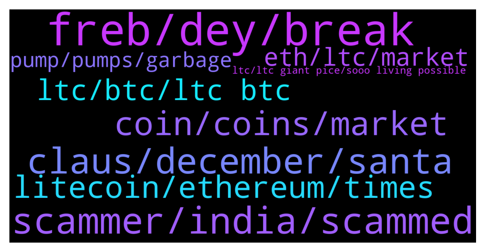

# **@Litecoin**
 ## Analysis for **2021-12-23** - **2021-12-24**.

---

## 📊 **Basic Stats**

**n_messages_sent**: 170

---

---

## 🔝 **Top keywords and related messages**

1. **freb, dey, break**

    @Nakabuchaka --- *You already have a lambo, dont complain* **--->** [TG Discussion](https://t.me/Litecoin/2034057)

    @TonyNakamoto --- *dey call u some insulP but r f0rget wat it B* **--->** [TG Discussion](https://t.me/Litecoin/2034143)

    @moonsie --- *mery chxirmast to u 2 freb* **--->** [TG Discussion](https://t.me/Litecoin/2034211)

    @TonyNakamoto --- *Over de soumd of ur own b0nkage* **--->** [TG Discussion](https://t.me/Litecoin/2033590)

    @TonyNakamoto --- *seems it mite B Johm Bollimger lol* **--->** [TG Discussion](https://t.me/Litecoin/2033571)

    @TonyNakamoto --- *somteimes dey call u 'ewu' but r thinking of an0ther* **--->** [TG Discussion](https://t.me/Litecoin/2034149)

2. **scammer, india, scammed**

    @jrx486 --- *Look, im just saying that if you encounter a scammer, it is more likely (not certain) that he is from nigeria or india* **--->** [TG Discussion](https://t.me/Litecoin/2034154)

    @jrx486 --- *Not saying everyone in those countries are scammers. I’m sure the majority isn’t.* **--->** [TG Discussion](https://t.me/Litecoin/2034134)

    @Bigbulz --- *And those people get scammed by those clowns deserve to get scammed* **--->** [TG Discussion](https://t.me/Litecoin/2034158)

    @jrx486 --- *I disagree, poor grannies live in another world* **--->** [TG Discussion](https://t.me/Litecoin/2034159)

    @Bigbulz --- *What does it mean by "are you Nigerian or indian" ?* **--->** [TG Discussion](https://t.me/Litecoin/2034132)

    @Bigbulz --- *I am in many indian group, the amount of scamming messages i get in every  group is unlimited.  And they all are from english native speaker. They use google translator to convert it to hindi* **--->** [TG Discussion](https://t.me/Litecoin/2034139)

3. **claus, december, santa**

    @RabbitL0v3r --- *Also santa claus find his origin in st nicholas* **--->** [TG Discussion](https://t.me/Litecoin/2034198)

    @jrx486 --- *I celebrate saint nicholas (sinterklaas) on December 6th and not santa claus on xmas. December 25th is a jesus day.* **--->** [TG Discussion](https://t.me/Litecoin/2034186)

    @moonsie --- *english couldnt pronounce sinter klaas so they makde it Santa Claus imo* **--->** [TG Discussion](https://t.me/Litecoin/2034200)

    @RabbitL0v3r --- *Saint Nicholas is more christian than Yule being pagan* **--->** [TG Discussion](https://t.me/Litecoin/2034187)

    @moonsie --- *"As Christianity expanded into Western Europe, the people there had been celebrating a Roman holiday ('Solis Invicti') on December 25th. Rather than compete with an already popular holiday, the church simply decided to move Christmas Day to December 25th and celebrate January 6th as the Feast of the Epiphany. Undoubtedly, Solis Invicti itself was a holiday created to overwrite previous Pagan winter solstice celebrations."* **--->** [TG Discussion](https://t.me/Litecoin/2034195)

    @Two_dotss --- *Santa Claus exist only on people memory  Never existed* **--->** [TG Discussion](https://t.me/Litecoin/2034216)

4. **coin, coins, market**

    @K_arlso_n --- *And this coin very fast go to the 0,01$* **--->** [TG Discussion](https://t.me/Litecoin/2033843)

    @dany --- *i recently learned about crypto fantasy coin and am looking forward to following its progress.* **--->** [TG Discussion](https://t.me/Litecoin/2034130)

    @K_arlso_n --- *Many people trust this coin, and everyone will be punished.* **--->** [TG Discussion](https://t.me/Litecoin/2033851)

    @BennyBennyBlanco --- *Other Shit coins belong in the 🚽* **--->** [TG Discussion](https://t.me/Litecoin/2033842)

    @K_arlso_n --- *I can buy other shit coin and make x4 and more. But not in this coin.* **--->** [TG Discussion](https://t.me/Litecoin/2033817)

    @dainguyenhp --- *I see this coin is dead* **--->** [TG Discussion](https://t.me/Litecoin/2034229)

5. **litecoin, ethereum, times**

    @moonsie --- *today ethereum is 30 times that value and litecoin barely 3 times* **--->** [TG Discussion](https://t.me/Litecoin/2033971)

    @moonsie --- *max risk, max mental health problems, minimum reward, guaranteed loss of quality of life. that is what litecoin give u.* **--->** [TG Discussion](https://t.me/Litecoin/2033740)

    @jericho2411 --- *that huge for litecoin dont undresastemate that.* **--->** [TG Discussion](https://t.me/Litecoin/2033877)

    @moonsie --- *bitcoin $8k can easily pump x8, but litecoin which has a much lower cap can't even match that, let alone ethereum or ada's performance. disgusitng.* **--->** [TG Discussion](https://t.me/Litecoin/2033713)

    @KevinWilson8 --- *Two xinxi in Litecoin group @admin* **--->** [TG Discussion](https://t.me/Litecoin/2033697)

    @moonsie --- *ethereum has outperformed litecoin 10 times over, so what the fuck are you talking about???* **--->** [TG Discussion](https://t.me/Litecoin/2033972)

6. **ltc, btc, ltc btc**

    @K_arlso_n --- *Other shit coin 0.00000084 +5.82% ))) LTC go to the hell...* **--->** [TG Discussion](https://t.me/Litecoin/2033841)

    @KevinWilson8 --- *Will ltc go up to $300 by end of 2022, I don't want to give up ltc, I can hold it for one more year* **--->** [TG Discussion](https://t.me/Litecoin/2033742)

    @shahabszd --- *Ltc 7000$ very very soon😎 if you can't hold you won't be rich* **--->** [TG Discussion](https://t.me/Litecoin/2033821)

    @K_arlso_n --- *LTC maybe 200$ no more, and with BTC dumped to the 10$* **--->** [TG Discussion](https://t.me/Litecoin/2034123)

    @K_arlso_n --- *LTC/BTC -0.000051 -1.57% we go to 75$* **--->** [TG Discussion](https://t.me/Litecoin/2034071)

    @Carlos_PRO_Holder --- *Segwit shot up litecoin to $400, mimblewimble will pump Ltc to $200 max, if not delayed or we get in a bear market first* **--->** [TG Discussion](https://t.me/Litecoin/2033811)

7. **eth, ltc, market**

    @KevinWilson8 --- *We must pray that BTC or ETH can return to ATH, these two are market leaders, otherwise ltc has no hope of returning to ATH* **--->** [TG Discussion](https://t.me/Litecoin/2033992)

    @BillyRoc --- *Why is LTC climbing faster than BTC and both rising quicker than eth?* **--->** [TG Discussion](https://t.me/Litecoin/2033963)

    @moonsie --- *lol, ltc has up 20% in insane bull run year and u expect it to somehow 100% next year when the bear market starts ??* **--->** [TG Discussion](https://t.me/Litecoin/2033744)

    @Badshah_Adding_Service --- *It is loosing market share and rank.* **--->** [TG Discussion](https://t.me/Litecoin/2034082)

    @BillyRoc --- *Yeah, that makes sense; eth is overvalued and ready to crash, which explains why LTC is going up faster.  I’m dumping eth and buying LTC and BTC.  Thank you moonsie.* **--->** [TG Discussion](https://t.me/Litecoin/2033973)

    @moonsie --- *'catching up' is an understatement. it's lagging so much behind, people should pray it will do x2 before the global economy collapses. absolute trash.* **--->** [TG Discussion](https://t.me/Litecoin/2033719)

8. **pump, pumps, garbage**

    @JIMMY G --- *Let’s see we are long overdue a proper pump to new highs* **--->** [TG Discussion](https://t.me/Litecoin/2033726)

    @moonsie --- *by the time this useless shit "pumps", even $1000 per LTC wont buy you a loaf of bread* **--->** [TG Discussion](https://t.me/Litecoin/2033677)

    @moonsie --- *This garbage couldnt pump for its life* **--->** [TG Discussion](https://t.me/Litecoin/2033932)

    @Carlos_PRO_Holder --- *Ltc has low volume, fake pump* **--->** [TG Discussion](https://t.me/Litecoin/2033885)

    @moonsie --- *basically the lower the price was, the harder the pump. EXCEPT FOR LITECUCK* **--->** [TG Discussion](https://t.me/Litecoin/2033712)

    @moonsie --- *By the time this garbage pumps a thousand dollar maybe buys you a coca cola* **--->** [TG Discussion](https://t.me/Litecoin/2033558)

9. **ltc, ltc giant pice, sooo living possible**

    @JIMMY G --- *LTC really has a lot of catching up to do to reward it holders.* **--->** [TG Discussion](https://t.me/Litecoin/2033714)

    @KevinWilson8 --- *Maybe the MWEB can help ltc, hope it will not delay again .* **--->** [TG Discussion](https://t.me/Litecoin/2033749)

    @RabbitL0v3r --- *Only thing u bought with ltc is pain* **--->** [TG Discussion](https://t.me/Litecoin/2033680)

    @TrojanHorshe --- *Giant  pice of shit LTC* **--->** [TG Discussion](https://t.me/Litecoin/2033609)

    @IsmailOtis --- *Sooo, when we're not living in the US it's not possible to use the blockcard of LTC?* **--->** [TG Discussion](https://t.me/Litecoin/2033644)

