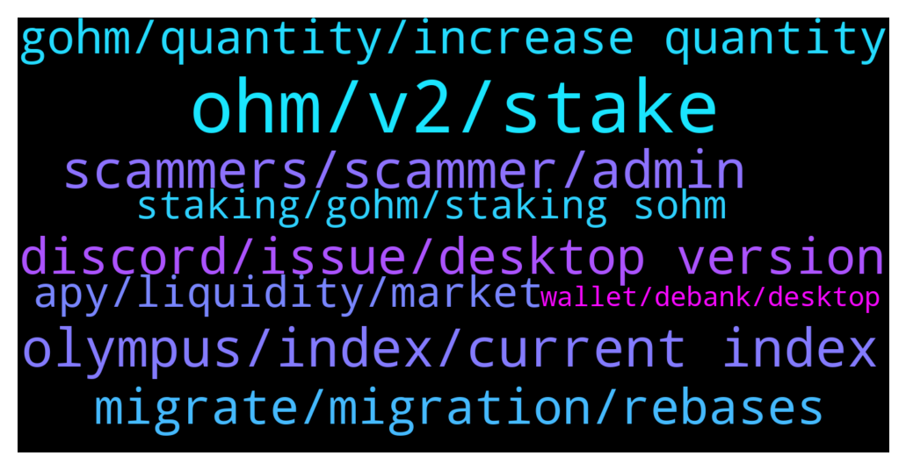

# **@OlympusTG**
 ## Analysis for **2021-12-23** - **2021-12-24**.

---

## 📊 **Basic Stats**

**n_messages_sent**: 575

---

---

## 🔝 **Top keywords and related messages**

1. **ohm, v2, stake**

    @nfwaple --- *buy gOHM and do nothing, or buy OHM v2 and stake them, they both have the same outcome* **--->** [TG Discussion](https://t.me/OlympusTG/132805)

    @marilylehmann --- *Actually The alphaOHM migration will occur via a smart contract that takes your alphaOHM and returns an equal amount of OHM.* **--->** [TG Discussion](https://t.me/OlympusTG/133185)

    @ChrisBCrypto --- *ok, i cant get in there board wont let me get passed accepting terms, so ill ask here, are you still able to sell ohm v1? i am going transfer over to new MM wallet, i think it will be more cost effective just to sell my OHM and rebuy V2 with new wallet,* **--->** [TG Discussion](https://t.me/OlympusTG/133653)

    @D --- *guys just sharing video of OHM https://youtu.be/oM21wPplSDY* **--->** [TG Discussion](https://t.me/OlympusTG/132981)

    @csherry2 --- *Hello admin, how can I swap alphaohm to ohms??* **--->** [TG Discussion](https://t.me/OlympusTG/133184)

    @favour --- *Guys what’s the new v2 ohm address* **--->** [TG Discussion](https://t.me/OlympusTG/132715)

2. **olympus, index, current index**

    @Eroni --- *Do Olympus support team usually call? Lol or are they scammers* **--->** [TG Discussion](https://t.me/OlympusTG/133049)

    @nfwaple --- *Refer to this tweet bro:  https://twitter.com/dopex_intern/status/1473439395999068162/photo/1  gohm does not increase, number of gohm x current index = number of sohm, current index increases every rebase, you can find current index on the dashboard of the olympus dapp* **--->** [TG Discussion](https://t.me/OlympusTG/132694)

    @nfwaple --- *holding gOHM has the same outcome as staking OHM, gohm does not increase, number of gohm x current index = number of sohm, current index increases every rebase, you can find current index on the dashboard of the olympus dapp, you can see your equivalent Staked balance in sOHM in the Stake page holding gOHM  Also see second pic of this thread: https://twitter.com/dopex_intern/status/1473439395999068162/photo/1  If you really insist that you want sOHM, you can use the Wrap function on the left side of the Dapp, unwrap from gOHM to sOHM* **--->** [TG Discussion](https://t.me/OlympusTG/132794)

    @nfwaple --- *https://twitter.com/dopex_intern/status/1473439395999068162/photo/1  gohm does not increase, number of gohm x current index = number of sohm, current index increases every rebase, you can find current index on the dashboard of the olympus dapp, you can see your equivalent Staked balance in sOHM in the Stake page holding gOHM* **--->** [TG Discussion](https://t.me/OlympusTG/132476)

    @nfwaple --- *you can unwrap to more sOHM or understand how gOHM works.   Second pic: https://twitter.com/dopex_intern/status/1473439395999068162/photo/1  gohm does not increase, number of gohm x current index = number of sohm, current index increases every rebase, you can find current index on the dashboard of the olympus dapp, you can see your equivalent Staked balance in sOHM in the Stake page holding gOHM* **--->** [TG Discussion](https://t.me/OlympusTG/133373)

    @nfwaple --- *See second pic of this thread: https://twitter.com/dopex_intern/status/1473439395999068162/photo/1  gohm does not increase, number of gohm x current index = number of sohm, current index increases every rebase, you can find current index on the dashboard of the olympus dapp* **--->** [TG Discussion](https://t.me/OlympusTG/132720)

3. **scammers, scammer, admin**

    @nfwaple --- *the scammers would love to chat* **--->** [TG Discussion](https://t.me/OlympusTG/132669)

    @BongoBoing --- *each message deploys an average of 3 dm’s* **--->** [TG Discussion](https://t.me/OlympusTG/132374)

    @Kev --- *Just landed here and I’m getting dms* **--->** [TG Discussion](https://t.me/OlympusTG/132447)

    @DeFi Support --- *You have to be really careful on here so you don't get scammed* **--->** [TG Discussion](https://t.me/OlympusTG/132604)

    @ChrisBCrypto --- *Hey apollo, i think i might have opened up dm on discord with you* **--->** [TG Discussion](https://t.me/OlympusTG/133648)

    @ripplemen --- *He is scammer he need from me my wallet phase😂* **--->** [TG Discussion](https://t.me/OlympusTG/132698)

4. **discord, issue, desktop version**

    @thepeoplesdegen --- *I'm stuck on the servers 2 meme channels for some reason* **--->** [TG Discussion](https://t.me/OlympusTG/133177)

    @Mark --- *im unable to get to the discord* **--->** [TG Discussion](https://t.me/OlympusTG/133142)

    @nfwaple --- *you can ask in the Discord my friend* **--->** [TG Discussion](https://t.me/OlympusTG/133193)

    @nfwaple --- *dm waple#1630 in Discord, won't ask you to click any link or connect to anything* **--->** [TG Discussion](https://t.me/OlympusTG/133527)

    @cdp279 --- *Check with discord am sure some smart py people are there* **--->** [TG Discussion](https://t.me/OlympusTG/132416)

    @nfwaple --- *try the Discord, sorry bro Idk what's the issue 🥲* **--->** [TG Discussion](https://t.me/OlympusTG/133236)

5. **migrate, migration, rebases**

    @Ap0l1o --- *That is not migration, but importing of the old wallet on a new device* **--->** [TG Discussion](https://t.me/OlympusTG/133665)

    @cdp279 --- *The update is the migration is still going on.* **--->** [TG Discussion](https://t.me/OlympusTG/133011)

    @JK --- *as per above buddy. error on migration.* **--->** [TG Discussion](https://t.me/OlympusTG/133126)

    @adalipi --- *Guys why i can not migrate? There is green „approved“ written ?!* **--->** [TG Discussion](https://t.me/OlympusTG/133111)

    @Keegan --- *When is the migration officially over* **--->** [TG Discussion](https://t.me/OlympusTG/132455)

    @ocelotquick --- *Christ. Read. Because they needed liquidity in v1. It will be adjusted after the migration is done. I hate crypto ignorance when answers are all at your fingertips.* **--->** [TG Discussion](https://t.me/OlympusTG/133567)

6. **gohm, quantity, increase quantity**

    @P --- *Guys, if I buy gOHM on Trader Joe, I then store my gOHM on my wallet, but what happens then ? The quantity of gOHM I hold goes up ?  DO NOT DM ME !!! ANSWER HERE !!!* **--->** [TG Discussion](https://t.me/OlympusTG/133007)

    @bananoboi --- *hey guys gOHM amount isnt increasing in my wallet?* **--->** [TG Discussion](https://t.me/OlympusTG/133129)

    @RomeoMoooon --- *Unfortunately it’s confusing, I liked better with sOHM were I see the quantity and growth* **--->** [TG Discussion](https://t.me/OlympusTG/132479)

    @Rah --- *The only thing i dont like about gOhm, it make it impossible to sell and keep your principle.* **--->** [TG Discussion](https://t.me/OlympusTG/132837)

    @cdp279 --- *You can buy more gohm or sohmv2* **--->** [TG Discussion](https://t.me/OlympusTG/132645)

    @ripplemen --- *If we have gOHM.. ohm or sohm coming automaticly our wallet ?* **--->** [TG Discussion](https://t.me/OlympusTG/133388)

7. **apy, liquidity, market**

    @Ap0l1o --- *Not on price fluctuations, but yes, it might have some small adjustments* **--->** [TG Discussion](https://t.me/OlympusTG/133681)

    @tomvarney --- *does APY auto correct based on price fluctuations? outside of the proposed drop to 1k in jan* **--->** [TG Discussion](https://t.me/OlympusTG/133674)

    @cdp279 --- *Yeah coz they “invest “ $100 and expect it to be 100000 the next day* **--->** [TG Discussion](https://t.me/OlympusTG/133596)

    @Xander --- *People start crying when price drops a few dollars* **--->** [TG Discussion](https://t.me/OlympusTG/133592)

    @Liam --- *If it drops below $300 and BTC stays above 46 I might panic, but I feel pretty good.  We've seen this before.  Stay strong 💪* **--->** [TG Discussion](https://t.me/OlympusTG/132517)

    @Liam --- *I haven't lost too much of my October November gains in my portfolio, but it's definitely dipped the last 25 days.   The only true dud for me has been JADE, but that was a small f it play that I expected to lose.* **--->** [TG Discussion](https://t.me/OlympusTG/132525)

8. **staking, gohm, staking sohm**

    @sbsbsb1122 --- *i dont understand, why staking gOHM have to choose the price?* **--->** [TG Discussion](https://t.me/OlympusTG/133108)

    @A. --- *I don't understand why the rewards on v1 are not actualized. Why does it take so long time? There are more than 2 billions of dollars funds staked on v1. Does our money not increase anymore in v1 staking - sOhm? Please Tag me* **--->** [TG Discussion](https://t.me/OlympusTG/133063)

    @BongoBoing --- *what are the advantages of staking gohm instead of sohm? I mean purely ROI perspective* **--->** [TG Discussion](https://t.me/OlympusTG/132437)

    @Jackmurky --- *if i have gohm do i need to do anything else for staking* **--->** [TG Discussion](https://t.me/OlympusTG/132820)

    @nfwaple --- *Did you see the second pic of the thread: https://twitter.com/dopex_intern/status/1473439395999068162/photo/1  If you only own gOHM, the sOHM you see in the Staking page is just an equivalent amount of sOHM you'd get when you unwrap your gOHM, you don't actually own gOHM + sOHM. gOHM is already doing something, it has the same outcome as staking OHM.* **--->** [TG Discussion](https://t.me/OlympusTG/132819)

    @ADIL --- *So just buy gohm directly and no need to stake ? Auto staking??* **--->** [TG Discussion](https://t.me/OlympusTG/132646)

