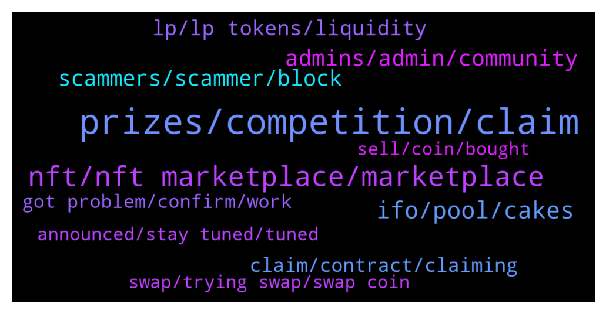

# **@PancakeSwap**
 ## Analysis for **2021-12-23** - **2021-12-24**.

---

## 📊 **Basic Stats**

**n_messages_sent**: 1449

---

---

## 🔝 **Top keywords and related messages**

1. **prizes, competition, claim**

    @rolling_barrel --- *Each member of the level received a size of the award, which was to be distributed among each member of the level. lel* **--->** [TG Discussion](https://t.me/PancakeSwap/2216616)

    @rolling_barrel --- *Not first and not all, I suppose 3-5 ppl received reward* **--->** [TG Discussion](https://t.me/PancakeSwap/2216625)

    @Andy19877 --- *So the prizes we saw is it the same prize we will claim?* **--->** [TG Discussion](https://t.me/PancakeSwap/2217155)

    @Abc97462 --- *I think they really screwed up. It seems it gave the prizes for the whole tier to the first one who claimed* **--->** [TG Discussion](https://t.me/PancakeSwap/2216430)

    @Ceddi200 --- *Bro scroll down the page and read. The prizes is written* **--->** [TG Discussion](https://t.me/PancakeSwap/2217618)

    @GbonezBAS --- *Does that mean they walked away with huge prizes? 😬* **--->** [TG Discussion](https://t.me/PancakeSwap/2217178)

2. **nft, nft marketplace, marketplace**

    @Luukku1 --- *Some were i believe, since people got the NFT* **--->** [TG Discussion](https://t.me/PancakeSwap/2217161)

    @Karthik --- *Ok all r same then i thought ever nft will be different* **--->** [TG Discussion](https://t.me/PancakeSwap/2218042)

    @way2blockchain --- *They can invalidate the NFTs with new contract ! But the tokens are gone! Thats why they are selling fast before pancake announce that they are invalid and are of zero value!* **--->** [TG Discussion](https://t.me/PancakeSwap/2216574)

    @Ceddi200 --- *You might also be asking, “why can’t I buy with CAKE?”. That’s because we want EVERYONE to be able to trade on the NFT marketplace. Trading fees for Phase 1 will be set at 2%. 🔥🥞All fees collected by PancakeSwap will be used to buy back and BURN CAKE in our weekly burns!🔥🥞* **--->** [TG Discussion](https://t.me/PancakeSwap/2218343)

    @HAITIENLK --- *I'm also looking forward to the money hahaha. important is the NFT.* **--->** [TG Discussion](https://t.me/PancakeSwap/2217954)

    @patmotu --- *WTF why is there an adress holding 598 Pancake Squad NFT* **--->** [TG Discussion](https://t.me/PancakeSwap/2219380)

3. **ifo, pool, cakes**

    @MMohitM --- *Sir could you please explain me about ifo staking* **--->** [TG Discussion](https://t.me/PancakeSwap/2215874)

    @HuddsCrypto --- *Hey guys how was Diviner Protocol ifo? Was it a success? I missed out as I was working away but intrested in the next one but thought I'd ask how people got on* **--->** [TG Discussion](https://t.me/PancakeSwap/2216374)

    @QV_zz --- *yea soon - staking for the IFO pool already started* **--->** [TG Discussion](https://t.me/PancakeSwap/2220515)

    @misterrr#9034 --- *Hi i came here from YouTube, they said the IFO of PCS fail terribly, why is that,?? I've been considering to join my first IFO through pancakeswap,* **--->** [TG Discussion](https://t.me/PancakeSwap/2216188)

    @Cell --- *There is a lot of demand for the ifo, because of that, you get not a lot of coins* **--->** [TG Discussion](https://t.me/PancakeSwap/2216189)

    @misterrr#9034 --- *So they get less like around 20dollars dpt although they commit 500dollars worth of cake right, major setback, so will next IFO improved by the team then??* **--->** [TG Discussion](https://t.me/PancakeSwap/2216209)

4. **admins, admin, community**

    @CakeCompounder --- *He is a real admin. Click on his name and check out the groups He is in. ✅* **--->** [TG Discussion](https://t.me/PancakeSwap/2218650)

    @iam68s --- *Admins cant i help people for predictions or is that against the rules?* **--->** [TG Discussion](https://t.me/PancakeSwap/2216263)

    @Luukku1 --- *Admins have tags next to our name. we never dm you first, all ppl that are DMing or calling you now are scammers. Ignore them.* **--->** [TG Discussion](https://t.me/PancakeSwap/2220583)

    @Alex --- *Yeah, some "chef snowball" just dmed saying that he is an admin and is asking if my wallet is verified yet lmfao* **--->** [TG Discussion](https://t.me/PancakeSwap/2216302)

    @Luukku1 --- *Try asking your questions here in the group. Admins might have their inbox flooded* **--->** [TG Discussion](https://t.me/PancakeSwap/2220603)

    @nnothing2 --- *@eko8686  ask in this group then. now admin just online* **--->** [TG Discussion](https://t.me/PancakeSwap/2218040)

5. **scammers, scammer, block**

    @m33Lucky --- *If only the scammers actually got a real job and worked just as hard* **--->** [TG Discussion](https://t.me/PancakeSwap/2217251)

    @Gerva85 --- *As I entered I got 3 different phone calls and 8 scammers DMing me. I fooled them for a while and then blocked* **--->** [TG Discussion](https://t.me/PancakeSwap/2219140)

    @apeling --- *Man hella scammers in here trying to steal you* **--->** [TG Discussion](https://t.me/PancakeSwap/2217929)

    @MHHY1999 --- *Guys two members with Sub-account come my pv  I think they are scammers Pls be careful* **--->** [TG Discussion](https://t.me/PancakeSwap/2216841)

    @Sunnisyde28 --- *😁😁😁😁 there more scammers in this group than I have seen elsewhere* **--->** [TG Discussion](https://t.me/PancakeSwap/2216391)

    @Liston(im) --- *I know scammers please stop texting me* **--->** [TG Discussion](https://t.me/PancakeSwap/2216380)

6. **lp, lp tokens, liquidity**

    @xandercakes --- *Yes like I said, the 0.17% fees collected that go to LP holders are done by just adding the fees from the swap to the overall liquidity pool.   It's explained here in the docs page. If additional LP tokens are being sent to another address, that's something to do with the tokens contract code.  https://docs.pancakeswap.finance/products/pancakeswap-exchange/pancakeswap-pools* **--->** [TG Discussion](https://t.me/PancakeSwap/2219127)

    @xandercakes --- *sort of, the screenshot i keep attaching explains it really well.  basically lets say there are 10 LP tokens representing 10 cake and 10 bnb  (1 LP token = 1 cake + 1 bnb)  if someone else trades 10 cake for 10 bnb , then another user trades 10 bnb for 10 cake, 0.017 cake and 0.017 bnb are taken from the two trades (the 0.17% trading fee). the 0.017 cake and 0.017 bnb are added to the overally liquidity pools so now there are 10.017 cake and 10.017 bnb after the two trades.  so each time there is a trade, the fees for liquidity providers are collected and added to the pool essentially making the LP tokens worth more.* **--->** [TG Discussion](https://t.me/PancakeSwap/2219147)

    @ClanMudhorn --- *Like that shouldn't have anything to do with that. PCS should be paying 0.17% of each txn to all LP holders based on their percentages. That has nothing to do with the extra slippage we charge people* **--->** [TG Discussion](https://t.me/PancakeSwap/2219116)

    @ClanMudhorn --- *i think i am following now. so the liquidity pool is communally hodling what should be all the lp token payouts untill each individual lp provider pulls their liquidty, and only at that time do they see the yield they have earned* **--->** [TG Discussion](https://t.me/PancakeSwap/2219142)

    @xandercakes --- *That isn't controlled by PCS, seems like that token probably has liquidity/transaction fees built into it's code that get sent to the contract owner and admin.* **--->** [TG Discussion](https://t.me/PancakeSwap/2219099)

    @rpoole69 --- *Gotcha, so let's say I supplied a LP pair and received 100 LP tokens, my portion of the .17% would be added to the 100 LP tokens I have?* **--->** [TG Discussion](https://t.me/PancakeSwap/2218455)

7. **claim, contract, claiming**

    @cryptXXXking --- *Contract was already found. Can't do anything. Claiming was turned off. Almost all was already taken* **--->** [TG Discussion](https://t.me/PancakeSwap/2216952)

    @HAITIENLK --- *You can try claim. But, check fee before confirm, if 0.48bnb fee is error* **--->** [TG Discussion](https://t.me/PancakeSwap/2217312)

    @mc_GRAGE --- *What is the problem with the claim mam? (Contract issues?* **--->** [TG Discussion](https://t.me/PancakeSwap/2219879)

    @HAITIENLK --- *battel claim? not yet bro. please wait* **--->** [TG Discussion](https://t.me/PancakeSwap/2217821)

    @GbonezBAS --- *Were people able to claim before the issue?* **--->** [TG Discussion](https://t.me/PancakeSwap/2217145)

    @way2blockchain --- *Yes but you cant claim them because its too less from the total amount in any section* **--->** [TG Discussion](https://t.me/PancakeSwap/2216693)

8. **got problem, confirm, work**

    @guy --- *I am experiencing same issue but it seems nobody will help here* **--->** [TG Discussion](https://t.me/PancakeSwap/2216062)

    @Nicolas --- *It still doesnt work i have tried at least 7 times* **--->** [TG Discussion](https://t.me/PancakeSwap/2219174)

    @Jeff --- *Just wait a little. And try again.* **--->** [TG Discussion](https://t.me/PancakeSwap/2219172)

    @ShaolinDude --- *hit confirm button until morning, maybe you get lucky* **--->** [TG Discussion](https://t.me/PancakeSwap/2216507)

    @almo83 --- *Yes me too, but it's not working this morning* **--->** [TG Discussion](https://t.me/PancakeSwap/2217725)

    @HAITIENLK --- *that issue, please read pin message.* **--->** [TG Discussion](https://t.me/PancakeSwap/2217649)

9. **swap, trying swap, swap coin**

    @JoeMikaelson --- *yes it says like that. thats why im confused. i dont send tokens. i only swap. i've been trading for a long time so i wont be making this kind of mistake. Can i report it to your management please?* **--->** [TG Discussion](https://t.me/PancakeSwap/2219840)

    @Nicolas --- *Hi team ! I have a problem woth the swap, i want to swap a coin so o click "enable AGS" (the name of the coin) i pay the fees etc everything work but the button for swap remains grey ald unclickable ? Do someone have an idea to help me* **--->** [TG Discussion](https://t.me/PancakeSwap/2219171)

    @HAITIENLK --- *5h ^_^. i have to check and swap 1 hours before end* **--->** [TG Discussion](https://t.me/PancakeSwap/2217526)

    @jymjym9 --- *app not working wont enable tokens for swaps just transaction fails* **--->** [TG Discussion](https://t.me/PancakeSwap/2220079)

    @Leroy --- *Im trying to swap bep token with my ledger but i cant get the token enabled* **--->** [TG Discussion](https://t.me/PancakeSwap/2220008)

    @satrioopw --- *Can i have assistance here ? Why i need to input my passphrase every time when i want to swap* **--->** [TG Discussion](https://t.me/PancakeSwap/2219328)

10. **announced, stay tuned, tuned**

    @Ikbuya --- *Please could you tell us if it's going to be today so I'll know how to mark my calendar. I have a lot to keep up with* **--->** [TG Discussion](https://t.me/PancakeSwap/2218245)

    @HAITIENLK --- *will be announced soon, please stay tuned.* **--->** [TG Discussion](https://t.me/PancakeSwap/2217834)

    @HAITIENLK --- *Will be announced soon, please stay tuned* **--->** [TG Discussion](https://t.me/PancakeSwap/2217896)

    @HAITIENLK --- *don't worrry, will be announced soon, please stay tuned.* **--->** [TG Discussion](https://t.me/PancakeSwap/2217943)

    @HAITIENLK --- *will be announced soon, please stay tuned* **--->** [TG Discussion](https://t.me/PancakeSwap/2219881)

    @HAITIENLK --- *i have to wait too ^_^* **--->** [TG Discussion](https://t.me/PancakeSwap/2217947)

