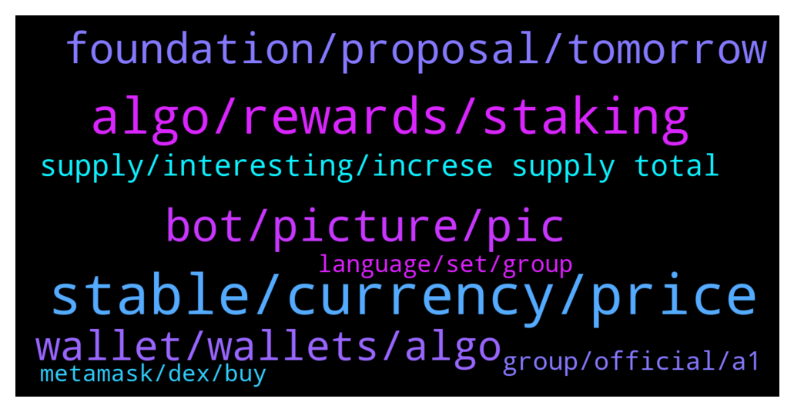

# **@algorand**
 ## Analysis for **2021-12-23** - **2021-12-24**.

---

## 📊 **Basic Stats**

**n_messages_sent**: 233

---

---

## 🔝 **Top keywords and related messages**

1. **stable, currency, price**

    @Ninvel --- *Hello, how are you? I am a junior developer of JAVA, I have got a project, the project was in tezos but I have another phiilosophy than the tezos comunity, my project is create a wallet for entreprises based in blockchains, this wallet would be desinged to be comfortable to use for physical and online stores, the problem with the tezos community is that my phylosophy is based on the international use of a “neutral” token (native token)  which must be stable (as a stablecoin but without being linked with another coin) Is the algo token designed to be long-term stable for use in international trade? thanks for the answer 😄* **--->** [TG Discussion](https://t.me/algorand/324855)

    @Ninvel --- *The use of USD is a problem because it creates a dependency on the dollar, in addition, the commissions are paid in the native token* **--->** [TG Discussion](https://t.me/algorand/324867)

    @Ninvel --- *I do not know if I explain myself well but the stability of a currency is a purely economic concept and is measured with the generalized changes in prices of products and services (inflation and deflation) the dollar is stable because its inflation is very small* **--->** [TG Discussion](https://t.me/algorand/324883)

    @Ninvel --- *Well, thank you very much for answering me, but my interest is precisely not to use a stablecoin but rather that the native currency itself is stable, it just seems that in this algorand it does not fulfill my needs.* **--->** [TG Discussion](https://t.me/algorand/324888)

    @Martin --- *Life is not stable man. Everything changes except change. Your super stable-neutral coin is a honorable idea but that’s impossible to achieve in the real world.* **--->** [TG Discussion](https://t.me/algorand/324902)

    @Ninvel --- *If a pizza is worth 1 algo in 5 years, how much will the pizza be worth? that's the metric* **--->** [TG Discussion](https://t.me/algorand/324879)

2. **algo, rewards, staking**

    @Wurzelbear --- *Will the staking rewards go up again or stay that low?* **--->** [TG Discussion](https://t.me/algorand/325409)

    @MackDenver --- *The prize is in ALGO as I can understand* **--->** [TG Discussion](https://t.me/algorand/325054)

    @Kirito2187 --- *oh so it's not divided equally, when he votes with a large ALGO token, it's likely that he will get an award in the form of a large ALGO token too* **--->** [TG Discussion](https://t.me/algorand/325404)

    @Abubakar --- *What is apy in algo wallet on algo staking* **--->** [TG Discussion](https://t.me/algorand/325131)

    @KAPIBAYSIDE --- *When staking in algo in algo prize game do we get more algo or just yieldly?* **--->** [TG Discussion](https://t.me/algorand/325053)

    @aleks_qaz --- *hey folks, just wanted to check if the current algo staking apy is under 1%?* **--->** [TG Discussion](https://t.me/algorand/325419)

3. **bot, picture, pic**

    @riqua21 --- *I know but I was wondering if race does play into perceptions about an account being a bot.  I'm sure it does but it's unconscious* **--->** [TG Discussion](https://t.me/algorand/325172)

    @mrlovin --- *Why each bot takes profile pictures of Chinese woman?* **--->** [TG Discussion](https://t.me/algorand/325154)

    @hope9999999 --- *The problem is nowadays we do not know whether we are chatting with AI bots or not. Be careful oneday you will wake up in Avatar world and cannot come back 🤪🤪🤪* **--->** [TG Discussion](https://t.me/algorand/325266)

    @mrlovin --- *But if you see a Chinese women texting „hi“ it becomes obvious that it is a bot   If they would have a bot as profile pic I wouldn’t think so  Because a bot never says he is one* **--->** [TG Discussion](https://t.me/algorand/325157)

    @mrlovin --- *If each not would have a picture of a white women but behave like a bot I would also doubt accounts which have such pictures  The same for black man and so on  Nothing racist here* **--->** [TG Discussion](https://t.me/algorand/325169)

    @Lina --- *Why, I’m not a robot, even though I have Asian female avatars* **--->** [TG Discussion](https://t.me/algorand/325347)

4. **foundation, proposal, tomorrow**

    @Fmv --- *Can someone pass me the contract for something please* **--->** [TG Discussion](https://t.me/algorand/325295)

    @MackDenver --- *The proposal details will be revealed once the governance phase starts* **--->** [TG Discussion](https://t.me/algorand/325359)

    @bigboy87183 --- *Thia is old news, and gas finished. The old accelerated vesting plan...   You should see the date at top of the article...* **--->** [TG Discussion](https://t.me/algorand/325019)

    @Elmenjo --- *The foundation api said it will start tomorrow 25, on Twitter it said few hours. What is correct?* **--->** [TG Discussion](https://t.me/algorand/325361)

    @walker_sw --- *Thanks. Do you know what the proposal is?* **--->** [TG Discussion](https://t.me/algorand/325027)

    @angelo9007 --- *I will let the team know* **--->** [TG Discussion](https://t.me/algorand/325283)

5. **wallet, wallets, algo**

    @pupzemli18 --- *I want 1 seed phrase and 10 wallets, this is possible? 10 new wallets I mean* **--->** [TG Discussion](https://t.me/algorand/325104)

    @MackDenver --- *You can simply import the wallet you want to use* **--->** [TG Discussion](https://t.me/algorand/325101)

    @pupzemli18 --- *Tell me pls, how can I make second, third and more wallets?) like in metamask* **--->** [TG Discussion](https://t.me/algorand/325100)

    @vohuytang --- *I want to use the DApp function on Algorand Wallet* **--->** [TG Discussion](https://t.me/algorand/325087)

    @MackDenver --- *MyAlgo wallet supports connecting to Algorand dapps.* **--->** [TG Discussion](https://t.me/algorand/325089)

    @vohuytang --- *Can i use Google web version Algorand wallet?* **--->** [TG Discussion](https://t.me/algorand/325076)

6. **supply, interesting, increse supply total**

    @EnalTesla20 --- *Total supply of 10 billion no more additions...?* **--->** [TG Discussion](https://t.me/algorand/324961)

    @NightAlgorand --- *Nah, we dont run on trc20.* **--->** [TG Discussion](https://t.me/algorand/325212)

    @MackDenver --- *That is an interesting idea, as our ecosystem grows we might see something similar in the future* **--->** [TG Discussion](https://t.me/algorand/325371)

    @OKEx_Gody --- *However, the current ecology is still very few. Whether it is necessary to upgrade TPS is a problem* **--->** [TG Discussion](https://t.me/algorand/325256)

    @Pablo_cast --- *more than 2000 rugpulls already be careful* **--->** [TG Discussion](https://t.me/algorand/325129)

    @Chocoim --- *So there is no such thing as fixed supply* **--->** [TG Discussion](https://t.me/algorand/325001)

7. **group, official, a1**

    @MackDenver --- *I think you are in the wrong group. This is the Algorand group* **--->** [TG Discussion](https://t.me/algorand/325331)

    @AlexanderShosha --- *Merry Christmas to the Algorand community!* **--->** [TG Discussion](https://t.me/algorand/325307)

    @SynapseBlock --- *Hello guys - I know this is the official group since I entered the link from Binance. I am totally new to Algorand 🙂 Wuhuu* **--->** [TG Discussion](https://t.me/algorand/325208)

    @Dave --- *There is no limits on Algorand 🤣🤣🤣🤣* **--->** [TG Discussion](https://t.me/algorand/325192)

    @NightAlgorand --- *You are in algorand now, we have more power here.* **--->** [TG Discussion](https://t.me/algorand/325143)

    @NightAlgorand --- *Welcome to Algorand Official channel 🙂* **--->** [TG Discussion](https://t.me/algorand/325138)

8. **language, set, group**

    @MackDenver --- *You should join the Spanish group  https://t.me/algorand_es* **--->** [TG Discussion](https://t.me/algorand/325289)

    @patrick_crypto --- *Not an official group but you might try @algorand_price I have an automatic translator set up so assuming you have your language set in Telegram, it should automatically translate to/from  your native language and the channel’s set language (English)* **--->** [TG Discussion](https://t.me/algorand/325287)

    @Fmv --- *I can't speak in the other group* **--->** [TG Discussion](https://t.me/algorand/325296)

    @Real_Noonlord --- *Thanks, language is not a problem for me but big deal for a lot of people* **--->** [TG Discussion](https://t.me/algorand/325293)

    @Ninvel --- *what does mean LMAO? sorry, I’m spanish and my english is very bad* **--->** [TG Discussion](https://t.me/algorand/324859)

    @MackDenver --- *There is no Korean group at the moment* **--->** [TG Discussion](https://t.me/algorand/325336)

9. **metamask, dex, buy**

    @mrlovin --- *If I remember correctly you can’t swap directly on Metamask as well. You still have to go to a dex and just approve the transaction with Metamask. It works the same with algo. You go to a dex and approve the transaction with the algowallet.* **--->** [TG Discussion](https://t.me/algorand/325385)

    @mrlovin --- *What is the difference from using Metamask on a dex to using Algowallet on a dex?* **--->** [TG Discussion](https://t.me/algorand/325388)

    @AgenteBanderas --- *The difference is that by opening metamask I can buy eth through the same app, if I open algowallet I don't have the possibility to buy algo while staying in the same app, and i can't use apple pay or services like this* **--->** [TG Discussion](https://t.me/algorand/325390)

    @AgenteBanderas --- *Well, metamask use transak to allow you to buy crypto, and it's much closer to being a sort of unique environment, now I use coinbase to buy algo, and it is much longer and not user friendly process in my opinion* **--->** [TG Discussion](https://t.me/algorand/325386)

    @mrlovin --- *There is no Metamask in the Algorand world* **--->** [TG Discussion](https://t.me/algorand/325301)

    @FereydoonAttar --- *Buy on Decoin now, so much easier and cheaper than use DEX* **--->** [TG Discussion](https://t.me/algorand/325048)

