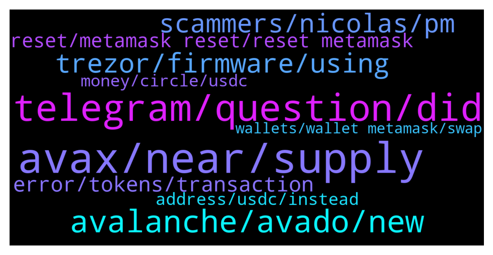

# **@avalancheavax**
 ## Analysis for **2021-12-23** - **2021-12-24**.

---

## 📊 **Basic Stats**

**n_messages_sent**: 229

---

---

## 🔝 **Top keywords and related messages**

1. **avax, near, supply**

    @zigdam --- *currently, doing AVAX->ETH——RAINBOWBRIDGE——->NEAR don't like Eth in between* **--->** [TG Discussion](https://t.me/avalancheavax/316976)

    @VatsalS33 --- *Good to see fellow Indian Avax maxis :)* **--->** [TG Discussion](https://t.me/avalancheavax/317093)

    @coctail_Bae --- *Hi there, I’m new to avax and c chain, I’m mostly playing on bsc I would like to know what’s the equivalent of poocoin on the avax chain? Thanks* **--->** [TG Discussion](https://t.me/avalancheavax/316870)

    @Gorlim1981 --- *Yeah... StackOS is a bit under the radar.... But in terms of product it's top notch already... U should check it out* **--->** [TG Discussion](https://t.me/avalancheavax/317051)

    @W --- *but ya agree, a direct bridge Avax-Near or Aurora would be much nicer* **--->** [TG Discussion](https://t.me/avalancheavax/316983)

    @Asolohcok --- *Best way is to send BUSD to CEX then Buy AVAX , And Withdraw AVAX via C-Chain , you can buy USDT.e on DEX with AVAX you have* **--->** [TG Discussion](https://t.me/avalancheavax/317014)

2. **telegram, question, did**

    @BuchiSmart --- *Why are people Dm me to solving my problem.  I simply asked a question here and expected an answer* **--->** [TG Discussion](https://t.me/avalancheavax/316662)

    @BuchiSmart --- *help me get an answer based on my question pls* **--->** [TG Discussion](https://t.me/avalancheavax/316724)

    @BuchiSmart --- *ok thanks  , why can't I get someone here?* **--->** [TG Discussion](https://t.me/avalancheavax/316719)

    @BuchiSmart --- *Why is no one addressing this issue here pls?* **--->** [TG Discussion](https://t.me/avalancheavax/316691)

    @povapay --- *But you are replying to messages again admin* **--->** [TG Discussion](https://t.me/avalancheavax/316654)

    @Nicolas_A --- *you can avoid getting invited by fake groups by changing your privacy settings. Telegram Settings > Privacy > Groups change from Everyone to Contact only* **--->** [TG Discussion](https://t.me/avalancheavax/316618)

3. **avalanche, avado, new**

    @Talux --- *We often read about the 4500 tps  that Avalanche is capable of. How many tps can be achieved on the C chain specifically?* **--->** [TG Discussion](https://t.me/avalancheavax/316795)

    @aco1731 --- *in usd terms never was so expensive for sure* **--->** [TG Discussion](https://t.me/avalancheavax/316921)

    @aco1731 --- *why 25 is the floor... even 25 is expensive today lol* **--->** [TG Discussion](https://t.me/avalancheavax/316917)

    @metad3pt --- *Embr is a new BalancerV2 fork on Avalanche, chekk it out at https://embr.finance* **--->** [TG Discussion](https://t.me/avalancheavax/317074)

    @BuchiSmart --- *For the past two days, I can't  do anything on avalanche network* **--->** [TG Discussion](https://t.me/avalancheavax/316688)

    @elizabeth_baker --- *Avalanche be with a bullish price action* **--->** [TG Discussion](https://t.me/avalancheavax/317153)

4. **trezor, firmware, using**

    @Cbears22 --- *Yes. Trezor T only supports avax C chain I believe. Not X or P. Firmware may fix.* **--->** [TG Discussion](https://t.me/avalancheavax/316747)

    @vampyren --- *ah Trezor....yeah maybe update app there + firmware.....and when you say tranact , do you mean send or what? what page?* **--->** [TG Discussion](https://t.me/avalancheavax/316745)

    @BuchiSmart --- *I don't need to buy another trezor, right?* **--->** [TG Discussion](https://t.me/avalancheavax/316764)

    @BuchiSmart --- *How can I update that firmware, I see that pops up when I want to approve transaction* **--->** [TG Discussion](https://t.me/avalancheavax/316755)

    @vampyren --- *Ah ok then latest version 10.8.1* **--->** [TG Discussion](https://t.me/avalancheavax/316710)

    @oathtobarbatos --- *Try using Trezor Suite, the latest firmware is 1.10.4 as far as I know* **--->** [TG Discussion](https://t.me/avalancheavax/316758)

5. **scammers, nicolas, pm**

    @Nicolas_A --- *Correct. Admins never DM first. only scammer do* **--->** [TG Discussion](https://t.me/avalancheavax/316614)

    @BeIntrinsic --- *Nicolas, is it safe to say you do not just randomly PM folks?* **--->** [TG Discussion](https://t.me/avalancheavax/316613)

    @boostoss --- *Dude shut up and listen to Nicolas only, block everyone else* **--->** [TG Discussion](https://t.me/avalancheavax/317143)

    @SeqAnto --- *He tries to scam in pm* **--->** [TG Discussion](https://t.me/avalancheavax/317115)

    @VatsalS33 --- *Exactly that's the point, that's why it's more funny, lifeless scammers.* **--->** [TG Discussion](https://t.me/avalancheavax/317103)

    @Cbears22 --- *Dont trust anyone who DM's you. They are scammers. BTW* **--->** [TG Discussion](https://t.me/avalancheavax/316734)

6. **error, tokens, transaction**

    @FluffyRat --- *Anyone else having issues swapping their gb token to e.g. usdc.e or any other token for that matter?  I'm getting an error when swapping on the front-end of pangolin. The tx is not even being broadcasted to the network* **--->** [TG Discussion](https://t.me/avalancheavax/316837)

    @BuchiSmart --- *I can't transact, claim tokens or even buy or sell tokens. what's going on. I have reset my account  yet same problem* **--->** [TG Discussion](https://t.me/avalancheavax/316689)

    @BuchiSmart --- *Hi, please for the past two days I cannot interact with any avalanche token on my metamask.  I received transaction 251 failed error: message unknown.  What should I do please?* **--->** [TG Discussion](https://t.me/avalancheavax/316649)

    @Nicolas_A --- *Try to do another type of transaction also* **--->** [TG Discussion](https://t.me/avalancheavax/316653)

    @FluffyRat --- *All other tokens work fine.  I'm reading up on this error and seems it might have to do with the slippage tolerance* **--->** [TG Discussion](https://t.me/avalancheavax/316846)

    @FluffyRat --- *"The transaction cannot succeed due to error: undefined. This is probably an issue with one of the tokens you are swapping."* **--->** [TG Discussion](https://t.me/avalancheavax/316839)

7. **reset, metamask reset, reset metamask**

    @Nicolas_A --- *Try to reset Metamask perhaps. Try another token* **--->** [TG Discussion](https://t.me/avalancheavax/316842)

    @oathtobarbatos --- *Try resetting your Metamask wallet, there has been an issue with Metamask and you might have to reset your profile. Settings > Advanced > Reset profile* **--->** [TG Discussion](https://t.me/avalancheavax/316701)

    @Nicolas_A --- *A few seconds if it’s still pending it means either you have to reset Metamask or the gas price is too low* **--->** [TG Discussion](https://t.me/avalancheavax/316608)

    @oathtobarbatos --- *This is a Metamask issue, try restarting your Metamask account* **--->** [TG Discussion](https://t.me/avalancheavax/316970)

    @gfrancaviglia --- *please check if your Tx is pending/stuck on metamask. If so, you should reset metamask* **--->** [TG Discussion](https://t.me/avalancheavax/316963)

    @BuchiSmart --- *I did reset it ,still nothing.* **--->** [TG Discussion](https://t.me/avalancheavax/316703)

8. **address, usdc, instead**

    @No name --- *I was sending usdc from my metamask wallet 1 account to 2 account and instead of putting my wallet 2 address to send usdc I instead put the usdc contact and sent* **--->** [TG Discussion](https://t.me/avalancheavax/316830)

    @Nicolas_A --- *you only have access to 1 C chain address per account in the web wallet* **--->** [TG Discussion](https://t.me/avalancheavax/317085)

    @No name --- *I had copied the usdc address to add on my second wallet so I can see the funds so I did that and then when I went to send from wallet 1 to wallet 2 I pasted the usdc address in the send to part* **--->** [TG Discussion](https://t.me/avalancheavax/316856)

    @No name --- *Sending from wallet 1 to wallet 2  Instead of putting is the sending on metamask my wallet 2 address I pasted usdc contract address* **--->** [TG Discussion](https://t.me/avalancheavax/316833)

    @okanenoodles --- *ok it's still im my eth wallet sorry* **--->** [TG Discussion](https://t.me/avalancheavax/316807)

    @okanenoodles --- *If I rejected the second transaction where's my eth?* **--->** [TG Discussion](https://t.me/avalancheavax/316806)

9. **money, circle, usdc**

    @Tvei2 --- *Circle can in theory freeze the assets and issue new usdc for you, I’ve read Tether has helped out restoring lost funds before. If it’s a huge amount Circle might be willing to help.* **--->** [TG Discussion](https://t.me/avalancheavax/316860)

    @Julie --- *Friends, did you make money or lose money in your investment today? Anyway, I made money. God bless, there is only happiness in my life.* **--->** [TG Discussion](https://t.me/avalancheavax/316955)

    @kevlovin --- *yeah man thats a bummer to hear for sure. i mean unless you reach out to usdc coin i dont think there is much anyone can do for u and i dont really think they are going to do much. its honestly the negitive side of blockchain but yeah 🥲🥲 thoughts and prayers are with you* **--->** [TG Discussion](https://t.me/avalancheavax/316857)

    @APExCaesar --- *I think circle pay runs usdc* **--->** [TG Discussion](https://t.me/avalancheavax/316838)

    @No name --- *Now I don't have my usdc funds* **--->** [TG Discussion](https://t.me/avalancheavax/316831)

    @No name --- *And now I don't have the funds* **--->** [TG Discussion](https://t.me/avalancheavax/316834)

10. **wallets, wallet metamask, swap**

    @kevlovin --- *yessir, i get it crypto can be good and bad. best way to keep funds in wallet is on metamask just click create wallet and then always transfer between wallets (it will show you all the wallets you have) then its basically impossible to loose because all you have are options for your wallets* **--->** [TG Discussion](https://t.me/avalancheavax/316855)

    @ruch149 --- *Hello guys. I see that in my wallet, I have WAVAX (with snowtrace), but when I try to swap it on traderjoe, it says I have 0. @admin any help on that please?* **--->** [TG Discussion](https://t.me/avalancheavax/316892)

    @oathtobarbatos --- *It won't change your balance, don't worry   https://support.avax.network/en/articles/4872721-metamask-transactions-are-stuck-rejected* **--->** [TG Discussion](https://t.me/avalancheavax/316971)

    @vampyren --- *I know its super annoying when wallet locks* **--->** [TG Discussion](https://t.me/avalancheavax/316737)

    @oathtobarbatos --- *It happens in which wallet? Metamask? Avalanche Wallet? Doing a swap?* **--->** [TG Discussion](https://t.me/avalancheavax/316692)

