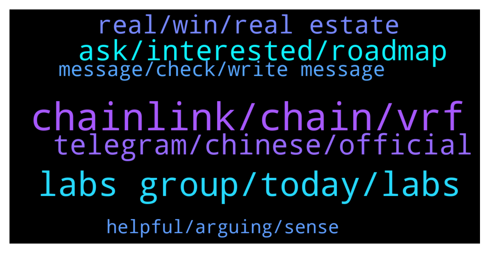

# **@chainlinkofficial**
 ## Analysis for **2021-12-23** - **2021-12-24**.

---

## 📊 **Basic Stats**

**n_messages_sent**: 111

---

---

## 🔝 **Top keywords and related messages**

1. **chainlink, chain, vrf**

    @jackdavid01 --- *Hello I need info about the chain link* **--->** [TG Discussion](https://t.me/chainlinkofficial/357031)

    @Wu_Hu --- *We will be building our NFT Marketplace AGORA, and in-game NFTs with chainlink* **--->** [TG Discussion](https://t.me/chainlinkofficial/357004)

    @Peter --- *When will stake option be able to done for investors?* **--->** [TG Discussion](https://t.me/chainlinkofficial/357084)

    @JoshSimenhoff --- *Ever wondered what exactly the metaverse is ✨  Read this recent blog post for a primer on the metaverse, covering the core technologies and concepts behind it and why blockchains and Chainlink decentralized oracle networks are crucial for developing a user-owned, interconnected virtual world 🔗 👇 https://blog.chain.link/what-is-the-metaverse* **--->** [TG Discussion](https://t.me/chainlinkofficial/357077)

    @juankaramoy --- *and for those that would like to learn more about VRF check out this article https://blog.chain.link/chainlink-vrf-on-chain-verifiable-randomness/* **--->** [TG Discussion](https://t.me/chainlinkofficial/356997)

    @Linkederic --- *https://t.me/chainlinkedesp  I don’t remember the first three exchanges, to be honest.* **--->** [TG Discussion](https://t.me/chainlinkofficial/356908)

2. **labs group, today, labs**

    @jakelabsgroup --- *Mike won't be joining us today, as he is not feeling well. Thank you Juan for organizing.* **--->** [TG Discussion](https://t.me/chainlinkofficial/356954)

    @JoshSimenhoff --- *Hey William, happy holidays to you as well!* **--->** [TG Discussion](https://t.me/chainlinkofficial/357110)

    @juankaramoy --- *Thank you all! and Hope to see you soon!* **--->** [TG Discussion](https://t.me/chainlinkofficial/356999)

    @juankaramoy --- *We'll be having a Q&A session here with LABS Group in 25 min. Stay tuned!* **--->** [TG Discussion](https://t.me/chainlinkofficial/356939)

    @jakelabsgroup --- *Hello everyone, I am Jake from LABS Group. I'm doing very well, happy to be here.* **--->** [TG Discussion](https://t.me/chainlinkofficial/356946)

    @juankaramoy --- *Glad to hear you are all well!* **--->** [TG Discussion](https://t.me/chainlinkofficial/356949)

3. **telegram, chinese, official**

    @James --- *Hello dev is there any Chinese group here?* **--->** [TG Discussion](https://t.me/chainlinkofficial/357020)

    @Author --- *Hello Dev any China group here!?..* **--->** [TG Discussion](https://t.me/chainlinkofficial/357061)

    @nam_nguyenson --- *China has a telegram group, It’s called @chainlinkfans (unofficial) and please also feel free to check out our Chinese communities (official) here:  https://blog.chain.link/chainlink-chinese-communities/* **--->** [TG Discussion](https://t.me/chainlinkofficial/357171)

    @harrumphharrumph --- *China has a telegram group, It’s called @chainlinkfans (unofficial) and please also feel free to check out our Chinese communities (official) here:  https://blog.chain.link/chainlink-chinese-communities/* **--->** [TG Discussion](https://t.me/chainlinkofficial/357062)

    @aeyahi --- *China has a telegram group, It’s called @chainlinkfans (unofficial) and please also feel free to check out our Chinese communities (official) here:  https://blog.chain.link/chainlink-chinese-communities/* **--->** [TG Discussion](https://t.me/chainlinkofficial/357036)

    @Sylvarantt --- *China has a telegram group, It’s called @chainlinkfans (unofficial) and please also feel free to check out our Chinese communities (official) here:  https://blog.chain.link/chainlink-chinese-communities/* **--->** [TG Discussion](https://t.me/chainlinkofficial/357022)

4. **ask, interested, roadmap**

    @mykillerson --- *cmon man, is it really trouble, that I asked about goal and roadmap?  I read the medium and want to join one of the projects who're on this list and for me is better to join the group and ask members about the project, to find the best for me Cuz the best way to understand smth is to ask the community* **--->** [TG Discussion](https://t.me/chainlinkofficial/357137)

    @mykillerson --- *what is the main point of the project? Where I can find any whitepaper or roadmap about it?* **--->** [TG Discussion](https://t.me/chainlinkofficial/357119)

    @Sylvarantt --- *Hi Jack, I think this article is a great first starter  https://blog.chain.link/what-is-chainlink/* **--->** [TG Discussion](https://t.me/chainlinkofficial/357032)

    @juankaramoy --- *here are the the socials where you can stay up to date with the projects and ask any other questions you have* **--->** [TG Discussion](https://t.me/chainlinkofficial/356995)

    @juankaramoy --- *Please do follow, talk and ask questions in their social media platform to stay updated and to learn more about the project.* **--->** [TG Discussion](https://t.me/chainlinkofficial/356983)

    @juankaramoy --- *Last but not least what’s next on your project’s roadmap for those very enthusiastic about your project here today?* **--->** [TG Discussion](https://t.me/chainlinkofficial/356984)

5. **real, win, real estate**

    @jakelabsgroup --- *Both works! Both of our platforms provides an easy starting point for blockchain and real estates aficinados, with the former one allowing investors to grow their wealth with real estate with just 100 USDT, and have a little fun with our WIN platform winning rewards.   LABS WIN Platform will be launched in the coming few weeks. So please do follow our social media channels and stay tunned!* **--->** [TG Discussion](https://t.me/chainlinkofficial/356981)

    @juankaramoy --- *I has been a pleasant 45 min learning about the WIN Platform and your real estate investing platform. We just have a few questions here to wrap up our Q&A session for today* **--->** [TG Discussion](https://t.me/chainlinkofficial/356979)

    @jakelabsgroup --- *LABS has been focusing on digital Real Estate investment. The WIN Platform is an innovative and revolutionary idea to give back to the LABS supporters. With just $5 USD worth of LABS, participants can enter the raffle and try their luck.  The payoff of the winning ticket varies each day. Each sold ticket increases the prize pool. When a prize pool isn't won, the next round's prize pool will be accumulated from the previous round; the longer it's been since someone has won the jackpot, the larger the prize pool will be.* **--->** [TG Discussion](https://t.me/chainlinkofficial/356964)

    @juankaramoy --- *Love the idea of giving more opportunity to the general mass to get involved in real estate investing via a fraction of its price point as we know real estate investing can cost a lot just to even get started with* **--->** [TG Discussion](https://t.me/chainlinkofficial/356962)

    @jakelabsgroup --- *Sure thing! LABS Group is a digital investment platform that provides access to fractionalized property ownership and enables the continuous trading of real estate assets-backed tokenized shares on a regulated security exchange.  We use blockchain technology and smart contracts to ensure complete transparency over a borderless ecosystem where property developers and investors can interact seamlessly and with unprecedented efficiency. So that people could invest in real estate projects in a fraction of its price point. Making real estate investment available for everyone.* **--->** [TG Discussion](https://t.me/chainlinkofficial/356960)

    @jakelabsgroup --- *Whoa - that's a great question. The WIN platform is part of our ecosystem to create more utilities to our LABS token. While they could invest in real estate with a lower entry barrier, why not winning extra bonuses and rewards with WIN? It is also a perfect starting point for members to start their blockchain investment journey.* **--->** [TG Discussion](https://t.me/chainlinkofficial/356977)

6. **message, check, write message**

    @atakankendir --- *why can't i write a message why is it always deleted??* **--->** [TG Discussion](https://t.me/chainlinkofficial/356915)

    @harrumphharrumph --- *Check the information in the pinned message or in this one: https://t.me/chainlinkofficial/356865* **--->** [TG Discussion](https://t.me/chainlinkofficial/357123)

    @Linkederic --- *To answer your question see this page https://chain.link/community/advocates* **--->** [TG Discussion](https://t.me/chainlinkofficial/356917)

    @Thelordtrillion --- *Ok thanks i will look for it* **--->** [TG Discussion](https://t.me/chainlinkofficial/357008)

    @Linkederic --- *I saw your message, the above is my reply* **--->** [TG Discussion](https://t.me/chainlinkofficial/356920)

    @atakankendir --- *Ok can you check please? :)* **--->** [TG Discussion](https://t.me/chainlinkofficial/356918)

7. **helpful, arguing, sense**

    @DrSebs --- *gotta love the people who just come in here and ask random questions🤣 ..... the laziness 😴* **--->** [TG Discussion](https://t.me/chainlinkofficial/357121)

    @mykillerson --- *lol, is this a problem? I can leave* **--->** [TG Discussion](https://t.me/chainlinkofficial/357122)

    @Shogun187 --- *This community is indeed quite helpful; we just often encourage people to do some of their own due diligence 👍* **--->** [TG Discussion](https://t.me/chainlinkofficial/357139)

    @DrSebs --- *but there is no harm in having a bit of fun is there:)* **--->** [TG Discussion](https://t.me/chainlinkofficial/357132)

    @harrumphharrumph --- *Let’s try to be helpful. There’s no sense in arguing or insulting one another.* **--->** [TG Discussion](https://t.me/chainlinkofficial/357130)

