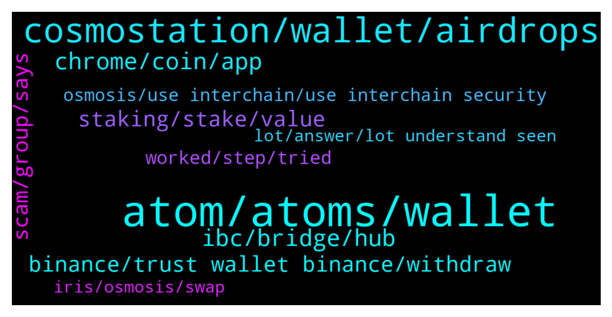

# **@cosmosproject**
 ## Analysis for **2021-12-23** - **2021-12-24**.

---

## 📊 **Basic Stats**

**n_messages_sent**: 410

---

---

## 🔝 **Top keywords and related messages**

1. **atom, atoms, wallet**

    @AtomJazz --- *You can stake ATOM or you can use it in DeFi applications for yields. Osmosis and Sifchain for example* **--->** [TG Discussion](https://t.me/cosmosproject/458857)

    @ZoltanAtom --- *Hi there,if your Atom at Keplr or Cosmostation wallets, you are able to Stake your Atom. If you hold your Atoms at another non-custodial wallets, I suggest you to import your mnemonics seed to recommended wallets.(Keplr/Cosmostation)* **--->** [TG Discussion](https://t.me/cosmosproject/459297)

    @Dr. --- *I've been researching COSMOS and think the tech is awesome, I'm a dev, but I'm concerned with the tokenomics of ATOM. unlimited supply is the biggest red flag. Can anyone speak to this?* **--->** [TG Discussion](https://t.me/cosmosproject/459196)

    @ramirolozc --- *What is happening that I cannot deposit atom into exchanges?* **--->** [TG Discussion](https://t.me/cosmosproject/459081)

    @Tom --- *I have staked my atoms in Atomic wallet for over a year now. I want to unstake it move them to Kepler. Is there a cooling period for withdrawal after unstake?* **--->** [TG Discussion](https://t.me/cosmosproject/458931)

    @SoberaniaFin --- *Hello people! Question: Could it be that it is not possible to deposit ATOM in Binance right now?* **--->** [TG Discussion](https://t.me/cosmosproject/459407)

2. **cosmostation, wallet, airdrops**

    @lightsascha --- *Woah, the Roadmap for 2022 is so exciting! So much happening and coming for us Cosmonauts ❤️❤️😍😍  https://blog.cosmos.network/whats-coming-to-cosmos-in-2022-ce8e48d383ab* **--->** [TG Discussion](https://t.me/cosmosproject/459066)

    @Cordtus --- *Cosmostation or keplr wallet are the recommended wallets. Also ignore all DM right now they are scams* **--->** [TG Discussion](https://t.me/cosmosproject/459177)

    @Fayvivien --- *Which app is the best to connect with trust wallet?  Keplr or Cosmostation? I don't usually do airdrop. I do only buying and staking.* **--->** [TG Discussion](https://t.me/cosmosproject/458516)

    @ZoltanAtom --- *Sure. Cosmostation is the recommended wallet. But you will need to use Keplr wallet to claim your airdrops. So you always have an option to import your mnemonics seed to Keplr. (If someone DM to you,block and report⚠️⚠️⚠️)* **--->** [TG Discussion](https://t.me/cosmosproject/459408)

    @lightsascha --- *Truly unique, what Cosmos enables. And now also the hint of Cosmwasm on the hub, I think this is great news 😊😊* **--->** [TG Discussion](https://t.me/cosmosproject/459068)

    @ZoltanAtom --- *Basically new chain chooses shared security because new chain has none.Cosmos doesn’t push them to use it. Not mandatory. So their choice to use it or not.* **--->** [TG Discussion](https://t.me/cosmosproject/458911)

3. **chrome, coin, app**

    @MK --- *In the Keplr, I see only one address* **--->** [TG Discussion](https://t.me/cosmosproject/459462)

    @g4u5591 --- *Hi, is there any trick to install keplr extension in Brave browser? It gives me an error* **--->** [TG Discussion](https://t.me/cosmosproject/458844)

    @ZoltanAtom --- *Keplr mobile app only supports 4 chain at the moment. Please use Cosmostation app or Keplr web wallet to get your IRIS address.* **--->** [TG Discussion](https://t.me/cosmosproject/459466)

    @AtomJazz --- *It's officially supported on Chrome only but should work on Brave too https://medium.com/chainapsis/how-to-use-keplr-wallet-40afc80907f6?source=user_profile---------0----------------------------* **--->** [TG Discussion](https://t.me/cosmosproject/458845)

    @ZoltanAtom --- *You should use Keplr wallet to skate your assets.* **--->** [TG Discussion](https://t.me/cosmosproject/459504)

    @Cordtus --- *See my other message ^^^ swap for another coin that they offer that is also compatible on keplr.* **--->** [TG Discussion](https://t.me/cosmosproject/459243)

4. **ibc, bridge, hub**

    @ZoltanAtom --- *Hi there,after Vega upgrade Cosmos hub became ibc router. But no all ibc txs routed by hub.* **--->** [TG Discussion](https://t.me/cosmosproject/458886)

    @Prometheus_Zeus --- *Hi Jazz, will the team prepare a list or web-report showing which chain using the IBC router?* **--->** [TG Discussion](https://t.me/cosmosproject/458786)

    @Totalspud --- *Okay thanks, so basically IBC would still be working for example if the hub when down?* **--->** [TG Discussion](https://t.me/cosmosproject/458887)

    @Totalspud --- *Hey, guys.. is all ibc  transactions routed through the hub?* **--->** [TG Discussion](https://t.me/cosmosproject/458885)

    @cumenez --- *Hi there, in the comsos network there's some bridge?* **--->** [TG Discussion](https://t.me/cosmosproject/459318)

    @kofvi --- *Hi, is the IBC same as crosschain bridge?* **--->** [TG Discussion](https://t.me/cosmosproject/458686)

5. **staking, stake, value**

    @AtomJazz --- *Not automatically. You have to claim manually and stake the rewards* **--->** [TG Discussion](https://t.me/cosmosproject/458825)

    @AtomJazz --- *Interchain security, Interchain accounts, liquid staking... Crazy bullish* **--->** [TG Discussion](https://t.me/cosmosproject/459069)

    @Cordtus --- *And even if you do have value it doesn't mean it's justified. Investors are stupid. Dogecoin is literally a Ponzi scheme memecoin that was in top 10 mcap for an embarrassingly long time* **--->** [TG Discussion](https://t.me/cosmosproject/459203)

    @joey19944 --- *So my tokens are locked up and what happens? I can spend them while they are staked ?* **--->** [TG Discussion](https://t.me/cosmosproject/459323)

    @joey19944 --- *And what happens if you go bankrupt* **--->** [TG Discussion](https://t.me/cosmosproject/459326)

    @MK --- *And how do you stake it? Sorry keep asking many questions. 🙏🏻* **--->** [TG Discussion](https://t.me/cosmosproject/459502)

6. **binance, trust wallet binance, withdraw**

    @fest8 --- *I'm seriously hungry and I can access my money on binance* **--->** [TG Discussion](https://t.me/cosmosproject/459105)

    @ebp700 --- *Damn to binance for trust wallet😡😡😡* **--->** [TG Discussion](https://t.me/cosmosproject/459086)

    @AtomJazz --- *Binance has been having some unexplained issues. Coinbase, Cryptocom and Kraken work normally* **--->** [TG Discussion](https://t.me/cosmosproject/459082)

    @fest8 --- *Please can you help? I have already suspended transactions on the Binance exchange for over five days now* **--->** [TG Discussion](https://t.me/cosmosproject/459096)

    @ZoltanAtom --- *Unfortunately we don’t. You should contact to Binance and ask their customer service. (If someone DM to you, block and report it immediately ⚠️⚠️)* **--->** [TG Discussion](https://t.me/cosmosproject/459419)

    @AtomJazz --- *I mean that's the easiest way until Binance enables withdrawals again* **--->** [TG Discussion](https://t.me/cosmosproject/458545)

7. **scam, group, says**

    @ZoltanAtom --- *There we gooooo 🔥🔥🔥🔥 You can pay at Zamnesia with BitCanna!   https://twitter.com/BitCannaGlobal/status/1474033158416969732* **--->** [TG Discussion](https://t.me/cosmosproject/458940)

    @Lucky_Luck888 --- *I didnt even know why they blocked and kicked me after i joined.. i even cant send any messages yet T_T* **--->** [TG Discussion](https://t.me/cosmosproject/458905)

    @ZoltanAtom --- *I have no idea. You should react out to their admins.* **--->** [TG Discussion](https://t.me/cosmosproject/458906)

    @g4u5591 --- *It says "Access denied"... maybe I've to change some setting?* **--->** [TG Discussion](https://t.me/cosmosproject/458849)

    @AtomJazz --- *No need to do anything. Btw if anyone is DMing you pls block him immidiately* **--->** [TG Discussion](https://t.me/cosmosproject/458501)

    @Fayvivien --- *Btw, I got scam message and scam website link from this guy @cosmoszproject He is pretending like a helping bot. (I've already blocked him, just sharing)* **--->** [TG Discussion](https://t.me/cosmosproject/458511)

8. **worked, step, tried**

    @Totalspud --- *Hey thanks for the reply! I know it's tricky but I'm trying to get as much indepth detail as possible.  Sorry if I'm wrecking your head.* **--->** [TG Discussion](https://t.me/cosmosproject/458916)

    @ZoltanAtom --- *a step by step guide: https://medium.com/chainapsis/how-to-use-keplr-wallet-40afc80907f6* **--->** [TG Discussion](https://t.me/cosmosproject/458933)

    @Merik_binance --- *Sorry, can you tell me how to do it?* **--->** [TG Discussion](https://t.me/cosmosproject/458551)

    @joey19944 --- *Still don’t understand it fully seems so complicated* **--->** [TG Discussion](https://t.me/cosmosproject/459332)

    @SoberaniaFin --- *Yes. I have tried at least 5 different ways I am used to... but none of them worked... that is way I asked in this Cosmos network group...* **--->** [TG Discussion](https://t.me/cosmosproject/459483)

    @Coin_6 --- *Like, figure it out on your own. Im out of options to offer you.* **--->** [TG Discussion](https://t.me/cosmosproject/459479)

9. **osmosis, use interchain, use interchain security**

    @Jokrogge --- *There is an auto compounding in LP osmosis farms or i have to compound manually?* **--->** [TG Discussion](https://t.me/cosmosproject/458634)

    @Totalspud --- *Yeah I'm aware that's its optional. However, my question is more like can osmosis use shared security even though it has its own?* **--->** [TG Discussion](https://t.me/cosmosproject/458914)

    @ZoltanAtom --- *Osmosis has their own validator set to secure themself. I don’t think they will need to use interchain security. But as you aware, osmosis delegators can decide to use interchain security or not via governance proposal.    But technically I don’t know if you can use your own validator set and use interchain security is an option! This question should be directed to devs.* **--->** [TG Discussion](https://t.me/cosmosproject/458915)

    @ZoltanAtom --- *Please join Osmosis channel too ;  https://t.me/osmosis_chat* **--->** [TG Discussion](https://t.me/cosmosproject/459551)

    @Cordtus --- *Osmosis Lab $OSMO [ADMINS NEVER DM] Osmosis $OSMO Fundamental Discussion and Price Speculation chat. app.osmosis.zone $ION t.me/IONGovernanceWorkingGroup https://t.me/osmosis_chat* **--->** [TG Discussion](https://t.me/cosmosproject/459247)

    @Cordtus --- *No all the tokens on osmosis (and IBC in general) are their own independent projects on their own independent blockchains. They are inter chain capable but do not rely on eachother in any way.* **--->** [TG Discussion](https://t.me/cosmosproject/459248)

10. **iris, osmosis, swap**

    @AtomJazz --- *You can withdraw IRIS from Binance to Keplr and swap it to atom on Osmosis DeX* **--->** [TG Discussion](https://t.me/cosmosproject/458542)

    @ZoltanAtom --- *Go to assets on Osmosis. Click the “deposit” and after swap IRIS to Atom. Please join osmosis channel ;  https://t.me/osmosis_chat* **--->** [TG Discussion](https://t.me/cosmosproject/459498)

    @Merik_binance --- *Yep and some iris on it now* **--->** [TG Discussion](https://t.me/cosmosproject/458554)

    @AtomJazz --- *Some are buying Iris on Binance, sending to Keplr wallet, connecting to Osmosis and swapping to ATOM there* **--->** [TG Discussion](https://t.me/cosmosproject/458488)

    @AtomJazz --- *Deposit those IRIS (assets -> deposit)* **--->** [TG Discussion](https://t.me/cosmosproject/458556)

    @FrancescoFran --- *Is MEMO mandatory when withdrawing IRIS from Binance to Keplr?* **--->** [TG Discussion](https://t.me/cosmosproject/459314)

