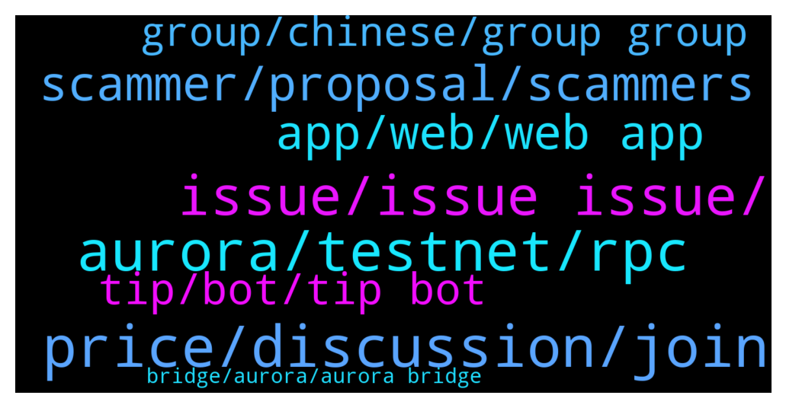

# **@cryptonear**
 ## Analysis for **2021-12-23** - **2021-12-24**.

---

## 📊 **Basic Stats**

**n_messages_sent**: 877

---

---

## 🔝 **Top keywords and related messages**

1. **price, discussion, join**

    @rahulgoel007 --- *We don't do price discussion here  Please join https://t.me/merchantsofnear* **--->** [TG Discussion](https://t.me/cryptonear/247966)

    @Kripto_Raptor --- *you can discuss price related topics here @Serser50   https://t.me/merchantsofnear* **--->** [TG Discussion](https://t.me/cryptonear/247811)

    @iamkemoo --- *You can find out more about TAs in the price chat: https://t.me/merchantsofnear* **--->** [TG Discussion](https://t.me/cryptonear/250090)

    @DeeCryptoGalaxy --- *On gate.io, price of Near was at 10k.... What's up with that?* **--->** [TG Discussion](https://t.me/cryptonear/249762)

    @kv9990 --- *@Pro0604 price discussion or fomo/fud/moon here pls. https://t.me/merchantsofnear* **--->** [TG Discussion](https://t.me/cryptonear/248403)

    @marko_eth --- *do we have any whales here , i would kindly ask those people to dump the price , too much green dildos lately, who even buys at these prices, arent people aware there will...let me correct..there MUST be a correction, and it will only be as brutal as more we climb up...* **--->** [TG Discussion](https://t.me/cryptonear/250531)

2. **aurora, testnet, rpc**

    @S1001001001001 --- *Near and auraora are different. Which is main ? Is aurora a working like gas ? I don't understand for existing 2 coins. Pls elaborate.* **--->** [TG Discussion](https://t.me/cryptonear/247788)

    @cuongdcc --- *on Aurora things go really great* **--->** [TG Discussion](https://t.me/cryptonear/249055)

    @kv9990 --- *Ledger 👀✌️ not sure if it supports Aurora* **--->** [TG Discussion](https://t.me/cryptonear/248016)

    @小猪 --- *hello，i want to know the circulation of aurora* **--->** [TG Discussion](https://t.me/cryptonear/249616)

    @kv9990 --- *Fun fact: Aurora RPC server capacity is 30x of what they had before AURORA IDO. ✌️😎* **--->** [TG Discussion](https://t.me/cryptonear/249061)

    @McFly_George --- *To control wallet and pool in Aurora and Near chain, like Debank or Tin Network* **--->** [TG Discussion](https://t.me/cryptonear/250557)

3. **issue, issue issue, **

    @Kripto_Raptor --- *you are doing something wrong tim* **--->** [TG Discussion](https://t.me/cryptonear/247771)

    @kv9990 --- *It's not normal but you're the third guy asking this in past hour! There're some Server/RPC issue 👀 Team is on it!* **--->** [TG Discussion](https://t.me/cryptonear/249113)

    @Muhammad Salahinezhad --- *Do you know what’s that issue?* **--->** [TG Discussion](https://t.me/cryptonear/248707)

    @kv9990 --- *Please use another browser :) it'll create a new access key ✌️* **--->** [TG Discussion](https://t.me/cryptonear/250499)

    @thanano46 --- *Yes sometimes they have this issue* **--->** [TG Discussion](https://t.me/cryptonear/247688)

    @jhfhgdfr --- *there was nothing to do wrong until now. no additional options selected, just used what was given* **--->** [TG Discussion](https://t.me/cryptonear/247776)

4. **scammer, proposal, scammers**

    @Hilikeice --- *Then let them destroy your reputation* **--->** [TG Discussion](https://t.me/cryptonear/250331)

    @kv9990 --- *Hi ✌️ feel free to DM me ,admins never DM first 👀* **--->** [TG Discussion](https://t.me/cryptonear/248238)

    @larry_lang --- *hmm u know what send me your id* **--->** [TG Discussion](https://t.me/cryptonear/249733)

    @Adex2456 --- *Chk pm ... I think you forget to take my call* **--->** [TG Discussion](https://t.me/cryptonear/249991)

    @thanano46 --- *Sorry i also don't dm first 🤣🤣🤣🤣* **--->** [TG Discussion](https://t.me/cryptonear/248249)

    @kv9990 --- *Hey,you can DM me or @Kripto_Raptor  for AMA proposals👀✌️* **--->** [TG Discussion](https://t.me/cryptonear/248079)

5. **app, web, web app**

    @Ak47fantom --- *It's on the play store . There is no app for it* **--->** [TG Discussion](https://t.me/cryptonear/248732)

    @NEARverse_xd --- *Why only pc? You can use web version in your android device too.* **--->** [TG Discussion](https://t.me/cryptonear/248723)

    @Ak47fantom --- *It doesn't have a mobile version. I only use my mobile . I don't have a pc* **--->** [TG Discussion](https://t.me/cryptonear/248668)

    @larry_lang --- *https://rainbowbridge.app/transfer have u used this app yet?* **--->** [TG Discussion](https://t.me/cryptonear/247941)

    @larry_lang --- *there is none, i am afraid* **--->** [TG Discussion](https://t.me/cryptonear/249763)

    @larry_lang --- *sorry but not so far i dont see a tool for that....* **--->** [TG Discussion](https://t.me/cryptonear/248496)

6. **tip, bot, tip bot**

    @Kripto_Raptor --- *this is how you tip New comers now you try 😊* **--->** [TG Discussion](https://t.me/cryptonear/247532)

    @badlordazekage --- *Okay I think I've got this down... so...... are there things we are to do to get tipped by you?🥺* **--->** [TG Discussion](https://t.me/cryptonear/247608)

    @Ștefan --- *how do i get the tip?* **--->** [TG Discussion](https://t.me/cryptonear/247538)

    @Kripto_Raptor --- *no, it will only spend (you can send tips) as much as you deposit, not more than that.* **--->** [TG Discussion](https://t.me/cryptonear/247594)

    @thanano46 --- *Yes they do tip near but only to the persons whose username is not hidden* **--->** [TG Discussion](https://t.me/cryptonear/247506)

    @thanano46 --- *You just need to login into your tip bot first* **--->** [TG Discussion](https://t.me/cryptonear/247576)

7. **group, chinese, group group**

    @EinyC --- *I’m very confused, I’m new to this group and don’t know what this group does* **--->** [TG Discussion](https://t.me/cryptonear/249223)

    @EinyC --- *I need a friend to talk to, is the group willing to help me* **--->** [TG Discussion](https://t.me/cryptonear/249244)

    @sakhan_22 --- *Is this the Legit TG group? There is so many of them, hard to tell the real one* **--->** [TG Discussion](https://t.me/cryptonear/248196)

    @larry_lang --- *sorry can u explain to me why there is 2 chinese group now=000* **--->** [TG Discussion](https://t.me/cryptonear/248477)

    @Author --- *Hello Dev any China group here?..* **--->** [TG Discussion](https://t.me/cryptonear/249002)

    @hanguyen150195 --- *Are you the admin of the group?* **--->** [TG Discussion](https://t.me/cryptonear/249776)

