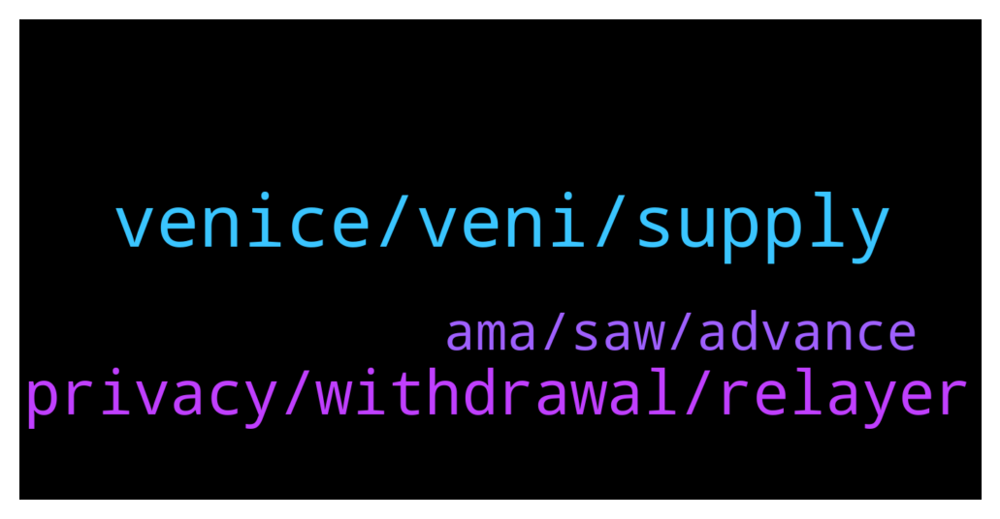

# **@defisearchpublic**
 ## Analysis for **2021-12-22** - **2021-12-24**.

---

## 📊 **Basic Stats**

**n_messages_sent**: 42

---

---

## 🔝 **Top keywords and related messages**

1. **venice, veni, supply**

    @jaelquin01 --- *This amount is a non-inflationary fixed supply set at launch. 10% of the $VENI supply was distributed at the genesis event to Venice liquidity providers and stakers. The remaining 90% is distributed over the course of four years.* **--->** [TG Discussion](https://t.me/defisearchpublic/240694)

    @jaelquin01 --- *It was designed to be under Venice DAO Governance to maintain stability* **--->** [TG Discussion](https://t.me/defisearchpublic/240690)

    @jaelquin01 --- *If you both want to check the beta test of Venice. Just search Testnet. Venice. Finance* **--->** [TG Discussion](https://t.me/defisearchpublic/240700)

    @carajulierey01 --- *Thanks Jael! This is a big help for me because  doing my research of this. It seems you know alot of info of Venice* **--->** [TG Discussion](https://t.me/defisearchpublic/240702)

    @jenicaannbin01 --- *Oh. You really invest you time. Good. You'll become millionaire of you know the process of the project and how it works. You'll know how to pla the game* **--->** [TG Discussion](https://t.me/defisearchpublic/240704)

    @carajulierey01 --- *Are you seeing that as for long term?* **--->** [TG Discussion](https://t.me/defisearchpublic/240688)

2. **privacy, withdrawal, relayer**

    @Venedixt0 --- *Monsoon improves transaction privacy by breaking the on chain links between sources and destination.* **--->** [TG Discussion](https://t.me/defisearchpublic/240662)

    @Fred©orpuz --- *This will make all your transaction private, bro.* **--->** [TG Discussion](https://t.me/defisearchpublic/240656)

    @Fred©orpuz --- *Is there a chance to compromise the protocol and leak some info of the depositors, bro?* **--->** [TG Discussion](https://t.me/defisearchpublic/240671)

    @Regor --- *Is it safe to use a relayer?* **--->** [TG Discussion](https://t.me/defisearchpublic/240669)

    @Venedixt0 --- *But a relayer can be used too to better preserve privacy* **--->** [TG Discussion](https://t.me/defisearchpublic/240664)

    @Venedixt0 --- *Well, the relayer cannot change any withdrawal data including recipients address, so yea.* **--->** [TG Discussion](https://t.me/defisearchpublic/240675)

3. **ama, saw, advance**

    @jaelquin01 --- *Hehe. Thanks but not really. I just attended those previous AMA that's why* **--->** [TG Discussion](https://t.me/defisearchpublic/240703)

    @jenicaannbin01 --- *I just saw this on one of the AMA group* **--->** [TG Discussion](https://t.me/defisearchpublic/240685)

    @Venedixt0 --- *Right, buddy. You know it too?* **--->** [TG Discussion](https://t.me/defisearchpublic/240657)

    @mrbateman11 --- *Daily news have been posted in our announcement channel! https://t.me/defisearchann* **--->** [TG Discussion](https://t.me/defisearchpublic/240632)

    @jaelquin01 --- *Take care guys! Merry Christmas in advance!* **--->** [TG Discussion](https://t.me/defisearchpublic/240706)

    @Fred©orpuz --- *Not, really buddy. Just saw it on twitter.* **--->** [TG Discussion](https://t.me/defisearchpublic/240660)

