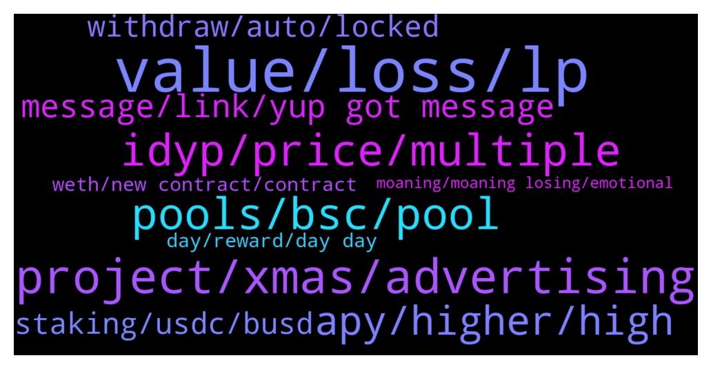

# **@dypfinance**
 ## Analysis for **2021-12-23** - **2021-12-24**.

---

## 📊 **Basic Stats**

**n_messages_sent**: 252

---

---

## 🔝 **Top keywords and related messages**

1. **value, loss, lp**

    @LovelySuman86 --- *I added 1800 busd when bnb was 530 and dyp at .56 now 1800 busd reduced to 1400* **--->** [TG Discussion](https://t.me/dypfinance/232910)

    @James --- *Hi - I have had a similar issue to those above - I deposited 500 BUSD into the 30day v2 BSC yield farm on 15/12. Despite both dyp/bnb increasing in value since then - my deposit LP token is now only worth 250 USD (which even allowing for the DYP 25% still represents a significant loss). My understanding of impermanent loss is that if both tokens increase in value, it is very difficult to lose money by impermanent loss.. is there another explanation of where this money is being lost? I had a similar experience on the 3 day v2 BSC platform. My colleagues on avax / eth have not experienced this* **--->** [TG Discussion](https://t.me/dypfinance/232953)

    @timdyp --- *Did you check my time of deposit? Did you check the price of my assets from the time of my deposit vs the price of your assets from the time of your deposit? This could be the only explanation because of the IL. You should also read about IL and be aware that the price of your deposited assets can go up or down in value because of the IL. For example today your value may be $500, tomorrow can be $800 or $300. And this can continue for all the time of the deposit.* **--->** [TG Discussion](https://t.me/dypfinance/232804)

    @hemanrock --- *hi, 75% is in LP and 25% is in DYP. so, the BNB and iDYP price on the day of your deposit and now the price may be different. please go through more about IL.* **--->** [TG Discussion](https://t.me/dypfinance/232955)

    @Eugej --- *Well...I don't believe you made a profit in the bnb side except then the team didn't compute my LP well. I deposited 5k on the 25th and righ now I have less* **--->** [TG Discussion](https://t.me/dypfinance/232798)

    @Srriram --- *Also, I did my first wbnb without lock... Wanted to test before I refer friends... I have a question guys.. What is this 11.8 LP stand for in the image below.. I assume that 222 dyp is worth 133 @0.6 USD.. Then 11.8 LP would be worth 45 auSD each approx.. But the withdraw box also says wbnb.. A bit confusing.. Any explanation is appreciated* **--->** [TG Discussion](https://t.me/dypfinance/232560)

2. **project, xmas, advertising**

    @DhoniMSD516 --- *Hey as per roadmap it should be this month, please stay tuned for further updates in this regard :)* **--->** [TG Discussion](https://t.me/dypfinance/233160)

    @DhoniMSD516 --- *Sure if there is anything, we will for sure consider asking community  Thanks for your suggestions and inputs* **--->** [TG Discussion](https://t.me/dypfinance/232549)

    @finaldust --- *Would the launchpad be planned for this week? It is getting to holiday.* **--->** [TG Discussion](https://t.me/dypfinance/232776)

    @Tony_GH11 --- *Hi There,  Would you mind referring me the marketing contact or team email regarding this project?  Want to forward our documentation about advertising and marketing for the project (not like shilling and twitter promotions with "influencers" and little AMA's). We offer actual advertising and real world marketing on our platform, where we have 1/3 million active users per month and guarantee much higher ROI and click-rates than Poocoin. We have open advertising spots (and more) and can connect you with our audience full of investors (whales too) to help you reach the moon.* **--->** [TG Discussion](https://t.me/dypfinance/232766)

    @<UNK> --- *Thx for the suggestion @Disguy125, it will be done. 🙏* **--->** [TG Discussion](https://t.me/dypfinance/232619)

    @Manuel --- *Thanks Tim, and I am happy with All the work you and the team is doing. Keep moving mountains* **--->** [TG Discussion](https://t.me/dypfinance/232812)

3. **pools, bsc, pool**

    @Manuel --- *I think most understand how IL work and also that it will be settled if you stay long enough in the pool. The dissapointment is that everyone that got in early bought Idyp on its spike. The feeling is that this spike was at least partly because there was just a very small portion of Idyp in circulation when the first pools where opened and this could have been foreseen by the team. And yes, also by the early ones who got in if they did a very close reading of all information available. Nevertheless, this is leaving a bad taste in the mouths of people who got in early because it feels that everyone that jumped in trustfully was stupid to do so. Please understand these feelings and do not ignore them. And for all others, take your loss, wait for your rewards, we are in it for the long run anyways.* **--->** [TG Discussion](https://t.me/dypfinance/232807)

    @Srriram --- *Howdy.. I am new here and all farming pools are locked..* **--->** [TG Discussion](https://t.me/dypfinance/232532)

    @kindcrypto --- *@DhoniMSD516   yes my friend --- the pool is AVAX 3 V1    dyp/avax   when i goto my stats --- it shoows deposited and claimable amoiunt -- the claim button is red. but cannot click or do anything  ..  its from a locked contract that was to unlock on 2021/09/12 14:03 ..* **--->** [TG Discussion](https://t.me/dypfinance/232848)

    @timdyp --- *This is 100% FUD, and I will tell you why with facts, not with words like ''CRAP''. It is not our fault that maybe you chose the right moment to join one of the farming pools, therefore you should DYOR before joining farming, learn about IL and take your risks. In less than one month we have 1502 users that are using the farming pools, from these 1502 users less than 10 are complaining. Unfortunately, you are one of them. With the old contracts that were at least 10x times worst compared with the v2 contracts, we managed to pay more than $40 million to the users and at some point, we had 0 IL! But this happened after 7 months, with all these achievements, plus you are saying that you enjoyed the old contracts you come and use words like ''CRAP''.  Just like a normal user I did some small deposits over the BSC, AVAX, and ETH pools and here are my current stats:  AVAX deposit of 2 WAVAX 13 days 1 hr ago, current value including rewards $280.55.   BSC deposit of 1.5 WBNB 32 days 9 hrs ago, current value includin* **--->** [TG Discussion](https://t.me/dypfinance/232601)

    @BM --- *Are the Polygon farming pools still scheduled for this year with one week to go?* **--->** [TG Discussion](https://t.me/dypfinance/232582)

    @Cryptomommi --- *All do respect. I actually did the exact same number for your numbers on BSC pool. I'll DM numbers. Please let me know what I'm missing. Because numbers not the same. I also did 5 ETH and bleeding money so had to leave that pool. Someone complained about me whining...not whining just want to know why my results are so different than the post. Everyone loses to risk and everyone loses money in crypto. I'm fine with that. But it's boggling my mind when your results are so much better and I'm not in profit like yourself.* **--->** [TG Discussion](https://t.me/dypfinance/232803)

4. **idyp, price, multiple**

    @Cj --- *How much idyp is now in circulation? Can't find it..* **--->** [TG Discussion](https://t.me/dypfinance/233001)

    @Sir_Crys_alot --- *Can someone explain like I am five why iDYP is bleeding so hard? Do we have to find a base, because like I see it it's only a background token so if many people use the protocol it should be stable at some point. Or not?* **--->** [TG Discussion](https://t.me/dypfinance/232630)

    @tamtamkanto --- *On which exchange will idyp be listed on polygon?* **--->** [TG Discussion](https://t.me/dypfinance/232827)

    @Malthedk --- *Unless team does something About idyp it Will continue current trend.* **--->** [TG Discussion](https://t.me/dypfinance/233026)

    @hemanrock --- *iDYP is being used for deposit in FARMS too and in future there can be more* **--->** [TG Discussion](https://t.me/dypfinance/232634)

    @Sir_Crys_alot --- *And iDYP is bleeding hard because of the defi winter currently it seems might be short to medium term harsh but should iron out when more new users come to the protocol* **--->** [TG Discussion](https://t.me/dypfinance/232641)

5. **apy, higher, high**

    @DhoniMSD516 --- *As said this is all auto calculated by smart contracts based on APY all these days this apy is dynamic.* **--->** [TG Discussion](https://t.me/dypfinance/233121)

    @DhoniMSD516 --- *Hey the APY is dynamic so you earned as per the apy all these days, so this might be the value for your stake period* **--->** [TG Discussion](https://t.me/dypfinance/233114)

    @Cryptomommi --- *Ok...but the APY is so low..shouldn't any go up if people withdrawing?* **--->** [TG Discussion](https://t.me/dypfinance/232642)

    @DhoniMSD516 --- *It was already stated the APY you will be earning* **--->** [TG Discussion](https://t.me/dypfinance/233147)

    @memiamang --- *So contract calculate beyond current apy* **--->** [TG Discussion](https://t.me/dypfinance/233145)

    @memiamang --- *Then the prevous apy is meanless if we didn’t claim* **--->** [TG Discussion](https://t.me/dypfinance/233135)

6. **message, link, yup got message**

    @burnysanders --- *sorry, I just joined the telegram.  Maybe that is worthy of being pinned for future users as I didn't see any documentation explaining this.* **--->** [TG Discussion](https://t.me/dypfinance/232889)

    @Life_is_love_La_la_la_la_la --- *Sorry. Please ignore my last paragraph as I see you have responded on this* **--->** [TG Discussion](https://t.me/dypfinance/232535)

    @DhoniMSD516 --- *Hey here is explanation why this was not included https://t.me/dypfinance/232530* **--->** [TG Discussion](https://t.me/dypfinance/232536)

    @Skipper_IM --- *Oh, thank you very much! )* **--->** [TG Discussion](https://t.me/dypfinance/233173)

    @DhoniMSD516 --- *Ok the link is in above message already :)* **--->** [TG Discussion](https://t.me/dypfinance/232879)

    @DhoniMSD516 --- *Cool yes all good, happy to answer 😀* **--->** [TG Discussion](https://t.me/dypfinance/232538)

7. **withdraw, auto, locked**

    @LovelySuman86 --- *Yes don’t have any option, I am locked for 3 months* **--->** [TG Discussion](https://t.me/dypfinance/233016)

    @LovelySuman86 --- *I am locked for 90 days* **--->** [TG Discussion](https://t.me/dypfinance/233004)

    @Life_is_love_La_la_la_la_la --- *Oh, last thing: I am a digital nomad. I carry a phone and a tablet. Neither permits me to know by hovering over 'Withdraw' when my lock period ends. This needs urgent attention* **--->** [TG Discussion](https://t.me/dypfinance/232542)

    @Tettluft --- *Can’t remember whether I locked for 90 or 60 days lol. Is it a way to find out?* **--->** [TG Discussion](https://t.me/dypfinance/232880)

    @DhoniMSD516 --- *Hey the withdraw button is on dApp page here https://app-avax.dyp.finance/staking-avax-3* **--->** [TG Discussion](https://t.me/dypfinance/232850)

    @timdyp --- *Hi, we did not add Auto-compounding for security reasons. We put the security first and one of the security audit companies advised us not to add the auto-compounding feature. Please note that it is not possible to withdraw before the end of the lock period.* **--->** [TG Discussion](https://t.me/dypfinance/232530)

8. **staking, usdc, busd**

    @hemanrock --- *FARMS work this way. please check this  Consider a scenario wherein you deposit BUSD $1000, the smart contract will split the BUSD $1000 in two parts: BUSD $750 is added to PancakeSwap V2 BNB/iDYP LP and BUSD $250 is sent to DYP Staking with 50% APR.   you can read more about it from here https://dypfinance.medium.com/?p=6be89f573f19* **--->** [TG Discussion](https://t.me/dypfinance/232564)

    @Kriptomatom --- *hello guys now depoasit fee for staking high abut 350 usd when it can be dicreased?* **--->** [TG Discussion](https://t.me/dypfinance/232891)

    @Life_is_love_La_la_la_la_la --- *Hi Dhoni,   Again, thank you for your rapid response but I feel i must disagree. The wording on the Staking page was very clear and not open to misinterpretation:  "The staking pools have the REINVEST function integrated, it means you are able to automatically add your daily rewards to the staking pool."  Possibly it is my poor English. I speak five languages and sometimes I become befuddled by the 600,000 words in the Complete Oxford English Dictionary.   Also, aou did not comment on why this feature was not included in V2. Is it possible to have your thoughts on this please?* **--->** [TG Discussion](https://t.me/dypfinance/232534)

    @LovelySuman86 --- *Then V1 staking was more beneficial* **--->** [TG Discussion](https://t.me/dypfinance/232913)

    @DhoniMSD516 --- *Hey if you are asking for depositing iDYP into staking this is not possible, only the allocation https://dyp.finance/idyp/claim and the airdropped iDYP https://dyp.finance/idyp/airdrop can be staked* **--->** [TG Discussion](https://t.me/dypfinance/232866)

    @DhoniMSD516 --- *It is designed that way and was explained already so I hope you read it before depositing  Deposit WAVAX, USDC.e, USDT.e, WETH.e, PNG, QI, DAI.e, XAVA, WBTC.e, or LINK.e, and earn up to 145% APY in DYP.   To start earning, all you need is to deposit one of the supported assets into the Buyback contract. Then, all assets will automatically be converted into DYP + iDYP and deposited into a staking contract. You can choose from two different options, with rewards starting from 40% APY up to 145% APY, depending on the lock time from a minimum of zero-days up to a maximum of 90 days.  The rewards are distributed automatically and can be claimed every day. When you withdraw you will receive all the deposited amounts in DYP.  Note: Consider a scenario wherein you deposit USDC.e $1000. The smart contract will buy iDYP worth USDC.e $750 and DYP worth USDC.e $250. All the rewards are paid in DYP, the DYP is market bought from Pangolin when you claim your rewards, that means constant buying pressure for the DYP tokens. When your lock time expires and you withdraw your funds, you will receive all the deposited amounts in DYP.* **--->** [TG Discussion](https://t.me/dypfinance/233110)

9. **weth, new contract, contract**

    @Eugej --- *Truthfully DYP team..this new contract is CRAP. Just in less than a month, my 5k is now less than half. To interact with the new contract is expensive. The rewards don't commensurate with my loss and my dyp reward keeps reducing. If you like delete me as Fud which it isn't...this is just my feedback from using your new contract that I hopefully waited for cos I enjoyed the old contract so much... I thot my Xmas would be fun with fyp but right now I'm in tears...* **--->** [TG Discussion](https://t.me/dypfinance/232590)

    @DhoniMSD516 --- *Hey welcome you can start reading about DYP here :)  https://t.me/dypfinance/229271* **--->** [TG Discussion](https://t.me/dypfinance/233060)

    @hemanrock --- *please stick discussion to DYP only* **--->** [TG Discussion](https://t.me/dypfinance/232696)

    @Sir_Crys_alot --- *That's my safe of sorts and DYP is a real farm* **--->** [TG Discussion](https://t.me/dypfinance/232687)

    @Deltre1 --- *Hi all, Just bought some DYP how do I go about turning it into WETH and farming it?* **--->** [TG Discussion](https://t.me/dypfinance/233184)

    @DhoniMSD516 --- *Hey if you are looking to swap DYP to WETH you can do it on Uniswap https://app.uniswap.org/#/swap?use=V2&inputCurrency=0x961c8c0b1aad0c0b10a51fef6a867e3091bcef17 Then after you have WETH you can head to https://dyp.finance/farmv2/eth and farm WETH* **--->** [TG Discussion](https://t.me/dypfinance/233188)

10. **day, reward, day day**

    @Arslan_Farrukh --- *U can only recover through rewards* **--->** [TG Discussion](https://t.me/dypfinance/233010)

    @memiamang --- *If i get reward by dyp then number of dyp must be increased day by day* **--->** [TG Discussion](https://t.me/dypfinance/233133)

    @DhoniMSD516 --- *You are still getting reward in DYP and not iDYP* **--->** [TG Discussion](https://t.me/dypfinance/233131)

    @memiamang --- *My reward number decrease day by day* **--->** [TG Discussion](https://t.me/dypfinance/233127)

    @memiamang --- *The reward number decrease day by day* **--->** [TG Discussion](https://t.me/dypfinance/233118)

    @Arslan_Farrukh --- *Just carry on after 3 months, u will reap rewards* **--->** [TG Discussion](https://t.me/dypfinance/233018)

