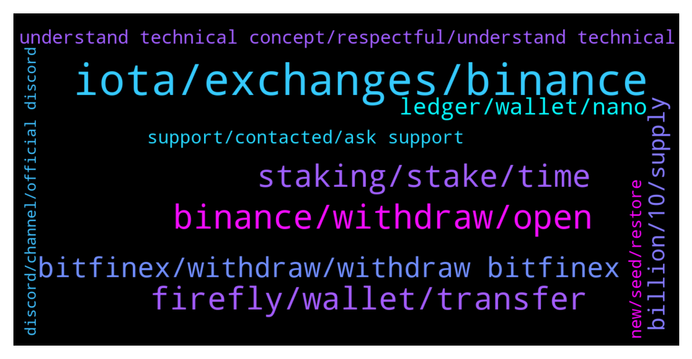

# **@iotatangle**
 ## Analysis for **2021-12-23** - **2021-12-24**.

---

## 📊 **Basic Stats**

**n_messages_sent**: 300

---

---

## 🔝 **Top keywords and related messages**

1. **iota, exchanges, binance**

    @millenium_earl2000 --- *Which exchange can u still withdraw iota* **--->** [TG Discussion](https://t.me/iotatangle/301772)

    @navinhn --- *No , I m not choosing BEP20 in first place , but Binance has only BEP20 to transfer out of binance, and they suspended Real IOTA , if they don’t support then most of IOTA will b stuck on exchange* **--->** [TG Discussion](https://t.me/iotatangle/301536)

    @navinhn --- *I think you are not understanding the technical properly, I know binance chain is completely different, but u r restricting wallet only for IOTA network, that’s wat I am saying* **--->** [TG Discussion](https://t.me/iotatangle/301628)

    @sy-subrc --- *Every IOTA less traded on Binance, is a good IOTA. Hope that helps.* **--->** [TG Discussion](https://t.me/iotatangle/301923)

    @DF --- *So I think less one exchange working* **--->** [TG Discussion](https://t.me/iotatangle/301971)

    @Yace --- *Is it possible to swap ada to iota ? For me you can only buy iota whith fiat money ( eur, dollars , .. )* **--->** [TG Discussion](https://t.me/iotatangle/302098)

2. **binance, withdraw, open**

    @SunnySide~ --- *yeah you know binance support is plenty helpful* **--->** [TG Discussion](https://t.me/iotatangle/301444)

    @⠠⠵ Lucas! --- *Sorry. Basically CZ says binance is located where he is sitting in a given moment* **--->** [TG Discussion](https://t.me/iotatangle/302082)

    @NOMPike --- *Has anyone solved this problem yet? Those of us stuck on binance?* **--->** [TG Discussion](https://t.me/iotatangle/301916)

    @sy-subrc --- *Binance is only a rumor, isn’t it?* **--->** [TG Discussion](https://t.me/iotatangle/301785)

    @sy-subrc --- *It’s an issue with Binance an ongoing for days. Allegedly they will open within two days. But no guarantee on that.* **--->** [TG Discussion](https://t.me/iotatangle/301794)

    @Fold11 --- *So tomorrow we can withdraw from binance? Nice* **--->** [TG Discussion](https://t.me/iotatangle/301769)

3. **firefly, wallet, transfer**

    @navinhn --- *Yes , that s 1 option, but if IOTA need thr token holders to participate then they also should support right , now major exchange like binance , huobi, Bittrex are not allowing them what the use, so what firefly can do from thr end is then can support BEP20 chain , if they don’t support others then how others will support thr token , in future if they want to transfer Bak to exchange to sell then again it’s going to create a problem,* **--->** [TG Discussion](https://t.me/iotatangle/301591)

    @navinhn --- *If firefly support accepting BEP20 then it’s not a problem, because binance has opened withdrawal for IOTA in BEP20 , if IOTA want thr users to stake then they should enable this , else all binance IOTA coins will b stuck thr only* **--->** [TG Discussion](https://t.me/iotatangle/301470)

    @Teleappa --- *Hi... Binance won't let me transfer to Firefly. It says that there is an issue with the IOTA network. Is it correct, is there a placer where I can by MIOTA to transfer to Firefly?* **--->** [TG Discussion](https://t.me/iotatangle/301791)

    @Mur --- *Hi I want transfer my iota token from etoro to fire fly wallet. Somebody knows how it works* **--->** [TG Discussion](https://t.me/iotatangle/301760)

    @navinhn --- *And we ask ur support also ,  support other chain to transfer to firefly* **--->** [TG Discussion](https://t.me/iotatangle/301592)

    @Tust1982 --- *Hi all, was looking for help, I've forgot the password on my iota firefly wallet and been searching for hours for a way to reset it with no avail, any help whatsoever will be greatly appreciated.* **--->** [TG Discussion](https://t.me/iotatangle/301366)

4. **staking, stake, time**

    @razali1984 --- *Should have at least resolve this issue before launching staking...* **--->** [TG Discussion](https://t.me/iotatangle/301398)

    @Tahmis --- *Well this was actually anticipated that something like this would happen when the actual staking starting is announced as everyone wants to withdraw at the same time* **--->** [TG Discussion](https://t.me/iotatangle/301465)

    @sy-subrc --- *Time is running out? It’s actually more time until staking is live, than time passed, since pre-staking started.* **--->** [TG Discussion](https://t.me/iotatangle/301921)

    @sy-subrc --- *At least from the issue I once had, I can tell, that it might take a few hours for them (don't worry) and it's solved. You got some more days until staking starts :)* **--->** [TG Discussion](https://t.me/iotatangle/301360)

    @sobroggi --- *I think early participants is actually the VCs etc. participating in ecosystem funding, but not participants of staking... https://blog.assembly.sc/assembly-fair-launch-token-distribution/* **--->** [TG Discussion](https://t.me/iotatangle/301735)

    @SunnySide~ --- *cheers guys also does it matter the size of your stake? it is ok to split into 2 wallets to stake or better to maintain in 1 wallet, or it doesnt matter?* **--->** [TG Discussion](https://t.me/iotatangle/301887)

5. **bitfinex, withdraw, withdraw bitfinex**

    @Snelting11 --- *My Bitfinex withdrawal now 13 hour pending since this morning* **--->** [TG Discussion](https://t.me/iotatangle/301329)

    @tonny_nguyen --- *Stop IOTA, I Can't Withdraw with all Exchange bitfinex is the last place to withdraw, but when entering the wallet address, the exchange does not accept it* **--->** [TG Discussion](https://t.me/iotatangle/301741)

    @sy-subrc --- *So it's more a specific problem to your account and not a general Bitfinexx issue* **--->** [TG Discussion](https://t.me/iotatangle/301357)

    @sy-subrc --- *As far as I know and read the past few days: Bitfinex (tested myself), Bitpanda (sometimes disable for a few hours to refill their hot wallet) and BinanceUS* **--->** [TG Discussion](https://t.me/iotatangle/301928)

    @sy-subrc --- *Bitfinex definitely works. Tried it 5 minutes ago, withdrawal received just now* **--->** [TG Discussion](https://t.me/iotatangle/301341)

    @Basti --- *Bitfinex is approving them manually sometimes* **--->** [TG Discussion](https://t.me/iotatangle/301972)

6. **ledger, wallet, nano**

    @Amit --- *What about iota we stored in trinty wallet Is it still accessible* **--->** [TG Discussion](https://t.me/iotatangle/301421)

    @Tahmis --- *Desktop only for now unfortunately. Mobile still under development. Yes, ledger is supported. More info here:* **--->** [TG Discussion](https://t.me/iotatangle/302019)

    @saverroute --- *Hey there.. not able to stake iota through ledger nano* **--->** [TG Discussion](https://t.me/iotatangle/301847)

    @Chris --- *There's 2 iota apps now on ledger* **--->** [TG Discussion](https://t.me/iotatangle/301343)

    @Timo --- *Is it recommendable to stake via the software firefly wallet on a windows pc? If I buy a nano ledger I will get it after christmas -> too late* **--->** [TG Discussion](https://t.me/iotatangle/301855)

    @Shortzliquidated --- *Is it possible to stake through ledger?* **--->** [TG Discussion](https://t.me/iotatangle/302017)

7. **billion, 10, supply**

    @Basti --- *Thing with iota staking is... It's no real staking.. So there will be a flood of unstaked tokens once the 90 days are over :D* **--->** [TG Discussion](https://t.me/iotatangle/301725)

    @AdamLake --- *Is there a way we can figure out how many iota have been staked so far?  I saw that we were over 40% but wouldn’t mind seeing for myself* **--->** [TG Discussion](https://t.me/iotatangle/301787)

    @mohsen --- *Any body knows how much will be total supply of Shimmer and Assembly?* **--->** [TG Discussion](https://t.me/iotatangle/301525)

    @AdamLake --- *I am absolutely mind blown how much iota have been staked so far* **--->** [TG Discussion](https://t.me/iotatangle/301719)

    @Jay --- *What is the minimum amount of iota I need in order to stake for shimmer? It say I don’t have enough* **--->** [TG Discussion](https://t.me/iotatangle/301521)

    @holdencf --- *Helium Network has 31.372% of the supply staked, by the looks of it we are going to easily pass that* **--->** [TG Discussion](https://t.me/iotatangle/301486)

8. **understand technical concept, respectful, understand technical**

    @sy-subrc --- *How am I not respectful? We’re discussing and are stuck in a loop. He’s asking me to understand the technical concept, which he’s clearly misinterpreting* **--->** [TG Discussion](https://t.me/iotatangle/301626)

    @Tahmis --- *Please try to be more respectful. Not all here are experts on the subject* **--->** [TG Discussion](https://t.me/iotatangle/301624)

    @sy-subrc --- *I think you don’t understand the technical concept 🤷‍♂️* **--->** [TG Discussion](https://t.me/iotatangle/301621)

    @Arjan --- *Yeah, when people hear “airdrop” everyone gets crazy😂* **--->** [TG Discussion](https://t.me/iotatangle/301722)

    @SunnySide~ --- *i reckon a lot of bagholders who really believe in the tech* **--->** [TG Discussion](https://t.me/iotatangle/301483)

    @AdamLake --- *I’ve never been so bullish on a project before.* **--->** [TG Discussion](https://t.me/iotatangle/301721)

9. **support, contacted, ask support**

    @Tahmis --- *I recommend to wait and ask their support* **--->** [TG Discussion](https://t.me/iotatangle/301550)

    @sy-subrc --- *And you guess contacting them will help make it work again faster? Sure thing 😂* **--->** [TG Discussion](https://t.me/iotatangle/301333)

    @NOMPike --- *It really isn't looking likely, they still haven't replied to me and time is running out.* **--->** [TG Discussion](https://t.me/iotatangle/301920)

    @Tahmis --- *Best is to ask their support about ETA for that* **--->** [TG Discussion](https://t.me/iotatangle/301519)

    @Tahmis --- *Yeah they have responded to many but the answers differ always :D* **--->** [TG Discussion](https://t.me/iotatangle/301448)

    @Snelting11 --- *Support said 12 hours, passed that, I’ve contacted them again* **--->** [TG Discussion](https://t.me/iotatangle/301330)

10. **new, seed, restore**

    @Timo --- *Is it also possible to restore the wallet with the seed value on a new pc/hdd?* **--->** [TG Discussion](https://t.me/iotatangle/301865)

    @Sailor --- *I mean creat wallet using the same seeds, it's  same restore* **--->** [TG Discussion](https://t.me/iotatangle/301872)

    @Chris --- *So will just keep the new one then* **--->** [TG Discussion](https://t.me/iotatangle/301350)

    @sy-subrc --- *You only need the new one then* **--->** [TG Discussion](https://t.me/iotatangle/301346)

    @Timo --- *I dont want to create a New one, i want to restore my current wallet on a New PC. That surely works?* **--->** [TG Discussion](https://t.me/iotatangle/301871)

    @tomastd --- *I cannot delete the an account with a lost password to recover it with the seed phrase* **--->** [TG Discussion](https://t.me/iotatangle/301999)

