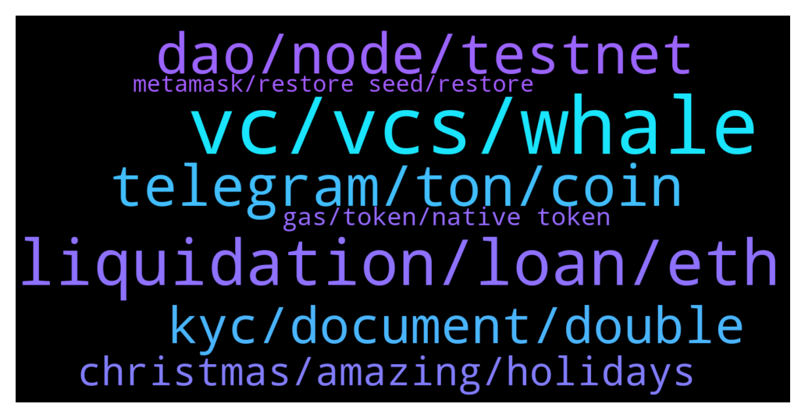

# **@lobsters_chat**
 ## Analysis for **2021-12-23** - **2021-12-24**.

---

## 📊 **Basic Stats**

**n_messages_sent**: 282

---

---

## 🔝 **Top keywords and related messages**

1. **vc, vcs, whale**

    @IndexCap --- *Web 3.0 is fun and has a lot of potential but we can’t hide the simple fact that 90% of VCs are promoting protocols and dumping their pre-sales before moving to the next thing… and they are right to do so because they need to produce returns, not to support protocols* **--->** [TG Discussion](https://t.me/lobsters_chat/310031)

    @StrategicReserve --- *How do you even differentiate between a VC and a whale* **--->** [TG Discussion](https://t.me/lobsters_chat/310034)

    @perpetual_losses --- *A VC is a whale with a brand* **--->** [TG Discussion](https://t.me/lobsters_chat/310036)

    @eth2enthusiast --- *inb4 i get muted. i just wanted to laugh at this   Venture capitalists are meant to capitalise ventures and are supposed to offer more than just mercenary capital.   >> lmaooooo! 10x or gtfo. 10x is better than degen 2x and gtfo  Flipping out of the right side of a pump and dump using inner circle asymmetry to dump on holders setting the venture back is not VC, it’s just basic degen behaviour with bigger size.  >> no no its vc behaviour. they had to talk to their friends and sync more. how close are yall? do yall hang out and buy each other dinners at fancy restaurants? ok then youre vc!  have you never met and just talk in twitter/tg/disc gcs? ok then youre degens.  not a lot of diff, but massive diff in sync. the "vcs" , even if as small as the degends, may end up getting a fancy meal. will i buy you a michelin star meal? doubtful. will i buy some protocol owners a michelin star mean for joining me? absolutely. noone wants to eat alone* **--->** [TG Discussion](https://t.me/lobsters_chat/310212)

    @warylow --- *Jack on twitter: VCs bad >:( Also Jack: VCs ples gib me monies* **--->** [TG Discussion](https://t.me/lobsters_chat/310010)

    @alkan58 --- *The ultimate goal has to be to include more investors and DAOs to replace traditional VCs. But imo same as VCs try to shape and control parts of web3, jack wants to lead and/or control the road of bitcoin. I see him and other whales as part of the same problem until we become way more inclusive. I think of ENS as a good example but even there are insiders.* **--->** [TG Discussion](https://t.me/lobsters_chat/310018)

2. **liquidation, loan, eth**

    @lesterenzo --- *Why won't someone just create a loan marketplace. Where people could choose lending/borrowing terms, like annual rate, liquidation levels (or no liquidation), what assets they want to lend/borrow, other variables, etc. This could eliminate a need in multitude of similar defi platforms, and will let people "negotiate" loan terms with each other.* **--->** [TG Discussion](https://t.me/lobsters_chat/310403)

    @lesterenzo --- *I know it's a general question - but what platforms (including centralized) provide liquidation free loans on crypto / or with liqudations, but close to 100% LTV? I know Alchemix provide 25% LTV, liqudation free loan on eth. Also Ruler, but Ruler doesn't seem to be working.* **--->** [TG Discussion](https://t.me/lobsters_chat/310331)

    @satoshi_onamoto --- *You don’t pay to borrow, so it’s an interest free loan, it uses the yearn pool for underlying so yield apy is currently 4.26% on eth only thing is you borrow a maximum of 25% of your collateral amount in eth and you borrow in synthetic eth* **--->** [TG Discussion](https://t.me/lobsters_chat/310368)

    @ChiTimesChi --- *err, not exactly. trailing stop with ~10% liquidation fee. So what you perceive as 50% LTV, in reality you'll be liquidated at ~55%.* **--->** [TG Discussion](https://t.me/lobsters_chat/310345)

    @ChiTimesChi --- *I believe Myso is building something like Ruler used to have. You might want to check some other products offering options - as getting liquidation free loan is basically buying a call option.* **--->** [TG Discussion](https://t.me/lobsters_chat/310334)

    @lesterenzo --- *oh. so I only need to return what I borrowed? this is too good. but from what I watched about alchemix - will my loan become bigger, If eth goes up? cause if it goes down - I know it does in alchemix.* **--->** [TG Discussion](https://t.me/lobsters_chat/310369)

3. **telegram, ton, coin**

    @ivangbi --- *Why is Durov writing like he is shilling a scam coin ido. Wtf is this* **--->** [TG Discussion](https://t.me/lobsters_chat/310110)

    @gonzogirl --- *Because he wants to rule this world. Obviously supporting the coin which is kinda independent, but, obviously, his is the best he can do to attract users thus gain some value* **--->** [TG Discussion](https://t.me/lobsters_chat/310114)

    @akashking0 --- *jack hates everything except btc ? why he aped in celo* **--->** [TG Discussion](https://t.me/lobsters_chat/310026)

    @FiveBoroughs --- *I don't think that says much, probably the reason he left* **--->** [TG Discussion](https://t.me/lobsters_chat/310094)

    @farm42 --- *Please aware, seen impersonator in Discord and Twitter/ TG.   https://twitter.com/officer_cia/status/1473802121137033224?s=20* **--->** [TG Discussion](https://t.me/lobsters_chat/310006)

    @rasikhmorani --- *(not sure why the file got deleted) Basically they try using the PoolTogether Smart Contract Risk CYA as a argument that it's a lottery in the first part of their doc. Then for the second part they start saying that no-loss lotteries are still covered under NY state law. They also attempt to drag in Galaxy and others for participating in Pool Together Governance with tokens as "partners in an enterprise violating New York law."  Not a lawyer, so I can't talk to the merit of their arguments. What I can speak to is that this is a very expensive $10 loss 😅* **--->** [TG Discussion](https://t.me/lobsters_chat/310308)

4. **dao, node, testnet**

    @goeth121 --- *How's the process look like to open an AMA with Lobster DAO? We have made a proposal here https://github.com/lobster-dao/overview/issues/50* **--->** [TG Discussion](https://t.me/lobsters_chat/309961)

    @tandeloff --- *Humanode Testnet V2 Public Beta is Live  Hello world, Humanode public beta is now live! If you are not a human node yet,  please read the guide, and then download the app to become a human node.   Details: https://blog.humanode.io/humanode-testnet-public-beta-is-live/* **--->** [TG Discussion](https://t.me/lobsters_chat/310183)

    @UltimatePractitioner --- *Solidity Development tele chat can prob help you ser. Going down same path and they are really helpful there* **--->** [TG Discussion](https://t.me/lobsters_chat/310293)

    @Clone95 --- *hi guys, do you know any discord generalist on DeFi where I can be up-to-date with latest developments?* **--->** [TG Discussion](https://t.me/lobsters_chat/310385)

    @mariialoppez --- *Hi! Here you have one https://stakely.io/faucet/xdai-chain* **--->** [TG Discussion](https://t.me/lobsters_chat/309966)

    @tiredgom --- *Hi, fellas. What is the best youtube guys who building on Solana daaps? I am noob rust developer 😀* **--->** [TG Discussion](https://t.me/lobsters_chat/310088)

5. **kyc, document, double**

    @somebodyontelegram --- *Can somebody double-check this, to make sure it’s safe? Looks legit tho.  https://twitter.com/9x9x9eth/status/1474100309463117830?s=21* **--->** [TG Discussion](https://t.me/lobsters_chat/310253)

    @zhongfu --- *i'm seeing a lot of services using jumio and other id-verification-as-a-service providers these days* **--->** [TG Discussion](https://t.me/lobsters_chat/310158)

    @river0x --- *Fwiw this predated my time as an employee by a short while but yes , it makes sense to double check* **--->** [TG Discussion](https://t.me/lobsters_chat/310063)

    @tobaias --- *Most can't do that because the approve is necessary and unfortunetely permit isn't really taking off* **--->** [TG Discussion](https://t.me/lobsters_chat/310354)

    @svenblockchain --- *Phones combine biometrics and all sorts of sensory checks to verify there's a real person taking an image of a real document.* **--->** [TG Discussion](https://t.me/lobsters_chat/310161)

    @zhongfu --- *if you're worried about that, then don't go through the kyc flow and/or submit your wallet address* **--->** [TG Discussion](https://t.me/lobsters_chat/310164)

6. **christmas, amazing, holidays**

    @nvy0x --- *Hope you’re all having safe and enjoyable holidays so far!* **--->** [TG Discussion](https://t.me/lobsters_chat/310236)

    @tobaias --- *sir congrats on successful deploy. Let's see how it goes ⚙️🧰* **--->** [TG Discussion](https://t.me/lobsters_chat/309992)

    @ivangbi --- *Guys cmon if you are degening into rugs at least fucking read 2 messages above. Thx peace.* **--->** [TG Discussion](https://t.me/lobsters_chat/310263)

    @eth2enthusiast --- *I ended up here due to some Spanish guy I met in Panama 🇵🇦 that overheard my convo from my balcony. Crazy start. But happy I made it* **--->** [TG Discussion](https://t.me/lobsters_chat/310237)

    @nvy0x --- *Merry Christmas to you as well 🎄🎄* **--->** [TG Discussion](https://t.me/lobsters_chat/310235)

    @eth2enthusiast --- *Thank you everyone!  It’s been an amazing year Many rugs Many gas burns  Many gains  Many airdrops  Many advices sent and received* **--->** [TG Discussion](https://t.me/lobsters_chat/310234)

7. **gas, token, native token**

    @ChiTimesChi --- *Some tokens have ERC-2612 permits implemented, so you can sign an approval off-chain (thus potentially enabling gasless trades). Ivan's most favorite token supports that iirc.* **--->** [TG Discussion](https://t.me/lobsters_chat/310358)

    @sir_integra_hellsing --- *anyone knows of a site that let you airdrop to a large number of wallets for a fixed gas cost?* **--->** [TG Discussion](https://t.me/lobsters_chat/310217)

    @akj0x --- *USDC on gearbox seems to require this much* **--->** [TG Discussion](https://t.me/lobsters_chat/310265)

    @akashking0 --- *Is there any dapp available which provides to swap from any token to  blockchain's native token for gas* **--->** [TG Discussion](https://t.me/lobsters_chat/310349)

    @phil_muhbags --- *Also gas fees a pretty cheap at the moment* **--->** [TG Discussion](https://t.me/lobsters_chat/310256)

    @xmons --- *Astrodrop using merkle trees is the most gas efficient because recipient has to claim themselves* **--->** [TG Discussion](https://t.me/lobsters_chat/310228)

