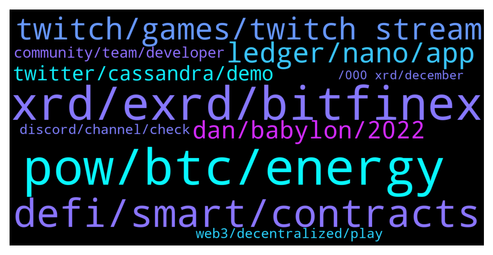

# **@radix_dlt**
 ## Analysis for **2021-12-23** - **2021-12-24**.

---

## 📊 **Basic Stats**

**n_messages_sent**: 459

---

---

## 🔝 **Top keywords and related messages**

1. **pow, btc, energy**

    @S --- *Right, because you can't do something like rush a longer chain?* **--->** [TG Discussion](https://t.me/radix_dlt/325905)

    @S --- *Yearly reward goes down = less investment into securing the network = cheaper to attack BTC* **--->** [TG Discussion](https://t.me/radix_dlt/325907)

    @danhughes --- *well imagine if a network made of #pi3 was actually a viable hardware spec  that cost is super small, can piggy back on your home internet, consumes a few watts of power  the most expensive thing to maintain really is storage* **--->** [TG Discussion](https://t.me/radix_dlt/326344)

    @S --- *Wonder if combinatorial PoW solves this somehow* **--->** [TG Discussion](https://t.me/radix_dlt/325850)

    @aus87 --- *This is not mining though like we are saying, you arent rewarded more for completing the POW portion of consensus* **--->** [TG Discussion](https://t.me/radix_dlt/325900)

    @Toby --- *I’ve wondered how a network would grow without an economic incentive. It seems to me like without, it cannot grow. You’re participating nodes and such have to spend money to keep the network alive and growing so unless a ton of them are just sitting around with money to blow, then it seems necessary.* **--->** [TG Discussion](https://t.me/radix_dlt/326339)

2. **xrd, exrd, bitfinex**

    @Null_v0id --- *Wow Okolie shouting out XRD, you love to see it 😁 https://twitter.com/lawrence_tko/status/1473810387049005065?s=21* **--->** [TG Discussion](https://t.me/radix_dlt/326175)

    @nzjoec --- *can I stake with eXRD? is mainnet live yet?* **--->** [TG Discussion](https://t.me/radix_dlt/326168)

    @aifretis --- *Hello all, Can I swap my EXRD to XRD on bitfinex? I will have 1-1 right? Even if it's not the same price on market?* **--->** [TG Discussion](https://t.me/radix_dlt/326063)

    @jonericcook --- *Does that this service able to gather all my stake history from when I started staking or does it just start once I link my wallet?* **--->** [TG Discussion](https://t.me/radix_dlt/326066)

    @Paul --- *Hello out there, may I get some advice from the super technically minded members in here please. Perhaps Florian.  I bought EXRD through a friend back in June. He held my stake along with his own in his Metamask wallet which was hacked two days ago, all coins withdrawn.   Can anyone suggest a person or organisation to contact to try and help with the retrieval of the missing coins. Obviously a dialogue with Metamask has been opened.* **--->** [TG Discussion](https://t.me/radix_dlt/326152)

    @CaptainMooseInc --- *https://twitter.com/xrdscan/status/1473714958634565633?s=21  XRDScan tracks every Epoch, rather than current state like most trackers. Not many use the 'USD price then' feature yet. It shows the value of your #Radix portfolio at the time of each epoch change. Go try it and the roller coaster! $exrd $xrd (And come stake with our validator!)* **--->** [TG Discussion](https://t.me/radix_dlt/326061)

3. **defi, smart, contracts**

    @joshhoppie --- *Seems like Radix really should be listed here – https://www.stakingrewards.com/* **--->** [TG Discussion](https://t.me/radix_dlt/326541)

    @Radstakes --- *Dan's twitter demo showcases some of the far reaching applications of Radix tech, with many of the features unique to Radix such as atomic cross shard composability while maintaining high levels of safety, liveness and throughput. There's a handy guide in the about section of the Twitter demo that explains a bit about what's going on under the hood: https://flexathon.net/twitter/index.html?help=1* **--->** [TG Discussion](https://t.me/radix_dlt/326391)

    @TyPo1 --- *Cheers, having read the link and your reply I make a step closer to understanding it all. I can’t wait for the other projects to finally accept and be in a position in which they can’t deny the significance of your and the Radix team’s achievements. I’m not talking money here at all, I’m talking of a desire for all the hard work to be acknowledged. This can’t be a VHS and Betamax story.* **--->** [TG Discussion](https://t.me/radix_dlt/326450)

    @rubydacheryyyy --- *Hey can I ask if radix marketing plan is to target a specific audience* **--->** [TG Discussion](https://t.me/radix_dlt/326635)

    @Lun --- *Hi, is there any projects will build on Radix? Thanks* **--->** [TG Discussion](https://t.me/radix_dlt/326327)

    @tonnypin --- *Hi, radix or solana which one is better ?* **--->** [TG Discussion](https://t.me/radix_dlt/326082)

4. **twitch, games, twitch stream**

    @mx471 --- *I always feel like listening to their music videos when I read their name. Because you mean the band, right? I can't think of anything else worth mentioning.* **--->** [TG Discussion](https://t.me/radix_dlt/326493)

    @Sha256 --- *I have already watched this video, thanks for sharing* **--->** [TG Discussion](https://t.me/radix_dlt/326044)

    @danhughes --- *wow the games requests are coming in hot!* **--->** [TG Discussion](https://t.me/radix_dlt/326306)

    @korone_stan --- *lol please prioritize the important stuff instead of silly games...although games are what make or break new platforms for sure* **--->** [TG Discussion](https://t.me/radix_dlt/326307)

    @Null_v0id --- *Might not be much, but I did get us a wojak fan/fanny made: https://twitter.com/v0idxbt/status/1474140597434920972?s=21* **--->** [TG Discussion](https://t.me/radix_dlt/326413)

    @Artistizen --- *Twitch Feed is online - Dan ist demonstrating Cassandra! https://www.twitch.tv/fuserleer  Always exciting! Thank you!* **--->** [TG Discussion](https://t.me/radix_dlt/326221)

5. **ledger, nano, app**

    @Kryptographer --- *Wen Radix download available on Ledger Live without the need of sideload?* **--->** [TG Discussion](https://t.me/radix_dlt/325984)

    @danasocial --- *Can someone help me for the sideloading of the app on ledger?* **--->** [TG Discussion](https://t.me/radix_dlt/325959)

    @Magal36 --- *what point are you stuck? I recomend before you start, open ledger live software, check if you have 40kb free space and update the firmware* **--->** [TG Discussion](https://t.me/radix_dlt/325960)

    @danasocial --- *Yes, i did go in the radix app directory, where there are bin and debug directory, i send the PIN on ledger nano s and After send the last command, i allow the unsafe app on the nano s, and here take the error invalid status 5103* **--->** [TG Discussion](https://t.me/radix_dlt/325976)

    @Avaunt --- *Sorry to hear about that. Although, it won't help your current predicament, I would highly recommend getting a Ledger Hardware Wallet. It makes hacks like that almost impossible.* **--->** [TG Discussion](https://t.me/radix_dlt/326153)

    @radixmatt --- *There won't be a firmware update for Radix. We'll just be available on the Ledger Live Manager to install the Radix app rather than having to sideload.* **--->** [TG Discussion](https://t.me/radix_dlt/325987)

6. **dan, babylon, 2022**

    @TelgarKW --- *Why doesn’t Dan just focus on being Babylon to the market sooner. Twitter demo is cool but seems like a deviation from the core project.* **--->** [TG Discussion](https://t.me/radix_dlt/326503)

    @Roy --- *Regarding that roadmap, launch in 2022 for Babylon and 2023 for Xi'an is quite broad, especially for Babylon. Is there any estimate on when in 2022 and when in 2023?* **--->** [TG Discussion](https://t.me/radix_dlt/326137)

    @NotBen --- *China puts 13 million into coronavirus lockdown in Xi'an https://www.nbcnews.com/video/china-puts-13-million-into-coronavirus-lockdown-in-xi-an-129436741869* **--->** [TG Discussion](https://t.me/radix_dlt/326227)

    @charrrrrlie --- *@Jacob_XRD is good at fixing this stuff when he's not /twerk ing* **--->** [TG Discussion](https://t.me/radix_dlt/326568)

    @Avaunt --- *The RDX works team is working on Babylon separately. Dan is working on proving cross shard Cerberus consensus works as the theory suggests and is "catching the bullets" for the development team before they have to start building for Xian.* **--->** [TG Discussion](https://t.me/radix_dlt/326554)

    @daxter889 --- *All work and no play makes Dan a dull boy 😜* **--->** [TG Discussion](https://t.me/radix_dlt/326308)

7. **twitter, cassandra, demo**

    @danhughes --- *my cassandra twitter notifications have gone quiet!  where are ya'll??* **--->** [TG Discussion](https://t.me/radix_dlt/326277)

    @danhughes --- *Firstly what a wonderful wholesome message that is to read. Thank you!  As for cassandra, its demonstrating capabilities that no one in this space is able to do. Not ethereum, not solana, not elrond, or anyone else.  Its showing the raw power of what we can do at radix, even if from a product perspective it doesn't make sense. It's a tech demo so all bets are off and we can push things to the max.  Can other projects do this stuff? Sure, there are twitter clones, dapp platforms etc. But none can do it at this kind of scale. If they say they can, ask them to show you a fair comparison. They can't.  That is the non tech significance* **--->** [TG Discussion](https://t.me/radix_dlt/326394)

    @gpel33 --- *How did you get twitter onto Cassandra? Is there some sort of open source twitter code? Or am I missing something more fundamental (not very teccy)* **--->** [TG Discussion](https://t.me/radix_dlt/326279)

    @danhughes --- *working on that ... Twitter is the most comprehensive demo though as it touches ALL parts of Cassandra* **--->** [TG Discussion](https://t.me/radix_dlt/326312)

    @danhughes --- *yeah I built Twitter (or a copy of) on Cassandra so I could import it to show off our POWER!! 😃* **--->** [TG Discussion](https://t.me/radix_dlt/326286)

    @Speakers --- *I have to keep double checking if I'm on the real twitter, or the Casandra version 😂* **--->** [TG Discussion](https://t.me/radix_dlt/326458)

8. **community, team, developer**

    @Sha256 --- *I’m not a developer, I just want to see how many developers are actually using this.* **--->** [TG Discussion](https://t.me/radix_dlt/326034)

    @Blind5ight --- *Here you can learn how the team thinks about attracting developers: https://www.youtube.com/watch?v=PKFmdWqRfy0* **--->** [TG Discussion](https://t.me/radix_dlt/326041)

    @yessurrrre --- *we should do hackathons to bring in more devs* **--->** [TG Discussion](https://t.me/radix_dlt/326013)

    @radixmatt --- *If you'd like to organize a hackathon for a group in your city, let us know!* **--->** [TG Discussion](https://t.me/radix_dlt/326026)

    @Blind5ight --- *You can also monitor the different developer communities: https://developers.radixdlt.com/#join-community* **--->** [TG Discussion](https://t.me/radix_dlt/326037)

    @Magal36 --- *For now the main target is developers that can understand the tech and will dive into building the ecosystem* **--->** [TG Discussion](https://t.me/radix_dlt/326638)

9. **web3, decentralized, play**

    @danhughes --- *forget the validators  look at Twitter etc ... #web3 = NFTs for most that would be users  #web3 stands for so much more philosophically* **--->** [TG Discussion](https://t.me/radix_dlt/326322)

    @Ben_XRD --- *Without a token how do you incentivise a decentralized ecosystem of participants to: - host - validate - generally participate  In web 3?* **--->** [TG Discussion](https://t.me/radix_dlt/326321)

    @danhughes --- *I think having a wallet in there maybe confuses it more ... most people associate web3 with tokens.  To see #web3 without tokens is maybe more eye-opening to its fundamental potential?* **--->** [TG Discussion](https://t.me/radix_dlt/326319)

    @rmf55 --- *Maybe a basic wallet dapp would be useful so people can see you are able to send & receive coins on there?* **--->** [TG Discussion](https://t.me/radix_dlt/326310)

    @Seboeoeoel --- *They have no interest in decentralized web ^w* **--->** [TG Discussion](https://t.me/radix_dlt/326430)

    @Kafkafrate --- *If you have a functional DAO and tools to run it decision making and funding would be spread among the members of the DAO, therefore more decentralized.* **--->** [TG Discussion](https://t.me/radix_dlt/325820)

10. **discord, channel, check**

    @Paul --- *Thank you, will only talk to people I recognise from this chat.* **--->** [TG Discussion](https://t.me/radix_dlt/326163)

    @Allen --- *No spamming here god damn it* **--->** [TG Discussion](https://t.me/radix_dlt/326599)

    @chrisijoyah --- *You can join our Discord channel to stay updated 😁* **--->** [TG Discussion](https://t.me/radix_dlt/325845)

    @yr12345678 --- *Be careful of the scammers DMing you about this now* **--->** [TG Discussion](https://t.me/radix_dlt/326162)

    @ITProfligate --- *@Anceir1950 I don’t respond to DMs unless there is a convo I can relate it to in one of the channels. I’m deleting your message. Ask your questions here.* **--->** [TG Discussion](https://t.me/radix_dlt/326468)

    @yr12345678 --- *Not if they DM you ;) No one official or well-known here will DM you* **--->** [TG Discussion](https://t.me/radix_dlt/326164)

