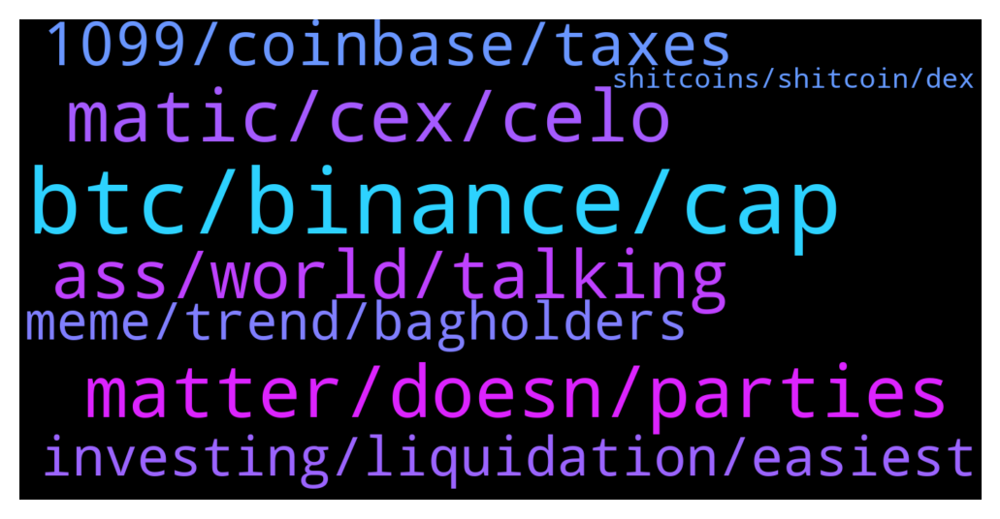

# **@shitpool**
 ## Analysis for **2021-12-23** - **2021-12-24**.

---

## 📊 **Basic Stats**

**n_messages_sent**: 256

---

---

## 🔝 **Top keywords and related messages**

1. **btc, binance, cap**

    @yesbutalsono --- *back per time has been the same price for  the last few days i think* **--->** [TG Discussion](https://t.me/shitpool/711329)

    @monkey993 --- *Luke warm Coinbase and Binance pumps man wtf* **--->** [TG Discussion](https://t.me/shitpool/711437)

    @nuckingfutzzzz --- *What's block.one upto these days? They are sitting on alot of btc* **--->** [TG Discussion](https://t.me/shitpool/711153)

    @NotTheGodfather --- *Rbn going to list on binance* **--->** [TG Discussion](https://t.me/shitpool/711250)

    @pizza_dog --- *I’m starting to see what they’re talking about with the downward pressure on price though. Almost back to 3 billion market cap and well below the 8k price it was at when it was at the 3 billion mktcap last* **--->** [TG Discussion](https://t.me/shitpool/711325)

    @MoneroPal --- *That’s foolish, TIME is garbage, bogus inflationary worthless token backed by nothing, you’ll get liquidated as it dumps from $4k down to $2.5k again. Best to just swing trade it while staking. Not a long term hold, certaintly wouldn’t borrow against it.* **--->** [TG Discussion](https://t.me/shitpool/710995)

2. **matter, doesn, parties**

    @iamslow --- *libs have all time high in murders in all their major cities right now* **--->** [TG Discussion](https://t.me/shitpool/711049)

    @NotTheGodfather --- *republicans are red, democrats are blue. combine the two colors and you get the color of purple, the color of royalty. the Elites own both sides. Republicans are the york rite of masons, Dems are the scottish rite. Two wings of same bird.  thats why political arguments along party lines are a waste of time. Back to crypto!* **--->** [TG Discussion](https://t.me/shitpool/711088)

    @iamslow --- *so they can steal more money* **--->** [TG Discussion](https://t.me/shitpool/711027)

    @MoneroPal --- *yes, will take years, not to mention, may be reversed by the next administration, lobbies run the country not the government...* **--->** [TG Discussion](https://t.me/shitpool/711028)

    @iamslow --- *say you're liberal w out saying it* **--->** [TG Discussion](https://t.me/shitpool/711040)

    @pizza_dog --- *Is it a liberal idea to point out we live in an oligarchy fellas* **--->** [TG Discussion](https://t.me/shitpool/711076)

3. **matic, cex, celo**

    @yesbutalsono --- *ser its not that hard to track if you touch any cex* **--->** [TG Discussion](https://t.me/shitpool/710986)

    @pizza_dog --- *Unless you have a more guaranteed way With cel* **--->** [TG Discussion](https://t.me/shitpool/710992)

    @kevvy_wevvy --- *I know EOS and XRP are better, cant think a 22 more* **--->** [TG Discussion](https://t.me/shitpool/711353)

    @kekurikekukaka --- *Is CZ trying to hit ETH with Matic ?* **--->** [TG Discussion](https://t.me/shitpool/711268)

    @Horselorde --- *Not a bad time to take CEL profits either* **--->** [TG Discussion](https://t.me/shitpool/710982)

    @MoneroPal --- *Do not associate wallets used for defi with cex’s, end of story, if you want to pay you rfair share go ahead.* **--->** [TG Discussion](https://t.me/shitpool/711026)

4. **ass, world, talking**

    @alpenair --- *Spell about to kick some ass* **--->** [TG Discussion](https://t.me/shitpool/711423)

    @Michealbuble1 --- *thanks for not roasting me to hard bahaha* **--->** [TG Discussion](https://t.me/shitpool/711262)

    @MoneroPal --- *you’re clueless worthy apes just stop* **--->** [TG Discussion](https://t.me/shitpool/711013)

    @iamslow --- *ok aalso you're just talking out your ass* **--->** [TG Discussion](https://t.me/shitpool/711069)

    @yesbutalsono --- *oh man i might do something rly dumb* **--->** [TG Discussion](https://t.me/shitpool/710970)

    @wanker007 --- *Annnd I just barfed in my mouth a bit* **--->** [TG Discussion](https://t.me/shitpool/711357)

5. **1099, coinbase, taxes**

    @MoneroPal --- *Doesn’t matter what they are, what matters is enforcement, for which there is currently ZERO. The IRS is chronically underfunded and has so far not gone after any on-chain transactions. They’ve been doing the same old, go after under reporters that were issued 1099’s and did not pay their taxes. I doubt this will change in the near future, likely another 3-5 years minimum.* **--->** [TG Discussion](https://t.me/shitpool/711024)

    @wojackdegreate --- *You really think swaps aren’t taxable? 😂* **--->** [TG Discussion](https://t.me/shitpool/711019)

    @MoneroPal --- *Has nothing to do with feeling better. It has to do with the absolute retardation of reporting defi transactions to the IRS. There is absolutely no purpose whatsoever to doing so. If you’re converting crypto (asset) to fiat (USD) you will be presented wth a 1099-misc from whichever CEX. You owe taxes then.* **--->** [TG Discussion](https://t.me/shitpool/711018)

    @MoneroPal --- *If you’re cashing out a large sum you’ll be issued a 1099-misc for anything over $600 so you’ll need to pay “your fair share”* **--->** [TG Discussion](https://t.me/shitpool/710997)

    @MoneroPal --- *lol taxes on when not selling to fiat on a CEX? ser…* **--->** [TG Discussion](https://t.me/shitpool/710985)

    @MoneroPal --- *No tax authority currently is analyzing the chain, certaintly not the IRS. They audit a total of 4500 partnerships per year and have been consistently defunded the past 15+ years. Not to mention the overhead and inability to prove wallet ownership reliably is still a major blocker. It will happen eventually, but not anytime soon. Many wallets, such as BlueWallet generate a new wallet address each transaction. Treat crypto as an asset, pay taxes when you sell that asset into fiat.* **--->** [TG Discussion](https://t.me/shitpool/710987)

6. **investing, liquidation, easiest**

    @pizza_dog --- *Also Pervy, borrow against your time for more mim to get time. You at least know the base time is compounding* **--->** [TG Discussion](https://t.me/shitpool/710991)

    @yokiyak --- *but it's the easiest  money tbh* **--->** [TG Discussion](https://t.me/shitpool/711485)

    @yokiyak --- *yeah playing the major isn't even the best roi ofc unless you need very big liq* **--->** [TG Discussion](https://t.me/shitpool/711490)

    @CryptoMike66 --- *And will get a real profite* **--->** [TG Discussion](https://t.me/shitpool/711526)

    @CryptoMike66 --- *The most profitable on ur opinion* **--->** [TG Discussion](https://t.me/shitpool/711508)

    @yokiyak --- *and add with profits ect sometime* **--->** [TG Discussion](https://t.me/shitpool/711495)

7. **meme, trend, bagholders**

    @Horselorde --- *Yup, still hated by the community haha* **--->** [TG Discussion](https://t.me/shitpool/711173)

    @wanker007 --- *Ironically MEME on bittrex still around, still moves (barely) but is OG 2016 haha.* **--->** [TG Discussion](https://t.me/shitpool/711533)

    @sumtemm --- *I lost a lot of chump change in meme anime coins* **--->** [TG Discussion](https://t.me/shitpool/711531)

    @sumtemm --- *meme coins go to 0 fast once that meme trend ends* **--->** [TG Discussion](https://t.me/shitpool/711530)

    @yokiyak --- *they follow major trend so you can frontrun* **--->** [TG Discussion](https://t.me/shitpool/711499)

    @yokiyak --- *but the main trend is coming ie defi* **--->** [TG Discussion](https://t.me/shitpool/711487)

