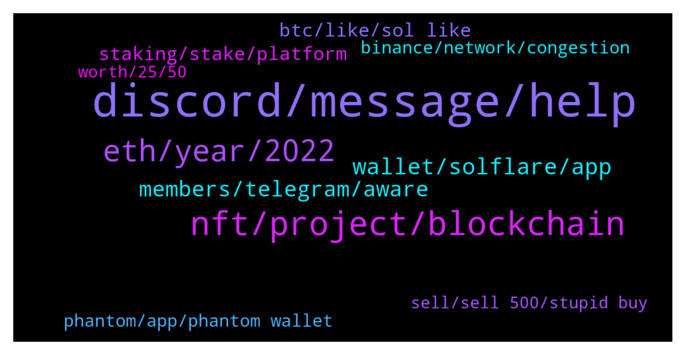

# **@solana**
 ## Analysis for **2021-12-23** - **2021-12-24**.

---

## 📊 **Basic Stats**

**n_messages_sent**: 405

---

---

## 🔝 **Top keywords and related messages**

1. **discord, message, help**

    @Sudesh --- *hi guys, i am a co-founder of a company building on solana, and for some reason i cannot get into solana discord.. please help.. i get linked is expired message, i have several dev questions and would like to connect to dev community at large.. i was talking to @cryptolover1987 and i hope someone can help me with this, i have seen several people have the same problems in reddit as well* **--->** [TG Discussion](https://t.me/solana/877702)

    @RealPrinceOla --- *Hello, I try to get that for you but I couldn't. May I ask you to join our discord channel. Our dev support will be able to help you technical things!   👉 https://solana.com/discord  ✅Click on #role and select the emoji "Community " 👨‍🌾 on Carl -bot. And then go back to the general section again.  Then you will able to send message!* **--->** [TG Discussion](https://t.me/solana/877016)

    @Karim_zaki0 --- *can you help me to come back my money? 😔* **--->** [TG Discussion](https://t.me/solana/878456)

    @NtriDuc --- *I tried to post the link to our twitter here but somehow the bot kept deleting it* **--->** [TG Discussion](https://t.me/solana/878104)

    @kekyv2 --- *if u are admin why u messaging me directly like scammers* **--->** [TG Discussion](https://t.me/solana/877129)

    @mahib45 --- *Hello 👋  Feel free to write your issue here ❤* **--->** [TG Discussion](https://t.me/solana/877514)

2. **nft, project, blockchain**

    @NtriDuc --- *Hi Rahul, we are a game project in advanced stage of development. We would like to launch on solana. Please can you  let us know whom we should speak to. (We don’t need funding - just technical partnership of some sort).* **--->** [TG Discussion](https://t.me/solana/878088)

    @hendra_wijayaaa --- *Because at solidus AI chat group, i read that the dev of that project is same with the one with solana I just want to confirm* **--->** [TG Discussion](https://t.me/solana/878004)

    @ruch149 --- *Hi guys. Where can we see the list of games for which Solana will provide liquidity mining incentives? Or where can we montior that? @admin* **--->** [TG Discussion](https://t.me/solana/878054)

    @NtriDuc --- *We have had alpha version of the game. People like it and like the dev team so we are quite popular in South East Asia* **--->** [TG Discussion](https://t.me/solana/878112)

    @Arko --- *What is the roadmap for Solana 2022?* **--->** [TG Discussion](https://t.me/solana/877355)

    @Ether --- *What is good news with Solana?* **--->** [TG Discussion](https://t.me/solana/876791)

3. **eth, year, 2022**

    @Hrn --- *Will solana be over 400 in a year* **--->** [TG Discussion](https://t.me/solana/877911)

    @lauretta122 --- *Long sol from it entry point at @ $176   With a. 10x leverage. And hold and sell at $185* **--->** [TG Discussion](https://t.me/solana/877404)

    @Senti --- *2022 1Q would have a good run* **--->** [TG Discussion](https://t.me/solana/877051)

    @lauretta122 --- *The year is almost over did you buy the dip for next year bull run when sol hit $500* **--->** [TG Discussion](https://t.me/solana/876904)

    @smith --- *maybe not 6m, but I do think they will at the same in 1.5-2y* **--->** [TG Discussion](https://t.me/solana/877449)

    @Monarch420 --- *in 2022 it will definitely reach $400* **--->** [TG Discussion](https://t.me/solana/878361)

4. **wallet, solflare, app**

    @BenjaminShannon --- *None, I just can't find the steps to sync my Solflare wallet with my Solflare mobile app* **--->** [TG Discussion](https://t.me/solana/876958)

    @Giorgio --- *Hi guys, I just opened a software version of solflare and something doesn't sound me so good, but of corse because I have no knowledge. At the moment of login, Instead of asking me for the password, it asks for the mnemonic, with no password, and then it shows me a list of solflare wallets based on the derivation path. Then I cannot select mine but just click on ACCESS and It goes directly to my own wallet. How does it associate it, since I haven t select it? Is there anything unsafe in this? Thanks* **--->** [TG Discussion](https://t.me/solana/878031)

    @Folaross --- *You can't set up 2fa security on the decentralised wallet. But I will advise you to set up a lock method on your browser and wallet apps.* **--->** [TG Discussion](https://t.me/solana/877263)

    @MustoDogemonGo --- *Admin please assist me I withdraw NFT from DogemonGO app to solana trust wallet address I want send it again to the app* **--->** [TG Discussion](https://t.me/solana/878199)

    @Umirai --- *Is there a way to setup a solana wallet with 2fa* **--->** [TG Discussion](https://t.me/solana/877258)

    @jaj650 --- *What is the best wallet to store solana on* **--->** [TG Discussion](https://t.me/solana/878510)

5. **members, telegram, aware**

    @mahib45 --- *Hello to all the newcomers! 👋    Welcome to Solana official community! As you just entered in #Solana, in case you have a question about what is #Solana?  Solana is a fast, secure, and censorship-resistant blockchain providing the open infrastructure required for crypto to scale to global adoption.   To read more about Solana please visit  Website: www.solana.com Document: https://docs.solana.com/introduction  ⚠️ Please be aware of fraudulent actors posing as Solana team members on Telegram. If you do receive suspicious messages, do not respond, click on links or follow any instructions. ✅ We recommend changing your telegram privacy settings to avoid being added to scam groups. ❗️There is no Solana airdrop or free giveaway!* **--->** [TG Discussion](https://t.me/solana/877878)

    @Karim_zaki0 --- *since 4 days ago, there was alive video in youtube about solana and its developpers, they was talking about 2x solana you sent to them, i sent them solana but i didn't recieve anything from them* **--->** [TG Discussion](https://t.me/solana/878436)

    @mahib45 --- *🚨🚨🚨 Scammer alert 🚨🚨🚨  ⚠️ Please be aware of fraudulent accounts posing as Solana team members on Telegram. If you receive suspicious messages, do not respond to them, click on links or follow any instructions. ⚠️ Please also be aware of "giveaways" promoted by bots, YouTube, in Medium articles or fake Telegram groups. Scammers are very creative, however the standard rule is never send funds to strangers or share your private key. ❗️There is no Solana airdrop or free giveaway! Do not send SOL anywhere with the expectation that you will receive more back.  ✅ We recommend changing your telegram privacy settings to avoid being added to scam groups.* **--->** [TG Discussion](https://t.me/solana/878648)

    @RealPrinceOla --- *⚠️ Please be aware of fraudulent actors posing as Solana team members on Telegram. If you do receive suspicious messages, do not respond, click on links or follow any instructions. ✅ We recommend changing your telegram privacy settings to avoid being added to scam groups. ❗️There is no Solana airdrop or free giveaway!  ⚠️Admins will never PM you first, if it does, it is most likely a scam. We the real Solana admins will never ask for money or remittances or any kind of seed phrase !!  Please Block 🚫 and report them to @notoscam* **--->** [TG Discussion](https://t.me/solana/878000)

    @Peppsonoio --- *Luna's group on telegram 199k members Solana's group on telegram 97k members* **--->** [TG Discussion](https://t.me/solana/877488)

    @Folaross --- *⚠️ Please be aware of fraudulent actors posing as Solana team members on Telegram. If you do receive suspicious messages, do not respond, click on links or follow any instructions. ⚠️ Please also be aware of giveaways promoted on YouTube, in Medium articles or fake Telegram groups. ❗️There is no Solana airdrop or free giveaway! Do not send SOL anywhere with the expectation that you will receive more back.  ✅ We recommend changing your telegram privacy settings to avoid being added to scam groups.* **--->** [TG Discussion](https://t.me/solana/877179)

6. **btc, like, sol like**

    @A --- *Not based on what I researched as it is gamble like based speculation* **--->** [TG Discussion](https://t.me/solana/878488)

    @thinks_deep4742 --- *More over eth and sol can be like currency value. And btc is already a store of value...kinda like gold.* **--->** [TG Discussion](https://t.me/solana/877907)

    @thinks_deep4742 --- *Its silly that you are comparing sol with btc. Both are very ver very different.* **--->** [TG Discussion](https://t.me/solana/877888)

    @Amaru --- *So many people here don't even know how to make money over crypto currency, especially SOL at this time It's a shame* **--->** [TG Discussion](https://t.me/solana/878062)

    @Serena --- *This sounds silly too you can’t compare both* **--->** [TG Discussion](https://t.me/solana/877901)

    @vintageme28 --- *Buying SOL now is like buying btc in 2013* **--->** [TG Discussion](https://t.me/solana/877861)

7. **staking, stake, platform**

    @mattiarxx --- *Hi, when i try to mint a nft on staking page, one error processing error 4 appears: custom program error 0x1 please try again* **--->** [TG Discussion](https://t.me/solana/877922)

    @cryptolover1987 --- *Which platform do you using for staking ?* **--->** [TG Discussion](https://t.me/solana/877227)

    @kekyv2 --- *if i cancel my staking is there any time limit ?* **--->** [TG Discussion](https://t.me/solana/877149)

    @Woly000 --- *Correct but always choose a good platform once it comes to staking, I personally use atomic wallet for $SOL staking* **--->** [TG Discussion](https://t.me/solana/877147)

    @kekyv2 --- *one more thing if i use phantom app stake it says %7 - %10 fee for stake for example if i stake 100 sol will they get my 7-8 sol for fees ?* **--->** [TG Discussion](https://t.me/solana/877144)

    @kekyv2 --- *so i wont lose any sol if i stake thanks* **--->** [TG Discussion](https://t.me/solana/877146)

8. **binance, network, congestion**

    @thinks_deep4742 --- *Is sol network facing congestion? Im beginning to think those binance cs guys r lying to me.* **--->** [TG Discussion](https://t.me/solana/877815)

    @thinks_deep4742 --- *Yes i just spoke with cs they said SOL network is congested. Asked me to check the withdrawal status in several hours. Very disappointing* **--->** [TG Discussion](https://t.me/solana/877753)

    @mahib45 --- *Hello 👋  This is NOT congestion on #Solana  network.  Please remember Binance is a centralized exchange, so when you request a withdrawal from Binance to  wallet, the Binance side will need to approve it, and the tx will NOT be recorded in the blockchain until Binance approved it. You may contact Binance tech support for more assistance ❤ Thank you so much!* **--->** [TG Discussion](https://t.me/solana/877676)

    @DigitalDogsStudios --- *Hello i've been investing in Solana and I really love the project. I would like to know however what is being done about the congestion issues that Solana has been facing?   I think most of these issues stem from Raydiums IDO's ... is this a Solana issue or is  this a Raydium problem?  Has there been any word on if they have fixed the problem?* **--->** [TG Discussion](https://t.me/solana/876712)

    @tscrow567 --- *Binance is yet to be approved bro* **--->** [TG Discussion](https://t.me/solana/877732)

    @thinks_deep4742 --- *Ive been waiting for an almost an hour now...withdrawing sole from binance to phantom* **--->** [TG Discussion](https://t.me/solana/877675)

9. **phantom, app, phantom wallet**

    @KanzakyRak --- *have this problem while connecting my phantom wallet with candy-machine mint button -> "code": 403, "message":"Access forbidden, contact your app developer* **--->** [TG Discussion](https://t.me/solana/878175)

    @Yienjo --- *Use phantom wallet or sollet on desktop* **--->** [TG Discussion](https://t.me/solana/877376)

    @Crypto_whale021 --- *do phantom wallet has mobile app?* **--->** [TG Discussion](https://t.me/solana/877652)

    @AsherQas --- *do they have an android app?* **--->** [TG Discussion](https://t.me/solana/877400)

    @aFidcel --- *Phantom and a whole lot others   Sollet Solflare* **--->** [TG Discussion](https://t.me/solana/878523)

    @thinks_deep4742 --- *Sollet has i think. Phantom does not. Do not fall for the fakeones. Its pahntom .app always* **--->** [TG Discussion](https://t.me/solana/877402)

10. **worth, 25, 50**

    @Visualized8 --- *I have like 50 cents worth sol, is it enough?* **--->** [TG Discussion](https://t.me/solana/877598)

    @Vhope09 --- *I have 50sol I'm very happy ❤️❤️* **--->** [TG Discussion](https://t.me/solana/878359)

    @Solamander --- *I was buying sol on 30 the i was so made at it couldnt break 50 for many months* **--->** [TG Discussion](https://t.me/solana/877879)

    @Monterrey_Rice --- *Depends on if you have been good or bad!* **--->** [TG Discussion](https://t.me/solana/876865)

    @Elie --- *Only if you care about making money* **--->** [TG Discussion](https://t.me/solana/878487)

    @thinks_deep4742 --- *Anyone on invictus sol? Are the usdc bonds worth it?* **--->** [TG Discussion](https://t.me/solana/876860)

