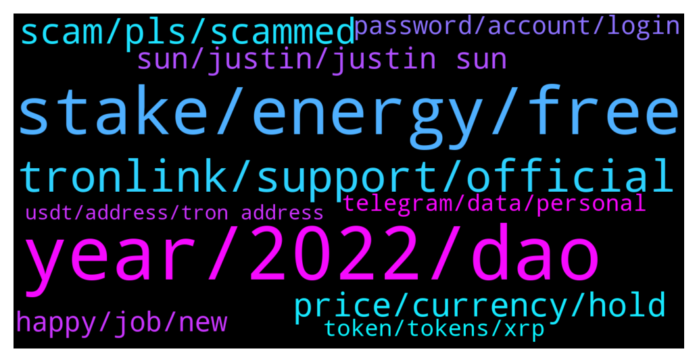

# **@tronnetworkEN**
 ## Analysis for **2021-12-23** - **2021-12-24**.

---

## 📊 **Basic Stats**

**n_messages_sent**: 339

---

---

## 🔝 **Top keywords and related messages**

1. **year, 2022, dao**

    @SaraSE2021 --- *Anything Tron related. Don’t say the whole market is down as the excuse. It’s been like this for awhile. What kind of changes will be coming to boost holders?* **--->** [TG Discussion](https://t.me/tronnetworkEN/3784901)

    @Darcosabhi --- *Why ? Is tron going up?  Or something else* **--->** [TG Discussion](https://t.me/tronnetworkEN/3787013)

    @TronBlockStaking --- *The street will have to recognize that Tron is undervalued, which will certainly happen. As for the Tron DAO we can just keep building a great ecosystem which will lead to expanding network effects...* **--->** [TG Discussion](https://t.me/tronnetworkEN/3784930)

    @davkelone --- *I would appreciate if they won`t* **--->** [TG Discussion](https://t.me/tronnetworkEN/3786536)

    @Ingemkts --- *I have the same question, what about trx's future? There will be a new CEO? There is way too much uncertainty* **--->** [TG Discussion](https://t.me/tronnetworkEN/3786824)

    @Iamthewitcher --- *Well I'm just wondering don't take it personally but why trx didn't performed well like everyone coin is pumping but trx is still at his position🙂* **--->** [TG Discussion](https://t.me/tronnetworkEN/3785082)

2. **stake, energy, free**

    @Jayjayonyishi --- *I mean trx staking not sun* **--->** [TG Discussion](https://t.me/tronnetworkEN/3785658)

    @Jayjayonyishi --- *Pls can you further explain who are validators and what they do* **--->** [TG Discussion](https://t.me/tronnetworkEN/3785460)

    @Fabs_trx --- *Better to unfreeze your trx and pay fees if you have enough trx to cover the fees* **--->** [TG Discussion](https://t.me/tronnetworkEN/3784340)

    @Fabs_trx --- *Go where you have frozen your trx and instead of freeze select unfreeze* **--->** [TG Discussion](https://t.me/tronnetworkEN/3784346)

    @Jayjayonyishi --- *Pls if I stake 1trx what is the interest rate* **--->** [TG Discussion](https://t.me/tronnetworkEN/3785447)

    @awtsw --- *they are the "miners" of proof of stake systems* **--->** [TG Discussion](https://t.me/tronnetworkEN/3785464)

3. **tronlink, support, official**

    @Carlos_TRX --- *Https://tronwiki.com <---- check this to know more about TRON. You are voting SR to give support to the best projects and improve the TRON blockchain* **--->** [TG Discussion](https://t.me/tronnetworkEN/3785620)

    @Fabs_trx --- *This is Tron group. Tron is a blockchain and everything has been doing fine. Maybe you should find some trading group 👍🏻* **--->** [TG Discussion](https://t.me/tronnetworkEN/3784909)

    @SteveMillerOR --- *I don’t see any CSupport avenue at Tronlink.* **--->** [TG Discussion](https://t.me/tronnetworkEN/3784325)

    @MannyGreenHill --- *What is the official website for tron mining* **--->** [TG Discussion](https://t.me/tronnetworkEN/3786509)

    @FirefighterJoe --- *I am new to TRON and would like to know how to Recharge so I can start  using my account. Thanks* **--->** [TG Discussion](https://t.me/tronnetworkEN/3786548)

    @Carlos_TRX --- *just send 1.1TRX to your TRON account to activate it, we recommend you use tronlink* **--->** [TG Discussion](https://t.me/tronnetworkEN/3786549)

4. **scam, pls, scammed**

    @Divenem --- *Pls it's should be work on* **--->** [TG Discussion](https://t.me/tronnetworkEN/3786686)

    @Chinomso --- *Seriously for an account that I been using for months now and you are saying is scam* **--->** [TG Discussion](https://t.me/tronnetworkEN/3787179)

    @SteveMillerOR --- *IDK what your question is referring to.* **--->** [TG Discussion](https://t.me/tronnetworkEN/3784327)

    @bu_sarry --- *Carlos am sent to you yesterday please see my massage* **--->** [TG Discussion](https://t.me/tronnetworkEN/3787586)

    @agentpiki --- *Admins and mods do not message you first.* **--->** [TG Discussion](https://t.me/tronnetworkEN/3787108)

    @KingsDove_TRX --- *@xPommepote check dm when possible, got some questions* **--->** [TG Discussion](https://t.me/tronnetworkEN/3786771)

5. **price, currency, hold**

    @RimshaRiaz1 --- *I want to make money without investment. Please help  I don't have money to invest* **--->** [TG Discussion](https://t.me/tronnetworkEN/3784315)

    @Jayjayonyishi --- *How can you increase the percentage can someone pls explain further . I am new to crypto currency exchange* **--->** [TG Discussion](https://t.me/tronnetworkEN/3785645)

    @Iamthewitcher --- *Same🙂once I'd get my average price i would definitely sell it off and never buy this coin again until i will make sure the price is in dip* **--->** [TG Discussion](https://t.me/tronnetworkEN/3785546)

    @agentpiki --- *Not taking personally 😁   Even in stocks, particular company performing well yet stocks go down  Same thing. You can't just rely on price action.* **--->** [TG Discussion](https://t.me/tronnetworkEN/3785085)

    @xPommepote --- *THANKS YOU! And remember how much time it takes for BTC or ETH to rise.* **--->** [TG Discussion](https://t.me/tronnetworkEN/3785558)

    @SaraSE2021 --- *Lol so you’re investing just for fun? 🤔* **--->** [TG Discussion](https://t.me/tronnetworkEN/3784907)

6. **sun, justin, justin sun**

    @agentpiki --- *You think?  You think Justin Sun will just abandon his precious Tron baby?* **--->** [TG Discussion](https://t.me/tronnetworkEN/3785079)

    @M0S1R --- *Justin Sun Resigns as CEO of TRON, This does not have a little psychological impact* **--->** [TG Discussion](https://t.me/tronnetworkEN/3785765)

    @KingsDove_TRX --- *Justin sun is now the Ambassador for Grenada concerning the WTO* **--->** [TG Discussion](https://t.me/tronnetworkEN/3786779)

    @agentpiki --- *Next (fake) news:  Rocket ride by Justin Sun overpumped, went to moon instead 💪💪* **--->** [TG Discussion](https://t.me/tronnetworkEN/3785960)

    @agentpiki --- *??? Justin Sun is going to space bro* **--->** [TG Discussion](https://t.me/tronnetworkEN/3785097)

    @agentpiki --- *Justin Sun's mission to Latin America* **--->** [TG Discussion](https://t.me/tronnetworkEN/3785075)

7. **happy, job, new**

    @Msicmaniac --- *Because there a lot of peoples* **--->** [TG Discussion](https://t.me/tronnetworkEN/3787551)

    @paulinhoa1 --- *also see them but not too often* **--->** [TG Discussion](https://t.me/tronnetworkEN/3786523)

    @Iamthewitcher --- *And hodl it until i double my money😈* **--->** [TG Discussion](https://t.me/tronnetworkEN/3785089)

    @simon866 --- *Wishing  you all have a merry Christmas and a happy new year! 🤝🎉* **--->** [TG Discussion](https://t.me/tronnetworkEN/3787724)

    @Reza --- *Why   Whoud you please help me and explain more* **--->** [TG Discussion](https://t.me/tronnetworkEN/3787256)

    @xPommepote --- *Same to you and all the team 💪🏻💜* **--->** [TG Discussion](https://t.me/tronnetworkEN/3787737)

8. **password, account, login**

    @Carlos_TRX --- *U cant, your binance account may have been compromised, contact binance support, my advice is that if you still have funds change them to a wallet and never compromise your private keys.* **--->** [TG Discussion](https://t.me/tronnetworkEN/3787576)

    @Chinomso --- *It's not wallet,  it's website where i recharge and  I daily claim five percent but now three percent  I couldn't login again because I changed my password they have refused login* **--->** [TG Discussion](https://t.me/tronnetworkEN/3787169)

    @Chinomso --- *And now it couldn't allow me to login with the new password* **--->** [TG Discussion](https://t.me/tronnetworkEN/3787125)

    @Chinomso --- *I changed my password because someone entered my account and claimed my daily percentage* **--->** [TG Discussion](https://t.me/tronnetworkEN/3787120)

    @Prince371 --- *It was transfer to this account by Tron link pro TEeFmeEHn8AN97MYdHy71yWubX3M6vBYvQ* **--->** [TG Discussion](https://t.me/tronnetworkEN/3785204)

    @xPommepote --- *Contact binance support if your account was hacked.* **--->** [TG Discussion](https://t.me/tronnetworkEN/3787575)

9. **telegram, data, personal**

    @davkelone --- *I lost my trust to Telegram completely after it has joined all those IT giants so I am definitely going to check this one 👍* **--->** [TG Discussion](https://t.me/tronnetworkEN/3786546)

    @paulinhoa1 --- *they have to earn in order to keep developing the messenger. For like 5 years, they were doing everything only using the Telegram owner`s personal funds.* **--->** [TG Discussion](https://t.me/tronnetworkEN/3786527)

    @davkelone --- *yeah, but I thought TG would not advertise anything. They were the last place without official ads.* **--->** [TG Discussion](https://t.me/tronnetworkEN/3786526)

    @davkelone --- *hey, is it only me or others also see the official Telegram ads in channels?* **--->** [TG Discussion](https://t.me/tronnetworkEN/3786521)

    @mathis_be --- *Take Secretum for example. You log in only with your wallet public address and that is all info the messenger gets from you. There is no way it will use it for ads or lose any sensible data.* **--->** [TG Discussion](https://t.me/tronnetworkEN/3786543)

    @mathis_be --- *web 3.0 messengers can not collect users data cause it is blockchain based.* **--->** [TG Discussion](https://t.me/tronnetworkEN/3786534)

10. **token, tokens, xrp**

    @Canaster --- *My Trx tokens aren't showing in the BSC side of the Tronbridge, can anyone help. My other tokens show.? Thanks* **--->** [TG Discussion](https://t.me/tronnetworkEN/3785562)

    @jmohamad416 --- *curInvokeEnergyLimit[22067], curOpEnergy[20000], usedEnergy[20827]. Transaction here What is this 👆👆* **--->** [TG Discussion](https://t.me/tronnetworkEN/3787349)

    @tobechi22 --- *Why I can't sell usdt without Tron?* **--->** [TG Discussion](https://t.me/tronnetworkEN/3788049)

    @Abba --- *Please  any one know about this token on tron scan (XRP trc10) with token ID 1002896* **--->** [TG Discussion](https://t.me/tronnetworkEN/3787604)

    @jmohamad416 --- *l want make token and send this what is it* **--->** [TG Discussion](https://t.me/tronnetworkEN/3787318)

    @T --- *I confirmed it is the old TRX token* **--->** [TG Discussion](https://t.me/tronnetworkEN/3787287)

