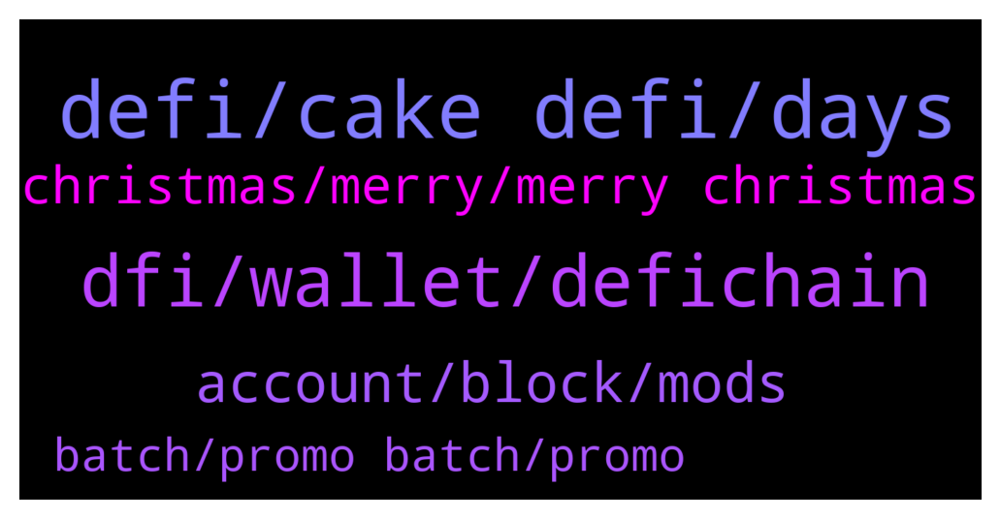

# **@CakeDeFi_EN**
 ## Analysis for **2021-12-24** - **2021-12-25**.

---

## 📊 **Basic Stats**

**n_messages_sent**: 72

---

---

## 🔝 **Top keywords and related messages**

1. **defi, cake defi, days**

    @Alexandre --- *I benn waiting more than 2 days for a withdraw. This is crazy!* **--->** [TG Discussion](https://t.me/CakeDeFi_EN/156559)

    @mikkelseg --- *I have made a deposit for to my btc on cake defi account but it is still pending for over 5 hours* **--->** [TG Discussion](https://t.me/CakeDeFi_EN/156602)

    @Michael_Schredl --- *It can take up to 3 business days* **--->** [TG Discussion](https://t.me/CakeDeFi_EN/156572)

    @Michael_Schredl --- *Withdraws are working normaly - they can take up to 3 business days* **--->** [TG Discussion](https://t.me/CakeDeFi_EN/156517)

    @MaverickGoh --- *I do not want to lock it up anymore. Does this means from tomorrow onwards i can withdraw? Or just flexible staking.* **--->** [TG Discussion](https://t.me/CakeDeFi_EN/156694)

    @Kassius84 --- *Yes, but be aware that $50 must arrive at Cake DeFi 😃👍* **--->** [TG Discussion](https://t.me/CakeDeFi_EN/156430)

2. **dfi, wallet, defichain**

    @Carlos --- *Will i ever be able to convert dfi to btc in the future ?* **--->** [TG Discussion](https://t.me/CakeDeFi_EN/156495)

    @James --- *That should be with the atomic swap plan in the near future hopefully* **--->** [TG Discussion](https://t.me/CakeDeFi_EN/156498)

    @Businesspunk1 --- *Thank u, How can I change the network?! Sorry newbie* **--->** [TG Discussion](https://t.me/CakeDeFi_EN/156536)

    @Captlu --- *I'd like to Swap my dTSLA to DFI or something else. Does anyone know how?* **--->** [TG Discussion](https://t.me/CakeDeFi_EN/156592)

    @Captlu --- *One last question, I've setup the DeFiChain wallet on app. To confirm, there is only one address to send all assets to? Like TSLA, GOOGL, etc?* **--->** [TG Discussion](https://t.me/CakeDeFi_EN/156598)

    @fabioandreatta --- *Select deposit and copy your Bitcoin Deposit Adress (DeFiChain Network) then past your address on the DeFiChain Wallet* **--->** [TG Discussion](https://t.me/CakeDeFi_EN/156537)

3. **account, block, mods**

    @Nico --- *Oh yes it is but there is a dude called Bernd mack in here who is asking people for their Account data. Him: Bernd mack* **--->** [TG Discussion](https://t.me/CakeDeFi_EN/156750)

    @enalettin --- *Anyone dm you and offer help is dangerous one hundred percent a thief make no mistake* **--->** [TG Discussion](https://t.me/CakeDeFi_EN/156753)

    @Captlu --- *I assume this is similar to Metamask or TraderJoe?* **--->** [TG Discussion](https://t.me/CakeDeFi_EN/156594)

    @DmgBautista --- *Always block and report anyone who DM you. ALWAYS! Scammers are always on the look in public chats and Cake public chat is no exception. In our pinned messages are the community rules, in which you can see mods will never DM you, as well as its against the rules to DM other users. Any question can and must be placed here, were mods and the community will share knowledge and help. No one needs to hide under a DM. Doing so, will likely be a scammer. Always block and report, dont even give them a chance 😉* **--->** [TG Discussion](https://t.me/CakeDeFi_EN/156757)

    @enalettin --- *They are scammers impersonating known names From here and try to steal your account your wealth your coins* **--->** [TG Discussion](https://t.me/CakeDeFi_EN/156752)

    @enalettin --- *Block immediately and don't ever click on any link they sende you* **--->** [TG Discussion](https://t.me/CakeDeFi_EN/156751)

4. **christmas, merry, merry christmas**

    @Businesspunk1 --- *@fabioandreatta thank u very much and have a merry christmas 🙂* **--->** [TG Discussion](https://t.me/CakeDeFi_EN/156540)

    @jumbolin --- *Merry Xmas 🎅 and all of you, stay healthy people* **--->** [TG Discussion](https://t.me/CakeDeFi_EN/156746)

    @rahulkumaragarwal --- *“The spirit of Christmas is sharing and caring. Let us not just be focused on our lives alone. Even if you are able to help one person, then you have made a difference” –🙏* **--->** [TG Discussion](https://t.me/CakeDeFi_EN/156708)

    @Lydbank --- *Merry Christmas to you all 🙏🙏* **--->** [TG Discussion](https://t.me/CakeDeFi_EN/156546)

    @fabioandreatta --- *Merry Christmas to you too ❤️* **--->** [TG Discussion](https://t.me/CakeDeFi_EN/156541)

    @A --- *I totally understand. Thank you for the response. And have a happy holiday!* **--->** [TG Discussion](https://t.me/CakeDeFi_EN/156573)

5. **batch, promo batch, promo**

    @Munnakn --- *Just one batch? Why it's locked 🔒 now* **--->** [TG Discussion](https://t.me/CakeDeFi_EN/156553)

    @Munnakn --- *@fabioandreatta  when BTC Xmas new batch will go live pls ? Looks current batch closed for entry ..* **--->** [TG Discussion](https://t.me/CakeDeFi_EN/156545)

    @Munnakn --- *Ok so I can't  enter now for promo batch?* **--->** [TG Discussion](https://t.me/CakeDeFi_EN/156548)

    @Michael_Schredl --- *How many confirmations do you have* **--->** [TG Discussion](https://t.me/CakeDeFi_EN/156604)

    @Michael_Schredl --- *Yes one Batch, because it is a promo* **--->** [TG Discussion](https://t.me/CakeDeFi_EN/156554)

    @fabioandreatta --- *Batch was open for a whole week to enter* **--->** [TG Discussion](https://t.me/CakeDeFi_EN/156551)

