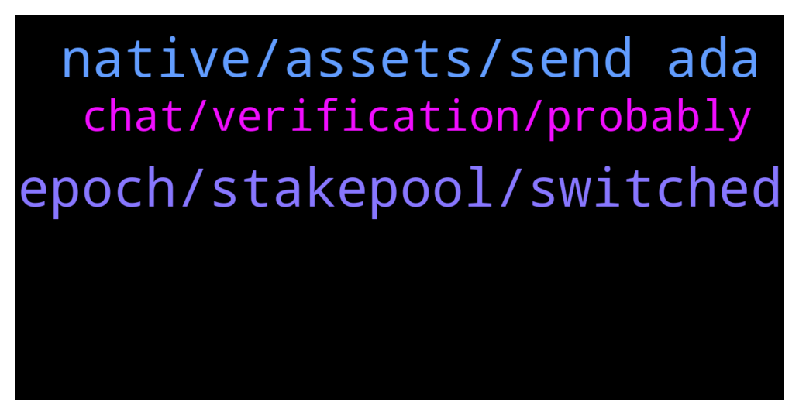

# **@Cardano**
 ## Analysis for **2021-12-24** - **2021-12-25**.

---

## 📊 **Basic Stats**

**n_messages_sent**: 49

---

---

## 🔝 **Top keywords and related messages**

1. **epoch, stakepool, switched**

    @... --- *hi if i unstake and restake on the same stakepool on the same day will i still receive my rewards?* **--->** [TG Discussion](https://t.me/Cardano/762065)

    @ChrisSTR8 --- *You will still get rewards from your old stakepool while you wait for the re-delegation to get effective. Yes the wait is the same for the rewards to come from the new pool* **--->** [TG Discussion](https://t.me/Cardano/762275)

    @... --- *I delegated to a different pool* **--->** [TG Discussion](https://t.me/Cardano/762093)

    @... --- *I already switched pools you see* **--->** [TG Discussion](https://t.me/Cardano/762091)

    @JohnGoldberg --- *If I re-delegate a stake to another stakepool does it take 2 full epochs before I can earn rewards again or does it take the ongoing epoch + the next epoch?* **--->** [TG Discussion](https://t.me/Cardano/762274)

    @DimkaT --- *After you switched pools, you have to wait two epochs for new setting to apply.* **--->** [TG Discussion](https://t.me/Cardano/762094)

2. **native, assets, send ada**

    @glitch04 --- *If you don't have native assets then it will say you don't have assets to send, if you are just sending ada you have to put in the value you want to send less the transaction fee or it will fail* **--->** [TG Discussion](https://t.me/Cardano/761965)

    @MangoPool --- *Can I run cli if I have daedalus wallet in my windows system* **--->** [TG Discussion](https://t.me/Cardano/761964)

    @Ongo_Gablogian69 --- *Does anyone use Nami Wallet? I’m trying to send my ADA to a different wallet but Nami wallet says I have no assets, whilst at the same time showing my balance* **--->** [TG Discussion](https://t.me/Cardano/761962)

    @Silentkiller0786 --- *Hey guys heard about ada nft did some one has more info on that how can i buy one* **--->** [TG Discussion](https://t.me/Cardano/762077)

    @Daz321 --- *How long will it be before we can send native tokens without having to send some ADA too?* **--->** [TG Discussion](https://t.me/Cardano/761984)

    @DU69SYP4 --- *How about kraken , i hold ada coin on there?* **--->** [TG Discussion](https://t.me/Cardano/762003)

3. **chat, verification, probably**

    @JuanIncognito --- *Why doesn’t this Cardano chat have the verification symbol?* **--->** [TG Discussion](https://t.me/Cardano/761941)

    @pool0AAAA --- *Hi! Seems it is here: https://github.com/cardano-foundation/CIPs/blob/master/CIP-1852/README.md  It doesn't work because link are like this "[CIP3](../CIP-0003)", so probably it should be change as "[CIP3](https://github.com/cardano-foundation/CIPs/tree/master/CIP-0003)", so full link should be there and then it should work. Probably you can make PR, if not let me know and I will create one.* **--->** [TG Discussion](https://t.me/Cardano/762322)

    @glitch04 --- *Telegram has not verified the channels yet, not sure why but the process was started several months ago with no response from telegram as to why or what needed to happen to complete the verification.* **--->** [TG Discussion](https://t.me/Cardano/761970)

    @mindmisled --- *I haven’t looked at this chat for days and there was 300 messages waiting….* **--->** [TG Discussion](https://t.me/Cardano/761942)

    @mindmisled --- *How comes this chat is quiet? Are there other channels?* **--->** [TG Discussion](https://t.me/Cardano/761939)

    @mindmisled --- *My NEAR chat had 2.5.k 😵‍💫* **--->** [TG Discussion](https://t.me/Cardano/761943)

