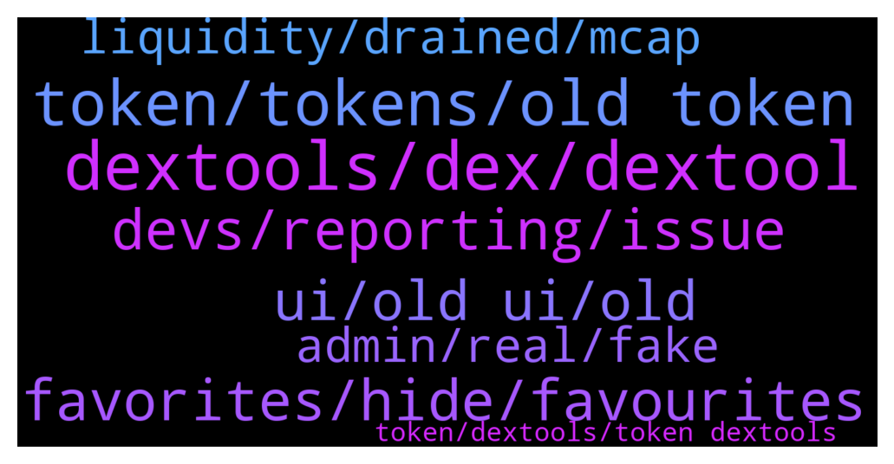

# **@DEXToolsCommunity**
 ## Analysis for **2021-12-23** - **2021-12-25**.

---

## 📊 **Basic Stats**

**n_messages_sent**: 701

---

---

## 🔝 **Top keywords and related messages**

1. **dextools, dex, dextool**

    @matarazzee00 --- *Yes i don't no i want you guys to show me how to list it on dextools* **--->** [TG Discussion](https://t.me/DEXToolsCommunity/316985)

    @FredericDEXT --- *This is the first step to make a more complete and modern UI, but many things are still in progress, and the community feedback is the best way to improve and the guide we always followed at dextools since the beginning.* **--->** [TG Discussion](https://t.me/DEXToolsCommunity/317317)

    @darkstorns --- *I haven't seen a significant change in functionality yet, this is not an update but an idle.  The number showing the price is too small, need blue red as before to know the price movement, I think the dev is imitating some other dex site, while dextools is number 1, who else needs to be imitated?* **--->** [TG Discussion](https://t.me/DEXToolsCommunity/317980)

    @Chris --- *Any way to revert to the old DexTools?* **--->** [TG Discussion](https://t.me/DEXToolsCommunity/317101)

    @starkess --- *I launched a project and it showing no symbol in dextool 😐* **--->** [TG Discussion](https://t.me/DEXToolsCommunity/316323)

    @benedictarchibongIII --- *hey is there anyone that could refer me to someone that has the capability to update dextools links/score? need to get it updated at the soonest convenience, thanks* **--->** [TG Discussion](https://t.me/DEXToolsCommunity/317090)

2. **token, tokens, old token**

    @solidask --- *Hello, is it possible to remove old version (V1) chart of a token that migrated to new version (V2)?* **--->** [TG Discussion](https://t.me/DEXToolsCommunity/316912)

    @D --- *nice work making the old token available after making a new one* **--->** [TG Discussion](https://t.me/DEXToolsCommunity/317036)

    @D --- *how do i convert my old token to new token?* **--->** [TG Discussion](https://t.me/DEXToolsCommunity/317002)

    @FredericDEXT --- *It's there in the token info section* **--->** [TG Discussion](https://t.me/DEXToolsCommunity/317614)

    @justdhu --- *I cannot use the new one it’s just another bogged version bring back the score on tokens lol you guys used to bait out the scammers etc* **--->** [TG Discussion](https://t.me/DEXToolsCommunity/318047)

    @rpoole69 --- *If you could do a single transaction to turn them into a specific token, that would be valuable IMHO* **--->** [TG Discussion](https://t.me/DEXToolsCommunity/316566)

3. **favorites, hide, favourites**

    @stanes --- *A lot of people asked to have the percentage change for the favorites.* **--->** [TG Discussion](https://t.me/DEXToolsCommunity/317953)

    @hopiumvictim --- *Who in the right mind would want to redesign the "favorites" section* **--->** [TG Discussion](https://t.me/DEXToolsCommunity/317949)

    @Simon --- *Another small thing, default sort order for favourites is last added and it doesn’t remember after I change it to name* **--->** [TG Discussion](https://t.me/DEXToolsCommunity/317530)

    @Simon --- *Guys not sure I’m a fan of the new layout, basically I want to be able to see my favourites so I can track current prices of my investments and a single chart together. I don’t care about anything else. All the guff on the left with pool info, dext score etc is fixed when I rarely care about any of it, it reduces the space for the chart and my favourites now have to float on top of it* **--->** [TG Discussion](https://t.me/DEXToolsCommunity/317457)

    @napascual --- *You could hide Favorites by click on the close button* **--->** [TG Discussion](https://t.me/DEXToolsCommunity/317111)

    @schwingk --- *I wish favorites was how it used to be, I hate scrolling to see my portfolio* **--->** [TG Discussion](https://t.me/DEXToolsCommunity/317414)

4. **devs, reporting, issue**

    @stanes --- *The issue has been forwarded to the devs. They will check and fix it asap.   Thanks for reporting 🙏* **--->** [TG Discussion](https://t.me/DEXToolsCommunity/316823)

    @FredericDEXT --- *It should work properly, try to reload* **--->** [TG Discussion](https://t.me/DEXToolsCommunity/317427)

    @stanes --- *The issue has been forwarded to the devs. They will check and fix it asap.  Thanks for reporting 🙏* **--->** [TG Discussion](https://t.me/DEXToolsCommunity/316180)

    @rpoole69 --- *Thanks, they may want to update that in the app :)* **--->** [TG Discussion](https://t.me/DEXToolsCommunity/316551)

    @stanes --- *Clear your cache it should solve the problem.* **--->** [TG Discussion](https://t.me/DEXToolsCommunity/316811)

    @stanes --- *Yep, great 👌 Always double/triple check* **--->** [TG Discussion](https://t.me/DEXToolsCommunity/316809)

5. **ui, old ui, old**

    @KK1P1 --- *the old interface was pretty much perfect, there was no need for this change* **--->** [TG Discussion](https://t.me/DEXToolsCommunity/317871)

    @hopiumvictim --- *Everything about the old UI was done right.* **--->** [TG Discussion](https://t.me/DEXToolsCommunity/317970)

    @spfr237 --- *u guys want old UI back because you are too lazy to study new one!😂 common step out of your comfort zone and try to learn it, i bet it worth it, cause there are things that can be done with this UI which was impossible with old one😉* **--->** [TG Discussion](https://t.me/DEXToolsCommunity/317542)

    @hopiumvictim --- *When can we get the old UI back?* **--->** [TG Discussion](https://t.me/DEXToolsCommunity/317940)

    @PGtheGreat --- *New UI not support UNI V3?* **--->** [TG Discussion](https://t.me/DEXToolsCommunity/318091)

    @DekuNinja --- *You messed up with new UI on phone used to be able to see volume mc all gone , is that going to be sorted ?* **--->** [TG Discussion](https://t.me/DEXToolsCommunity/317358)

6. **liquidity, drained, mcap**

    @napascual --- *You can see it on the Liquidity tab, bottom tabs on mobile* **--->** [TG Discussion](https://t.me/DEXToolsCommunity/317359)

    @danrunn --- *For new UI can we see liquidity amount for each pair anywhere?* **--->** [TG Discussion](https://t.me/DEXToolsCommunity/318062)

    @PGtheGreat --- *Cannot find any liquidity info here* **--->** [TG Discussion](https://t.me/DEXToolsCommunity/318092)

    @stanes --- *If you are using your mobile on iOS there is currently a bug so you have to go to the bottom of the page and click on "liquidity" to see info.* **--->** [TG Discussion](https://t.me/DEXToolsCommunity/318072)

    @ngl_ee --- *is showing as invalid liquidity though it definitely just had tranasctions* **--->** [TG Discussion](https://t.me/DEXToolsCommunity/316212)

    @D3c3ntraliz3d --- *yes the liquidity and mcap is not been showed on the phone* **--->** [TG Discussion](https://t.me/DEXToolsCommunity/318022)

7. **admin, real, fake**

    @moondriver1 --- *thanks 👌🏼yep already someone DM me first 😳* **--->** [TG Discussion](https://t.me/DEXToolsCommunity/315841)

    @stanes --- *Never trust anybody here who doesn't have an admin tag.* **--->** [TG Discussion](https://t.me/DEXToolsCommunity/316799)

    @FredericDEXT --- *Feel free, real admins never DM first* **--->** [TG Discussion](https://t.me/DEXToolsCommunity/317632)

    @sunshinecrypto --- *Gosh I I asked one question in the chat and I got about three fake people messaging me pretending to be you lol   Anyway do you mind if I send you a DM? Needed some help with my dextools plz* **--->** [TG Discussion](https://t.me/DEXToolsCommunity/317623)

    @CyberBULK --- *Sorry can he DM me? Im on tg jail* **--->** [TG Discussion](https://t.me/DEXToolsCommunity/316573)

    @lazymobile --- *I sent Guillermo a message on it 😉* **--->** [TG Discussion](https://t.me/DEXToolsCommunity/316810)

