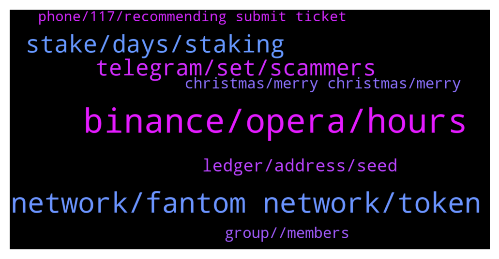

# **@Fantom_English**
 ## Analysis for **2021-12-24** - **2021-12-25**.

---

## 📊 **Basic Stats**

**n_messages_sent**: 188

---

---

## 🔝 **Top keywords and related messages**

1. **binance, opera, hours**

    @CG_05 --- *I did not discussed about price of ftm, just said what problem had with binance* **--->** [TG Discussion](https://t.me/Fantom_English/615446)

    @Chris --- *I was also trying to do this. I changed to BNB and sent to MM on BSC. Then I swapped for FTM on SpookySwap. Then I bridged to Fantom Network, again using SpookySwap. This last step, the bridge, has now been waiting to be confirmed for 8 hours !!* **--->** [TG Discussion](https://t.me/Fantom_English/615368)

    @yapxy --- *Hi! Could I ask for some help…trying to send my FTM tokens from kucoin to MM. can I send it directly via FTM network instead of erc?* **--->** [TG Discussion](https://t.me/Fantom_English/615336)

    @Janevietani --- *Binnance, Huobi, Bitfinex have liquidity for main net FTM* **--->** [TG Discussion](https://t.me/Fantom_English/615362)

    @Mcjig --- *binance supports mainnet ftm so send mainnet(opera) ftm* **--->** [TG Discussion](https://t.me/Fantom_English/615952)

    @SleeplessB0x --- *for 10 hours, for 500 ftm? thats no liquidity* **--->** [TG Discussion](https://t.me/Fantom_English/615307)

2. **network, fantom network, token**

    @slickrick6 --- *You can only send directly to fantom network from MetaMask if kucoin has native fantom withdrawals open* **--->** [TG Discussion](https://t.me/Fantom_English/615353)

    @Aleksey --- *Tell me, do you know dex Wing swap on Fantom, can you trust them?* **--->** [TG Discussion](https://t.me/Fantom_English/615598)

    @Mcjig --- *you can check out different projects and info on https://discord.gg/ftmalerts* **--->** [TG Discussion](https://t.me/Fantom_English/615859)

    @Avishek0000 --- *I want buy painter swap from fantom* **--->** [TG Discussion](https://t.me/Fantom_English/615569)

    @toninoraise --- *it is not possible on the native network fantom?* **--->** [TG Discussion](https://t.me/Fantom_English/616268)

    @sam --- *does fantom not do anything to prevent the fake sites on socials?* **--->** [TG Discussion](https://t.me/Fantom_English/616184)

3. **stake, days, staking**

    @pawneex --- *I don’t want farm or pools which has some chance of impermenant loss I just want stake is there any* **--->** [TG Discussion](https://t.me/Fantom_English/615795)

    @Fjody --- *Stake your FTM in fantom wallet. Around 14 % APR brutto if you lock for 1 year. Or have a look at Tarot. Similar earnings without locking when you use supply tab.* **--->** [TG Discussion](https://t.me/Fantom_English/615832)

    @Mcjig --- *look at spiritswap and/or spookyswap and see what farms they have. i do know that spirit has ftm/just farm* **--->** [TG Discussion](https://t.me/Fantom_English/615745)

    @manueldisaba --- *Hi whats the best way to earn rewards with ftm?* **--->** [TG Discussion](https://t.me/Fantom_English/615838)

    @Juan --- *What % commission will you pay?* **--->** [TG Discussion](https://t.me/Fantom_English/616118)

    @pawneex --- *I got ftm and just and zoo in my MetaMask can I make use of them like staking or something ?* **--->** [TG Discussion](https://t.me/Fantom_English/615739)

4. **telegram, set, scammers**

    @Heisenbvrg --- *Can u pls check why banned in marines as I'm a ftm whale no sense to ban me lol* **--->** [TG Discussion](https://t.me/Fantom_English/615965)

    @Janevietani --- *that is scam. official Fantom telegram only https://t.me/Fantom_English* **--->** [TG Discussion](https://t.me/Fantom_English/616180)

    @SleeplessB0x --- *TECHNICAL SUPPORT stop scamming I need a real admin thanks* **--->** [TG Discussion](https://t.me/Fantom_English/615285)

    @pajamasfreak --- *Anything need to fill with seedphrase is scam, bot only asking tx id* **--->** [TG Discussion](https://t.me/Fantom_English/615380)

    @Alamin --- *I blocked both scammers who pretend to be ftm mods* **--->** [TG Discussion](https://t.me/Fantom_English/615977)

    @sam --- *oh really, how can I do that? I don't want to see another person scammed.* **--->** [TG Discussion](https://t.me/Fantom_English/616202)

5. **ledger, address, seed**

    @Janevietani --- *use fwallet seed phrase / mnemonic to ledger* **--->** [TG Discussion](https://t.me/Fantom_English/615666)

    @Fjody --- *Do you need your old address being connected to Ledger for some reason? Because that basically does not add any security to your account - once the old seed was used on a computer, it might be compromised. It is advised to create a new address with Ledger and then connect it to Fantom wallet (so the seed will remain just within Ledger).* **--->** [TG Discussion](https://t.me/Fantom_English/615675)

    @Sugzino --- *I've tried to use the fantom help page, but can't figure out how to import an existing fwallet into the ledger?* **--->** [TG Discussion](https://t.me/Fantom_English/615665)

    @Sugzino --- *Is that through ledger live? Or through the pwa app* **--->** [TG Discussion](https://t.me/Fantom_English/615671)

    @Fjody --- *If you want to be sure that your wallet is safe, then yes, create new address with Ledger and transfer the funds to it.* **--->** [TG Discussion](https://t.me/Fantom_English/615689)

    @Janevietani --- *input the seed phrase on your ledger , please make sure your ledger are fresh ledger* **--->** [TG Discussion](https://t.me/Fantom_English/615672)

6. **group, , members**

    @sam --- *I've learnt the hard way, the group had such a large amount of what I thought was genuine members. if anyone come across the foundation group with 40,000 members be careful.* **--->** [TG Discussion](https://t.me/Fantom_English/616187)

    @bona1707 --- *i think they didn't make regional group* **--->** [TG Discussion](https://t.me/Fantom_English/615827)

    @Mcjig --- *you can search for it. i found one group. but dont know if its legit or not. so check it out but be careful* **--->** [TG Discussion](https://t.me/Fantom_English/615734)

    @sam --- *they must be making a killing then, there is over 40,000 people in that group if they are people.* **--->** [TG Discussion](https://t.me/Fantom_English/616181)

    @James --- *Hello dev is there any Chinese group here?* **--->** [TG Discussion](https://t.me/Fantom_English/615700)

    @love1284 --- *Can I know the address of the Korean group?* **--->** [TG Discussion](https://t.me/Fantom_English/615556)

7. **christmas, merry christmas, merry**

    @Johnnyfantom --- *Guys Merry Christmas and be careful of fake admins etc. They even contact me, remember admins will never DM you first* **--->** [TG Discussion](https://t.me/Fantom_English/616204)

    @Johnnyfantom --- *Merry Christmas guys from all of us 🎄🎄🤶🤶* **--->** [TG Discussion](https://t.me/Fantom_English/616024)

    @CiccioPasticcio95 --- *Have a nice Christmas fantom family and thanks FTM to pay my Christmas presents 🙈* **--->** [TG Discussion](https://t.me/Fantom_English/615949)

    @Jan-Marvin --- *MERRY CHRISTMAS wonderful people.  Praise the lord and Hodl FTM* **--->** [TG Discussion](https://t.me/Fantom_English/615881)

    @Niva --- *This is some crazy christmas pump* **--->** [TG Discussion](https://t.me/Fantom_English/615744)

    @Sardon70 --- *Full of scammers even on Christmas Day….take care as some people do not respect anything* **--->** [TG Discussion](https://t.me/Fantom_English/616245)

8. **phone, 117, recommending submit ticket**

    @sirlordcomic --- *Should be an option but at times it has been disabled.* **--->** [TG Discussion](https://t.me/Fantom_English/616271)

    @juni_GFC --- *Hi, why can i not send tokens to a other wallet? Everytime i open MEtamask and click on send. it mention automatically a to high gas price. Around 117 on the left <<* **--->** [TG Discussion](https://t.me/Fantom_English/615588)

    @Avishek0000 --- *I can't connect my wallet this site* **--->** [TG Discussion](https://t.me/Fantom_English/615574)

    @Janevietani --- *it could be error on your phone. try close the app and reopen or restart your phone* **--->** [TG Discussion](https://t.me/Fantom_English/615450)

    @Chris --- *It's recommending to submit a ticket :/* **--->** [TG Discussion](https://t.me/Fantom_English/615379)

    @cryptodaodao --- *can someone help me  with discord* **--->** [TG Discussion](https://t.me/Fantom_English/615522)

